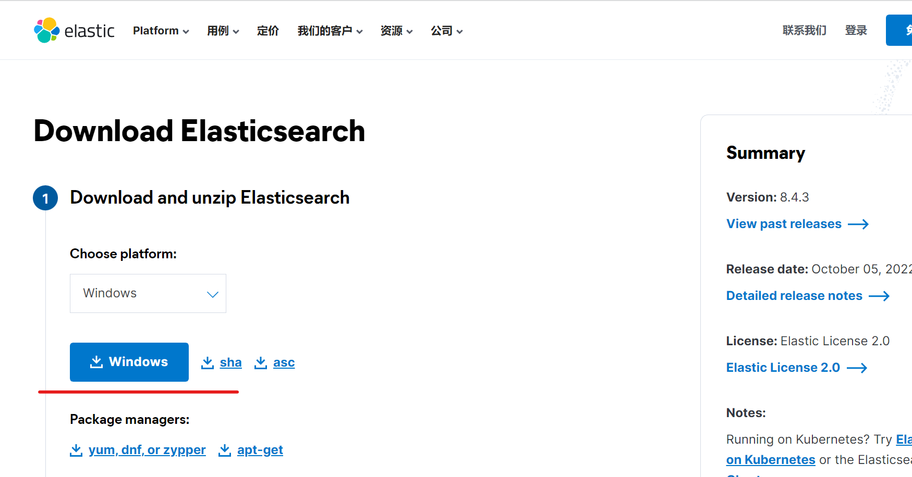
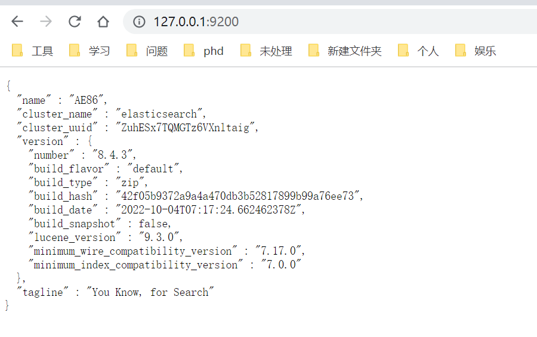

本章介绍ES在windows系统的下载、安装与配置。

# 1.[官网](https://www.elastic.co/cn/downloads/elasticsearch)下载安装包。



解压到相应的文件夹，完成安装。

# 2.配置

## 2.1 修改jvm参数

`\config\jvm.options`文件，打开如下两个参数：

```
-Xms4g
-Xmx4g
```

# 2.2 修改ES参数

`\config\elasticsearch.yml`文件，修改如下：

```
# 集群名字，集群中的每台机器必须设置成一样
cluster.name: AE86-ES

# 数据目录
path.data: D:/elasticsearch-8.4.3/data

# 日志目录
path.logs: D:/elasticsearch-8.4.3/logs
```

# 3.测试

## 3.1 运行

可执行文件在bin路径下:elasticsearch.bat。
        
## 3.2 测试

访问  http://127.0.0.1:9200/ 出现以下内容就完成。

```json
{
  "name" : "AE86",
  "cluster_name" : "elasticsearch",
  "cluster_uuid" : "ZuhESx7TQMGTz6VXnltaig",
  "version" : {
    "number" : "8.4.3",
    "build_flavor" : "default",
    "build_type" : "zip",
    "build_hash" : "42f05b9372a9a4a470db3b52817899b99a76ee73",
    "build_date" : "2022-10-04T07:17:24.662462378Z",
    "build_snapshot" : false,
    "lucene_version" : "9.3.0",
    "minimum_wire_compatibility_version" : "7.17.0",
    "minimum_index_compatibility_version" : "7.0.0"
  },
  "tagline" : "You Know, for Search"
}
```

如果访问localhost:9200失败，修改`/config/elasticsearch.yml`文件。

```
xpack.security.enabled:false

xpack.security.enrollment.enabled:false

xpack.security.transport.ssl.enabled:false
```


