# 1.参考链接

[官网](https://git-scm.com/downloads)

[安装参考链接](https://www.cnblogs.com/hdlan/p/14395189.html)

# 2.安装流程

（1）下载安装包

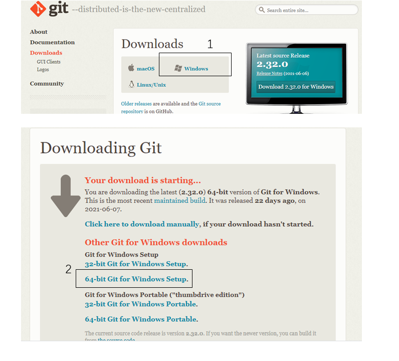

（2）安装

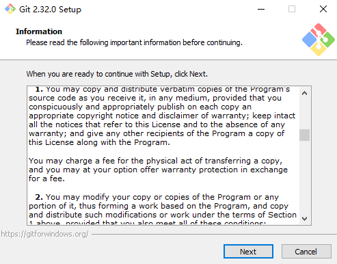

（3）选择合适的路径

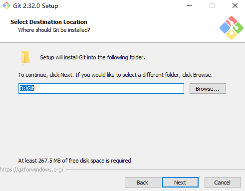

（4）组件选择

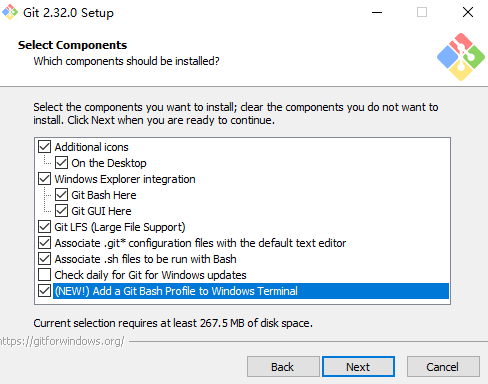

（5）开始菜单快捷方式目录

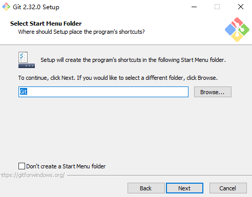

（6）选择编辑器，默认VIM

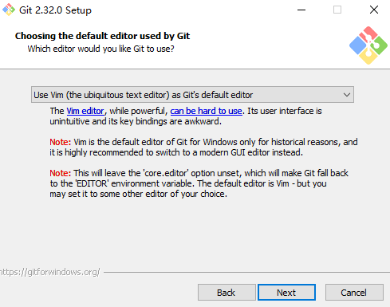

（7）调整新存储库中初始分支的名称

选第1个：让Git使用它的默认分支名称

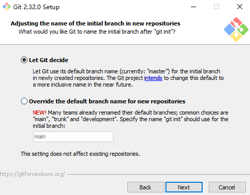

（8）设置GIT的PATH环境

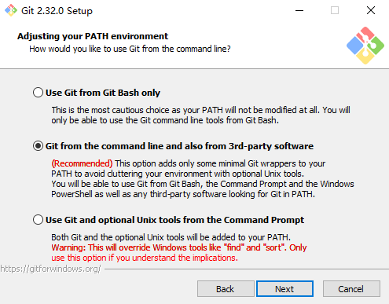

（9）传输方式

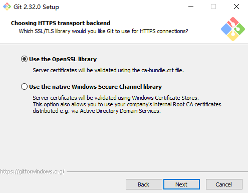

（10）配置提交行尾符号转换

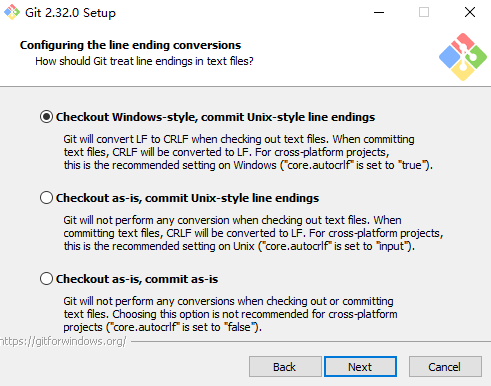

（11）配置终端模拟器以与Git Bash一起使用

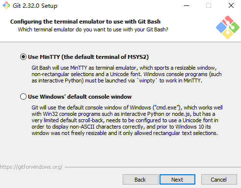

（12）选择git仓库获取最新的分支

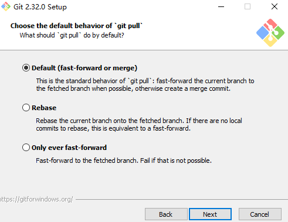

（13）选择凭据助手

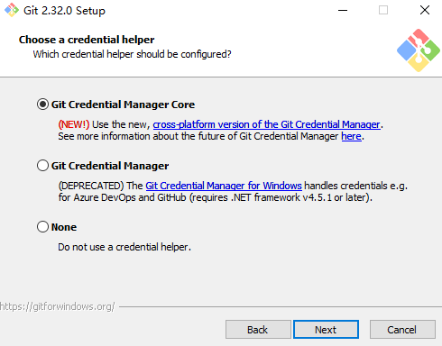

（14）额外配置选项

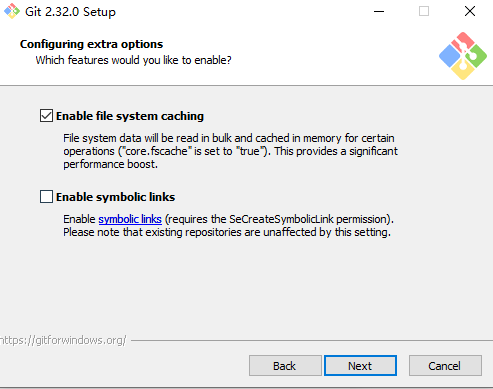

（15）配置实验选项，可能有漏洞，不选择。

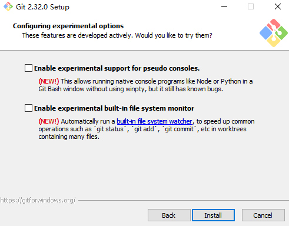

（16）安装等待

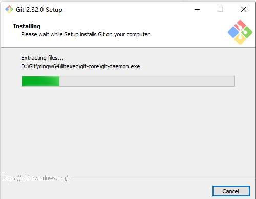

（17）完成安装

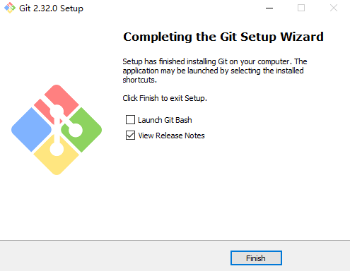
