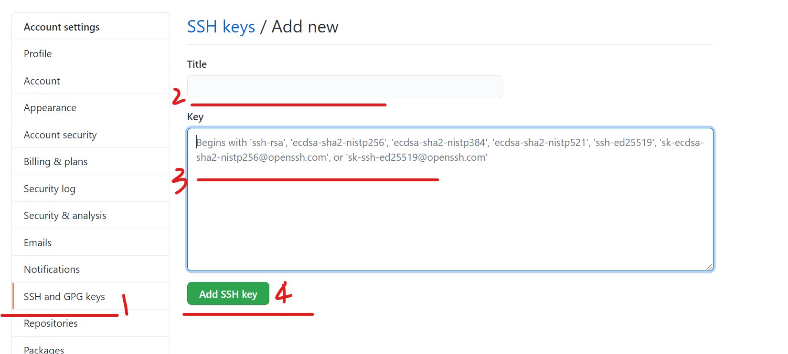

通常将Github作为远程仓库。

[参考链接](https://www.liaoxuefeng.com/wiki/896043488029600/896954117292416)

# 1.Github设置远程SSH

（1）创建SSH Key。

在用户主目录（C:\Users\{用户名}）下，“查看”中勾选隐藏的项目，看看有没有.ssh目录：

如果有，再看看这个目录下有没有id_rsa和id_rsa.pub这两个文件，如果已经有了，可直接跳到下一步。

如果没有，打开Shell（Windows下打开Git Bash），创建SSH Key：

```
$ ssh-keygen -t rsa -C "youremail@example.com"
```

其中，youremail@example.com设置成你自己的邮箱。然后一路回车，使用默认值即可，无需设置密码，这样以后克隆项目时也不需要输入密码。

如果一切顺利的话，可以在用户主目录里找到.ssh目录，里面有id_rsa和id_rsa.pub两个文件，这两个就是SSH Key的秘钥对，id_rsa是私钥，不能泄露出去，id_rsa.pub是公钥，可以放心地告诉任何人。


（2）添加SSH Keys

登陆GitHub，打开“Account settings”，点击“SSH and GPG Keys”页面。

点击“NewSSH Key”，填上任意Title，在Key文本框里粘贴id_rsa.pub文件的内容：



最后点击“Add SSH Key”即可。

为什么GitHub需要SSH Key呢？因为GitHub需要识别出你推送的提交确实是你推送的，而不是别人冒充的，而Git支持SSH协议，所以，GitHub只要知道了你的公钥，就可以确认只有你自己才能推送。

GitHub允许添加多个Key。假定你有若干电脑，你一会儿在公司提交，一会儿在家里提交，只要把每台电脑的Key都添加到GitHub，就可以在每台电脑上往GitHub推送了。

提示，在GitHub上免费托管的Git仓库，任何人都可以看到喔（但只有你自己才能改）。所以，不要把敏感信息放进去。

如果不想让别人看到Git库，有两个办法，一个是交点保护费，让GitHub把公开的仓库变成私有的。另一个办法是自己动手，搭一个Git服务器，因为是你自己的Git服务器，所以别人也是看不见的。

# 2.


