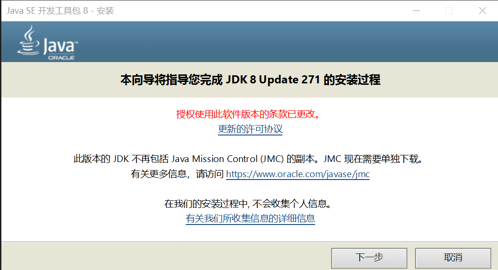
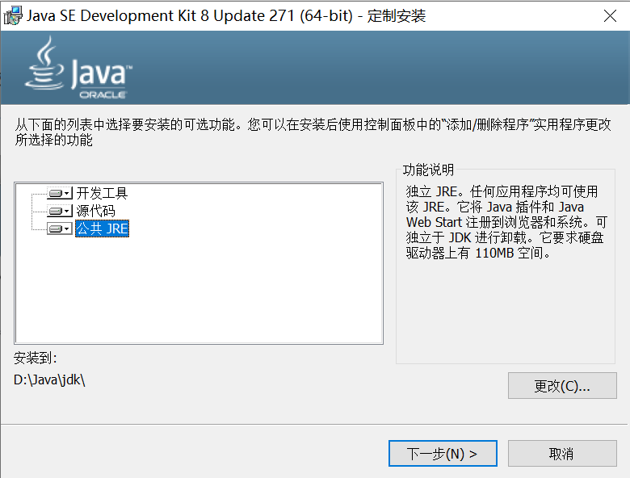
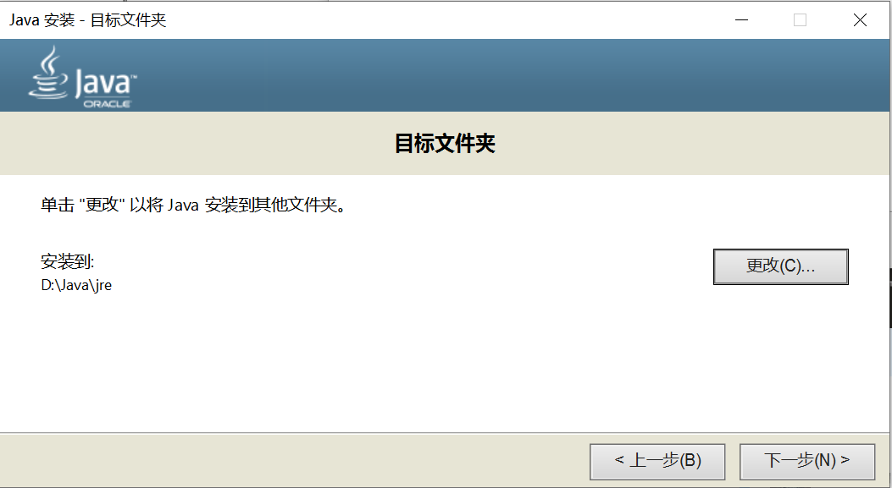
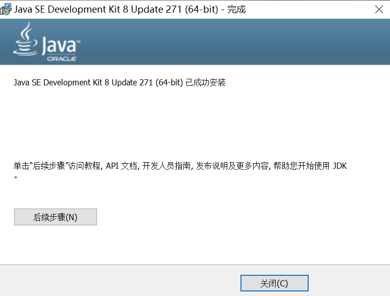
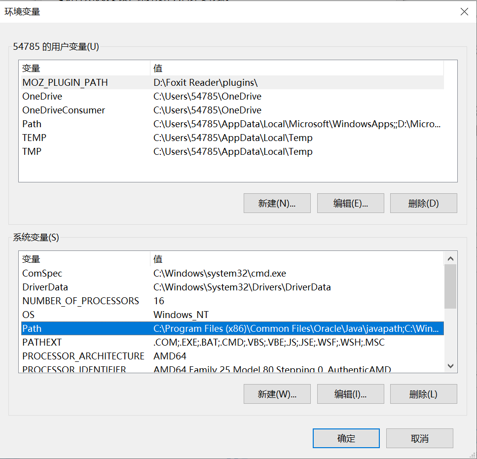
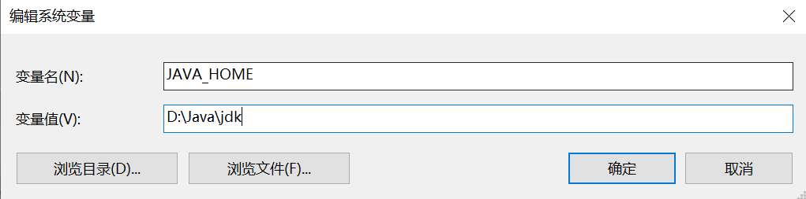
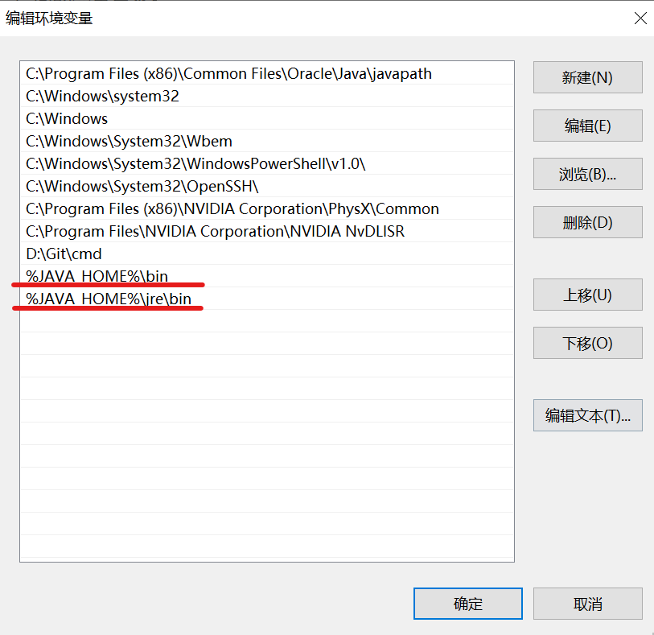
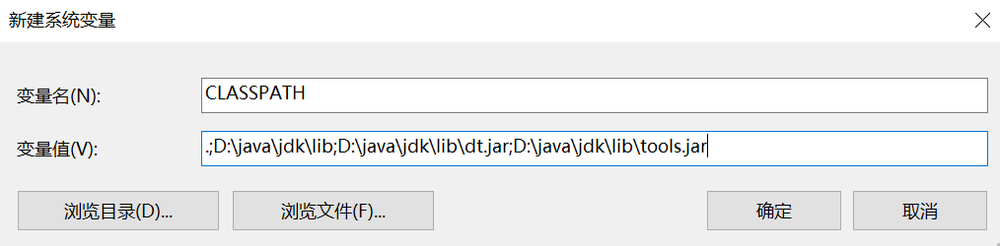
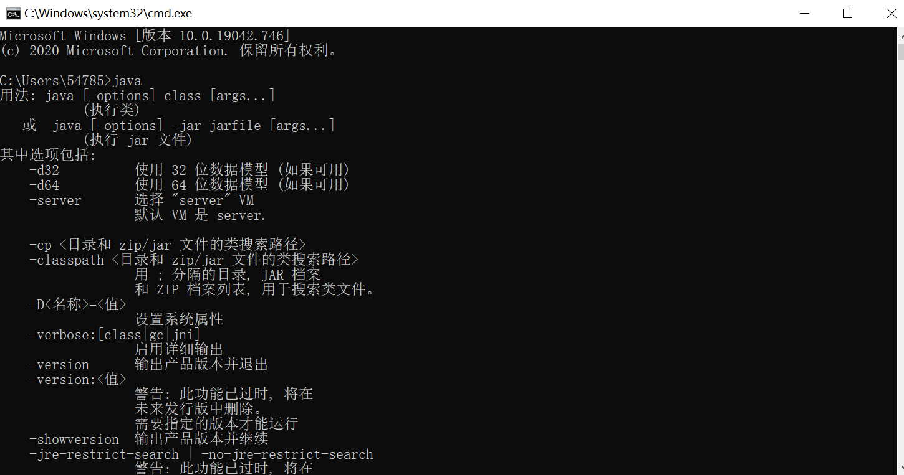
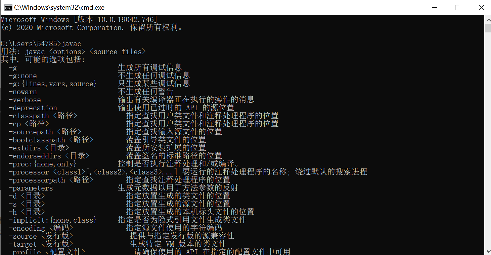

以jdk8为例。

# 1.参考链接

在官网选择自己想要的版本，最好与公司的版本保持一致。

[官网](https://www.oracle.com/java/technologies/javase/javase-jdk8-downloads.html)

[参考链接](https://blog.csdn.net/weixin_42182599/article/details/107370719)

# 2.安装流程

（1）点击安装



（2）设置jdk路径

此处安装在D盘。



（3）设置jre路径

在安装中途，会跳出jre的安装，设置其路径。



（4）安装完成



# 3.环境配置

计算机 --> 属性 --> 高级系统设置 --> 环境变量

以下操作均在系统变量中进行。



（1）设置JAVA_HOME

```
JAVA_HOME
D:\java\jdk     (这是JDK的路径）
```




```
%JAVA_HOME%\bin     (JDK中的bin文件路径）
```



（2）设置CLASSPATH

```
CLASSPATH
.;D:\java\jdk\lib;D:\java\jdk\lib\dt.jar;D:\java\jdk\lib\tools.jar
```

注意，变量值可以只填一个点，后面的变量写不写都是可以的，如果不放心的话可以加上。
设置CLASSPATH的目的：防止出现找不到或无法加载主类问题。



# 4.检测jdk是否安装成功

命令行输入：```java```



命令行输入：```javac```


说明安装成功！
