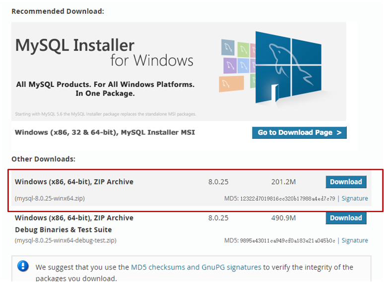

本章介绍MySQL的下载、安装与配置。

# 1.[官网](https://www.mysql.com/)下载安装包

(1) 找到DOWNLOADS选项。


（2）选免费的社区版本。


（3）下载server。




# 2.安装

（1）将下载的MySQL安装包解压到你想要放的位置，绝对路径中避免出现中文。


（2）以管理员身份打开命令行。


（3）进入MySQL的bin目录。


（4）安装MySQL的服务：mysqld --install


（5）初始化MySQL：mysqld --initialize --console
初始化会产生一个随机密码,如下图框框所示，记住这个密码，后面会用到。


（6）开启MySQL的服务：net start mysql


（7）登录验证，MySQL是否安装成功：mysql -u root -p
(要注意上面产生的随机密码，不包括前面符号前面的空格，否则会登陆失败)，如果和下图所示一样，则说明你的mysql已经安装成功！注意，，一定要先开启服务，不然会登陆失败，出现拒绝访问的提示符！！！


（8）修改密码：alter user 'root'@'localhost' identified by 'xxx';   (xxx是你要设置的密码)
由于初始化产生的随机密码太复杂，，不便于我们登录MySQL，因此，我们应当修改一个自己能记住的密码！


（9）再次登录验证新密码：mysql -u root -p
得先退出MySQL：exit
然后再用新密码登录。


# 3.配置环境变量

（1）为了方便登录操作MySQL，在这里我们设置一个全局变量。
点击"我的电脑"–>“属性”–>’‘高级系统设置’’–>’‘环境变量’’。

（2）新建系统变量MYSQL，存入你自己的安装路径。


（3）把新建的MYSQL变量添加到Path路径变量中：%MYSQL%\bin。


（4）配置完成之后，每当我们想要用使用MYSQL时，只需要在命令行输入登录sql语句即可。

还记得登录MySQL的指令吗？

# 4.常用指令

```bash
User: root
Password: 123

一、连接操作
①安装服务：mysqld --install
②初始化：　mysqld --initialize --console
③开启服务：net start mysql
④关闭服务：net stop mysql
⑤登录本机mysql：mysql -u root -p
   Enter PassWord：(密码)
   登出：以下三种均可
             \q 
            Exit;（带分号）
            Quit;（带分号）
⑥修改密码：alter user 'root'@'localhost' identified by 'xxx';(xxx是新密码)
⑦标记删除mysql服务：sc delete mysql
⑧查看版本：mysql -V

二、数据库操作
①显示所有数据库，结尾必须带上分号，否则MySQL会认为语句没有结束，什么都不显示：
    show DATABASES; 
②创建/删除数据库，xxx表示要处理的数据库名称：
   create database xxx;
   drop database xxx;
③使用数据库：
   use xxx;
④显示所有表：
   show tables;
⑤查看表结构，xxx表示要处理的表的名称：
   show columns from xxx;
   DESCRIBE xxx；

```
