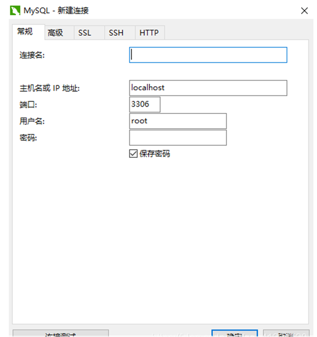
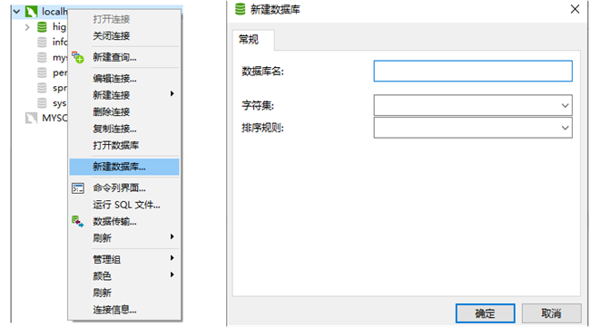
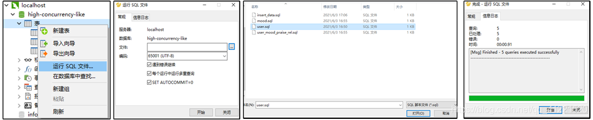
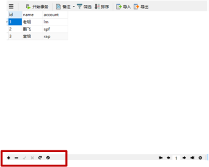

本章介绍数据库可视化软件Navicat的安装与使用，方便直观地操作数据库。

# 1.下载


# 2.使用

（1）连接数据库。
新建一个MySQL连接，连接名自己取一个，用户名、密码就是MySQL的用户名密码，你在安装MySQL（可参考第一章）时设置的。



（2）关于报错2059。
在mysql8之前的版本中加密规则为mysql_native_password，而在mysql8以后的加密规则为caching_sha2_password。我们可以将mysql用户登录的加密规则修改为mysql_native_password。

   **解决方法：**

①命令行登陆MYSQL，使用：mysql -u root -p

②输入登陆密码。

③输入命令，其中password是你的密码： 

```bash
ALTER USER 'root'@'localhost' IDENTIFIED BY 'password' PASSWORD EXPIRE NEVER;
```

④输入命令，其中password是你的密码：

```bash
ALTER USER 'root'@'localhost' IDENTIFIED WITH mysql_native_password BY 'password';
```

⑤打开navicat，发现连接成功。

（3）创建数据库。
在新建的连接上，右击新建数据库，可以设置为你的项目名字。



（4）创建表。
选择相应的建表方式，此处以SQL文件示例。



user.sql文件如下：
SQL语句中，与字段相关的使用反引号`` ` ``，即英文输入下，在按键1左边的那个 ~ 键。与文本值相关的，使用单引号`` ` ``。

```sql
-- ----------------------------
-- Table structure for user
-- ----------------------------
DROP TABLE IF EXISTS `user`;
CREATE TABLE `user` (
  `id` varchar(32) NOT NULL,
  `name` varchar(20) DEFAULT NULL,
  `account` varchar(20) DEFAULT NULL,
  PRIMARY KEY (`id`),
  KEY `user_name_index` (`name`) USING BTREE,
  KEY `user_account_index` (`account`) USING BTREE
) ENGINE=InnoDB DEFAULT CHARSET=utf8;

INSERT INTO `user` VALUES ('1', '老明', 'lm');
INSERT INTO `user` VALUES ('2', '鹏飞', 'spf');
INSERT INTO `user` VALUES ('3', '宜培', 'rap');
```

结果如下：


图中的 + - √ x 等符号，也能完成对表的操作。