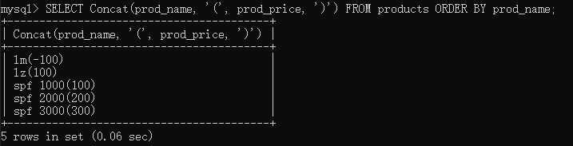

本章介绍计算字段，子查询等内容。

# 1.计算字段

字段（field）：基本是与列（column）的意思相同。

计算字段：并不存在于数据库表中，是运行时在SELECT语句内创建的。

（1）拼接字段

拼接（concatenate）：将值联结到一起构成单个值。可使用Concat()函数来拼接两个列。

```sql
-- 把多个串拼接起来形成一个较长的串
SELECT Concat(prod_name, '(', prod_price, ')') FROM products ORDER BY prod_name;
```



（2）使用别名

别名（alias）：一个字段或值的替换名，关键字AS。

```sql
-- 把多个串拼接起来形成一个较长的串，并赋予别名prod_info
SELECT Concat(prod_name, '(', prod_price, ')') AS prod_info FROM products ORDER BY prod_name;
```

（3）执行算数计算

|操作符                 |说明                              |
|----------------------|----------------------------------|
|+|加|
|-|减|
|*|乘|
|/|除|

```sql
-- 在订单表中选取某个订单的产品id，数量，单价，总价
SELECT prod_id, quantity, item_price, quantity*item_price AS sum_price FROM orderitems WHERE order_num = 2005;
```

# 2.子查询

子查询（subquery）：嵌套在其他查询中的查询。

版本要求：使用MySQL4.1或更高的版本。

（1）利用子查询过滤

现有三张表：

    orders：订单号order_num，客户号cust_id，订单日期。

    orderitems：订单号order_num，物品名称prod_name，物品数量quantity等。

    customers：客户号cust_id，客户名字cust_name，客户联系方式cust_contact等。

问题：检索出订购物品TNT2的所有客户信息？

思路：

    ①从orderitems表检索所有包含物品TNT2的订单号。

    ②根据①中的订单号，从orders检索客户号cust_id。

    ③再根据②中的客户号cust_id，从customers表中检索客户信息。

利用子查询的话，只需要一条语句即可。在SELECT语句中，子查询总是从内向外处理。

```sql
-- 检索订购物品TNT2的所有客户信息
SELECT cust_name, cust_contact FROM customers WHERE cust_id IN (
    SELECT cust_id FROM orders WHERE order_num IN (
        SELECT order_num FROM orderitems WHERE prod_id = 'TNT2'));
```

（2）作为计算字段使用子查询

以下查询，为了区分cust_id，使用了完全限定列名。

```sql
-- 查询每个客户的信息，以及订单数目
SELECT cust_name, cust_contact, (SELECT count(*) FROM orders WHERE orders.cust_id = customers.cust_id) AS orders FROM customers;
```
