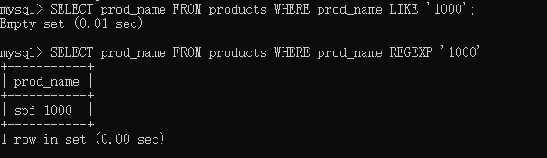

本章介绍正则表达式内容。

# 1.正则表达式操作符

|操作符                 |说明                              |
|----------------------|----------------------------------|
|REGEXP                |其后面所跟的东西为正则表达式        |
|.                     |匹配任意一个字符                   |
|\|                    |OR条件，匹配两个或两个以上表达式之一 |
|[]                    |另一种形式的OR语句，匹配几个字符之一 |
|^                     |NOT条件，用于否定                  |
|-                     |设置范围                           |

# 2.基本字符匹配

正则表达式的作用是匹配文本，MySQL仅支持一小部分正则表达式。在版本3.23.4后，不区分大小写，如要使用可用关键字BINARY。

基本句式：```SELECT ... FROM ... WHERE ... REGEXP ...```

```sql
-- 基本字符匹配，查找名字中带1000的
SELECT prod_name FROM products WHERE prod_name REGEXP '1000'; 

-- .是正则表达式中的字符，表示匹配任意一个字符。例如：1000，2000，3000
SELECT prod_name FROM products WHERE prod_name REGEXP '.000'; 

-- 为搜索两个或两个以上表达式之一，使用 |
SELECT prod_name FROM products WHERE prod_name REGEXP '1000|2000|3000';

-- 匹配几个字符之一，在[]选出一个字符来匹配
SELECT prod_name FROM products WHERE prod_name REGEXP '[123]000';

-- 匹配几个字符以外的,除开[]中的几个字符，类似.1000的
SELECT prod_name FROM products WHERE prod_name REGEXP '[^123]000';
```

# 3.REGEXP与LIKE的区别



可以看到，LIKE语句不返回数据，REGEXP返回数据。原因在于：
①LIKE语句匹配整个列，如果被匹配的文本(1000)在列值中出现，LIKE不会找到它，相应的行也不会被返回，除非使用通配符。
②REGEXP在列值内进行匹配，如果被匹配的文本(1000)在列值中出现，REGEXP会找到它，相应的行被返回。

# 4.匹配范围

```sql
-- 可以匹配1000，2000，3000，4000，5000
SELECT prod_name FROM products WHERE prod_name REGEXP '[1-5]000';
```

# 5.匹配特殊字符

由于很多字符在正则表达式中有特殊的含义，当我们需要在文本中匹配这些字符的字面意义时，该怎么使用正则表达式呢？

为了匹配特殊字符，必须使用\\进行转义。例如\\.表示查找.，\\-表示查找-。

```sql
-- 可以匹配.
SELECT prod_name FROM products WHERE prod_name REGEXP '\\.';
```

\\\也用来引用元字符（具有特殊含义的字符），与一般转义不同，MySQL要求两个反斜杠，自己解释一个，正则表达式解释一个。

|元字符                 |说明                              |
|----------------------|----------------------------------|
|\\\f                |换页        |
|\\\n                |换行        |
|\\\r                |回车        |
|\\\t                |制表        |
|\\\v                |纵向制表    |

# 6.匹配多个实例

多个正则表达式操作符组合进行匹配，可以使用重复元字符来完成。

|元字符                 |说明                              |
|----------------------|----------------------------------|
|*|0个或多个匹配|
|+|1个或多个匹配（等于{1,}）|
|?|0个或1个匹配（等于{0,1}）|
|{n}|指定数目的匹配|
|{n,}|不少于指定数目的匹配|
|{n,m}|匹配数目的范围（m不超过255）|

```sql
-- \\(和\\)匹配括号()，[0-9]指定范围，?表示前面一个字符(s)出现0次或1次
SELECT prod_name FROM products WHERE prod_name REGEXP '\\([0-9] sticks?\\)';

-- 匹配4个数字连在一起的，以下两种写法
SELECT prod_name FROM products WHERE prod_name REGEXP '[[:digit:]]{4}';
SELECT prod_name FROM products WHERE prod_name REGEXP '[0-9][0-9][0-9][0-9]';
```

# 7.匹配特定位置的文本

为了避免在一个字符串中任意位置进行匹配，只匹配特定位置的文本，需要如下的定位符。

|元字符                 |说明                              |
|----------------------|----------------------------------|
|^|文本的开始|
|$|文本的结尾|
|\[[:<:]]|词的开始|
|\[[:>:]]|词的结尾|

```sql
-- ^匹配串的开始，[0-9\\.]0-9或者\\.其中之一
SELECT prod_name FROM products WHERE prod_name REGEXP '^[0-9\\.]';
```
