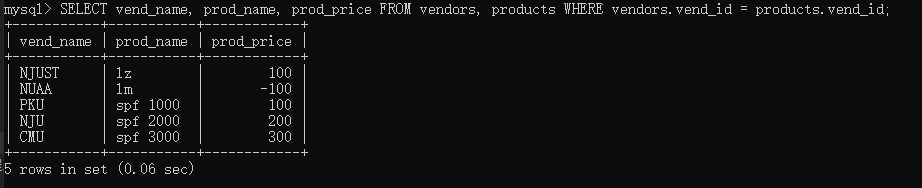
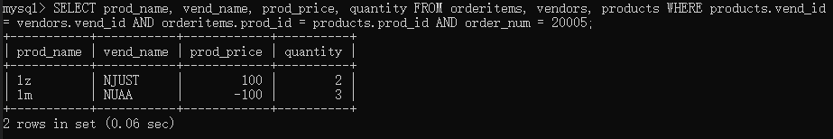

Q:如果数据存储在**多个表**中，怎么使用单条SELECT语句检索出数据？

A:使用联结。

本章介绍表的联结等内容。

# 1.联结

（1）创建联结

基本句式：```SELECT ... FROM t1, t2, ... WHERE ...```

```sql
-- 联结两个表，依据供应商id进行联结
SELECT vend_name, prod_name, prod_price FROM vendors, products WHERE vendors.vend_id = products.vend_id;
```



```sql
-- 多表联结，编号为20005的订单中的物品
SELECT prod_name, vend_name, prod_price, quantity FROM orderitems, vendors, products WHERE products.vend_id = vendors.vend_id AND orderitems.prod_id = products.prod_id AND order_num = 20005;
```



在联结时，需要给出WHERE子句进行限定。否则，将一个表的每一行与另一个表联结。

（2）内部联结

等值联结（equijoin）：基于两个表之间的相等测试，也可称为内部联结。

在使用时，我们可以用显式的语法表明联结类型。

基本句式：```SELECT ... FROM ... INNER JOIN ... ON ...```

```sql
-- 上面的sql改写，一样的效果
SELECT vend_name, prod_name, prod_price FROM vendors INNER JOIN products ON vendors.vend_id = products.vend_id;
```

（3）自联结

一张表联结自身，即需要用到自身的信息作为查询条件。

```sql
-- 检索p2.id = '2'的生厂商的所有产品，为了防止歧义，使用别名
SELECT p1.prod_id, p1.prod_name FROM products AS p1, products AS p2 WHERE p1.vend_id = p2.vend_id AND p2.id = '2';
```

（4）自然联结

自然联结排除多次出现，使每个列只返回1次。因此，目前为止，我们建立的每个内部联结都是自然联结。

（5）外部联结

将一个表中的行与另一个表中的行相关联，有时需要关联没有关联行当那些行。

# 2.组合
