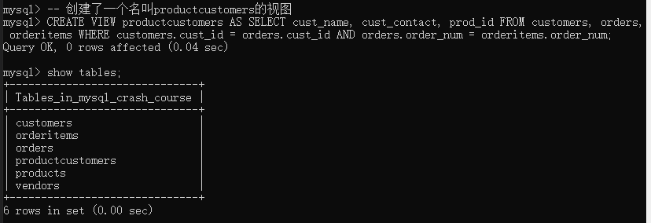
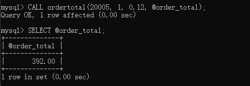
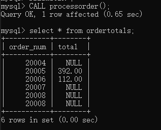

MySQL 5添加了对视图、存储过程、游标的支持！

# 1.视图

视图（view）：将查询包装成一个虚拟表，它不包含表中应该有点任何列或数据。

（1）视图的应用

- 重用SQL语句。
- 简化复杂的SQL操作。
- 使用表的组成部分，而不是全部表。
- 保护数据。可以给用户特定数据的访问权限，而不是整个表。
- 更改数据格式和表示。视图可以返回跟底层表的表示、格式不同的数据。

因此，在视图创建后，可以用与表基本相同的方式去使用它。

基本语法：

```sql
CREATE VIEW   -- 创建视图
SHOW CREATE VIEW viewname   -- 查看创建视图的语句
DROP VIEW viewname   --删除视图
CREATE OR REPLACE VIEW    -- 更新视图
```

（2）创建视图

```sql
-- 创建了一个名叫productcustomers的视图
CREATE VIEW productcustomers AS SELECT cust_name, cust_contact, prod_id FROM customers, orders, orderitems WHERE customers.cust_id = orders.cust_id AND orders.order_num = orderitems.order_num;
```



```sql
-- 使用视图查询
SELECT cust_name, cust_contact FROM productcustomers WHERE prod_id = '1';
```

（3）更新视图

使用INSERT、UPDATE、DELETE对视图进行更新时，将更新其基表。

# 2.存储过程

相当于定义一个SQL语句组成的函数，以后要用的时候直接调用即可。简单、安全、高效。

（1）创建存储过程

以下存储过程展示了，参数传入、参数传出、临时变量的创建、变量赋值等操作过程。

|关键字|说明|
|-----|----|
|IN|传递给存储过程|
|OUT|从存储过程传出|
|INOUT|对存储过程传入和传出|

```sql
-- 建立智能存储过程
CREATE PROCEDURE ordertotal(
    IN order_number INT,
    IN tax_enable BOOLEAN,
    IN tax_percent DECIMAL(3,2),
    OUT order_total DECIMAL(8,2)
)COMMENT 'Obtain order total, optionally adding tax'
BEGIN
  -- Declare variable for total
  DECLARE total DECIMAL(8,2);
  -- Get total total
  SELECT Sum(quantity*item_price) FROM orderitems WHERE orderitems.order_num = order_number INTO total;
  -- compute the tax0
  IF tax_enable THEN
    SELECT total * (1 + tax_percent) INTO total;
  END IF;
  -- save the total
  SELECT total INTO order_total;
END；
```

当我们在命令行运行以上代码时，会报错。因为默认的MySQL语句分隔符为;，命令行内也使用;作为语句符。因此命令行会解释存储过程中的;，导致它们不会成为存储过程的成分，这会使存储过程的语法出现错误。

解决办法，临时更改命令行实用程序的语句分隔符，如下所示：

```sql
-- 临时更改命令行实用程序的语句分隔符
DELIMITER //          -- 第1处
CREATE PROCEDURE ordertotal(
    IN order_number INT,
    IN tax_enable BOOLEAN,
    IN tax_percent DECIMAL(3,2),
    OUT order_total DECIMAL(8,2)
)COMMENT 'Obtain order total, optionally adding tax'
BEGIN
  -- Declare variable for total
  DECLARE total DECIMAL(8,2);
  -- Get total total
  SELECT Sum(quantity*item_price) FROM orderitems WHERE orderitems.order_num = order_number INTO total;
  -- compute the tax0
  IF tax_enable THEN
    SELECT total * (1 + tax_percent) INTO total;
  END IF;
  -- save the total
  SELECT total INTO order_total;
END//    -- 第2处
DELIMITER ;   -- 第3处
```

（2）检查存储过程

显示某个存储过程内部具体语句：```SHOW CREATE PROCEDURE xxx```
显示何时、由谁创建等详细信息的存储过程列表：```SHOW PROCEDURE STATUS```

```sql
-- 显示ordertotal内部的具体过程
SHOW CREATE PROCEDURE ordertotal;
-- 显示存储过程列表，显示的排版有点乱
SHOW PROCEDURE STATUS;
```

（3）执行存储过程

基本句式：```CALL xxx(@param1, @param2, @param3, ...)```

MySQL的变量必须以@开始。

```sql
-- 调用定义的存储过程
CALL ordertotal(20005, 1, 0.12, @order_total);
-- 查看变量
SELECT @order_total;
```



（4）删除存储过程

基本句式：```DROP PROCEDURE xxx```

# 3.游标

MySQL的检索操作返回一组称为结果集的行，为了对每行进行操作，出现了游标。

**MySQL的游标只能用于存储过程和函数**。

游标（cursor）：存储在MySQL服务器上的数据库查询，在对结果集使用游标后，可以根据需要滚动游标，来浏览结果集中的数据。

（1）创建游标

使用```DECLARE```声明游标，```FOR```后面定义相应的```SELECT```语句。

基本句式：```DECLARE ... CURSOR FOR ...```

```sql
CREATE PROCEDURE processorder()  -- 在存储过程中使用
BEGIN
  DECLARE ordernumbers CURSOR  -- 声明游标
  FOR
  SELECT order_num FROM orders;  -- SELECT 语句
END; 
```

（2）使用游标

使用步骤：

①使用前，必须声明游标，```DECLARE```；

②打开游标，以供使用，```OPEN```；

③对于填有数据的游标，根据需要检索各行，```FETCH```。

④使用完，必须关闭游标，```CLOSE```。

示例：循环检索数据

```sql
CREATE PROCEDURE processorder()  -- 在存储过程中使用
BEGIN
  -- 定义局部变量
  DECLARE done BOOLEAN DEFAULT 0;
  DECLARE o INT;
  DECLARE t DECIMAL(8,2);

  -- 声明游标
  DECLARE ordernumbers CURSOR  
  FOR
  SELECT order_num FROM orders;  -- SELECT 语句

  -- 声明继续句柄，SQLSTATE '02000'是一个未找到条件
  DECLARE CONTINUE HANDLER FOR SQLSTATE '02000' SET done = 1;

  -- 创建临时表，存储结果
  CREATE TABLE IF NOT EXISTS ordertotals(order_num INT, total DECIMAL(8,2));

  -- 打开游标
  OPEN ordernumbers;

  -- 循环处理所有行
  REPEAT
    -- 获取每行
    FETCH ordernumberS INTO o;

    -- 调用上一节定义的存储过程，带上税收后的总额
    CALL ordertotal(o, 1, 0.12, t);

    -- 转存到临时表
    INSERT INTO ordertotals VALUES(o, t);

  -- 结束循环
  UNTIL done END REPEAT;

-- 关闭游标
CLOSE ordernumbers;

END; 
```

注意事项：

①DECLARE定义的局部变量必须在游标、句柄之前定义；

②句柄必须在游标之后定义；

上面的存储过程，还记得在命令行怎么定义吗？**要记得临时更改命令行实用程序的语句分隔符**啊。

结果：

```sql
-- 先调用存储过程
CALL processorder();

-- 查看执行结果
SELECT * FROM ordertotals;
```

