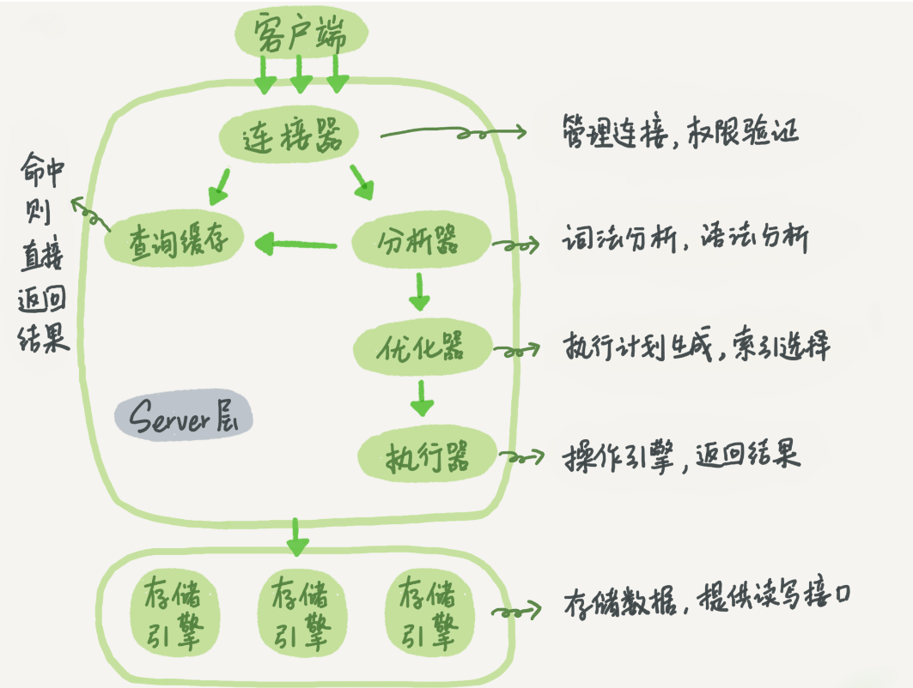

# 1.查询语句执行流程

```sql
select * from T where ID=10；
```
执行流程如下：



Server 层：连接器、查询缓存、分析器、优化器、执行器等，涵盖 MySQL 的大多数核心服务功能，以及所有的内置函数（如日期、时间、数学和加密函数等），所有跨存储引擎的功能都在这一层实现，比如存储过程、触发器、视图等。

存储引擎层负责数据的存储和提取。其架构模式是插件式的，支持 InnoDB、MyISAM、Memory 等多个存储引擎。现在最常用的存储引擎是 InnoDB，它从 MySQL 5.5.5 版本开始成为了默认存储引擎。

# 2.详细步骤

## 2.1 连接器

负责跟客户端建立连接、获取权限、维持和管理连接。

```shell
mysql -h$ip -P$port -u$user -p
```

##  2.2 查询缓存

MySQL 拿到一个查询请求后，会先到查询缓存。之前执行过的语句及其结果可能会以key-value 对的形式，被直接缓存在内存中。key 是查询的语句，value 是查询的结果。

不建议使用缓存，缓存的失效非常频繁，只要有对一个表的更新，这个表上所有的查询缓存都会被清空。

按需使用：你可以将参数 query_cache_type 设置成 DEMAND，这样对于默认的 SQL 语句都不使用查询缓存。而对于你确定要使用查询缓存的语句，可以用 SQL_CACHE 显式指定，

```sql
mysql> select SQL_CACHE * from T where ID=10；
```

MySQL 8.0 版本直接将查询缓存的整块功能删掉了，也就是说 8.0 开始彻底没有这个功能了。

## 2.3 分析器

SQL 语句做解析，从而知道你要做什么。

（1）词法分析：识别SQL 语句里面的字符串分别是什么。例如，"select"这个关键字识别出来，这是一个查询语句。字符串“T”识别成“表名 T”，字符串“ID”识别成“列 ID”。

（2）语法分析：根据语法规则，判断你输入的这个 SQL 语句是否满足 MySQL 语法。如果你的语句不对，就会收到“You have an error in your SQL syntax”的错误提醒。

## 2.4 优化器

优化SQL。例如，（1）在表里面有多个索引的时候，决定使用哪个索引；（2）在一个语句有多表关联（join）的时候，决定各个表的连接顺序。

## 2.5 执行器

MySQL 通过分析器知道了你要做什么，通过优化器知道了该怎么做，于是就进入了执行器阶段，开始执行语句。

（1）判断执行权限。如果命中查询缓存，会在返回结果的时候，做权限验证。

```mysql
-- 如果没有权限
mysql> select * from T where ID=10; 
ERROR 1142 (42000): SELECT command denied to user 'b'@'localhost' for table 'T'
```

（2）如果有权限，根据表的引擎定义，去使用这个引擎提供的接口，继续执行。

慢查询日志中 rows_examined 的字段，表示这个语句执行过程中扫描了多少行，该值在执行器每次调用引擎获取数据行的时候累加。在有些场景下，执行器调用一次，在引擎内部则扫描了多行，因此引擎扫描行数跟 rows_examined 并不是完全相同的。
