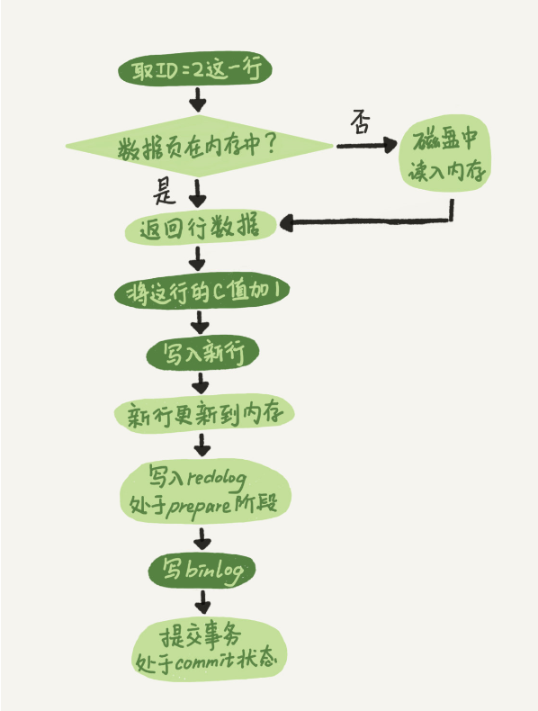

# 1.更新语句

```sql
update T set c=c+1 where ID=2;
```

首先，查询语句的那一套流程，更新语句也会走一遍，并且把表 T 上所有缓存结果都清空。

更新流程还涉及两个重要的日志模块：redo log（重做日志）和 binlog（归档日志）。

# 2.redo log

更新数据时，有2种做法：

（1）每一次的更新操作都写进磁盘，然后磁盘找到对应的记录，再更新。IO 成本、查找成本高。

（2）记录先写到 redo log 里，并更新内存，这时更新就算完成。

MySQL 采取第2种，即 WAL 技术（Write-Ahead Logging），先写日志，再写磁盘。redo log 是 InnoDB 引擎特有的日志，InnoDB 的 redo log 是固定大小的，比如可以配置为一组 4 个文件，每个文件的大小是 1GB，那么总共就可以记录 4GB 的操作。从头开始写，写到末尾就又回到开头循环写。


write pos 是当前记录的位置，一边写一边后移，写到第 3 号文件末尾后就回到 0 号文件开头。

checkpoint 是当前要擦除的位置，也是往后推移并且循环的，擦除记录前要把记录更新到数据文件。

write pos 和 checkpoint 之间的是还空着的部分，可以用来记录新的操作。如果 write pos 追上 checkpoint，表示日志满了，这时候不能再执行新的更新，得停下来先擦掉一些记录，把 checkpoint 推进一下。

有了 redo log，InnoDB 就可以保证即使数据库发生异常重启，之前提交的记录都不会丢失，这个能力称为crash-safe。

# 3.binlog

Server 层也有自己的日志，称为 binlog（归档日志）。MySQL 自带的引擎是 MyISAM，但是 MyISAM 没有 crash-safe 的能力，binlog 日志只能用于归档。而 InnoDB 是另一个公司以插件形式引入 MySQL 的，既然只依靠 binlog 是没有 crash-safe 能力的，所以 InnoDB 使用另外一套日志系统——也就是 redo log 来实现 crash-safe 能力。

区别：

（1）redo log 是 InnoDB 引擎特有的；binlog 是 MySQL 的 Server 层实现的，所有引擎都可以使用。

（2）redo log 是物理日志，记录的是“在某个数据页上做了什么修改”；binlog 是逻辑日志，记录的是这个语句的原始逻辑，比如“给 ID=2 这一行的 c 字段加 1 ”。

（3）redo log 是循环写的，空间固定会用完；binlog 是可以追加写入的。“追加写”是指 binlog 文件写到一定大小后会切换到下一个，并不会覆盖以前的日志。

# 4.执行流程

（1）执行器先找引擎取 ID=2 这一行。ID 是主键，引擎直接用树搜索找到这一行。如果 ID=2 这一行所在的数据页本来就在内存中，就直接返回给执行器；否则，需要先从磁盘读入内存，然后再返回。

（2）执行器拿到引擎给的行数据，把这个值加上 1，比如原来是 N，现在就是 N+1，得到新的一行数据，再调用引擎接口写入这行新数据。

（3）引擎将这行新数据更新到内存中，同时将这个更新操作记录到 redo log 里面，此时 redo log 处于 prepare 状态。然后告知执行器执行完成了，随时可以提交事务。

（4）执行器生成这个操作的 binlog，并把 binlog 写入磁盘。

（5）执行器调用引擎的提交事务接口，引擎把刚刚写入的 redo log 改成提交（commit）状态，更新完成。



其中，浅色框表示是在 InnoDB 内部执行的，深色框表示是在执行器中执行的。

# 5.两阶段提交

（1）数据恢复：怎样让数据库恢复到半个月内任意一秒的状态？

binlog 会记录所有的逻辑操作，并且是采用“追加写”的形式。如果你的 DBA 承诺说半个月内可以恢复，那么备份系统中一定会保存最近半个月的所有 binlog，同时系统会定期做整库备份。

- 首先，找到最近的一次全量备份，从这个备份恢复到临时库；

- 然后，从备份的时间点开始，将备份的 binlog 依次取出来，重放到中午误删表之前的那个时刻。

由于 redo log 和 binlog 是两个独立的逻辑，如果不用两阶段提交，要么就是先写完 redo log 再写 binlog，或者采用反过来的顺序。我们看看这两种方式会有什么问题。

（2）先写 redo log 后写 binlog

假设在 redo log 写完，binlog 还没有写完的时候，MySQL 进程异常重启。binlog 里面就没有这条语句，如果需要用该 binlog 来恢复临时库的话，由于这个语句的 binlog 丢失，这个临时库就会少了这一次更新。

（3）先写 binlog 后写 redo log

如果在 binlog 写完之后 crash，由于 redo log 还没写，崩溃恢复以后这个事务无效，所以这一行 c 的值是 0。但是 binlog 里面已经记录了“把 c 从 0 改成 1”这个日志。所以，在之后用 binlog 来恢复的时候就多了一个事务出来，恢复出来的这一行 c 的值就是 1，与原库的值不同。

当需要扩容时，常见的做法是用全量备份加上应用 binlog 来实现的，这个“不一致”就会导致线上出现主从数据库不一致的情况。

redo log 和 binlog 都可以用于表示事务的提交状态，而两阶段提交就是让这两个状态保持逻辑上的一致。

# 6.小结

本节介绍了 MySQL 里面最重要的两个日志，即物理日志 redo log 和逻辑日志 binlog。

redo log 用于保证 crash-safe 能力。innodb_flush_log_at_trx_commit 这个参数设置成 1 的时候，表示每次事务的 redo log 都直接持久化到磁盘。这个参数我建议你设置成 1，这样可以保证 MySQL 异常重启之后数据不丢失。

sync_binlog 这个参数设置成 1 的时候，表示每次事务的 binlog 都持久化到磁盘。这个参数我也建议你设置成 1，这样可以保证 MySQL 异常重启之后 binlog 不丢失。
