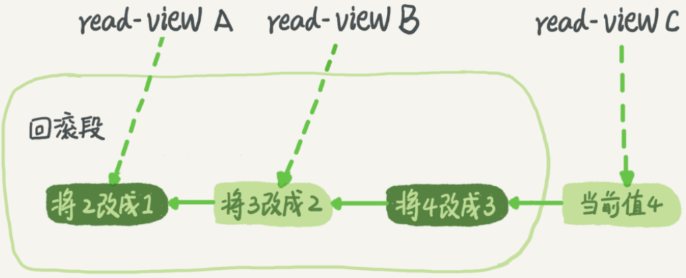

# 1.背景

例：转账过程具体到程序里会有一系列的操作，比如查询余额、做加减法、更新余额等，这些操作必须保证是一体的。

事务就是要保证一组数据库操作，要么全部成功，要么全部失败。在 MySQL 中，事务支持是在引擎层实现的，比如 MySQL 原生的 MyISAM 引擎就不支持事务，这也是 MyISAM 被 InnoDB 取代的重要原因之一。

# 2.隔离性与隔离级别

隔离性，事务的ACID（Atomicity、Consistency、Isolation、Durability，即原子性、一致性、隔离性、持久性）特性之一。

当多个事务同时执行的时候，就可能出现脏读（dirty read）、不可重复读（non-repeatable read）、幻读（phantom read）的问题，为了解决这些问题，就有了“隔离级别”的概念。

隔离得越严实，效率就会越低，因此要在二者之间寻找一个平衡点。SQL 标准的事务隔离级别包括：

（1）读未提交（read uncommitted）：一个事务还没提交时，它做的变更就能被别的事务看到。

（2）读提交（read committed）：一个事务提交之后，它做的变更才会被其他事务看到。

（3）可重复读（repeatable read）：一个事务执行过程中看到的数据，总是跟这个事务在启动时看到的数据是一致的。当然在可重复读隔离级别下，未提交变更对其他事务也是不可见的。

（4）串行化（serializable ）：对于同一行记录，“写”会加“写锁”，“读”会加“读锁”。当出现**读写锁冲突**的时候，后访问的事务必须等前一个事务执行完成，才能继续执行。

通过启动参数 transaction-isolation 进行设置，在实现上：

（1）读未提交：直接返回记录上的最新值，没有视图概念。

（2）读提交（不可重复读）：每个 SQL 语句开始执行的时候创建一个视图。

（3）可重复读：在事务启动时创建一个视图，整个事务期间都用这个视图。

（4）串行化：直接用加锁的方式来避免并行访问。

例子，可重复读场景：

假设你在管理一个个人银行账户表。一个表存了每个月月底的余额，一个表存了账单明细。这时要做数据校对。此时就希望在校对过程中，即使有用户发生了一笔新的交易，也不影响校对结果。

# 3.事务隔离的实现

可重复读的具体实现。

在 MySQL 中，每条记录在更新时，会同时记录一条回滚操作。通过记录上的最新值和回滚操作，可以得到前一个状态。

假设一个值从 1 被按顺序改成了 2、3、4，在回滚日志里面就会有类似下面的记录。



如图中看到的，在视图 A、B、C 里面，这一个记录的值分别是 1、2、4，同一条记录在系统中可以存在多个版本，就是数据库的多版本并发控制（MVCC）。对于 read-view A，要得到 1，就必须将当前值依次执行图中所有的回滚操作得到。

回滚日志什么时候删除呢？

系统会判断，当没有比这个回滚日志更早的 read-view 的时候，即不再用到该回滚日志，回滚日志会被删除。

为什么不要使用长事务？

（1）长事务意味着系统里面会存在很老的事务视图，在长事务提交之前，数据库里面可能用到的回滚记录都必须保留，这就会导致大量占用存储空间。

在 MySQL 5.5 及以前的版本，回滚日志是跟数据字典一起放在 ibdata 文件里的，即使长事务最终提交，回滚段被清理，文件也不会变小。

（2）除了对回滚段的影响，长事务还占用锁资源，也可能拖垮整个库。

# 4.事务的启动方式

MySQL 的事务启动方式有以下几种：

（1）显式启动事务语句， begin 或 start transaction。配套的提交语句是 commit，回滚语句是 rollback。

（2）set autocommit=0，如果只执行一个 select 语句，这个事务就启动了，而且并不会自动提交。这个事务持续存在直到你主动执行 commit 或 rollback 语句，或者断开连接。

有些客户端连接框架会默认连接成功后先执行一个 set autocommit=0 的命令，导致接下来的查询都在事务中，如果是长连接，就导致了意外的长事务。因此，建议使用 set autocommit=1, 通过显式语句的方式来启动事务。

在 autocommit 为 1 的情况下，用 begin 显式启动的事务，如果执行 commit 则提交事务。如果执行 commit work and chain，则是提交事务并自动启动下一个事务，这样也省去了再次执行 begin 语句的开销。

可以在 information_schema 库的 innodb_trx 这个表中查询长事务，比如下面这个语句，用于查找持续时间超过 60s 的事务。

```sql
select * from information_schema.innodb_trx where TIME_TO_SEC(timediff(now(),trx_started)) > 60
```
