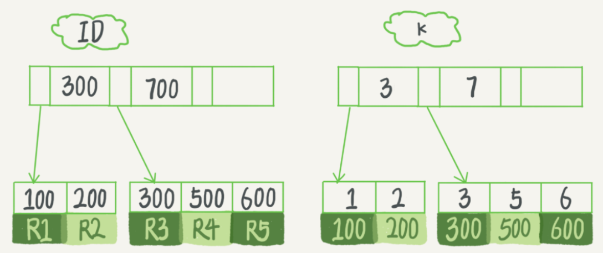

# 1.索引数据结构

索引是为了提高查询效率，常见的数据结构是：哈希表、有序数组和搜索树。

（1）哈希表：适用于只有等值查询的场景。

（2）有序数组：等值查询和范围查询效率高（O(log(N))），但是更新效率低，在中间插入一个记录就必须移动后面所有的记录。

（3）二叉搜索树：每个节点的左子树小于父节点，父节点又小于右子树。查询复杂度是 O(log(N))，为了维持这个查询复杂度，则需要保证是平衡二叉树，因此更新的时间复杂度也是 O(log(N))。

- 平衡二叉树：左右两个子树的高度差的绝对值不超过1，并且左右两个子树都是一棵平衡二叉树。

- 多叉树：每个节点有多个子树。

数据库的索引不止存在内存中，还要写到磁盘上。为了减少磁盘寻址，需要降低树的高度，因此使用多叉树。

例1：

>一棵 100 万节点的平衡二叉树，树高 20。一次查询可能需要访问 20 个数据块。假设从机械磁盘随机读一个数据块需要 10 ms 左右的寻址时间。即对于一个 100 万行的表，如果使用二叉树来存储，单独访问一个行可能需要 20 个 10 ms 的时间。

以 InnoDB 的一个整数字段索引为例，这个 N 差不多是 1200。这棵树高是 4 的时候，就可以存 1200 的 3 次方个值，这已经 17 亿了。考虑到树根的数据块总是在内存中的，一个 10 亿行的表上一个整数字段的索引，查找一个值最多只需要访问 3 次磁盘。其实，树的第二层也有很大概率在内存中，那么访问磁盘的平均次数就更少了。

（4）跳表。

（5）LSM 树。

每碰到一个新数据库，需要先关注它的数据模型，才能从理论上分析出这个数据库的适用场景。

# 2.InnoDB的索引数据结构

 InnoDB 中，表是根据主键顺序以索引的形式存放的，该方式称为索引组织表。InnoDB 使用了 B+ 树索引模型，所以数据都是存储在 B+ 树中的，并且每个索引在 InnoDB 里面对应一棵 B+ 树。

例2：

>假设，有一个主键列为 ID 的表，表中有字段 k，并且在 k 上有索引。

```sql
create table T (
    id int primary key, 
    k int not null, 
    name varchar(16),
    index (k)
) engine=InnoDB;
```

表中R1~R5 数据入下：

|id|k|
|--|-|
|100|1|
|200|2|
|300|3|
|500|5|
|600|6|

则两棵树的示例示意图如下：



可以看出，根据叶子节点的内容，索引类型分为主键索引和非主键索引。

（1）主键索引的叶子节点存的是整行数据。在 InnoDB 里，主键索引也被称为聚簇索引（clustered index）。

（2）非主键索引的叶子节点内容是主键的值。在 InnoDB 里，非主键索引也被称为二级索引（secondary index）。

基于主键索引和普通索引的查询有什么区别？

- 如果语句是 select * from T where ID=500，即主键查询方式，则只需要搜索 ID 这棵 B+ 树；

- 如果语句是 select * from T where k=5，即普通索引查询方式，则需要先搜索 k 索引树，得到 ID 的值为 500，再到 ID 索引树搜索一次。这个过程称为回表。

也就是说，基于非主键索引的查询需要多扫描一棵索引树。因此，我们在应用中应该尽量使用主键查询。

# 3.索引维护

B+ 树为了维护索引有序性，在插入新值的时候需要做必要的维护。以上图为例：

- 如果插入的 ID=700，则只需要在 R5 的记录后面插入一个新记录。

- 如果插入的 ID=400，需要逻辑上挪动后面的数据，空出位置。

- 如果 R5 所在的数据页已经满了，根据 B+ 树的算法，需要申请一个新的数据页，然后挪动部分数据过去。这个过程称为页分裂。在这种情况下，①查询、更新性能降低。②数据页的利用率降低。原本放在一个页的数据，现在分到两个页中，整体空间利用率降低大约 50%。

哪些场景下应该使用自增主键，而哪些场景下不应该？

自增主键是指自增列上定义的主键，在建表语句中一般是这么定义的：

```sql
-- 插入新记录的时候可以不指定 ID 的值，系统会获取当前 ID 最大值加 1 作为下一条记录的 ID 值。
NOT NULL PRIMARY KEY AUTO_INCREMENT。
```

（1）数据写入成本。

自增主键的插入数据模式，正符合前面提到的递增插入的场景。每次插入一条新记录，都是追加操作，都不涉及到挪动其他记录，也不会触发叶子节点的分裂。

（2）存储空间。

>假设表中有一个唯一字段，比如字符串类型的身份证号，那应该用身份证号做主键，还是用自增字段做主键呢？

由于每个非主键索引的叶子节点上都是主键的值。如果用身份证号做主键，那么每个二级索引的叶子节点占用约 20 个字节，而如果用整型做主键，则只要 4 个字节，如果是长整型（bigint）则是 8 个字节。

显然，主键长度越小，普通索引的叶子节点就越小，普通索引占用的空间也就越小。

什么场景适合用业务字段直接做主键的呢？

例3：

>有些业务的场景需求是这样的：
 1.只有一个索引；
 2.该索引必须是唯一索引。

这就是典型的 KV 场景，由于没有其他索引，所以也不用考虑其他索引的叶子节点大小的问题。这时就要优先考虑上面提到的“尽量使用主键查询”原则，直接将这个索引设置为主键，可以避免每次查询需要搜索两棵树。

# 4.课后问题

假如要重建索引 k，你的两个 SQL 语句可以这么写：

```sql
alter table T drop index k;
alter table T add index(k);
```

假如要重建主键索引，也可以这么写：

```sql
alter table T drop primary key;
alter table T add primary key(id);
```

上面这两个重建索引的做法，说出你的理解。如果有不合适的，如何改进？

首先为什么要重建索引？

索引可能因为删除，或者页分裂等原因，导致数据页有空洞，重建索引的过程会创建一个新的索引，把数据按顺序插入，这样页面的利用率最高，也就是索引更紧凑、更省空间。

重建索引 k 的做法是合理的，可以达到省空间的目的。但是，重建主键的过程不合理。

不论是删除主键还是创建主键，都会将整个表重建。所以连着执行这两个语句的话，第一个语句就白做了。这两个语句，你可以用这个语句代替 ： alter table T engine=InnoDB。在专栏的第 12 篇文章《为什么表数据删掉一半，表文件大小不变？》中，我会和你分析这条语句的执行流程。
