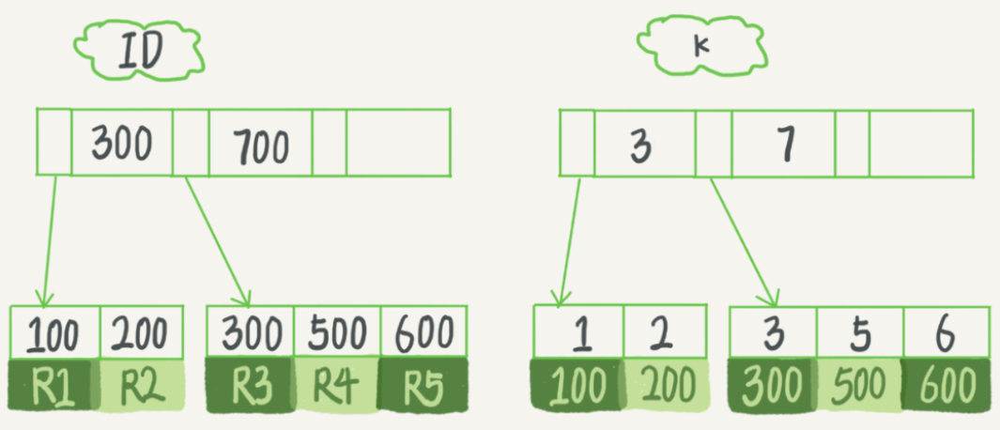
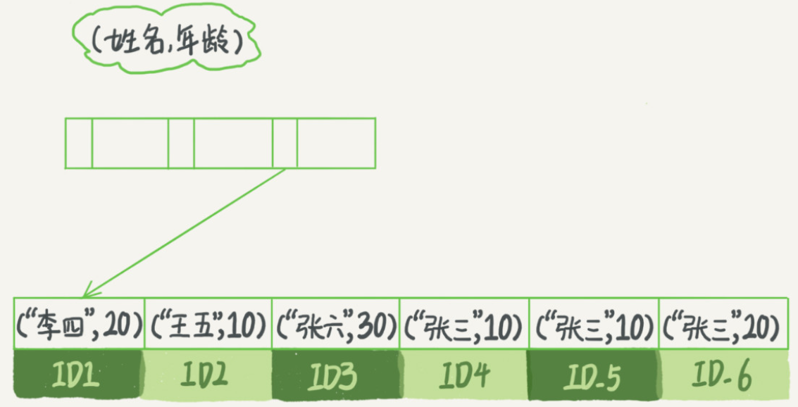
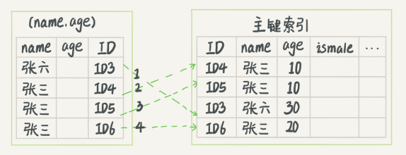
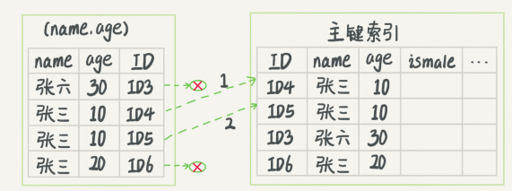

# 1.索引执行示例

例1：

>执行 select * from T where k between 3 and 5，需要执行几次树的搜索操作，会扫描多少行？

表的初始化语句如下：

```sql
create table T (
    ID int primary key,
    k int NOT NULL DEFAULT 0, 
    s varchar(16) NOT NULL DEFAULT '',
    index k(k)
)engine=InnoDB; 

insert into T values(100,1, 'aa'),(200,2,'bb'),(300,3,'cc'),(500,5,'ee'),(600,6,'ff'),(700,7,'gg');
```

索引 B+ 树如下：



执行流程：

（1）在 k 索引树上找到 k=3 的记录，取得 ID = 300；（查 k 索引树）

（2）再到 ID 索引树查到 ID=300 对应的 R3；（回表）

（3）在 k 索引树取下一个值 k=5，取得 ID=500；（查 k 索引树）

（4）再回到 ID 索引树查到 ID=500 对应的 R4；（回表）

（5）在 k 索引树取下一个值 k=6，不满足条件，循环结束。（查 k 索引树）

可以看到，查k 索引树 3 次，回表2次。由于所需要的数据只在主键索引上有，所以需要回表。那么，有没有可能经过索引优化，避免回表过程呢？

# 2.覆盖索引

如果执行的语句是：

```sql
select ID from T where k between 3 and 5;
```

这时只需要查 ID 的值，而 ID 的值已经在 k 索引树上了，因此可以直接提供查询结果，不需要回表。在这个查询里面，索引 k 已经“覆盖了”我们的查询需求，称为覆盖索引。

由于覆盖索引可以减少树的搜索次数，显著提升查询性能，所以使用覆盖索引是一个常用的性能优化手段。

在引擎内部使用覆盖索引在索引 k 上其实读了三个记录，R3~R5（对应的索引 k 上的记录项），但是对于 MySQL 的 Server 层来说，它就是找引擎拿到了两条记录，因此 MySQL 认为扫描行数是 2。

# 3.最左前缀原则

例2：

>我们用（name，age）这个联合索引来分析



可以看到，索引项是按照索引定义里面出现的字段顺序排序的。

（1）当你的逻辑需求是查到所有名字是“张三”的人时，可以快速定位到 ID4，然后向后遍历得到所有需要的结果。

（2）如果你要查的是所有名字第一个字是“张”的人，你的 SQL 语句的条件是"where name like ‘张 %’"。这时，你也能够用上这个索引，查找到第一个符合条件的记录是 ID3，然后向后遍历，直到不满足条件为止。

可以看到，**不只是索引的全部定义，只要满足最左前缀，就可以利用索引来加速检索。这个最左前缀可以是联合索引的最左 N 个字段，也可以是字符串索引的最左 M 个字符**。

# 4.联合索引

例3：

>在一个市民信息表上，是否有必要将身份证号和名字建立联合索引？

市民表的定义：

```sql
CREATE TABLE `tuser` (
  `id` int(11) NOT NULL,
  `id_card` varchar(32) DEFAULT NULL,
  `name` varchar(32) DEFAULT NULL,
  `age` int(11) DEFAULT NULL,
  `ismale` tinyint(1) DEFAULT NULL,
  PRIMARY KEY (`id`),
  KEY `id_card` (`id_card`),
  KEY `name_age` (`name`,`age`)
) ENGINE=InnoDB
```

如果现在有一个高频请求，要根据市民的身份证号查询他的姓名，这个联合索引就有意义了。

在建立联合索引的时候，如何安排索引内的字段顺序？

（1）第一原则是，通过调整顺序，减少维护的索引数量。

当已经有了 (a,b) 这个联合索引后，因为可以支持最左前缀，一般就不需要单独在 a 上建立索引了。

因此，要为高频请求创建 (身份证号，姓名）这个联合索引，**并用这个索引支持“根据身份证号查询地址”的需求**。

（2）第二原则是，节省空间。

例4：

>如果既有联合查询 (a,b) ，又有基于 a、b 各自的查询呢？

**查询条件里面只有 b 的语句，是无法使用 (a,b) 这个联合索引的，这时候你不得不维护另外一个索引，也就是说你需要同时维护 (a,b)、(b) 这两个索引**。

比如上面这个市民表的情况，name 字段是比 age 字段大的，此时创建一个（name,age) 的联合索引和一个 (age) 的单字段索引。

# 5.索引下推

以市民表的联合索引（name, age）为例：检索出表中“名字第一个字是张，而且年龄是 10 岁的所有男孩”。

```sql
select * from tuser where name like '张 %' and age=10 and ismale=1;
```

（1）最左前缀索引规则：能用 “张”，找到第一个满足条件的记录 ID3。

（2）然后判断其他条件是否满足。

在 MySQL 5.6 之前，只能从 ID3 开始一个个回表。到主键索引上找出数据行，再对比字段值。

下图在 (name,age) 索引里特意去掉了 age 的值，这个过程 InnoDB 并不会去看 age 的值，只是按顺序把“name 第一个字是’张’”的记录一条条取出来回表。因此，需要回表 4 次。



 MySQL 5.6 引入的索引下推优化（index condition pushdown）， 可以在索引遍历过程中，对索引中包含的字段先做判断，直接过滤掉不满足条件的记录，减少回表次数。
 
 下图InnoDB 在 (name,age) 索引内部就判断了 age 是否等于 10，对于不等于 10 的记录，直接判断并跳过。在我们的这个例子中，只需要对 ID4、ID5 这两条记录回表取数据判断，就只需要回表 2 次。




