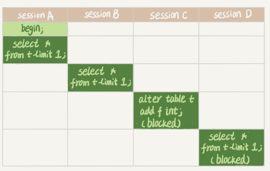

据库锁设计的初衷是处理并发问题。根据加锁的范围，MySQL 里面的锁大致可以分成全局锁、表级锁和行锁三类。

# 1.全局锁

对整个数据库实例加锁。典型使用场景是，做全库逻辑备份。

```sql
-- 方式1：FTWRL
Flush tables with read lock

-- 方式2
set global readonly=true
```

当你需要让整个库处于只读状态的时候，可以使用这个命令，之后其他线程的以下语句会被阻塞：数据更新语句（数据的增删改）、数据定义语句（包括建表、修改表结构等）和更新类事务的提交语句。

官方自带的逻辑备份工具是 mysqldump。当 mysqldump 使用参数–single-transaction 的时候，导数据之前就会启动一个事务，来确保拿到一致性视图。而由于 MVCC 的支持，这个过程中数据是可以正常更新的。该方法只适用于所有的表使用事务引擎的库。

# 2.表级锁

MySQL 里面表级别的锁有两种：一种是表锁，一种是元数据锁（meta data lock，MDL)。

## 2.1 表锁

```sql
-- 设置锁
lock tables … read/write

-- 释放锁
unlock tables
```
例1：

>某个线程 A 中执行 lock tables t1 read, t2 write; 

（1）其他线程写 t1、读写 t2 的语句都会被阻塞。

（2）线程 A 在执行 unlock tables 之前，也只能执行读 t1、读写 t2 的操作。连写 t1 都不允许，自然也不能访问其他表。

## 2.2 MDL（metadata lock）锁

MDL 不需要显式使用，在访问一个表的时候会被自动加上。作用是，保证读写的正确性。

例2：

>如果一个查询正在遍历一个表，期间另一个线程对这个表结构做变更，删了一列，那么查询线程拿到的结果跟表结构对不上，肯定是不行的。

因此，在 MySQL 5.5 版本中引入了 MDL，当对一个表做增删改查操作的时候，加 MDL 读锁；当要对表做结构变更操作的时候，加 MDL 写锁。

（1）读锁之间不互斥，因此你可以有多个线程同时对一张表增删改查。

（2）读写锁之间、写锁之间是互斥的，用来保证变更表结构操作的安全性。因此，如果有两个线程要同时给一个表加字段，其中一个要等另一个执行完才能开始执行。

例3：

>给一个表加字段，或者修改字段，或者加索引，需要扫描全表的数据。在对大表操作的时候，你肯定会特别小心，以免对线上服务造成影响。而实际上，即使是小表，操作不慎也会出问题。我们来看一下下面的操作序列，假设表 t 是一个小表（MySQL 5.6）。



（1） session A 先启动，这时候会对表 t 加一个 MDL 读锁。由于 session B 需要的也是 MDL 读锁，因此可以正常执行。

（2）session C 会被 blocked，是因为 session A 的 MDL 读锁还没有释放，而 session C 需要 MDL 写锁，因此只能被阻塞。

（3）之后所有在表 t 上新申请 MDL 读锁的请求也会被 session C 阻塞。如果查询语句频繁，这个库的线程很快就会爆满。

那么如何安全地给小表加字段？

（1）首先解决长事务，事务不提交，就会一直占着 MDL 锁。在 MySQL 的 information_schema 库的 innodb_trx 表中，你可以查到当前执行中的事务。如果你要做 DDL 变更的表刚好有长事务在执行，要考虑先暂停 DDL，或者 kill 掉这个长事务。

（2） alter table 语句里面设定等待时间，如果在等待时间里能拿到 MDL 写锁最好，拿不到也不要阻塞后面的业务语句，先放弃。之后开发人员或者 DBA 再通过重试命令重复这个过程。

MariaDB 已经合并了 AliSQL 的这个功能，所以这两个开源分支目前都支持 DDL NOWAIT/WAIT n 这个语法。

```sql
ALTER TABLE tbl_name NOWAIT add column ...

ALTER TABLE tbl_name WAIT N add column ... 
```
