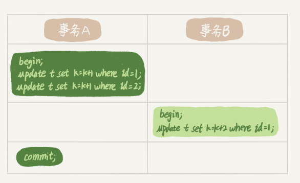

MySQL 的行锁是由各个引擎自己实现的，并不是所有的引擎都支持行锁，不支持行锁意味着并发控制只能使用表锁。MyISAM 不支持行锁，InnoDB 是支持行锁的，这也是 MyISAM 被 InnoDB 替代的重要原因之一。

# 1.两阶段锁

例1：

>假设字段 id 是表 t 的主键，事务 B 的 update 语句会被阻塞，直到事务 A 执行 commit 之后，事务 B 才能继续执行。

两阶段锁协议：在 InnoDB 事务中，行锁是在需要的时候才加上的，但是要等到事务结束时才释放。

## 2.死锁和死锁检测

死锁：当并发系统中不同线程出现循环资源依赖，都在等待别的线程释放资源时，就会导致这几个线程都进入无限等待的状态。

例2：

>事务 A 在等待事务 B 释放 id=2 的行锁，而事务 B 在等待事务 A 释放 id=1 的行锁。

当出现死锁以后，有两种策略：

（1）直接进入等待，直到超时。这个超时时间可以通过参数 innodb_lock_wait_timeout 来设置。

（2）发起死锁检测，发现死锁后，主动回滚死锁链条中的某一个事务，让其他事务得以继续执行。将参数 innodb_deadlock_detect 设置为 on，表示开启这个逻辑。

