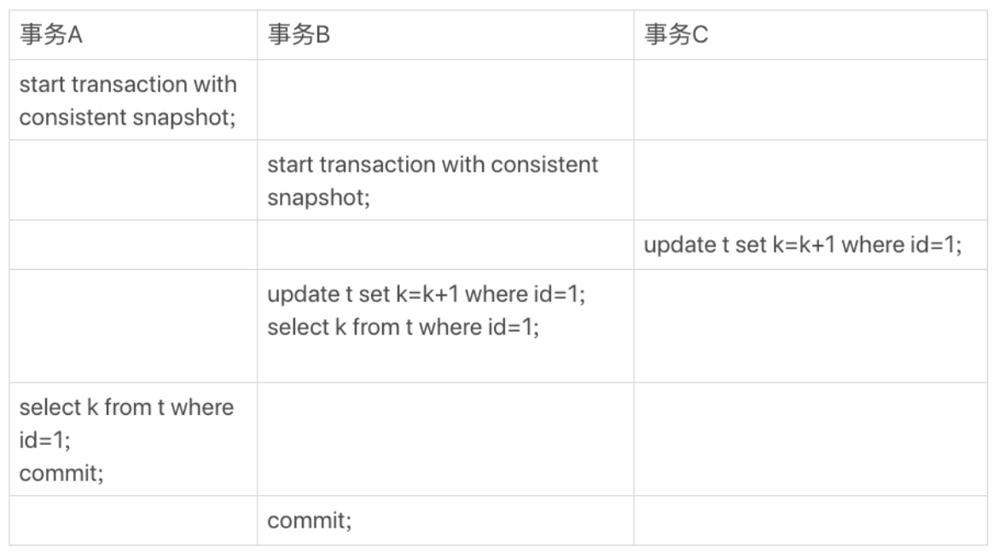
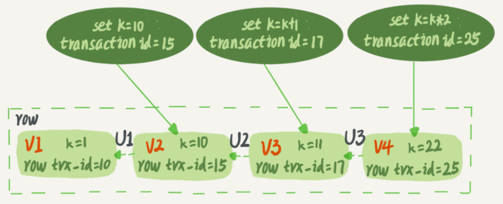
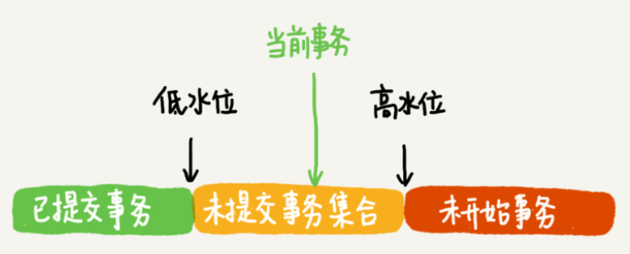
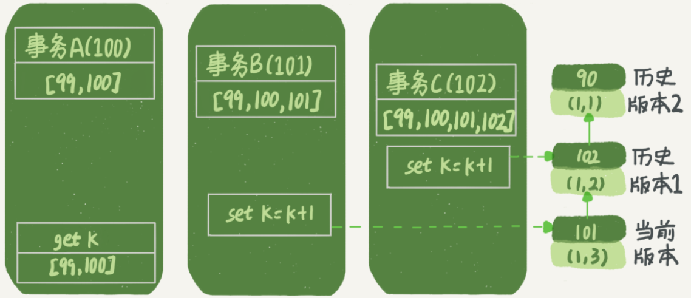
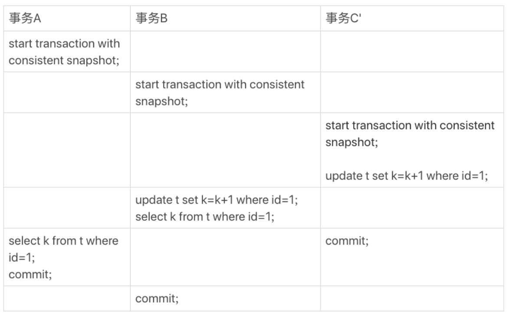
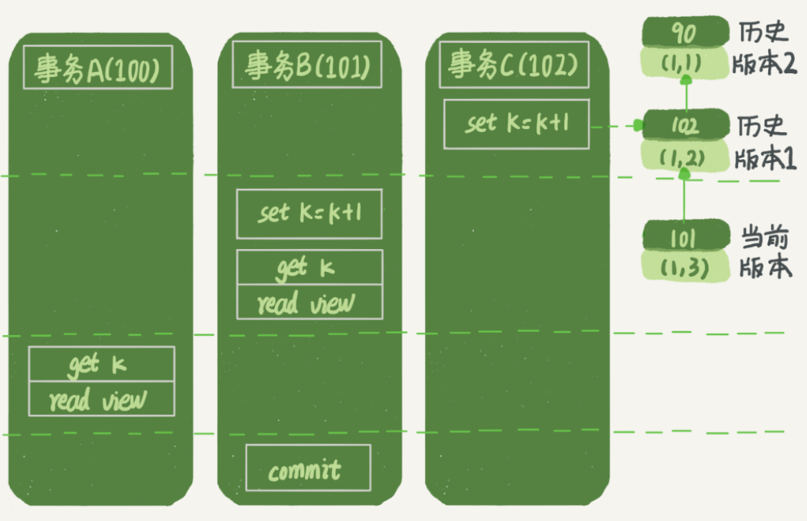

# 1.视图

第 3 章讲到，如果是可重复读隔离级别，事务 T 启动的时候会创建一个视图 read-view，之后事务 T 执行期间，即使有其他事务修改了数据，事务 T 看到的仍然跟在启动时看到的一样。

第 7 章讲到，一个事务要更新一行，如果刚好有另外一个事务拥有这一行的行锁，它会被锁住，进入等待状态。

问题是，既然进入了等待状态，那么等到这个事务自己获取到行锁要更新数据的时候，它读到的值又是什么呢？

例1：

>下面是一个只有两行的表的初始化语句:

```sql
CREATE TABLE `t` (
  `id` int(11) NOT NULL,
  `k` int(11) DEFAULT NULL,
  PRIMARY KEY (`id`)
) ENGINE=InnoDB;

insert into t(id, k) values(1,1),(2,2);
```

按序执行事务 A、B、C：



begin/start transaction 命令并不是一个事务的起点，在此后的第一个操作 InnoDB 表的语句（第一个快照读语句），事务才真正启动。如果想要马上启动一个事务，可以使用 start transaction with consistent snapshot 命令。

在这个例子中，事务 C 没有显式地使用 begin/commit，表示这个 update 语句本身就是一个事务，语句完成的时候会自动提交。事务 B 在更新了行之后查询 ; 事务 A 在一个只读事务中查询，并且时间顺序上是在事务 B 的查询之后。

这时，如果我告诉你事务 B 查到的 k 的值是 3，而事务 A 查到的 k 的值是 1，你是不是感觉有点晕呢？

在 MySQL 里，有两个“视图”的概念：

（1） view。它是一个用查询语句定义的虚拟表，在调用的时候执行查询语句并生成结果。创建视图的语法是 create view ... ，而它的查询方法与表一样。

（2） InnoDB 在实现 MVCC 时用到的一致性读视图，即 consistent read view，用于支持 RC（Read Committed，读提交）和 RR（Repeatable Read，可重复读）隔离级别的实现。

它没有物理结构，作用是事务执行期间用来定义“我能看到什么数据”。

# 2.MVCC

MVCC（Multi-Version Concurrency Control），多版本并发控制。在可重复读隔离级别下，事务在启动时，会对整库创建快照。

整库快照的实现：

（1）事务 ID（transaction id）。InnoDB 每个事务有一个唯一的事务 ID，在事务开始时向 InnoDB 的事务系统申请的，按申请顺序严格递增的。

（2）行数据版本。每次事务更新数据的时候，都会生成一个新的数据版本，并且把 transaction id 赋值给这个数据版本的事务 ID，记为 row trx_id。同时，旧的数据版本要保留，并且在新的数据版本中，能够有信息可以直接拿到它。

（3）历史版本数据计算。视图 V1、V2、V3 并不是物理上真实存在的，而是每次需要的时候根据当前版本和 undo log 计算出来的。比如，需要 V2 的时候，就是通过 V4 依次执行 U3、U2 算出来。

下图记录被多个事务连续更新后的状态，三个虚线箭头是 undo log：



按照可重复读的定义，一个事务启动的时候，能够看到所有已经提交的事务结果。但是之后，这个事务执行期间，其他事务的更新对它不可见。因此，该事务会去查找在启动之前的数据版本，如果是这个事务自己更新的数据，它还是要认的。

数据版本的可见性实现：

（1）事务 ID 数组。InnoDB 为每个事务构造了一个数组，用来保存这个事务启动瞬间，当前正在“活跃”的所有事务 ID。“活跃”指的就是，启动了但还没提交。

（2）事务 ID 水位。数组里面事务 ID 的最小值记为低水位，当前系统里面已经创建过的事务 ID 的最大值加 1 记为高水位。

这个视图数组和高水位，就组成了当前事务的一致性视图（read-view）。数据版本的可见性规则，就是基于数据的 row trx_id 和这个一致性视图的对比结果得到的。

这个视图数组把所有的 row trx_id 分成了几种不同的情况。



这样，对于当前事务的启动瞬间来说，一个数据版本的 row trx_id，有以下几种可能：

（1）如果落在绿色部分，表示这个版本是已提交的事务或者是当前事务自己生成的，这个数据是可见的；

（2）如果落在红色部分，表示这个版本是由将来启动的事务生成的，是肯定不可见的；

（3）如果落在黄色部分，那就包括两种情况：

- 若 row trx_id 在数组中，表示这个版本是由还没提交的事务生成的，不可见；

- 若 row trx_id 不在数组中，表示这个版本是已经提交了的事务生成的，可见。

InnoDB 利用了“所有数据都有多个版本”的这个特性，实现了“秒级创建快照”的能力。

此时，我们再来分析例1.

不妨做如下假设：

（1）事务 A 开始前，系统里面只有一个活跃事务 ID 是 99；

（2）事务 A、B、C 的版本号分别是 100、101、102，且当前系统里只有这四个事务；

（3）三个事务开始前，(1,1）这一行数据的 row trx_id 是 90。

这样，事务 A 的视图数组就是 [99,100], 事务 B 的视图数组是 [99,100,101], 事务 C 的视图数组是 [99,100,101,102]。



时间先后顺序来判断：

第一个有效更新是事务 C，把数据从 (1,1) 改成了 (1,2)。这时候，这个数据的最新版本的 row trx_id 是 102，而 90 这个版本已经成为了历史版本。

第二个有效更新是事务 B，把数据从 (1,2) 改成了 (1,3)。这时候，这个数据的最新版本（即 row trx_id）是 101，而 102 又成为了历史版本。

在事务 A 查询的时候，其实事务 B 还没有提交，但是它生成的 (1,3) 这个版本已经变成当前版本了。但这个版本对事务 A 必须是不可见的，否则就变成脏读了。

好，现在事务 A 要来读数据了，它的视图数组是 [99,100]。当然了，读数据都是从当前版本读起的。所以，事务 A 查询语句的读数据流程是这样的：

- 找到 (1,3) 的时候，判断出 row trx_id=101，比高水位大，处于红色区域，不可见；

- 接着，找到上一个历史版本，一看 row trx_id=102，比高水位大，处于红色区域，不可见；

- 再往前找，终于找到了（1,1)，它的 row trx_id=90，比低水位小，处于绿色区域，可见。

这样执行下来，虽然期间这一行数据被修改过，但是事务 A 不论在什么时候查询，看到这行数据的结果都是一致的，所以我们称之为一致性读。

# 3.更新逻辑

事务 B 的视图数组是先生成的，之后事务 C 才提交，不是应该看不见 (1,2) 吗，怎么能算出 (1,3) 来？

是的，如果事务 B 在更新之前查询一次数据，这个查询返回的 k 的值确实是 1。

但是，如果更新数据，就不能再在历史版本上更新了，否则事务 C 的更新就丢失了。因此，事务 B 此时的 set k=k+1 是在（1,2）的基础上进行的操作。

**规则**：更新数据都是先读后写的，这个读只能读当前的值，称为“当前读”（current read）。

因此，在更新的时候，当前读拿到的数据是 (1,2)，更新后生成了新版本的数据 (1,3)，这个新版本的 row trx_id 是 101。

所以，在执行事务 B 查询语句的时候，一看自己的版本号是 101，最新数据的版本号也是 101，是自己的更新，可以直接使用，所以查询得到的 k 的值是 3。

这里我们提到了一个概念，叫作当前读。其实，除了 update 语句外，select 语句如果加锁，也是当前读。

所以，如果把事务 A 的查询语句 select * from t where id=1 修改一下，加上 lock in share mode 或 for update，也都可以读到版本号是 101 的数据，返回的 k 的值是 3。下面这两个 select 语句，就是分别加了读锁（S 锁，共享锁）和写锁（X 锁，排他锁）。

```sql
mysql> select k from t where id=1 lock in share mode;

mysql> select k from t where id=1 for update;
```

例2：

>假设事务 C 不是马上提交的，而是变成了下面的事务 C’，会怎么样呢？



事务 C’的不同是，更新后并没有马上提交，在它提交前，事务 B 的更新语句先发起了。

前面说过了，虽然事务 C’还没提交，但是 (1,2) 这个版本也已经生成了，并且是当前的最新版本。那么，事务 B 的更新语句会怎么处理呢？

此时，我们在上一篇文章中提到的“两阶段锁协议”就要上场了。事务 C’没提交，也就是说 (1,2) 这个版本上的写锁还没释放。而事务 B 是当前读，必须要读最新版本，而且必须加锁，因此就被锁住了，必须等到事务 C’释放这个锁，才能继续它的当前读。

到这里，我们把一致性读、当前读和行锁就串起来了。

现在，我们再回到文章开头的问题：事务的可重复读的能力是怎么实现的？

（1）可重复读的核心就是一致性读（consistent read）；

（2）更新数据的时候，只能用当前读。如果当前的记录的行锁被其他事务占用的话，就需要进入锁等待。

而读提交的逻辑和可重复读的逻辑类似，它们最主要的区别是：

在可重复读隔离级别下，只需要在事务开始的时候创建一致性视图，之后事务里的其他查询都共用这个一致性视图；

在读提交隔离级别下，每一个语句**执行前都会重新算出一个新的视图**。

那么，我们再看一下，在读提交隔离级别下，事务 A 和事务 B 的查询语句查到的 k，分别应该是多少呢？

“start transaction with consistent snapshot; ”的意思是从这个语句开始，创建一个持续整个事务的一致性快照。所以，在读提交隔离级别下，这个用法就没意义了，等效于普通的 start transaction。

下面是读提交时的状态图，可以看到这两个查询语句的创建视图数组的时机发生了变化，就是图中的 read view 框。（注意：这里，我们用的还是事务 C 的逻辑直接提交，而不是事务 C’）



这时，事务 A 的查询语句的视图数组是在执行这个语句的时候创建的，时序上 (1,2)、(1,3) 的生成时间都在创建这个视图数组的时刻之前。但是，在这个时刻：

(1,3) 还没提交，属于情况 1，不可见；
(1,2) 提交了，属于情况 3，可见。
所以，这时候事务 A 查询语句返回的是 k=2。

显然地，事务 B 查询结果 k=3。

# 4.总结

InnoDB 的行数据有多个版本，每个数据版本有自己的 row trx_id，每个事务或者语句有自己的一致性视图。

普通查询语句是一致性读，一致性读会根据 row trx_id 和一致性视图确定数据版本的可见性。

对于可重复读，查询只承认在**事务启动前**就已经提交完成的数据；

对于读提交，查询只承认在**语句启动前**就已经提交完成的数据；

而当前读，总是读取已经提交完成的最新版本。
