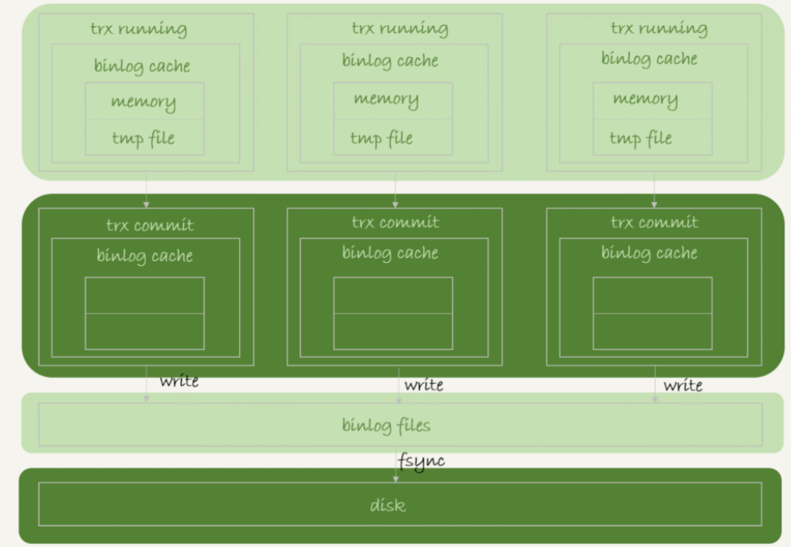
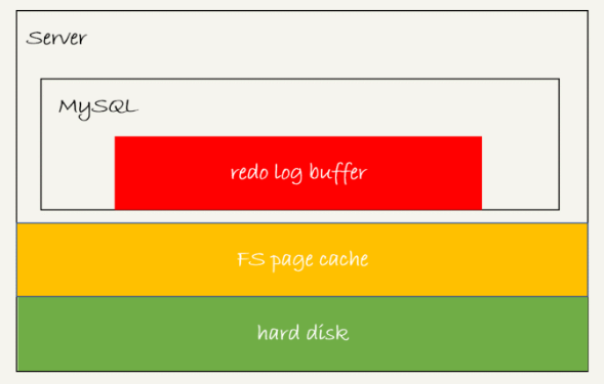

只要 redo log 和 binlog 保证持久化到磁盘，就能确保 MySQL 异常重启后，数据可以恢复。redo log 的写入流程是怎么样的？如何保证 redo log 真实地写入了磁盘？那么今天，我们就再一起看看 MySQL 写入 binlog 和 redo log 的流程。

# 1.binlog 的写入机制

binlog 的写入逻辑：事务执行过程中，先把日志写到 binlog cache，事务提交的时候，再把 binlog cache 写到 binlog 文件中。

一个事务的 binlog 是不能被拆开的，因此不论这个事务多大，也要确保一次性写入。这就涉及到了 binlog cache 的保存问题。

系统给 binlog cache 分配了一片内存，每个线程一个，参数 binlog_cache_size 用于控制单个线程内 binlog cache 所占内存的大小。如果超过了这个参数规定的大小，就要暂存到磁盘。事务提交的时候，执行器把 binlog cache 里的完整事务写入到 binlog 中，并清空 binlog cache。

可以看到，每个线程有自己 binlog cache，但是共用同一份 binlog 文件。

图中的 write，指的就是指把日志写入到文件系统的 page cache，并没有把数据持久化到磁盘，所以速度比较快。图中的 fsync，才是将数据持久化到磁盘的操作。一般情况下，我们认为 fsync 才占磁盘的 IOPS。

write 和 fsync 的时机，是由参数 sync_binlog 控制的：

（1）sync_binlog=0 的时候，表示每次提交事务都只 write，不 fsync；

（2）sync_binlog=1 的时候，表示每次提交事务都会执行 fsync；

（3）sync_binlog=N(N>1) 的时候，表示每次提交事务都 write，但累积 N 个事务后才 fsync。

因此，在出现 IO 瓶颈的场景里，将 sync_binlog 设置成一个比较大的值，可以提升性能。在实际的业务场景中，考虑到丢失日志量的可控性，一般不建议将这个参数设成 0，比较常见的是将其设置为 100~1000 中的某个数值。

但是，将 sync_binlog 设置为 N，对应的风险是：如果主机发生异常重启，会丢失最近 N 个事务的 binlog 日志。

# 2.redo log 的写入机制

在第 15 章中，介绍了事务在执行过程中，生成的 redo log 是要先写到 redo log buffer 的。然后就有同学问了，redo log buffer 里面的内容，是不是每次生成后都要直接持久化到磁盘呢？

答案是，不需要。

如果事务执行期间 MySQL 发生异常重启，那这部分日志就丢了。由于事务并没有提交，所以这时日志丢了也不会有损失。

那么，另外一个问题是，事务还没提交的时候，redo log buffer 中的部分日志有没有可能被持久化到磁盘呢？

答案是，确实会有。

这个问题，要从 redo log 可能存在的三种状态说起。这三种状态，对应的就是图中的三个颜色块。

这三种状态分别是：

（1）红色：存在 redo log buffer 中，物理上是在 MySQL 进程内存中；

（2）黄色：写到磁盘 (write)，但是没有持久化（fsync)，物理上是在文件系统的 page cache 里面；

（3）绿色：持久化到磁盘，对应的是 hard disk。

日志写到 redo log buffer 是很快的，wirte 到 page cache 也差不多，但是持久化到磁盘的速度就慢多了。

为了控制 redo log 的写入策略，InnoDB 提供了 innodb_flush_log_at_trx_commit 参数，它有三种可能取值：

（1）设置为 0 的时候，表示每次事务提交时都只是把 redo log 留在 redo log buffer 中 ;

（2）设置为 1 的时候，表示每次事务提交时都将 redo log 直接持久化到磁盘；

（3）设置为 2 的时候，表示每次事务提交时都只是把 redo log 写到 page cache。

InnoDB 有一个后台线程，每隔 1 秒，就会把 redo log buffer 中的日志，调用 write 写到文件系统的 page cache，然后调用 fsync 持久化到磁盘。因此一个没有提交的事务的 redo log，也是可能已经持久化到磁盘的。

还有两种场景会让一个没有提交的事务的 redo log 写入到磁盘中。

（1）**redo log buffer 占用的空间即将达到 innodb_log_buffer_size 一半的时候，后台线程会主动写盘。**注意，由于这个事务并没有提交，所以这个写盘动作只是 write，而没有调用 fsync，也就是只留在了文件系统的 page cache。

（2）**并行的事务提交的时候，顺带将这个事务的 redo log buffer 持久化到磁盘。**假设一个事务 A 执行到一半，已经写了一些 redo log 到 buffer 中，这时候有另外一个线程的事务 B 提交，如果 innodb_flush_log_at_trx_commit 设置的是 1，那么按照这个参数的逻辑，事务 B 要把 redo log buffer 里的日志全部持久化到磁盘。这时候，就会带上事务 A 在 redo log buffer 里的日志一起持久化到磁盘。

如果把 innodb_flush_log_at_trx_commit 设置成 1，那么 redo log 在 prepare 阶段就要持久化一次，因为有一个崩溃恢复逻辑是要依赖于 prepare 的 redo log，再加上 binlog 来恢复的（第 15 章）。

