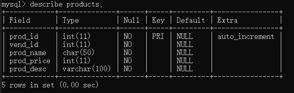

本章介绍MySQL的数据类型，基本的表操作，基本的CRUD操作。

# 1.数据类型

(1)串数据

即字符串类型，分为定长串和变长串。定长串接受固定长度，在表创建时指定；变长串存储可变长度文本。

串数据需要括在引号内，通常**单引号**更好。

|数据类型     |说明|
|------------|----|
|CHAR|1~255个字符的定长串。在创建时指定，否则假定为CHAR(1)|
|VARCHAR|变长，不超过255字节。若在创建时指定VARCHAR(n)，则可存储0到n个字符的变长串(n≤255)
|ENUM|一个预定义集合的某个串，最多64K个串|
|SET|接受最多64个串组成的一个预定义集合的零个或多个串|
|TEXT|变长文本，最大长度64K|
|TINYTEXT|变长文本，最大长度255字节|
|MEDIUMTEXT|变长文本，最大长度16K|
|LONGTEXT|变长文本，最大长度4GB|

（2）数值数据

**无需**放在引号内。

除BIT和BOOLEAN外，都可以有符号或无符号。

|数据类型|说明|
|-------|----|
|BIT|位字段，1~64位|
|BOOLEAN（或BOOL）|布尔值，0或1|
|INT（或INTEGER）|整数值，范围-2147483648 \~ 2147483647，如果是UNSIGNED，则0 \~ 4294967295|
|TINYINT|整数值，范围-128 \~ 127，如果是UNSIGNED，则0 \~ 255|
|SMALLINT|整数值，范围-32768 \~ 32767，如果是UNSIGNED，则0 \~ 65535|
|MEDIUMINT|整数值，范围-8388608 \~ 8388607，如果是UNSIGNED，则0 \~ 16777215|
|BIGINT|整数值，范围-9223372036854775808 \~ 9223372036854775807，如果是UNSIGNED，则0 \~ 18446744073709551615|
|DECIMAL（或DEC）|精度可变的浮点值|
|DOUBLE|双精度浮点值|
|FLOAT|单精度浮点值|
|REAL|4字节的浮点值|

（3）日期和时间数据
|数据类型|说明|
|-------|----|
|YEAR|2位数字表示时，范围70（1970年） \~ 69（2069年）；4位数字表示时，范围1901 \~ 2155年|
|DATA|日期，格式为YYYY-MM-DD，范围1000-01-01 \~ 9999-12-31|
|TIME|时间，格式为HH:MM:SS|
|DATETIME|DATA和TIME的组合|
|TIMESTAMP|时间戳，功能与DATETIME相同，但范围较小|

（4）二进制数据

可存储任何数据，包括二进制信息，如图像、多媒体、字处理文档等。

|数据类型|说明|
|-------|----|
|BLOB|Blob最大长度64KB|
|TINYBLOB|Blob最大长度255字节|
|MEDIUMBLOB|Blob最大长度16MB|
|LONGBLOB|Blob最大长度4GB|

# 2.表级操作

（1）创建表```CREATE TABLE```

```sql
CREATE TABLE IF NOT EXISTS `products` (   -- 创建前检查是否已经存在
  `prod_id` int(11) NOT NULL AUTO_INCREMENT,  -- 自增
  `vend_id` int(11) NOT NULL,    
  `prod_name` char(50) NOT NULL,
  `prod_price` int(11) NOT NULL,
  `prod_desc` varchar(100) NOT NULL,
  PRIMARY KEY (`prod_id`)    -- 主键
) ENGINE=InnoDB DEFAULT CHARSET=utf8;  -- 引擎，默认字符集
```

创建了1个products的表，并且设置了每个字段（Field）的数据类型以及要求。



主键（primary key）：一列（或一组列），其值能够唯一区分表中的每行。

```sql
-- 在定义表时，创建主键
PRIMARY KEY (`prod_id`) -- 单个列作为主键
PRIMARY KEY (`order_num`, `order_item`)  -- 多个列一起作为主键
```

（2）更新表```ALTER TABLE```

```sql
ALTER TABLE products ADD vend_phone CHAR(20); -- 增加了一个新的列
ALTER TABLE products DROP COLUMN vend_phone; -- 删除列
ALTER TABLE products ADD CONSTRAINT fk_products_vendors FOREIGN KEY (vend_id) REFERENCES vendors (vend_id);  -- 定义外键 
```

外键（foreign key）：外键为表中的一列，包含另一个表的主键值，定义了两个表之间的关系。

```sql
-- 在定义表时，创建外键
FOREIGN KEY (prod_id) REFERENCES products (prod_id)

-- 改变表的结构，增加外键
ALTER TABLE orderitems ADD CONSTRAINT fk_orderitems_products FOREIGN KEY (prod_id) REFERENCES products (prod_id);
```

对于复杂的表的结构更改，一般步骤：
①用新的列布局创建一个新表；
②使用```INSERT SELECT``语句将旧表数据复制到新表。
③检验新表；
④重命名旧表，如果确定，可以删除它。
⑤用旧表原来的名字，重命名新表。
⑥根据需要，重新创建触发器、存储过程、索引、外键等；

（3）删除表```DROP TABLE```

```sql
DROP TABLE IF EXISTS products;
```

（4）重命名表```RENAME TABLE```

```sql
RENAME TABLE products TO products1; -- 对1个表重命名
```

```sql
RENAME TABLE products TO products1，
             customers TO customers1,
             orders TO orders1;     -- 对多个表重命名
```

# 3.基本CRUD操作

CRUD：增加(Create)、检索(Retrieve)、更新(Update)和删除(Delete)几个单词的首字母简写。

（1）检索数据```SELECT```

基本句式：```SELECT ... FROM ...```

```sql
SELECT prod_name FROM products;    -- 检索单个列

SELECT prod_id, vend_id, prod_name FROM products; -- 检索多个列

SELECT * FROM products;    -- 检索所有列

SELECT DISTINCT prod_name FROM products;   -- 检索单个列，关键字DISTINCT表明值不重复

SELECT products.prod_name FROM products;    -- 完全限定列名，即特指products表中的列prod_name
```

（2）插入数据```INSERT```

基本句式：```INSERT INTO ... VALUES ...```

```sql
-- 插入完整的一条数据，prod_id设置了自增，因此可用NULL，让MySQL自动增量
-- 也可以省略部分列，但是要求省略的列在表的允许下：①允许NULL。②表定义中给出了默认值
INSERT INTO products(prod_id, vend_id, prod_name, prod_price, prod_desc) 
       VALUES (NULL, 1, 'lz', 100, 'worker');  
```

```sql
-- 插入多条数据，要求插入的列相同
INSERT INTO products(prod_id, vend_id, prod_name, prod_price, prod_desc) 
       VALUES (NULL, 1, 'lz', 100, 'worker'),
              (NULL, 2, 'lm', 101, 'worker');
```

```sql
-- 插入检索出的数据，INSERT SELECT
INSERT INTO products(prod_id, vend_id, prod_name, prod_price, prod_desc) 
       SELECT prod_id, vend_id, prod_name, prod_price, prod_desc FROM products_new;
```

（3）更新数据```UPDATE```

基本句式：```UPDATE ... SET ... WHERE ...```，一定要记得用WHERE指定要更新的行，否则将是对整个表进行更新

```sql
UPDATE products SET prod_desc = 'master' WHERE prod_id = 1;  -- 更新单个列

UPDATE products SET prod_price = 200, prod_desc = 'master' WHERE prod_id = 1;  -- 更新多个列
```

（4）删除数据```DELETE```

基本句式：```DELETE FROM ... WHERE ...```，一定要记得用WHERE指定要删除的行，否则将是删除整个表的内容

```sql
DELETE FROM products WHERE prod_id = 1;  -- 删除单个行

TRUNCATE TABLE products;  -- 删除所有行。具体先删除表，再重建一个一样的表，速度更快。
```
