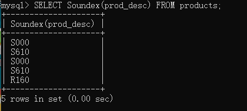

本章介绍函数的使用。

（1）文本处理函数

|函数|说明|
|----|---|
|Left()|返回串左边的字符|
|Right()|返回串右边的字符|
|Length()|返回串的长度|
|Locate()|找出串的一个子串|
|SubString()|返回子串的字符|
|Lower()|将串转换为小写|
|Upper()|将串转换为大写|
|LTrim()|去掉串左边的空格|
|RTrim()|去掉串右边的空格|
|Soundex()|返回串的SOUNDEX值，一个将字符串转换为描述其语音表示的算法|

```sql
-- 返回描述字段的SOUNDEX值
SELECT Soundex(prod_desc) FROM products;
```



（2）日期和时间处理函数

|函数|说明|
|----|---|
|AddDate()|增加一个日期（天、周等）|
|AddTime()|增加一个时间（时、分等）|
|Now()|返回当前日期和时间|
|CurDate()|返回当前日期|
|CurTime()|返回当前时间|
|Date()|返回日期时间的日期部分|
|DateDiff()|计算两个日期之差|
|Date_Add()|高度灵活的日期运算函数|
|Date_Format()|返回一个格式化的日期或时间串|
|Year()|返回一个日期的年份部分|
|Month()|返回一个日期的月部分|
|Day()|返回一个日期的天数部分|
|DayOfWeek()|对于一个日期，返回对应的星期几|
|Time()|返回一个日期时间的时间部分|
|Hour|返回一个时间的小时部分|
|Minute()|返回一个时间的分钟部分|
|Second()|返回一个时间的秒部分|

```sql
-- 检索2005年9月1日这一天，每个客户的订单号
SELECT cust_id, order_num FROM orders WHERE Date(order_date) = '2005-09-01';
```

关键点：

    ①日期的格式必须是yyyy-mm-dd，因此2005年9月1日为2005-09-01.

    ②必须使用Date()函数指示这一天，否则 WHERE order_date = '2005-09-01' 表示2005-09-01 00:00:00 这个时间点。

```sql
-- 检索2005年9月这一个月，每个客户的订单号，需要记住是否闰月，一个月的开始结束
SELECT cust_id, order_num FROM orders WHERE Date(order_date) BETWEEN '2005-09-01' AND '2005-09-01';

-- 检索2005年9月这一个月，每个客户的订单号，无需知道该月的开始结束
SELECT cust_id, order_num FROM orders WHERE Year(order_date) =2005 AND Month(order_date) = 9;
```

（3）数值处理函数

|函数|说明|
|----|---|
|Abs()|返回一个数的绝对值|
|Sqrt()|返回一个数的平方根|
|Cos()|返回一个角度的余弦|
|Sin()|返回一个角度的正弦|
|Tan()|返回一个角度的正切|
|Exp()|返回一个数的指数值|
|Mod()|返回除操作数的余数|
|Pi()|返回圆周率|
|Rand()|返回一个随机数|

（4）汇总数据

聚集函数（aggregate function）：运行在行组上，计算和返回单个值的函数。

|聚集函数|说明|
|----|---|
|AVG()|返回某列的平均数|
|COUNT()|返回某列的行数|
|MAX()|返回某列的最大值|
|MIN()|返回某列的最小值|
|SUM()|返回某列值的和|

AVG()函数：

```sql
-- 列名必须作为AVG()的参数。若要多个列的平均值，则使用多个AVG()
SELECT AVG(prod_price) AS avg_price FROM products;
```

COUNT()函数：

①使用COUNT(*)对表的行数进行统计，包含空值（NULL）和非空值。

②使用COUNT(column)对特定的列具有值的行进行计数，忽略NULL值。

```sql
-- 检索客户数量，不会忽略掉NULL
SELECT COUNT(*) AS num_cust FROM customers;

-- 检索有email的客户数量，会忽略掉NULL
SELECT COUNT(cust_email) AS num_email FROM customers;
```

MAX()、MIN()、SUM()函数：

```sql
SELECT MAX(prod_price) AS max_price FROM products;

SELECT MIN(prod_price) AS min_price FROM products;

SELECT SUM(prod_price) AS sum_price FROM products;
```

组合聚集：

```sql
SELECT  COUNT(*) AS num_items,
        MAX(prod_price) AS max_price,
        MIN(prod_price) AS min_price,
        SUM(prod_price) AS sum_price FROM products;
```

聚集不同值：

ALL为默认值，无需指定。如果要只包含不同值，可使用关键词 ```DISTINCT``` 。

```sql
-- 返回价格不同的产品的平均价格
SELECT AVG(DISTINCT prod_price) AS avg_price FROM products;
```
