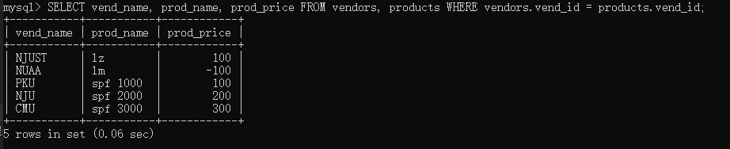
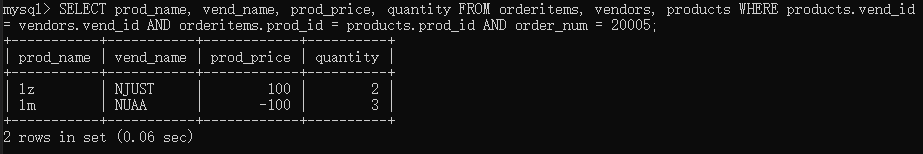

Q:如果数据存储在**多个表**中，怎么使用单条SELECT语句检索出数据？

A:使用联结。

本章介绍表的联结等内容。

# 1.联结

（1）创建联结

基本句式：```SELECT ... FROM t1, t2, ... WHERE ...```

```sql
-- 联结两个表，依据供应商id进行联结
SELECT vend_name, prod_name, prod_price FROM vendors, products WHERE vendors.vend_id = products.vend_id;
```



```sql
-- 多表联结，编号为20005的订单中的物品
SELECT prod_name, vend_name, prod_price, quantity FROM orderitems, vendors, products WHERE products.vend_id = vendors.vend_id AND orderitems.prod_id = products.prod_id AND order_num = 20005;
```



在联结时，需要给出WHERE子句进行限定。否则，将一个表的每一行与另一个表联结。

（2）内部联结

等值联结（equijoin）：基于两个表之间的相等测试，也可称为内部联结。

在使用时，我们可以用显式的语法表明联结类型。

基本句式：```SELECT ... FROM ... INNER JOIN ... ON ...```

```sql
-- 上面的sql改写，一样的效果
SELECT vend_name, prod_name, prod_price FROM vendors INNER JOIN products ON vendors.vend_id = products.vend_id;
```

（3）自联结

一张表联结自身，即需要用到自身的信息作为查询条件。

```sql
-- 检索p2.id = '2'的生厂商的所有产品，为了防止歧义，使用别名
SELECT p1.prod_id, p1.prod_name FROM products AS p1, products AS p2 WHERE p1.vend_id = p2.vend_id AND p2.id = '2';
```

（4）自然联结

自然联结排除多次出现，使每个列只返回1次。因此，目前为止，我们建立的每个内部联结都是自然联结。

（5）外部联结

将一个表中的行与另一个表中的行相关联，有时需要关联没有关联行的那些行。

左联结：返回左表中的全部记录和右表中与联结字段相等的记录。

右联结：返回右表中的全部记录和左表中与联结字段相等的记录。

基本句式：```SELECT ... FROM t1 LEFT/RIGHT OUTER JOIN t2 ON ...```

```sql
-- 内部联结，检索所有客户及其订单
SELECT customers.cust_id, orders.order_num FROM customers INNER JOIN orders ON customers.cust_id = orders.cust_id;

-- 外部联结（左联结），检索所有客户及其订单，包括没有下订单的客户
SELECT customers.cust_id, orders.order_num FROM customers LEFT OUTER JOIN orders ON customers.cust_id = orders.cust_id;

-- 外部联结（右联结），检索所有订单及其客户
SELECT customers.cust_id, orders.order_num FROM customers RIGHT OUTER JOIN orders ON customers.cust_id = orders.cust_id;
```

# 2.组合

当前我们的查询都是从一个或多个表中返回单条SELECT语句的结果。

MySQL也支持执行多个SELECT语句，并将结果作为单个查询结果返回，这些组合查询通常称为并（union）或复合查询（compound query）。

有两种基本情况，其中需要使用组合查询：

    ①在单个查询中，从不同的表返回类似结构的数据。
    ②对单个表执行多个查询，按单个查询返回数据。

规则：
    
    ①UNION必须使用两条或两条以上的SELECT语句。
    ②UNION的每个查询必须包含相同的列、表达式或聚集函数，不过每个列的次序不一定要一样。
    ③列数据的类型必须兼容：不必完全相同，但是需要DBMS可以进行隐式转换。

（1）创建组合查询

只需要使用UNION关键字，将每条SELECT语句连接起来。

基本句式：```SELECT ... FROM ... WHERE ... UNION SELECT ... FROM ... WHERE ...```

```sql
-- 将两条SELECT语句的结果整合在一起，输出
SELECT vend_id, prod_id, prod_price FROM products WHERE prod_price <= 5 
UNION 
SELECT vend_id, prod_id, prod_price FROM products WHERE vend_id IN (1, 4);

-- 也可使用OR
SELECT vend_id, prod_id, prod_price FROM products WHERE prod_price <= 5 OR vend_id IN (1, 4);
```

（2）取消重复的行

UNION 自动去除了重复的行。如果想留下重复的行，可使用UNION ALL。

（3）结果排序

在 UNION 语句中，要想对最终结果排序，那么 ORDER BY 只能使用一次，并且只能出现在最后一条 SELECT 语句的末尾。

```sql
-- ORDER BY 的使用
SELECT vend_id, prod_id, prod_price FROM products WHERE prod_price <= 5 
UNION 
SELECT vend_id, prod_id, prod_price FROM products WHERE vend_id IN (1, 4) ORDER BY vend_id, prod_id;
```
