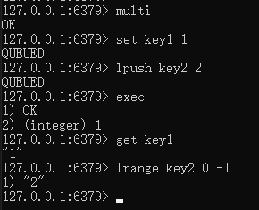
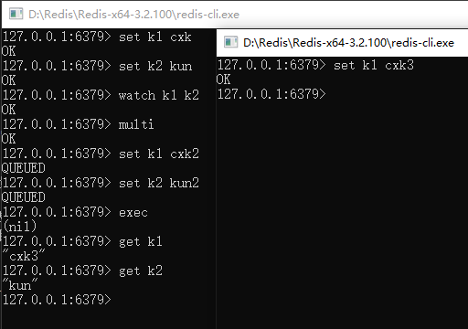
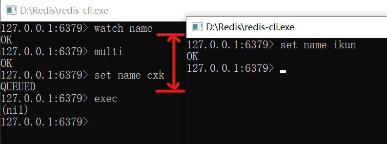
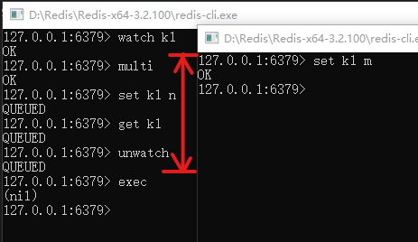
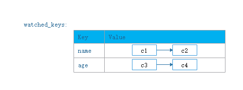
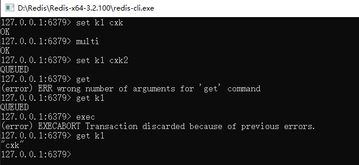
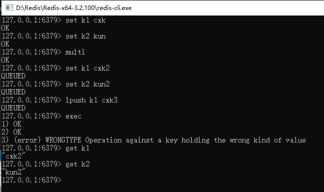

为了同时处理多个结构，需要向Redis发送多个命令。将多个命令封装成事务（transaction），提交给Redis。当事务内所有命令都执行完毕，Redis才会去处理其他客户端的命令。

# 1 事务命令

|命令|行为|示例|
|----|---|----|
|WATCH|乐观锁,监视任意数量的数据库键||
|UNWATCH|取消 WATCH 命令对**所有**数据库键的监视||
|MULTI|开启事务||
|EXEC|执行事务||
|DISCARD|取消事务||

# 2 事务流程

(1）事务开始。

(2）命令入队。

在事务中，如果客户端发送的命令为EXEC、DISCARD、WATCH、MULTI四个命令的其中一个，那么服务器立即执行这个命令。相反，如果命令是其他命令，那么服务器并不立即执行这个命令，而是将这个命令放入一个事务队列里面，然后向客户端返回QUEUED回复。

(3）事务执行。

例子1：事务执行成功



例子2：事务执行失败



## 2.1 开启事务

MULTI命令开启事务。

## 2.2 事务队列

事务操作以外的命令将会被放在一个事务队列中。

Redis客户端的mstate属性表征其事务状态。事务状态包含一个事务队列，以及一个已入队命令的计数器。事务队列中的每个元素对应着一个命令的相关信息，包括指向命令实现函数的指针、命令的参数，以及参数的数量。

```C
typedef struct redisClient {
	
	//事务状态
	multiState mstate; 
	// ...
}redisClient;

typedef struct multiState {
	//事务队列，FIFO顺序
	multiCmd *commands;
	//已入队命令计数
	int count;
}multiState;

typedef struct multiCmd {
	//参数
	robj **argv;
	//参数数量
	int argc;
	//命令指针
	struct redisCommand *cmd;
} multiCmd;
```

## 2.3 事务执行

EXEC命令用于执行事务。服务器会遍历客户端的事务队列，执行队列中保存的所有命令，最后将执行命令所得的结果全部返回给客户端。

EXEC命令的实现原理：

```python
def EXEC():
    #创建空白的回复队列
    reply_queue = []
    #遍历事务队列中的每个项
    #读取命令的参数， 参数的个数， 以及要执行的命令
    for argv, argc, cmd in client.mstate.commands:
        #执行命令， 并取得命令的返回值
        reply = execute_command(cmd, argv, argc)
        #将返回值追加到回复队列末尾
        reply_queue.append(reply)
        #移除REDIS_MULTI标识， 让客户端回到非事务状态
        client.flags & = ~REDIS_MULTI
        #清空客户端的事务状态， 包括：
        #1）清零入队命令计数器
        #2）释放事务队列
        client.mstate.count = 0
        release_transaction_queue(client.mstate.commands)
        #将事务的执行结果返回给客户端
        send_reply_to_client(client, reply_queue)
```

## 2.3 事务取消

DISCARD命令取消事务。

# 3.数据监视

WATCH命令监视任意数量的数据库键；UNWATCH命令取消 WATCH 命令对**所有** key 的监视。

WATCH命令是一个乐观锁(optimistic locking)，它可以在EXEC命令执行之前，监视任意数量的数据库键，并在EXEC命令执行时，检查被监视的键是否被修改。如果是，服务器将拒绝执行事务，并向客户端返回代表事务执行失败的空回复。

举个例子：客户端A监控了键name，然后开启了事务，并执行。但是在客户端A监控键name后，且事务执行前，客户端B对键name进行了修改，将导致客户端A的事务执行失败。



UNWATCH命令只能在事务开始前才起作用，事务开启后，使用UNWATCH，如果另一个客户端修改了被监视的键，事务依旧执行失败。



## 3.1 监视信息的保存

每个Redis数据库都保存着一个watched_keys字典。字典的键是被WATCH命令监视的数据库键，而字典的值则是一个链表，链表中记录监视该数据库键的所有客户端：



```C
typedef struct redisDb {
    // ...
    //正在被WATCH命令监视的键
    dict *watched_keys;
} redisDb;
```

## 3.2 监视机制的触发

所有对数据库进行修改的命令，在执行之后都会调用multi.c/touchWatchKey函数对watched_keys字典进行检查。如果该键正在被某个客户端监听，那么touchWatchKey函数会将监视该键的客户端的REDIS_DIRTY_CAS标识打开，表示该客户端的事务安全性已经被破坏。

```python
def touchWatchKey(db, key):
    #如果键key存在于数据库的watched_keys字典中
    #那么说明至少有一个客户端在监视这个key
    if key in db.watched_keys:
        #遍历所有监视键key的客户端
        for client in db.watched_keys[key]:
            #打开标识
            client.flags |= REDIS_DIRTY_CAS
```

当REDIS_DIRTY_CAS被打开，此时服务器将认为该事务不安全，拒绝执行。

# 4.事务的ACID特性在Redis中的体现

Redis中，事务总是具有原子性(Automic)、一致性(Consistency)、隔离性(Isolation)，当Redis运行在特定的持久化模式中，也具有持久性(Durability)。

## 4.1 原子性

定义：数据库将事务中的多个操作当作一个整体来执行，服务器要么就执行事务中的所有操作，要么就一个操作也不执行。

Redis事务的原子性有如下几种情况：

（1）事务执行成功

命令全部执行。

（2）命令入队出错，导致事务失败。所有命令都执行失败。



（3）命令执行出错，事务将错误命令排除出命令队列，继续执行。正确的命令能够执行，不支持事务回滚。



## 4.2 一致性

定义：如果数据库在执行事务之前是一致的，那么在事务执行之后，无论事务是否执行成功，数据库也要是一致的。

“一致”指的是数据符合数据库本身的定义和要求，没有包含非法或者无效的错误数据。

Redis事务的一致性有如下几种情况：

（1）入队错误

如果一个事务在入队命令的过程中，出现了命令不存在，或者命令的格式不正确等情况，那么Redis将拒绝执行这个事务。

因为服务器会拒绝执行入队过程中出现错误的事务，所以Redis事务的一致性不会被带有入队错误的事务影响。

>在Redis 2.6.5以前的版本，即使有命令在入队过程中发生了错误，事务一样可以执行，不过被执行的命令只包括那些正确入队的命令。

（2）执行错误

- 执行过程中发生的错误都是一些不能在入队时被服务器发现的错误，这些错误只会在命令实际执行时被触发。

- 即使在事务的执行过程中发生了错误，服务器也不会中断事务的执行，它会继续执行事务中余下的其他命令，并且已执行的命令（包括执行命令所产生的结果）不会被出错的命令影响。

因为在事务执行的过程中，出错的命令会被服务器识别出来，并进行相应的错误处理，所以这些出错命令不会对数据库做任何修改，也不会对事务的一致性产生任何影响。

（3）服务器停机

如果Redis服务器在执行事务的过程中停机，那么根据服务器所使用的持久化模式，可能有以下情况出现：

- 如果服务器运行在无持久化的内存模式下，那么重启之后的数据库将是空白的，因此数据总是一致的。
- 如果服务器运行在RDB模式下，那么在事务中途停机不会导致不一致性，因为服务器可以根据现有的RDB文件来恢复数据，从而将数据库还原到一个一致的状态。如果找不到可供使用的RDB文件，那么重启之后的数据库将是空白的， 而空白数据库总是一致的。
- 如果服务器运行在AOF模式下，那么在事务中途停机不会导致不一致性，因为服务器可以根据现有的AOF文件来恢复数据，从而将数据库还原到一个一致的状态。如果找不到可供使用的AOF文件，那么重启之后的数据库将是空白的，而空白数据库总是一致的。


综上所述，无论Redis服务器运行在哪种持久化模式下，事务执行中途发生的停机都不会影响数据库的一致性。

## 4.3 隔离性

定义：并发的各个事务不会互相影响，并且在并发状态下执行的事务和串行执行的事务产生的结果完全相同。

因为Redis使用单线程的方式来执行事务（以及事务队列中的命令），并且服务器保证，在执行事务期间不会对事务进行中断，因此，Redis的事务总是以串行的方式运行的，并且事务也总是具有隔离性
的。

## 4.4 持久性

定义：当一个事务执行完毕时，执行这个事务所得的结果已经被保存到永久性存储介质（比如硬盘） 里面了，即使服务器在事务执行完毕之后停机，执行事务所得的结果也不会丢失。

（1）Redis事务的持久性由Redis所使用的持久化模式决定：

- 当服务器在无持久化的内存模式下运作时， 事务不具有持久性。一旦服务器停机， 包括事务数据在内的所有服务器数据都将丢失。
- 当服务器在RDB模式下运作时，服务器只会在特定的保存条件被满足时，才会执行BGSAVE命令，对数据库进行保存操作，并且异步执行的BGSAVE不能保证事务数据被第一时间保存到硬盘里面，因此RDB持久化模式下的事务也不具有持久性。
- 当服务器运行在AOF持久化模式下，并且appendfsync选项的值为always时，程序总会在执行命令之后调用同步（sync）函数，将命令数据真正地保存到硬盘里面，因此这种配置下的事务是具有持久性的。
- 当服务器运行在AOF持久化模式下，并且appendfsync选项的值为everysec时，程序会每秒同步一次命令数据到硬盘。因为停机可能会恰好发生在等待同步的那一秒钟之内，这可能会造成事务数据丢失，所以这种配置下的事务不具有持久性。
- 当服务器运行在AOF持久化模式下，并且appendfsync选项的值为no时，程序会交由操作系统来决定何时将命令数据同步到硬盘。因为事务数据可能在等待同步的过程中丢失，所以这种配置下的事务不具有持久性。

（2）no-appendfsync-on-rewrite配置选项对持久性的影响，默认配置下，处于关闭状态。

选项no-appendfsync-on-rewrite可以配合appendfsync选项为always或者everysec的AOF持久化模式使用。当no-appendfsync-onrewrite选项处于打开状态时，在执行BGSAVE命令或者BGREWRITEAOF命令期间，服务器会暂时停止对AOF文件进行同步，从而尽可能地减少I/O阻塞。

因此关于“always模式的AOF持久化可以保证事务的持久性”这一结论将不再成立，因为在服务器停止对AOF文件进行同步期间，事务结果可能会因为停机而丢失。
  
（3）不论Redis在什么模式下运作，在一个事务的最后加上SAVE命令总可以保证事务的持久性。但是效率低，不具有实用性。
