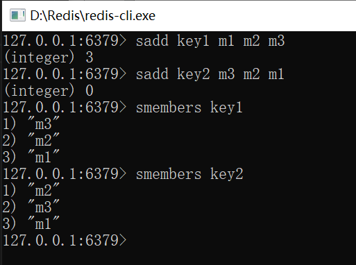
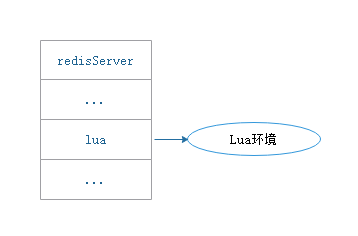
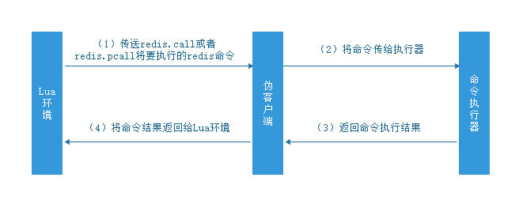
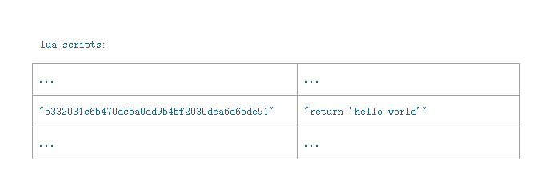

Lua是一种轻量的脚本语言，用标准C语言编写并以源代码形式开放.其设计目的是为了嵌入应用程序中，从而为应用程序提供灵活的扩展和定制功能。

Lua脚本跟单个Redis命令、MULTI/EXEC事务一样，都是原子操作。

# 1 创建并修改Lua环境

Redis在服务器内嵌了一个Lua环境，并对这个Lua环境进行了修改，以满足Redis服务器的需要。

## 1.1 创建Lua环境

服务器首先调用Lua的C API函数lua_open，创建一个新的Lua环境。

## 1.2 载入函数库

Redis将载入以下函数库到Lua环境：

·基础库（base library）：这个库包含Lua的核心（core）函数，比如assert、error、pairs、tostring、pcall等。另外，为了防止用户从外部文件中引入不安全的代码，库中的loadfile函数会被删除。

·表格库（table library）：这个库包含用于处理表格的通用函数，比如table.concat、table.insert、table.remove、table.sort等。

·字符串库（string library）：这个库包含用于处理字符串的通用函数，比如用于对字符串进行查找的string.find函数，对字符串进行格式化的string.format函数，查看字符串长度的string.len函数，对字符串进行翻转的string.reverse函数等。

·数学库（math library）：这个库是标准C语言数学库的接口，它包括计算绝对值的math.abs函数，返回多个数中的最大值和最小值的math.max函数和math.min函数，计算二次方根的math.sqrt函数，计算对数的math.log函数等。

·调试库（debug library）：这个库提供了对程序进行调试所需的函数，比如对程序设置钩子和取得钩子的debug.sethook函数和debug.gethook函数，返回给定函数相关信息的debug.getinfo函数，为对象设置元数据的debug.setmetatable函数， 获取对象元数据的debug.getmetatable函数等。

·Lua CJSON库（`http://www.kyne.com.au/~mark/software/luacjson.php`）：这个库用于处理UTF-8编码的JSON格式，其中cjson.decode函数将一个JSON格式的字符串转换为一个Lua值，而cjson.encode函数将一个Lua值序列化为JSON格式的字符串。

·Struct库（`http://www.inf.puc-rio.br/~roberto/struct/`）：这个库用于在Lua值和C结构（struct）之间进行转换，函数struct.pack将多个Lua值打包成一个类结构（struct-like）字符串，而函数struct.unpack则从一个类结构字符串中解包出多个Lua值。

·Lua cmsgpack库（`https://github.com/antirez/lua-cmsgpack`）：这个库用于处理MessagePack格式的数据，其中cmsgpack.pack函数将Lua值转换为MessagePack数据，而cmsgpack.unpack函数则将MessagePack数据转换为Lua值。

## 1.3 创建redis全局表格

服务器将在Lua环境中创建一个全局变量redis表格（table）。这个redis表格包含以下函数：

·用于执行Redis命令的redis.call和redis.pcall函数。

·用于记录Redis日志（log）的redis.log函数，以及相应的日志级别（level）常量：redis.LOG_DEBUG，redis.LOG_VERBOSE，redis.LOG_NOTICE，以及redis.LOG_WARNING。

·用于计算SHA1校验和的redis.sha1hex函数。

·用于返回错误信息的redis.error_reply函数和redis.status_reply函数。

## 1.4 使用Redis自制的随机函数来替换Lua原有的随机函数

为了保证相同的脚本可以在不同的机器上产生相同的结果，Redis要求所有传入服务器的Lua脚本，以及Lua环境中的所有函数，都必须是无副作用（side effect）的纯函数（pure function）。但是，在之前载入Lua环境的math函数库中，用于生成随机数的math.random函数和math.randomseed函数都是带有副作用的。

因为这个原因，Redis使用自制的函数替换了math库中原有的math.random函数和math.randomseed函数，替换之后的两个函数有以下特征：

·对于相同的seed来说，math.random总产生相同的随机数序列，这个函数是一个纯函数。

·除非在脚本中使用math.randomseed显式地修改seed，否则每次运行脚本时，Lua环境都使用固定的math.randomseed（0）语句来初始化seed。

## 1.5 创建排序辅助函数

对于Lua脚本来说，另一个可能产生不一致数据的地方是那些带有不确定性质的命令。

比如对于一个集合键来说，因为集合元素的排列是无序的，所以即使两个集合的元素完全相同，它们的输出结果也可能并不相同，如下所示：



带有不确定性的命令：

|命令|备注|
|----|----|
|SINTER||
|SUNION||
|SDIFF||
|SMEMBERS||
|HKEYS||
|HVALS||
|KEYS||

为了消除不确定性，服务器会为Lua环境创建一个排序辅助函数__redis__compare_helper，当Lua脚本执行完一个带有不确定性的命令之后，程序会使__redis__compare_helper作为对比函数，自动调用table.sort函数对命令的返回值做一次排序，以此来保证相同的数据集总是产生相同的输出。

## 1.6 创建redis.pcall函数的错误报告辅助函数

服务器将为Lua环境创建一个名为__redis__err__handler的错误处理函数，当脚本调用redis.pcall函数执行Redis命令，并且被执行的命令出现错误时，__redis__err__handler就会打印出错代码的来源和发生错误的行数，为程序的调试提供方便。

## 1.7 保护Lua的全局环境

服务器将对Lua环境中的全局环境进行保护，确保传入服务器的脚本不会因为忘记使用local关键字而将额外的全局变量添加到Lua环境里面。不过Redis并未禁止用户修改已存在的全局变量，所以在执行Lua脚本的时候，需要避免错误地修改了全局变量。

以下情形将报错：

- 试图创建一个全局变量时，将报错：Script attempted to create global variable
- 试图获取一个不存在的全局变量，将报错：Script attempted to access unexisting global variable

## 1.8 将Lua环境保存到服务器状态的lua属性里面

经过以上修改，Lua环境的修改工作结束。最后，服务器会将Lua环境和服务器状态的lua属性关联起来，



因为Redis使用串行化的方式来执行Redis命令，所以在任何特定时间里，最多都只会有一个脚本能够被放进Lua环境里面运行。因此，整个Redis服务器只需要创建一个Lua环境即可。

# 2 Lua环境协作组件

Redis服务器还创建了两个用于与Lua环境进行协作的组件:(1)负责执行Lua脚本中的Redis命令
的伪客户端，(2)用于保存Lua脚本的lua_scripts字典。

## 2.1 伪客户端

因为执行Redis命令必须有相应的客户端状态，所以Redis服务器专门为Lua环境创建了一个伪客户端，并由伪客户端负责处理Lua脚本中包含的所有Redis命令。

Lua脚本使用redis.call函数或者redis.pcall函数执行一个Redis命令，需要完成以下步骤：

1） Lua环境将redis.call函数或者redis.pcall函数要执行的命令传给伪客户端。

2） 伪客户端将命令传给命令执行器。

3） 命令执行器执行命令，并将执行结果返回给伪客户端。

4） 伪客户端接收命令结果，并将结果返回给Lua环境。

5） Lua环境接收到命令结果后，将结果返回给redis.call函数或者redis.pcall函数。

6） redis.call或者redis.pcall将命令结果作为函数返回值返回给脚本中的调用者。



## 2.2 lua_scripts字典

lua_scripts字典的键为某个Lua脚本的SHA1校验和（checksum），而值则是SHA1校验和对应的Lua脚本：

```C
struct redisSerVer {
    //...
    dict *lua_scripts;
}
```

lua_scripts字典有两个作用：(1)实现SCRIPT EXISTS命令，(2)是实现脚本复制功能。

# 3 EVAL命令的实现

Eval命令使用Lua解释器执行脚本。

**语法：**

```redis
EVAL script numkeys key [key ...] arg [arg ...] 
```

**参数说明：**

- script：一段Lua5.1脚本程序。
- numkeys：用于指定键名参数的个数。
- key [key ...]：从EVAL的第三个参数开始算起,表示在脚本中所用到的Redis键(key)，这些键名参数可以在Lua中通过全局变量KEYS数组，用1为基址的形式访问(KEYS[1]、KEYS[2]、...)。
- arg [arg ...]：附加参数，在Lua中通过全局变量ARGV数组访问，访问的形式和KEYS变量类似( ARGV[1]、ARGV[2]、...)。

**示例：**

```redis
redis 127.0.0.1:6379> eval "return {KEYS[1],KEYS[2],ARGV[1],ARGV[2]}" 2 key1 key2 first second
1) "key1"
2) "key2"
3) "first"
4) "second"
```

EVAL命令的执行过程可以分为以下三个步骤：

1）根据客户端给定的Lua脚本，在Lua环境中定义一个Lua函数。

2）将客户端给定的脚本保存到lua_scripts字典，等待将来进一步使用。

3）执行刚刚在Lua环境中定义的函数，以此来执行客户端给定的Lua脚本。

## 3.1 定义脚本函数

当客户端向服务器发送EVAL命令时，服务器首先要在Lua环境中，为传入的脚本定义一个对应的Lua函数。其中，Lua函数的名字由f_前缀加上脚本的SHA1校验和（四十个字符长）组成，而函数的体（body）则是脚本本身。

示例：

```redis
EVAL "return 'hello world'" 0
```

服务器将在Lua环境中定义以下函数：

```lua
function f_5332031c6b470dc5a0dd9b4bf2030dea6d65de91()
    return 'hello world'
end
```

使用函数来保存脚本有以下好处：

1）执行脚本更简单，只要调用对应的函数。

2）通过函数的局部性来让Lua环境保持清洁，减少垃圾回收，并避免使用全局变量。

3）如果某脚本对应的函数在Lua环境中被定义过至少一次，那么服务器可以直接通过调用Lua函数来执行脚本。

## 3.2 保存脚本至lua_scripts字典

3.1节中的Lua脚本将被保存为：



## 3.3 执行脚本函数

在执行脚本前，服务器还需要进行一些设置钩子、传入参数等：

1）将EVAL命令中传入的键名和参数分别保存到KEYS数组和ARGV数组，然后将这两个数组作为全局变量传入到Lua环境里面。

2）为Lua环境装载超时处理钩子（hook）。当脚本出现超时运行情况时，客户端可以通过SCRIPT KILL命令停止脚本，或者SHUTDOWN命令直接关闭服务器。

3）执行脚本函数。

4）移除超时钩子。

5）将执行脚本函数的结果保存到客户端状态的输出缓冲区里面，等待服务器将结果返回给客户端。

6）对Lua环境执行垃圾回收操作。

# 4 EVALSHA命令的实现

EVAL成功执行的Lua脚本，在Lua环境里有相对应的Lua函数。EVALSHA命令可以通过SHA1校验和去执行函数。

示例：

```redis
EVALSHA "5332031c6b470dc5a0dd9b4bf2030dea6d65de91" 0
"hello world"
```

服务器首先根据客户端输入的SHA1校验和，检查函数f_5332031c6b470dc5a0dd9b4bf2030dea6d65de91是否存在于Lua环境中。如果函数存在，服务器将执行该函数，并将结果返回给客户端。

# 5 脚本管理命令

Redis中与Lua脚本有关的命令还有四个：SCRIPT FLUSH、 SCRIPT EXISTS、SCRIPT LOAD、SCRIPT KILL。

## 5.1 SCRIPT FLUSH

用于清除服务器中所有和Lua脚本有关的信息，该命令会释放并重建lua_scripts字典，关闭现有的Lua环境并重新创建一个新的Lua环境。

## 5.2 SCRIPT EXISTS

根据输入的SHA1校验和，检查对应的脚本是否存在于服务器中。允许一次传入多个SHA1校验和。

## 5.3 SCRIPT LOAD

该命令所做的事情和EVAL命令执行脚本时所做的前两步完全一样：（1）首先在Lua环境中为脚本创建相对应的函数，（2）将脚本保存到lua_scripts字典里面。

## 5.4 SCRIPT KILL

如果服务器设置了lua-time-limit配置选项，那么在执行Lua脚本之前，服务器都会在Lua环境里面设置一个超时处理钩子（hook）。

钩子在脚本运行期间，会定期检查已经运行了多长时间，一旦钩子发现运行时间已经超过了lua-time-limit，钩子将定期在脚本运行的间隙中，查看是否有SCRIPT KILL命令或者SHUTDOWN命令到达服务器。

如果超时运行的脚本未执行任何写入操作，那么客户端可以通过SCRIPT KILL命令来指示服务器停止执行这个脚本。处理完SCRIPT KILL命令之后，服务器可以继续运行。

如果脚本已经执行过写入操作，那么客户端只能用SHUTDOWN nosave命令来停止服务器，从而防止不合法的数据被写入数据库中。

# 6 脚本复制

当服务器运行在复制模式之下时，具有写性质的脚本命令会被复制到从服务器。

命令包括：EVAL、EVALSHA、SCRIPT FLUSH，SCRIPT LOAD。

## 6.1 复制EVAL、SCRIPT FLUSH、SCRIPT LOAD

当主服务器执行完以上命令时，主服务器会将命令传播（propagate）给所有从服务器。

## 6.2 复制EVALSHA命令

在从库上可能出现找不到脚本的情况，Redis要求**主服务器在传播EVALSHA命令的时候**，必须确保EVALSHA命令要执行的脚本已经被所有从服务器载入过。如果不能确保这一点，主服务器会将
EVALSHA命令转换成等价的EVAL，然后通过传播EVAL来代替EVALSHA。

1）判断传播EVALSHA命令是否安全

主服务器使用服务器状态的repl_scriptcache_dict字典记录已经传播给所有从服务器的脚本：

```C
struct redisServer {
    // ...
    dict *repl_scriptcache_dict;
};
```

其中，键为Lua脚本的SHA1校验和，值为NULL。

2）清空repl_scriptcache_dict字典

每当主服务器添加一个新的从服务器时，主服务器都会清空自己的repl_scriptcache_dict字典，强制自己重新向所有从服务器传播脚本，从而确保所有从服务器不会出现脚本未找到错误。

3）EVALSHA命令转换成EVAL命令

第一步：根据SHA1校验和sha1，在lua_scripts字典中查找对应的Lua脚本script。

第二步：将EVALSHA改写成EVAL，并且将校验和sha1改成脚本script，至于numkeys、key、arg等参数则保持不变。

主服务器在传播完EVAL后，会将被传播脚本的SHA1校验和添加到repl_scriptcache_dict字典。

4）传播EVALSHA

当主服务器成功在本机执行完一个EVALSHA后，它将根据EVALSHA指定的SHA1校验和是否存在于repl_scriptcache_dict字典来决定是向从服务器传播EVALSHA命令还是EVAL命令：

# 7 参考资料

《Lua 5.1 Reference Manual》介绍Lua语言的语法和标准库：http://www.lua.org/manual/5.1/manual.html