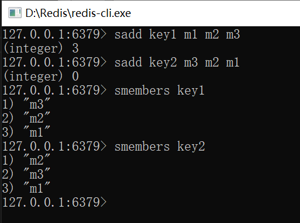
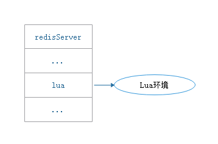

Lua是一种轻量的脚本语言，用标准C语言编写并以源代码形式开放.其设计目的是为了嵌入应用程序中，从而为应用程序提供灵活的扩展和定制功能。

Redis在服务器内嵌了一个Lua环境，并对这个Lua环境进行了修改，以满足Redis服务器的需要。

# 1 创建并修改Lua环境

## 1.1 创建Lua环境

服务器首先调用Lua的C API函数lua_open，创建一个新的Lua环境。

## 1.2 载入函数库

Redis将载入以下函数库到Lua环境：

·基础库（base library）：这个库包含Lua的核心（core）函数，比如assert、error、pairs、tostring、pcall等。另外，为了防止用户从外部文件中引入不安全的代码，库中的loadfile函数会被删除。

·表格库（table library）：这个库包含用于处理表格的通用函数，比如table.concat、table.insert、table.remove、table.sort等。

·字符串库（string library）：这个库包含用于处理字符串的通用函数，比如用于对字符串进行查找的string.find函数，对字符串进行格式化的string.format函数，查看字符串长度的string.len函数，对字符串进行翻转的string.reverse函数等。

·数学库（math library）：这个库是标准C语言数学库的接口，它包括计算绝对值的math.abs函数，返回多个数中的最大值和最小值的math.max函数和math.min函数，计算二次方根的math.sqrt函数，计算对数的math.log函数等。

·调试库（debug library）：这个库提供了对程序进行调试所需的函数，比如对程序设置钩子和取得钩子的debug.sethook函数和debug.gethook函数，返回给定函数相关信息的debug.getinfo函数，为对象设置元数据的debug.setmetatable函数， 获取对象元数据的debug.getmetatable函数等。

·Lua CJSON库（`http://www.kyne.com.au/~mark/software/luacjson.php`）：这个库用于处理UTF-8编码的JSON格式，其中cjson.decode函数将一个JSON格式的字符串转换为一个Lua值，而cjson.encode函数将一个Lua值序列化为JSON格式的字符串。

·Struct库（`http://www.inf.puc-rio.br/~roberto/struct/`）：这个库用于在Lua值和C结构（struct）之间进行转换，函数struct.pack将多个Lua值打包成一个类结构（struct-like）字符串，而函数struct.unpack则从一个类结构字符串中解包出多个Lua值。

·Lua cmsgpack库（`https://github.com/antirez/lua-cmsgpack`）：这个库用于处理MessagePack格式的数据，其中cmsgpack.pack函数将Lua值转换为MessagePack数据，而cmsgpack.unpack函数则将MessagePack数据转换为Lua值。

## 1.3 创建redis全局表格

服务器将在Lua环境中创建一个全局变量redis表格（table）。这个redis表格包含以下函数：

·用于执行Redis命令的redis.call和redis.pcall函数。

·用于记录Redis日志（log）的redis.log函数，以及相应的日志级别（level）常量：redis.LOG_DEBUG，redis.LOG_VERBOSE，redis.LOG_NOTICE，以及redis.LOG_WARNING。

·用于计算SHA1校验和的redis.sha1hex函数。

·用于返回错误信息的redis.error_reply函数和redis.status_reply函数。

## 1.4 使用Redis自制的随机函数来替换Lua原有的随机函数

为了保证相同的脚本可以在不同的机器上产生相同的结果，Redis要求所有传入服务器的Lua脚本，以及Lua环境中的所有函数，都必须是无副作用（side effect）的纯函数（pure function）。但是，在之前载入Lua环境的math函数库中，用于生成随机数的math.random函数和math.randomseed函数都是带有副作用的。

因为这个原因，Redis使用自制的函数替换了math库中原有的math.random函数和math.randomseed函数，替换之后的两个函数有以下特征：

·对于相同的seed来说，math.random总产生相同的随机数序列，这个函数是一个纯函数。

·除非在脚本中使用math.randomseed显式地修改seed，否则每次运行脚本时，Lua环境都使用固定的math.randomseed（0）语句来初始化seed。

## 1.5 创建排序辅助函数

对于Lua脚本来说，另一个可能产生不一致数据的地方是那些带有不确定性质的命令。

比如对于一个集合键来说，因为集合元素的排列是无序的，所以即使两个集合的元素完全相同，它们的输出结果也可能并不相同，如下所示：

带有不确定性的命令：

|命令|备注|
|----|----|
|SINTER||
|SUNION||
|SDIFF||
|SMEMBERS||
|HKEYS||
|HVALS||
|KEYS||

为了消除不确定性，服务器会为Lua环境创建一个排序辅助函数__redis__compare_helper，当Lua脚本执行完一个带有不确定性的命令之后，程序会使__redis__compare_helper作为对比函数，自动调用table.sort函数对命令的返回值做一次排序，以此来保证相同的数据集总是产生相同的输出。

## 1.6 创建redis.pcall函数的错误报告辅助函数

服务器将为Lua环境创建一个名为__redis__err__handler的错误处理函数，当脚本调用redis.pcall函数执行Redis命令，并且被执行的命令出现错误时，__redis__err__handler就会打印出错代码的来源和发生错误的行数，为程序的调试提供方便。

## 1.7 保护Lua的全局环境

服务器将对Lua环境中的全局环境进行保护，确保传入服务器的脚本不会因为忘记使用local关键字而将额外的全局变量添加到Lua环境里面。不过Redis并未禁止用户修改已存在的全局变量，所以在执行Lua脚本的时候，需要避免错误地修改了全局变量。

以下情形将报错：

- 试图创建一个全局变量时，将报错：Script attempted to create global variable
- 试图获取一个不存在的全局变量，将报错：Script attempted to access unexisting global variable

## 1.8 将Lua环境保存到服务器状态的lua属性里面

经过以上修改，Lua环境的修改工作结束。最后，服务器会将Lua环境和服务器状态的lua属性关联起来，

因为Redis使用串行化的方式来执行Redis命令，所以在任何特定时间里，最多都只会有一个脚本能够被放进Lua环境里面运行。因此，整个Redis服务器只需要创建一个Lua环境即可。