本章介绍Windows系统下的Redis的下载、安装与配置。

# 1.[官网](https://github.com/microsoftarchive/releases)下载安装包。

（1）找到Release目录，选择相应版本，下载msi文件。

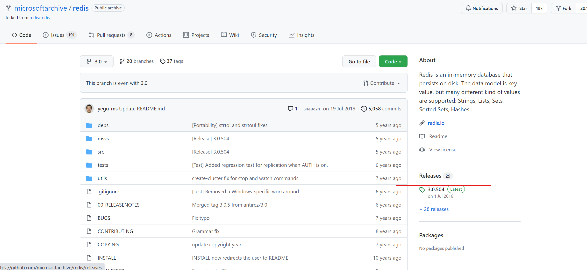

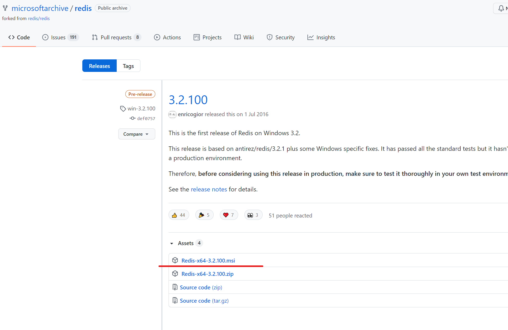

# 2.安装

（1）双击msi文件，开始安装。

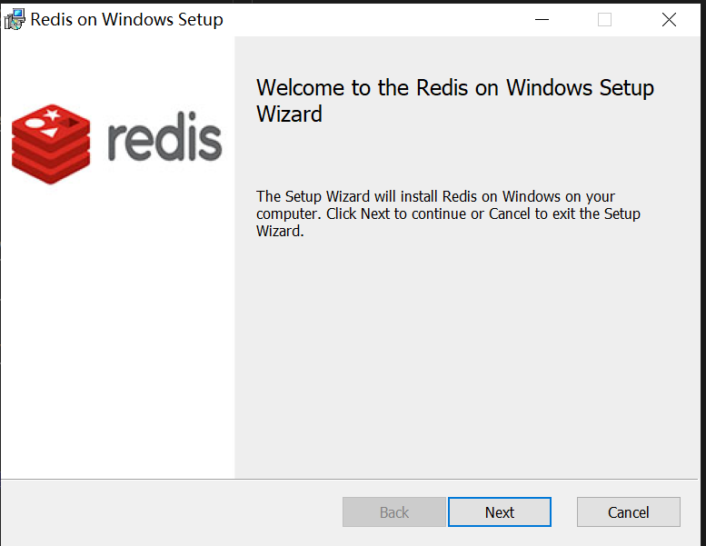

（2）安装到相应的目录。选择“添加Redis目录到环境变量PATH中”，这样方便系统自动识别Redis执行文件在哪里。

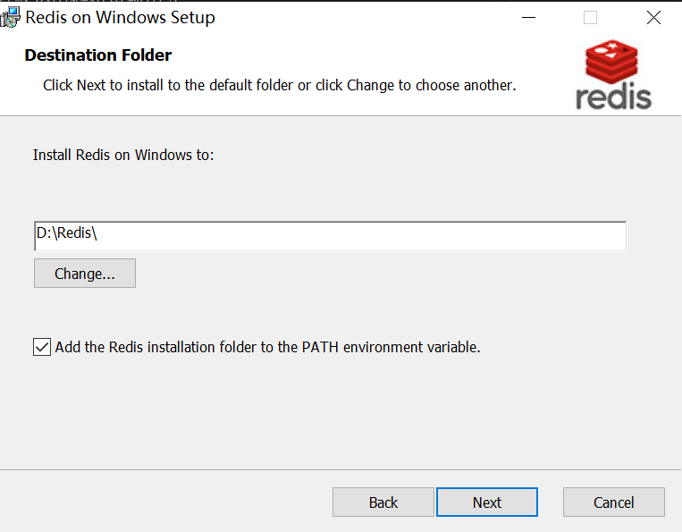

（3）端口号可保持默认的6379，并选择防火墙例外，从而保证外部可以正常访问Redis服务。

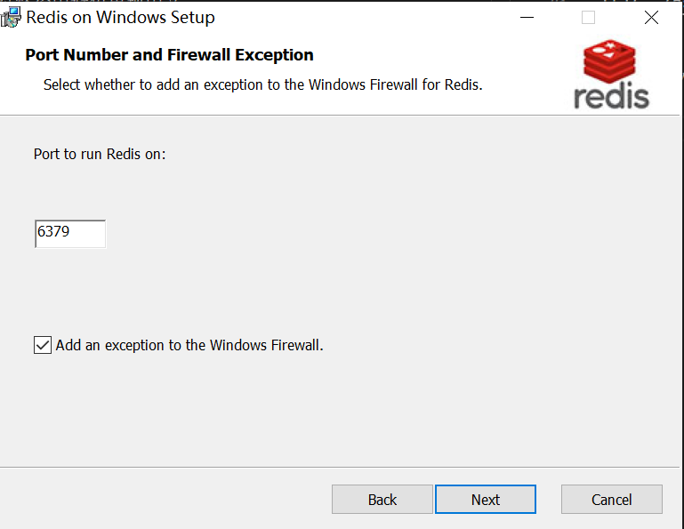

（4）设定最大值为100M。作为实验和学习，100M足够了。

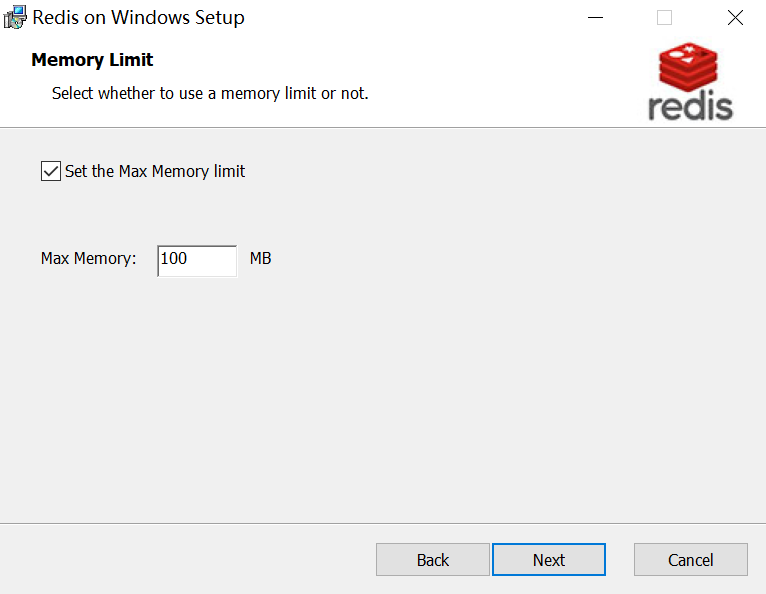

（5）点击安装后，正式的安装过程开始。稍等一会即可完成。

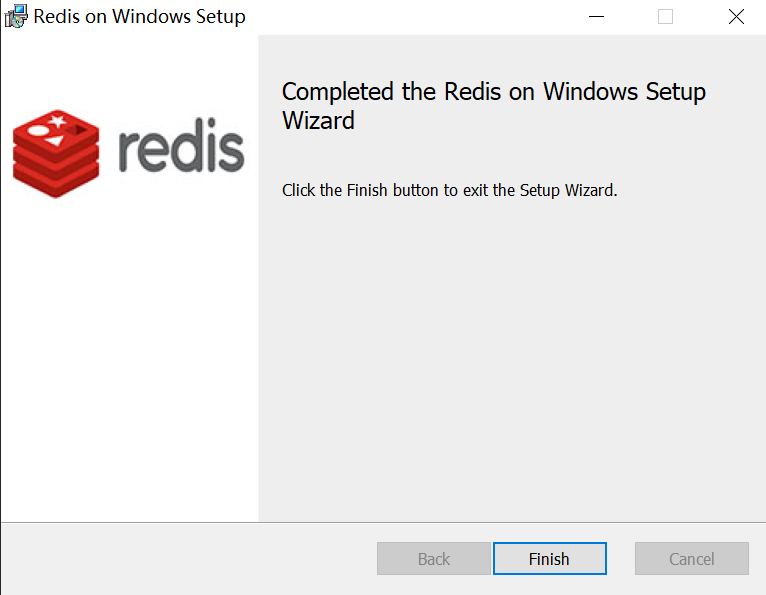

# 3.配置

（1）安装完毕后，需要先做一些设定工作，以便服务启动后能正常运行。

使用文本编辑器，这里使用Notepad++，打开Redis服务配置文件。注意：不要找错了，通常为redis.windows-service.conf，而不是redis.windows.conf。后者是以非系统服务方式启动程序使用的配置文件。

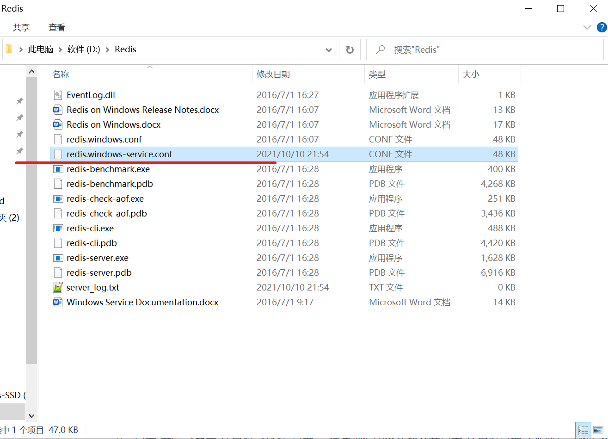

（2）找到含有requirepass字样的地方，追加一行，输入requirepass 123。requirepass前面不要有空格，否则在计算机管理中重启服务报错。

这是访问Redis时所需的密码，一般测试情况下可以不用设定密码。不过，即使是作为本地访问，也建议设定一个密码。此处以简单的123来演示。

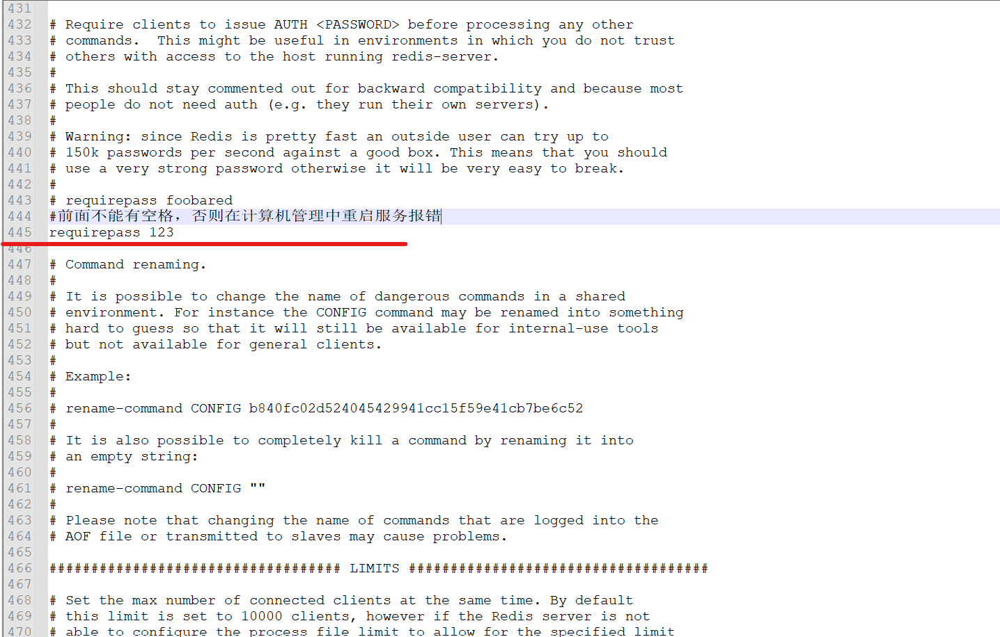

（3）查看Redis服务是否启动。

点击“开始” -> 右击“计算机” -> 选择“管理”。在左侧栏中依次找到并点击“计算机管理（本地）” -> 服务和应用程序 -> 服务。

再在右侧找到Redis名称的服务，查看启动情况。如未启动，则手动启动之。正常情况下，服务应该正常启动并运行了。

为了使设置的密码起到作用，需要重启服务。

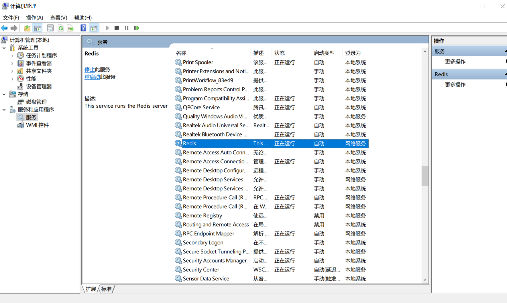

# 4.测试

最后来测试一下Redis是否正常提供服务。

（1）由于我们已经将Redis添加到环境变量，因此直接在命令行输入redis-cli即可。

如果未添加到环境变量，则在命令行窗口进入Redis的目录，cd D:\Redis。输入redis-cli并回车。（redis-cli是客户端程序）如图正常提示进入，并显示正确端口号，则表示服务已经启动。

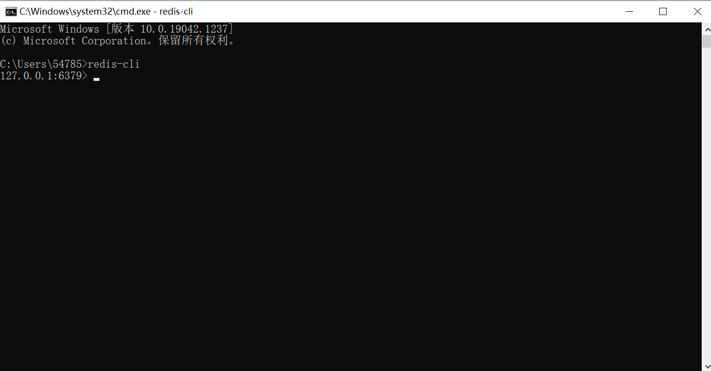

（2）使用服务前需要先通过密码验证。

未验证时，保存数据失败。

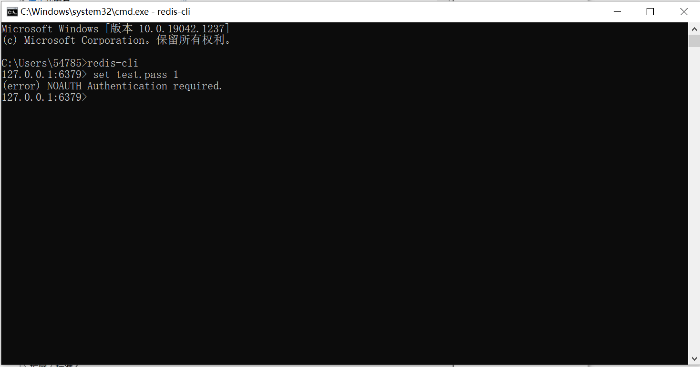

输入“auth 123”并回车（123是之前设定的密码）。返回提示OK表示验证通过。

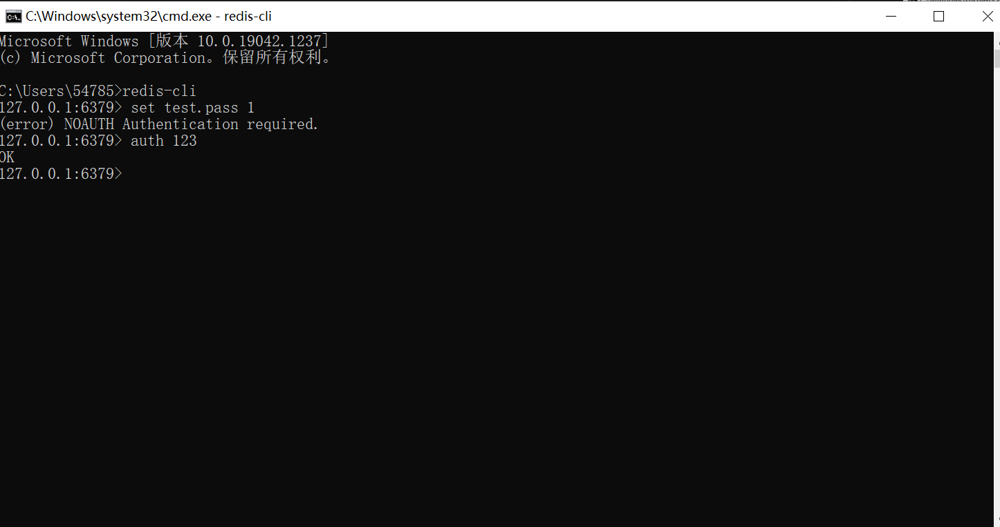

（3）实际测试一下读写。

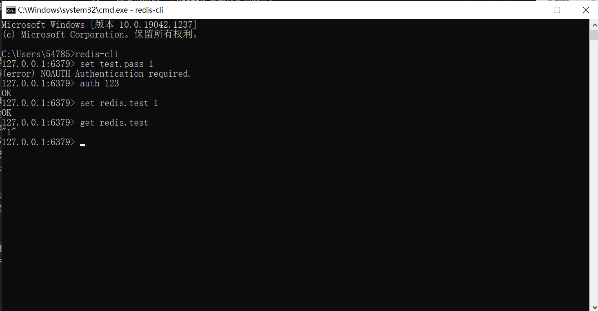

# 5.Redis客户端常用指令

```redis
Password: 123

一、连接操作
①启动服务：redis-server.exe
②启动客户端：redis-cli
③输入密码：auth password
```