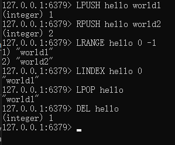

基本数据类型对比如下：

|结构类型|存储的值|结构的读写能力|
|-------|-------|-------------|
|字符串 STRING|可以是字符串、整数、浮点数|①对整个字符串或字符串的一部分进行操作；②对整数和浮点数进行自增（increment）、自减操作（decrement）；|
|列表 LIST|双向链表，每个节点包含一个字符串|①从列表两端进行推入、弹出；②根据偏移量对列表进行修剪（trim）；③读取单个、多个元素；④根据值查找、删除元素；|
|集合 SET|不重复的字符串的无序集合|①添加、获取、删除单个元素；②检查一个元素是否存在于集合；③计算交集、并集、差集；④从集合里随机获取元素；|
|散列 HASH|键-值对（k,v）的无序散列|①添加、获取、删除单个键值对；②获取所有键值对；|
|有序集合 ZSET|字符串成员（member）与浮点数分值（score）的有序映射，元素的排列顺序由分值大小决定|①添加、获取、删除单个元素；②根据成员、分值范围（range）获取元素；|

# 1.STRING

最大能存储512MB，可以是简单字符串，复杂的xml/json字符串，二进制图像，音频的字符串，数字的字符串等。

**示意图：**


**命令：**

|命令|行为|
|--|--|
|GET|获取存储在给定键中的值|
|SET|设置存储在给定键中的值|
|DEL|删除存储在给定键中的值，该命令可用于所有类型|

**示例：**

```redis
SET hello world  
GET hello
DEL hello
```


# 2.LIST

支持存储2^32-1个元素

**示意图：**


**命令：**

|命令|行为|
|--|--|
|LPUSH|将给定值推入列表左端|
|RPUSH|将给定值推入列表右端|
|LPOP|弹出左端值，并返回|
|RPOP|弹出右端值，并返回|
|LRANGE|获取列表在给定范围内所有值|
|LINDEX|获取列表在给定位置上的单个元素|

**示例：**

```redis
LPUSH hello world1 
RPUSH hello world2
LRANGE hello 0 -1
LINDEX hello 0
LPOP hello
DEL hello
```



# 3.SET

**示意图：**


**命令：**

|命令|行为|
|--|--|
|SADD|将给定值添加到集合|
|SMEMBERS|返回集合包含的所有元素|
|SISMENBER|检查给定元素是否在集合中|
|SREM|如果给定元素在集合中，移除这个元素|
|SINTER|计算交集|
|SUNION|计算并集|
|SDIFF|计算差集|

**示例：**

```redis
SADD hello world1 
SADD hello world2
SADD hello world3
SMEMBERS hello 
SISMEMBER hello world1
SREM hello world1
SMEMBERS hello
DEL hello
```


# 4.HASH

**示意图：**


**命令：**

|命令|行为|
|--|--|
|HSET|在指定的散列里，添加给定的键值对|
|HGET|在指定的散列里，获取给定键的值|
|HGETALL|获取指定的散列所包含的所有键值对|
|HDEL|如果给定键在散列中，那么移除这个键|

**示例：**

```redis
HSET hello k1 world1
HSET hello k2 world2
HSET hello k3 world3
HGETALL hello 
HDEL hello k1
HGET hello k1
HGET hello k2
```


# 5.ZSET

ZSET存储的也是键-值对（k, v）。在ZSET中，键也被称为成员（member），本质还是键，因此每个成员都不同；值也被称为分值（score），分值必须为**浮点数**。依据分值对键-值对进行排序。

既可以依据成员访问元素（和散列一样），也可以依据分值以及分值的排列顺序访问元素。

默认情况，按分值由小到大排序。

**示意图：**


**命令：**

|命令|行为|
|--|--|
|ZADD|将一个带有给定分值的成员添加到有序集合里， ```ZADD key score member [WITHSCORES]```|
|ZRANGE|给定元素位置，从有序集合里获取多个元素，```ZRANGE key start stop [WITHSCORES]```|
|ZRANGEBYSCORE|给定分值范围，获取有序集合中在此范围内的元素，```ZRANGEBYSCORE key min max [WITHSCORES]```|
|ZREM|如果给定成员在有序集合中，那么移除这个成员，```ZREM key member```|

**示例：**

```redis
ZADD hello 0.2 k2
ZADD hello 0.1 k1
ZADD hello 0.3 k3
ZRANGE hello 0 -1
ZRANGE hello 0 -1 WITHSCORES
ZRANGEBYSCORE hello 0 0.2
ZRANGEBYSCORE hello 0 0.2 WITHSCORES
ZREM hello k1
```


可以看到，ZSET依据分值，对键-值对进行了排序。

```ZRANGE```如果不给出可选条件[WITHSCORES]，则只显示成员。
