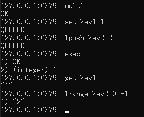
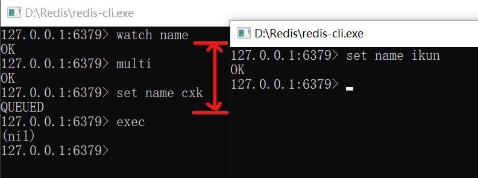
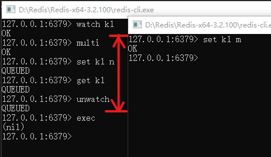
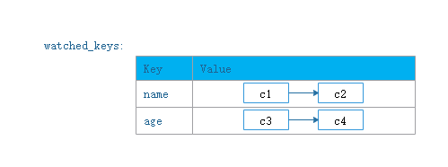

为了同时处理多个结构，需要向Redis发送多个命令。将多个命令封装成事务（transaction），提交给Redis。当事务内所有命令都执行完毕，Redis才会去处理其他客户端的命令。

# 1 事务命令

|命令|行为|示例|
|----|---|----|
|WATCH|乐观锁,监视任意数量的数据库键||
|UNWATCH|取消 WATCH 命令对**所有**数据库键的监视||
|MULTI|开启事务||
|EXEC|执行事务||
|DISCARD|||

# 2 事务流程

在事务中，如果客户端发送的命令为EXEC、DISCARD、WATCH、MULTI四个命令的其中一个，那么服务器立即执行这个命令。相反，如果命令是其他命令，那么服务器并不立即执行这个命令，而是将这个命令放入一个事务队列里面，然后向客户端返回QUEUED回复。

举个例子：



## 2.1 开启事务

MULTI命令开启事务。

## 2.2 事务队列

事务操作以外的命令将会被放在一个事务队列中。

Redis客户端的mstate属性表征其事务状态。事务状态包含一个事务队列，以及一个已入队命令的计数器。事务队列中的每个元素对应着一个命令的相关信息，包括指向命令实现函数的指针、命令的参数，以及参数的数量。

```C
typedef struct redisClient {
	
	//事务状态
	multiState mstate; 
	// ...
}redisClient;

typedef struct multiState {
	//事务队列，FIFO顺序
	multiCmd *commands;
	//已入队命令计数
	int count;
}multiState;

typedef struct multiCmd {
	//参数
	robj **argv;
	//参数数量
	int argc;
	//命令指针
	struct redisCommand *cmd;
} multiCmd;
```

## 2.3 事务执行

EXEC命令用于执行事务。服务器会遍历客户端的事务队列，执行队列中保存的所有命令，最后将执行命令所得的结果全部返回给客户端。

EXEC命令的实现原理：

```python
def EXEC():
    #创建空白的回复队列
    reply_queue = []
    #遍历事务队列中的每个项
    #读取命令的参数， 参数的个数， 以及要执行的命令
    for argv, argc, cmd in client.mstate.commands:
        #执行命令， 并取得命令的返回值
        reply = execute_command(cmd, argv, argc)
        #将返回值追加到回复队列末尾
        reply_queue.append(reply)
        #移除REDIS_MULTI标识， 让客户端回到非事务状态
        client.flags & = ~REDIS_MULTI
        #清空客户端的事务状态， 包括：
        #1）清零入队命令计数器
        #2）释放事务队列
        client.mstate.count = 0
        release_transaction_queue(client.mstate.commands)
        #将事务的执行结果返回给客户端
        send_reply_to_client(client, reply_queue)
```

# 3.数据监视

WATCH命令监视任意数量的数据库键；UNWATCH命令取消 WATCH 命令对**所有** key 的监视。

WATCH命令是一个乐观锁(optimistic locking)，它可以在EXEC命令执行之前，监视任意数量的数据库键，并在EXEC命令执行时，检查被监视的键是否被修改。如果是，服务器将拒绝执行事务，并向客户端返回代表事务执行失败的空回复。

举个例子：客户端A监控了键name，然后开启了事务，并执行。但是在客户端A监控键name后，且事务执行前，客户端B对键name进行了修改，将导致客户端A的事务执行失败。



UNWATCH命令只能在事务开始前才起作用，事务开启后，使用UNWATCH，如果另一个客户端修改了被监视的键，事务依旧执行失败。



## 3.1 监视信息的保存

每个Redis数据库都保存着一个watched_keys字典。字典的键是被WATCH命令监视的数据库键，而字典的值则是一个链表，链表中记录监视该数据库键的所有客户端：



```C
typedef struct redisDb {
    // ...
    //正在被WATCH命令监视的键
    dict *watched_keys;
} redisDb;
```

## 3.2 监视机制的触发

所有对数据库进行修改的命令，在执行之后都会调用multi.c/touchWatchKey函数对watched_keys字典进行检查。如果该键正在被某个客户端监听，那么touchWatchKey函数会将监视该键的客户端的REDIS_DIRTY_CAS标识打开，表示该客户端的事务安全性已经被破坏。

```python
def touchWatchKey(db, key):
    #如果键key存在于数据库的watched_keys字典中
    #那么说明至少有一个客户端在监视这个key
    if key in db.watched_keys:
        #遍历所有监视键key的客户端
        for client in db.watched_keys[key]:
            #打开标识
            client.flags |= REDIS_DIRTY_CAS
```

当REDIS_DIRTY_CAS被打开，此时服务器将认为该事务不安全，拒绝执行。

# 4.事务的ACID特性在Redis中的体现

Redis中，事务总是具有原子性(Automic)、一致性(Consistency)、隔离性(Isolation)，当Redis运行在特定的持久化模式中，也具有持久性(Durability)。

## 4.1 原子性


