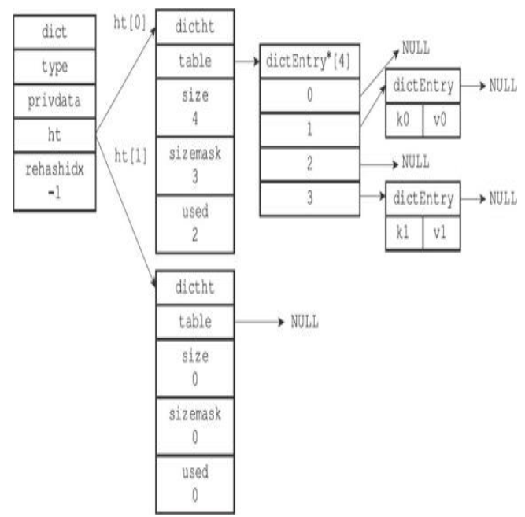
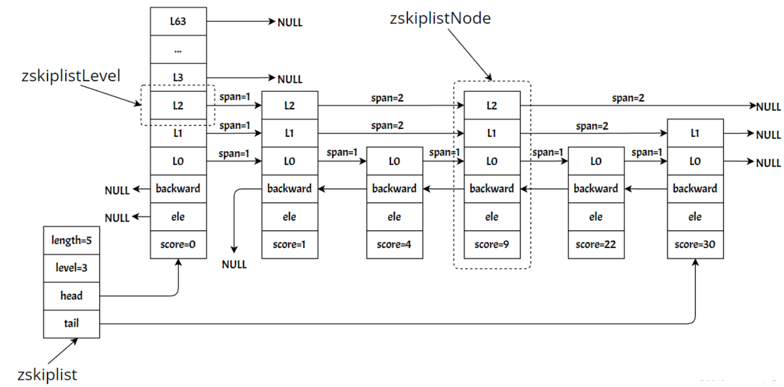

# 1.简单动态字符串（simple dynamic string， SDS）

## 1.1 作用

（1）保存数据库中的字符串值。

（2） SDS用作缓冲区（buffer）：AOF模块中的AOF缓冲区，以及客户端状态中的输入缓冲区。 

## 1.2 定义

```C
struct sdshdr {
    
    //记录buf数组中已使用字节的数量
    int len;

    //记录buf数组中未使用字节的数量
    int free;

    //字节数组，用于保存字符串，包含未使用的字节
    char buf[];
};
```

## 1.3 特点

比起C字符串， SDS具有以下优点：

（1）常数复杂度获取字符串长度。

SDS在len中记录了长度，所以获取一个SDS长度的复杂度仅为O（1）。

（2）杜绝缓冲区溢出。

C字符串不记录自身长度带来的另一个问题是容易造成缓冲区溢出（buffer overflow） 。

当对SDS进行修改时，API会先检查SDS的空间是否满足要求，如果不满足的话，会自动扩展大小，然后才执行修改，所以使用SDS既不需要手动修改空间大小，也不会出现缓冲区溢出。

（3）减少修改字符串长度时所需的内存重分配次数。

- 空间预分配：用于字符串增长操作。若长度（len）小于1MB，则分配和len属性同样大小的未使用空间，这时len和free的值相同。若长度将大于等于1MB，那么会分配1MB的未使用空间，此时SDS的buf数组的实际长度为len+1MB+1byte。

- 惰性空间释放：用于字符串缩短操作。缩短时，并不立即使用内存重分配来回收多出的字节，而是使用free将这些字节的数量记录起来，并等待将来使用。

（4）二进制安全。

允许特殊字符（空字符等），因此可以保存像图片、音频、视频、压缩文件等二进制数据。

（5）兼容部分C字符串函数。

# 2.链表

## 2.1 作用

（1）列表的底层数据结构，双端链表。

（2）发布与订阅、慢查询、监视器等功能也用到了链表，Redis服务器本身还使用链表来保存多个客户端的状态信息，以及使用链表来构建客户端输出缓冲区（output buffer）。

## 2.2 定义

链表节点定义如下：

```C
typedef struct listNode {

    //前置节点
    struct listNode * prev;

    //后置节点
    struct listNode * next;

    //节点的值
    void * value;
}listNode;
```

一般通过列表 list 来持有链表，

```C
typedef struct list {
    
    //表头节点
    listNode * head;

    //表尾节点
    listNode * tail;

    //链表所包含的节点数量
    unsigned long len;

    //节点值复制函数
    void *(*dup)(void *ptr);

    //节点值释放函数
    void (*free)(void *ptr);

    //节点值对比函数
    int (*match)(void *ptr,void *key);
} list;
```

list结构为链表提供了表头指针head、表尾指针tail，以及列表长度len，而dup、free和match成员则是用于实现多态链表所需的类型特定函数。

## 2.3 特点

（1）双端：链表节点带有prev和next指针，获取某个节点的前置节点和后置节点的复杂度都是O（1）。

（2）无环：表头节点的prev指针和表尾节点的next指针都指向NULL，对链表的访问以NULL为终点。

（3）带表头指针和表尾指针：通过list结构的head指针和tail指针，程序获取链表的表头节点和表尾节点的复杂度为O（1）。

（4）带链表长度：使用len属性来对list持有的链表节点进行计数，程序获取链表中节点数量的复杂度为O（1） 。

（5）多态：链表节点使用void*指针来保存节点值，并且可以通过list结构的dup、free、match三个属性为节点值设置类型特定函数，所以链表可以用于保存各种不同类型的值。

# 3.字典

## 3.1 作用

（key, value）键值对。

## 3.2 定义

（1）字典

```C
typedef struct dict {
    //类型特定函数
    dictType *type;

    //私有数据
    void *privdata;

    //哈希表
    //一般情况下，只使用ht[0]哈希表，ht[1]哈希表只会在对ht[0]哈希表进行rehash时使用
    dictht ht[2];

    //rehash索引
    //当rehash不在进行时， 值为-1
    int rehashidx;
} dict;
```



（2）哈希表

字典底层实现为哈希表，每个哈希表节点就保存了字典的一个键值对。

```C
typedef struct dictht {

    //哈希表数组
    dictEntry **table;

    //哈希表大小，即table数组的大小
    unsigned long size;

    //哈希表大小掩码， 用于计算索引值
    //总是等于size-1
    unsigned long sizemask;

    //该哈希表已有节点的数量
    unsigned long used;
} dictht;
```

（3）哈希表节点

dictEntry结构为键值对，其中值可以是一个指针、uint64_t整数、int64_t整数。

```C
typedef struct dictEntry {

    //键
    void *key;

    //值
    union{
        void *val;
        uint64_tu64;
        int64_ts64;
    } v;

    //指向下个哈希表节点，形成链表，解决键冲突
    struct dictEntry *next;
} dictEntry;
```

## 3.3 特点

（1）哈希算法

插入新的键值对时，先根据键计算出哈希值和索引值，然后再根据索引值，将包含新键值对的哈希表节点放到哈希表数组的指定索引上面。Redis使用的是 MurmurHash2 算法。

（2）解决键冲突

冲突（collision）：当有两个或以上的键被分配到了哈希表数组的同一个索引上。

Redis的哈希表使用链地址法（separate chaining）来解决键冲突，每个节点都有一个next指针，多个哈希表节点可以用next指针构成一个单向链表，被分配到同一个索引上的多个节点可以用这个单向链表连接起来。

（3）rehash

当哈希表保存的键值对数量太多或者太少时，程序需要对哈希表的大小进行相应的扩展或者收缩。

①为ht[1]哈希表分配空间，空间大小取决于要执行的操作，以及ht[0]当前包含的键值对数量（也即是ht[0].used属性的值）：

- 如果是扩展操作，那么ht[1]的大小为第一个大于等于ht[0].used*2 的2^n（2的n次方幂） ；
- 如果是收缩操作，那么ht[1]的大小为第一个大于等于ht[0].used 的2^n。

②将保存在ht[0]中的所有键值对渐进式rehash到ht[1]上面。

rehash指的是重新计算键的哈希值和索引值，然后将键值对放置到ht[1]哈希表的指定位置上。

③当ht[0]包含的所有键值对都迁移到了ht[1]之后（ht[0]变为空表），释放ht[0]，将ht[1]设置为ht[0]，并在ht[1]新创建一个空白哈希表，为下一次rehash做准备。

（4）哈希表的扩展与收缩

当满足任意一个条件，程序会自动开始对哈希表执行扩展操作：

①服务器目前没有在执行BGSAVE命令或者BGREWRITEAOF命令，并且哈希表的负载因子大于等于1。

②服务器目前正在执行BGSAVE命令或者BGREWRITEAOF命令，并且哈希表的负载因子大于等于5。

其中哈希表的负载因子可以通过公式：

```C
//负载因子 = 哈希表已保存节点数量/哈希表大小
load_factor = ht[0].used / ht[0].size
```

当哈希表的负载因子小于0.1时，程序自动开始对哈希表执行收缩操作。

（5）渐进式rehash

扩展或收缩哈希表需要将ht[0]里面的所有键值对rehash到ht[1]里面，但是，这个rehash动作是分多次、渐进式地完成的。避免数据量大时，对服务器产生影响。

①为ht[1]分配空间，让字典同时持有ht[0]和ht[1]两个哈希表。

②在字典中维持一个索引计数器变量rehashidx，并将它的值设置为0， 表示rehash工作正式开始。

③在rehash进行期间，每次对字典执行添加、删除、查找或者更新操作时，程序除了执行指定的操作以外，还会顺带将ht[0]哈希表在rehashidx索引上的所有键值对rehash到ht[1]，当rehash工作完成之后，程序将rehashidx属性的值增一。

④随着字典操作的不断执行，最终在某个时间点上，ht[0]的所有键值对都会被rehash至ht[1]，这时程序将rehashidx属性的值设为-1，表示rehash操作已完成

（6）渐进式rehash执行期间的哈希表操作

①字典的删除（delete）、查找（find）、更新（update）等操作会在两个哈希表上进行。 例如， 要在字典里面查找一个键的话，程序会先在ht[0]里面进行查找，如果没找到的话，就会继续到ht[1]里面进行查找。

②在渐进式rehash执行期间，新添加到字典的键值对一律会被保存到ht[1]里面，而ht[0]则不再进行任何添加操作，这一措施保证了ht[0]包含的键值对数量会只减不增，并随着rehash操作的执行而最终变成空表。

# 4.跳跃表

## 4.1 作用

（1）有序集合键的底层实现之一，如果一个有序集合包含的元素数量比较多，或者有序集合中元素的成员（member）是比较长的字符串时，Redis就会使用跳跃表来作为有序集合键的底层实现。

（2）在集群节点中用作内部数据结构。

## 4.2 定义

一种有序数据结构，它通过在每个节点中维持多个指向其他节点的指针，从而达到快速访问节点的目的。

（1）跳跃表

zskiplist结构的定义如下：

```C
typedef struct zskiplist {

    //表头节点和表尾节点
    structz skiplistNode *header, *tail;

    //表中节点的数量
    unsigned long length;

    //表中层数最大的节点的层数
    int level;
} zskiplist;
```



（2）跳跃表节点

zskiplistNode结构定义：

```C
typedef struct zskiplistNode {

    //层
    struct zskiplistLevel {

        //前进指针
        struct zskiplistNode *forward;

        //跨度
        unsigned int span;
    } level[];

    //后退指针
    struct zskiplistNode *backward;

    //分值
    double score;

    //成员对象
    robj *obj;
} zskiplistNode;
```

①层

跳跃表节点的level数组可以包含多个元素，每个元素都包含一个指向其他节点的指针，程序可以通过这些层来加快访问其他节点的速度，一般来说，层的数量越多，访问其他节点的速度就越快。

②前进指针

每个层都有一个指向表尾方向的前进指针（level[i].forward属性），用于从表头向表尾方向访问节点。

③跨度

层的跨度（level[i].span属性）用于记录两个节点之间的距离，累计起来得到目标节点在跳跃表中的排位。

- 两个节点之间的跨度越大，它们相距得就越远。

- 指向NULL的所有前进指针的跨度都为0，因为它们没有连向任何节点。

④后退指针

节点的后退指针（backward属性）用于从表尾向表头方向访问节点：跟可以一次跳过多个节点的前进指针不同，因为每个节点只有一个后退指针，所以每次只能后退至前一个节点。

⑤分值和成员

节点的分值（score属性）是一个double类型的浮点数，跳跃表中的所有节点都按分值从小到大来排序。

节点的成员对象（obj属性）是一个指针，它指向一个字符串对象，而字符串对象则保存着一个SDS值。各个节点保存的成员对象必须是唯一的。

## 4.3 特点

（1）支持平均O（logN）、最坏O（N）复杂度的节点查找，还可以通过顺序性操作来批量处理节点。

# 5.整数集合

## 5.1 作用

## 5.2 定义

## 5.3 特点


# 3.字典

## 2.1 作用
## 2.2 定义
## 2.3 特点


