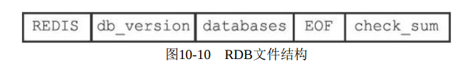

# 1.RDB 持久化

RDB文件（Redis Database Backup file）是某一时刻Redis服务器中，数据库以及数据库的键值对信息经过压缩的二进制文件，保存在硬盘里，通过该文件可以还原生成RDB文件时的数据库状态。

## 1.1 创建

SAVE、BGSAVE 用于生成RDB文件。

（1）SAVE命令会阻塞Redis服务器进程，直到RDB文件创建完毕。

（2）BGSAVE命令会派生出一个**子进程**，然后由子进程负责创建RDB文件，服务器进程（父进程）继续处理命令请求。

```C
//派生子进程，并由子进程创建RDB文件
redis> BGSAVE 
Background saving started
```

## 1.2 载入

Redis并没有专门载入RDB文件的命令，只要启动时检测到RDB文件存在，它就会自动载入RDB文件。因为AOF文件的更新频率通常比RDB文件高，所以如果开启了AOF，那么会优先使用AOF文件来还原数据库状态。

服务器在载入RDB文件期间，会一直处于阻塞状态，直到载入工作完成为止。

## 1.3 自动间隔性保存

Redis允许用户通过设置服务器配置的save选项，让服务器每隔一段时间自动执行一次BGSAVE命令。

```C
//这也是默认设置
save 900 1
save 300 10
save 60 10000
```

那么只要满足以下3个条件中的任意一个，BGSAVE命令就会被执行：

- 服务器在900秒之内，对数据库进行了至少1次修改。
- 服务器在300秒之内，对数据库进行了至少10次修改。
- 服务器在60秒之内，对数据库进行了至少10000次修改。

Redis的服务器周期性操作函数 serverCron 默认每隔100毫秒就会执行一次，该函数用于对正在运行的服务器进行维护，其中一项工作就是检查save选项所设置的保存条件是否已经满足，如果满足，就执行BGSAVE命令。

## 1.4 RDB文件结构



（1）REDIS：常量，5字节，通过这五个字符，程序可以在载入文件时，快速检查所载入的文件是否RDB文件。

（2）db_version：4字节，值是一个字符串表示的整数，记录RDB文件的版本号。

（3）databases：包含零个或任意多个数据库，以及各个数据库中的键值对数据。

（4）EOF：常量，1字节，标志着RDB文件正文内容结束。

（5）check_sum：8字节，无符号整数，保存着一个校验和，这个校验和是通过对REDIS、db_version、databases、EOF 进行计算得出的。在载入RDB文件时，会将载入数据所计算出的校验和与check_sum所记录的校验和进行对比，来检查RDB文件是否有出错。

# 2.AOF 持久化

AOF（Append Only File）持久化，通过保存Redis服务器所执行的写命令来记录数据库状态，AOF 是纯文本格式，可以直接打开。

服务器在启动时，可以通过载入和执行AOF文件中保存的命令来还原服务器关闭之前的数据库状态。

## 2.1 AOF 实现

分为命令追加（append）、文件写入、文件同步（sync）三个步骤。

（1）追加

当AOF开启时，每执行完一个写命令，会以协议格式将写命令追加到 aof_buf 缓冲区。

（2）写入

服务器每结束一个事件循环之前，都会调用 flushAppendOnlyFile 函数，考虑是否将aof_buf缓冲区中的内容写入到AOF文件里。

flushAppendOnlyFile 函数的行为由服务器配置的 appendfsync 选项决定：

- always：总是将aof_buf缓冲区所有内容写入并同步到AOF。
- everysec：将aof_buf缓冲区所有内容写入到AOF。如果上次同步时间据现在超过1秒钟，则通过子线程进行同步。
- no：将aof_buf缓冲区所有内容写入到AOF，但不同步，何时同步由操作系统决定。

（3）同步

在现代操作系统中，当用户调用 write 函数，将一些数据写入到文件的时候，操作系统通常会将写入
数据暂时保存在一个内存缓冲区里面，等到缓冲区的空间被填满、或者超过了指定的时限之后，才真正地将缓冲区中的数据写入到磁盘里面。

fsync和fdatasync两个同步函数，可以强制让操作系统立即将缓冲区中的数据写入到硬盘里面。

从平摊操作的角度来看，no模式和everysec模式的效率类似，当出现故障停机时，使用no模式的服务器将丢失上次同步AOF文件之后的所有写命令数据。

## 2.2 AOF 载入与数据还原

创建一个不带网络连接的伪客户端，读取AOF文件的写命令，然后执行。

## 2.3 AOF 重写

（1）定义

解决AOF文件体积膨胀的问题，Redis提供了AOF文件重写（rewrite）功能。

实际上，AOF文件重写并不对现有的AOF文件进行任何读取、分析或者写入操作，这个功能是通过读取服务器当前的数据库状态来实现的。

比如，一个 string msg 通过多次操作，最终的值是 "1"，那么重写会生成1条命令，set msg 1。处理列表、哈希表、集合、有序集合这四种可能会带有多个元素的键时，如果元素的数量超过了 redis.h/REDIS_AOF_REWRITE_ITEMS_PER_CMD常量的值，那么重写程序将使用多条命令来记录键的值。

（2）AOF 后台重写

aof_rewrite 函数会进行大量的写入操作，会导致线程将被长时间阻塞，因此 AOF 重写程序放到 **子进程** 里执行。

- 子进程进行AOF重写期间，服务器进程（父进程）可以继续处理命令请求。
- **子进程带有服务器进程的数据副本**，使用子进程而不是线程，可以在避免使用锁的情况下，保证数据的安全性。

问题：子进程在进行AOF重写期间，服务器进程还需要继续处理命令请求，而新的命令可能会修改数据库状态，从而使得服务器当前的数据库状态和重写后的AOF文件状态不一致。

为了解决数据不一致，Redis服务器设置了一个AOF重写缓冲区，创建子进程之后开始使用，当Redis服务
器执行完一个写命令之后，会同时将写命令发送给AOF缓冲区和AOF重写缓冲区。

当子进程完成AOF重写工作之后，会向父进程发送一个信号，父进程在接到该信号之后，会调用一个信号处理函数，并执行以下工作：

（1）将AOF重写缓冲区中的所有内容写入到新AOF文件中，这时新AOF文件所保存的数据库状态将和服务器当前的数据库状态一致。

（2）对新的AOF文件进行改名，原子地（atomic）覆盖现有的AOF文件，完成新旧两个AOF文件的替换。


