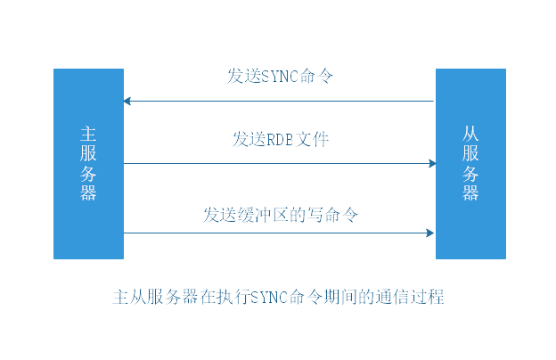
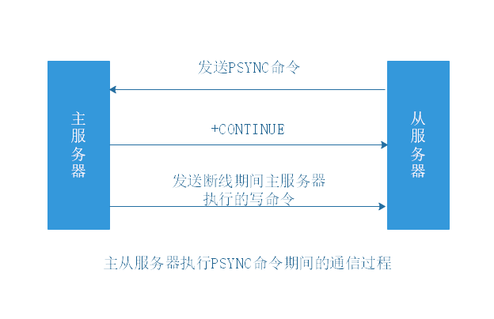
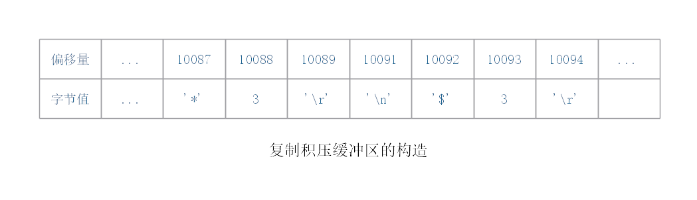

执行SLAVEOF或者设置slaveof选项，可以让一个服务器去复制（replicate）另一个服务器。其中，被复制的服务器为主服务器（master），而对主服务器进行复制的服务器则称为从服务器（slave）。

# 1 旧版复制

（2.8版本以前）

旧版Redis的复制功能分为同步（sync）和命令传播（command propagate）两个操作：

- 同步：将从服务器的数据库状态更新至主服务器当前的数据库状态。
- 命令传播：在主从服务器的数据库状态出现不一致时，让主从服务器的数据库重新回到一致状态。

## 1.1 同步

从服务器对主服务器的同步操作需要通过向主服务器发送SYNC命令来完成，以下是SYNC命令的执行步骤：

1）从服务器向主服务器发送SYNC命令。

2）主服务器执行BGSAVE命令，生成RDB文件，并使用缓冲区记录从现在开始执行的所有写命令。

3）主服务器的BGSAVE执行完毕时，会将RDB文件发送给从服务器，从服务器接收并载入这个RDB文件。

4）主服务器将缓冲区里面的所有写命令发送给从服务器执行，将数据库状态更新至主服务器当前所处的状态。



## 1.2 命令传播

同步后，主从服务器达到一致状态。

后续当主服务器执行写命令时，会将命令发送给从服务器执行，当从服务器执行了相同的写命令后，主从服务器将再次回到一致状态。

## 1.3 旧版复制功能的缺陷

在Redis中，从服务器对主服务器的复制可以分为以下两种情况：

- 初次复制：从服务器以前没有复制过任何主服务器，或者从服务器当前要复制的主服务器和上一次复制的主服务器不同。
- 断线后重新复制：处于命令传播阶段的主从服务器因为网络原因而中断了复制，但从服务器通过自动重连接重新连上了主服务器，并重新复制主服务器。

对于初次复制来说，旧版复制能够很好地完成任务，但对于断线后重新复制来说，由于要重新走一遍同步流程(SYNC)，因此效率很低。

# 2 新版复制

（2.8版本及以后）

Redis从2.8版本开始，使用PSYNC命令代替SYNC命令来执行复制时的同步操作。

PSYNC命令具有完整重同步（full resynchronization）和部分重同步（partial resynchronization）两种模式：

- 完整重同步：用于处理初次复制情况，执行步骤和SYNC命令基本一样。
- 部分重同步：用于处理断线后重新复制情况。



## 2.1 部分重同步

部分重同步功能由三个部分构成：

- 主服务器的复制偏移量（replication offset）和从服务器的复制偏移量。
- 主服务器的复制积压缓冲区（replication backlog）。
- 服务器的运行ID（run ID）。

### 2.1.1 偏移量

主服务器和从服务器会分别维护一个复制偏移量：

- 主服务器每次向从服务器传播N个字节的数据时，就将自己的复制偏移量的值加上N。
- 从服务器每次收到主服务器传播来的N个字节的数据时，就将自己的复制偏移量的值加上N。

### 2.1.2 积压缓冲区

复制积压缓冲区：由主服务器维护的一个 **固定长度（fixed-size）** 先进先出（FIFO）队列，默认大小为1MB。

当主服务器进行命令传播时，它不仅会将写命令发送给所有从服务器，还会将写命令入队到复制积压缓冲区里面，并且复制积压缓冲区会为队列中的每个字节记录相应的复制偏移量。



当从服务器重新连上主服务器时，从服务器会通过PSYNC将自己的复制偏移量offset发送给主服务器，主服务器会根据这个复制偏移量来决定对从服务器执行何种同步操作：

- 如果offset偏移量之后的数据（也即是偏移量offset+1开始的数据）仍然存在于复制积压缓冲区里面，那么主服务器将对从服务器执行部分重同步操作。
- 如果offset偏移量之后的数据已经不存在于复制积压缓冲区，那么主服务器将对从服务器执行完整重同步操作。

### 2.1.3 服务器运行ID

无论主从服务器，都会有自己的运行ID。运行ID在服务器启动时自动生成，由40个随机的十六进制字符组成。

1）当从服务器进行初次复制时，主服务器会将运行ID传送给从服务器，而从服务器则会将这个运行ID保存起来。

2）当从服务器断线并重新连上一个主服务器时，从服务器将向当前连接的主服务器发送之前保存的运行ID。

3）如果从服务器保存的运行ID和当前主服务器的运行ID相同，那么说明从服务器断线之前连接的就是该主服务器，主服务器可以继续尝试执行部分重同步操作。

4）如果从服务器保存的运行ID和当前主服务器的运行ID不相同，那么说明从服务器断线之前连接的不是该主服务器，主服务器将对从服务器执行完整重同步操作。

# 3 复制的实现

从服务器接发送SLAVEOF \<master_ip\> \<master_port\>，在接收到主服务器的命令后，将开始复制。

## 3.1 设置主服务器的地址和端口

从服务器首先将客户端给定的主服务器IP地址127.0.0.1以及端口6379，保存到服务器状态的masterhost属性和masterport属性。

```C
struct redisServer {
    // ...
    //主服务器的地址
    char *masterhost;
    //主服务器的端口
    int masterport;
};
```

SLAVEOF是一个异步命令，从服务器在完成masterhost和masterport的设置后，将向发送SLAVEOF的客户端返回OK，实际的复制工作将在OK返回后执行。

## 3.2 建立套接字连接

从服务器根据IP地址和端口，创建连向主服务器的套接字。

（1）如果从服务器创建的套接字能成功连接（connect）到主服务器，那么：

- 从服务器：将为该套接字关联一个专门用于处理复制工作的文件事件处理器，这个处理器将负责执行后续的复制工作：接收RDB文件，接收写命令等。
- 主服务器：将为该套接字创建相应的客户端状态，并将从服务器看作是一个连接到主服务器的客户端。此时，从服务器既可以向主服务器发送命令请求，也可以接收命令回复。


## 3.3 发送PING命令

从服务器成为主服务器的客户端后，将向主服务器发送一个PING命令。

作用：

（1）通过发送PING检查套接字的读写状态是否正常。

（2）通过发送PING检查主服务器能否正常处理命令请求。

回复情况：

（1）如果主服务器返回一个命令回复，但从服务器不能在规定的时限（timeout）内读取回复的内容，则表示主从服务器间的网络状态不佳，不能继续执行后续步骤。此时，从服务器断开并重新创建套接字。

（2）如果主服务器返回一个错误，则表示主服务器暂时没办法处理从服务器的命令请求。此时，从服务器断开并重新创建套接字。

（3）如果从服务器读取到"PONG"回复，那么表示主从服务器间的网络状态正常，并且主服务器可以正常处理从服务器（客户端）发送的命令请求。

## 3.4 身份验证

如果**从服务器**设置了masterauth选项，那么进行身份验证。

## 3.5 发送端口信息

从服务器执行REPLCONF listeningport \<port-number\>，向主服务器发送从服务器的监听端口号。

主服务器在接收到命令后，将端口号记录在从服务器对应的客户端状态的slave_listening_port属性中。

```C
typedef struct redisClient {
    // ...
    //从服务器的监听端口号
    int slave_listening_port;
} redisClient;
```

slave_listening_port属性目前唯一的作用就是在主服务器执行INFO replication命令时打印出从服务器的端口号。

## 3.6 同步

从服务器将向主服务器发送PSYNC命令，将自己的数据库更新至主服务器数据库当前所处的状态。

在同步操作执行之前，只有从服务器是主服务器的客户端。但是在**执行同步后，主服务器也会成为从服务器的客户端**：主服务器需要成为从服务器的客户端，才能向从服务器发送保存在复制积压缓冲区里的写命令。

## 3.7 命令传播

主从服务器进入命令传播阶段。此时主服务器需要一直将自己执行的写命令发送给从服务器，而从服务器只要一直接收并执行主服务器发来的写命令，就可以保证主从服务器一致。

# 4 心跳检测

在命令传播阶段，从服务器默认以每秒一次的频率，向主服务器发送命令：`REPLCONF ACK <replication_offset>`，其中replication_offset是从服务器当前的复制偏移量。

发送REPLCONF ACK对于主从服务器有三个作用：

（1）检测主从服务器的网络状态。
（2）辅助实现min-slaves选项。
（3）检测命令丢失。

## 4.1 检测主从服务器的网络状态

通过向主服务器发送INFO replication命令，在列出的从服务器列表的lag一栏中，可以看到相应从服务器最后一次向主服务器发送REPLCONF ACK命令距离现在过了多少秒：

```redis
127.0.0.1:6379> INFO replication
# Replication
role:master
connected_slaves:2
slave0:ip=127.0.0.1,port=12345,state=online,offset=211,lag=0  # 刚刚发送过 REPLCONF ACK命令
slave1:ip=127.0.0.1,port=56789,state=online,offset=197,lag=15 # 15秒之前发送过REPLCONF ACK命令
master_repl_offset:211
repl_backlog_active:1
repl_backlog_size:1048576
repl_backlog_first_byte_offset:2
repl_backlog_histlen:210
```

通常，lag的值应该在0秒或者1秒之间跳动。如果超过1秒，那么说明主从服务器之间的连接出现了故障。

## 4.2 辅助实现min-slaves选项

Redis的min-slaves-to-write和min-slaves-max-lag两个选项可以防止主服务器在不安全的情况下执行写命令。

举个例子，如果向主服务器提供以下设置：

```redis
min-slaves-to-write 3
min-slaves-max-lag 10
```

那么在从服务器的数量少于3个，或者三个从服务器的延迟（lag）值都大于或等于10秒时，主服务器将拒绝执行写命令。

## 4.3 检测命令丢失

当从服务器发送REPLCONF ACK时，主服务器会检查从服务器的复制偏移量。如果从服务器的复制偏移量少于自己的复制偏移量，然后主服务器就会在复制积压缓冲区里面找到从服务器缺少的数据，并将这些数据重新发送给从服务器。

在Redis 2.8版本以前，即使命令在传播过程中丢失，主服务器没有措施知道，更不会向从服务器补发丢失的数据。

# 5 问题

1. 复制积压缓冲区大小不好确定。

2. 部分重同步的时候，存在双写问题（写缓冲区和从服务器），有没有优化思路？

一种解决思路：不再使用复制缓冲区，后台线程将RDB文件切分，分块传输。
