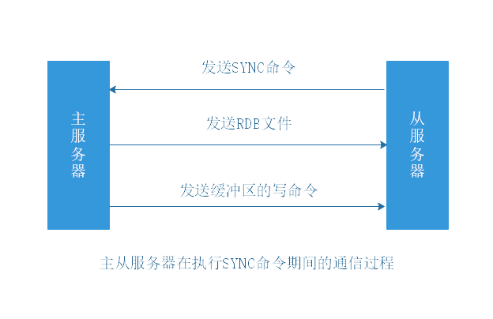
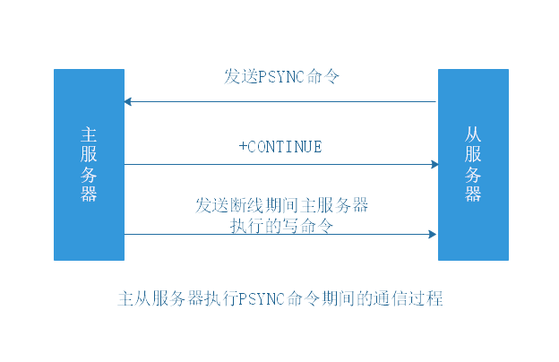
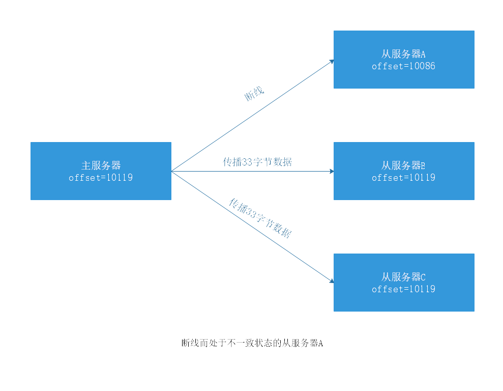
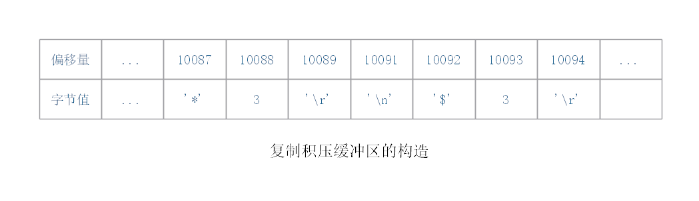

执行SLAVEOF或者设置slaveof选项，可以让一个服务器去复制（replicate）另一个服务器。其中，被复制的服务器为主服务器（master），而对主服务器进行复制的服务器则称为从服务器（slave）。

# 1 旧版复制

（2.8版本以前）

旧版Redis的复制功能分为同步（sync）和命令传播（command propagate）两个操作：

- 同步：将从服务器的数据库状态更新至主服务器当前的数据库状态。
- 命令传播：在主从服务器的数据库状态出现不一致时，让主从服务器的数据库重新回到一致状态。

## 1.1 同步

从服务器对主服务器的同步操作需要通过向主服务器发送SYNC命令来完成，以下是SYNC命令的执行步骤：

1）从服务器向主服务器发送SYNC命令。

2）主服务器收到SYNC命令后，执行BGSAVE命令，在后台生成一个RDB文件，并使用一个缓冲区记录从现在开始执行的所有写命令。

3）主服务器的BGSAVE执行完毕时，主服务器会将生成的RDB文件发送给从服务器，从服务器接收并载入这个RDB文件，将数据库状态更新至主服务器执行BGSAVE命令时的数据库状态。

4）主服务器将缓冲区里面的所有写命令发送给从服务器，从服务器执行这些写命令，将数据库状态更新至主服务器数据库当前所处的状态。

## 1.2 命令传播

在同步操作执行完毕之后，主从服务器两者的数据库将达到一致状态。后续当主服务器执行客户端发送的写命令时，主服务器的数据库就有可能会被修改，并导致主从服务器状态不再一致。

此时，主服务器要对从服务器执行命令传播来继续保持一致：主服务器会将执行的写命令，发送给从服务器执行，当从服务器执行了相同的写命令后，主从服务器将再次回到一致状态。

## 1.3 旧版复制功能的缺陷

在Redis中，从服务器对主服务器的复制可以分为以下两种情况：

- 初次复制：从服务器以前没有复制过任何主服务器，或者从服务器当前要复制的主服务器和上一次复制的主服务器不同。
- 断线后重新复制：处于命令传播阶段的主从服务器因为网络原因而中断了复制，但从服务器通过自动重连接重新连上了主服务器，并重新复制主服务器。

对于初次复制来说，旧版复制能够很好地完成任务，但对于断线后重新复制来说，由于要重新走一遍同步流程(SYNC)，而不是仅仅同步断线后的主服务器的写命令，因此效率很低。

SYNC命令的缺点：

1）主服务器需要执行BGSAVE命令来生成RDB文件，这个生成操作会耗费主服务器大量的CPU、内存和磁盘I/O资源。

2）主服务器需要将生成的RDB文件发送给从服务器，这个发送操作会耗费主从服务器大量的网络资源（带宽和流量），并对主服务器响应命令请求的时间产生影响。

3）接收到RDB文件的从服务器需要载入主服务器发来的RDB文件，并且在载入期间，从服务器会因为阻塞而没办法处理命令请求。

# 2 新版复制

（2.8版本及以后）

Redis从2.8版本开始，使用PSYNC命令代替SYNC命令来执行复制时的同步操作。

PSYNC命令具有完整重同步（full resynchronization）和部分重同步（partial resynchronization）两种模式：

- 完整重同步：用于处理初次复制情况，执行步骤和SYNC命令基本一样。
- 部分重同步：用于处理断线后重新复制情况，主服务器将连接断开期间执行的写命令发送给从服务器，从服务器接收并执行这些写命令，将数据库更新至主服务器当前所处的状态。

## 2.1 部分重同步

部分重同步功能由三个部分构成：

- 主服务器的复制偏移量（replication offset）和从服务器的复制偏移量。
- 主服务器的复制积压缓冲区（replication backlog）。
- 服务器的运行ID（run ID）。

### 2.1.1 偏移量

主服务器和从服务器会分别维护一个复制偏移量：

- 主服务器每次向从服务器传播N个字节的数据时，就将自己的复制偏移量的值加上N。
- 从服务器每次收到主服务器传播来的N个字节的数据时，就将自己的复制偏移量的值加上N。

考虑如下断线场景：

假设从服务器A在断线之后，立即重新连接主服务器，并且成功。那么接下来，从服务器将向主服务器发送PSYNC命令，报告从服务器A当前的复制偏移量为10086，那么这时：

（1）主服务器应该对从服务器执行完整重同步还是部分重同步呢？

（2）如果执行部分重同步的话，主服务器又如何补偿从服务器A在断线期间丢失的那部分数据呢？

### 2.1.2 积压缓冲区

复制积压缓冲区：由主服务器维护的一个**固定长度（fixed-size）**先进先出（FIFO）队列，默认大小为1MB。当入队元素的数量大于队列长度时，最先入队的元素会被弹出，而新元素会被放入队列。

当主服务器进行命令传播时，它不仅会将写命令发送给所有从服务器，还会将写命令入队到复制积压缓冲区里面，并且复制积压缓冲区会为队列中的每个字节记录相应的复制偏移量。

当从服务器重新连上主服务器时，从服务器会通过PSYNC将自己的复制偏移量offset发送给主服务器，主服务器会根据这个复制偏移量来决定对从服务器执行何种同步操作：

- 如果offset偏移量之后的数据（也即是偏移量offset+1开始的数据）仍然存在于复制积压缓冲区里面，那么主服务器将对从服务器执行部分重同步操作。
- 如果offset偏移量之后的数据已经不存在于复制积压缓冲区，那么主服务器将对从服务器执行完整重同步操作。

2.1.1节问题：

主服务器收到从服务器发来的PSYNC命令以及偏移量10086之后，主服务器将检查偏移量10086之后的数据是否存在于复制积压缓冲区里面，结果发现这些数据仍然存在，于是主服务器向从服务器发送+CONTINUE回复，表示数据同步将以部分重同步模式来进行。

根据需要调整复制积压缓冲区的大小：

如果主服务器有大量写命令，又或者主从服务器断线后重连接时间较长，那么复制积压缓冲区默认1MB可能不合适。此时，PSYNC的复制重同步模式就不能正常发挥作用。

复制积压缓冲区的最小大小可以根据公式second*write_size_per_second来估算：

- second：从服务器断线后重新连接上主服务器所需的平均时间（以秒计算）。
- write_size_per_second：主服务器平均每秒产生的写命令数据量（协议格式的写命令的长度总和）。

示例：

假设主服务器平均每秒产生1 MB的写数据，而从服务器断线后平均要5秒才能重新连接上主服务器，那么复制积压缓冲区的大小就不能低于5MB。

为了安全起见，可以将复制积压缓冲区的大小设为2*second*write_size_per_second，这样可以保证绝大部分断线情况都能用部分重同步来处理。复制积压缓冲区大小的修改方法，可以参考配置文件中关于repl-backlog-size选项的说明。

### 2.1.3 服务器运行ID

无论主从服务器，都会有自己的运行ID。运行ID在服务器启动时自动生成，由40个随机的十六进制字符组成。

1）当从服务器进行初次复制时，主服务器会将运行ID传送给从服务器，而从服务器则会将这个运行ID保存起来。

2）当从服务器断线并重新连上一个主服务器时，从服务器将向当前连接的主服务器发送之前保存的运行ID。

3）如果从服务器保存的运行ID和当前主服务器的运行ID相同，那么说明从服务器断线之前连接的就是该主服务器，主服务器可以继续尝试执行部分重同步操作。

4）如果从服务器保存的运行ID和当前主服务器的运行ID不相同，那么说明从服务器断线之前连接的不是该主服务器，主服务器将对从服务器执行完整重同步操作。

## 2.2 PSYNC命令的实现

## 3 复制的实现