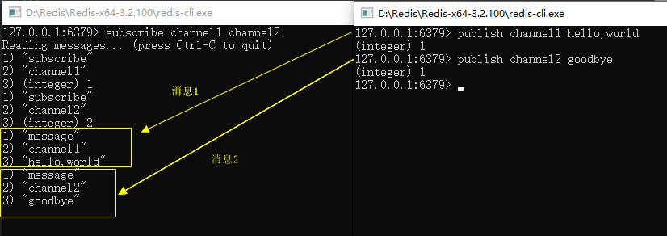

# 1.STRING

|命令|行为|示例|
|----|---|----|
|SET|设置存储在给定键中的值。EX:过期时间，秒。PX:过期时间，毫秒。NX:只有键key不存在的时候才会设置key的值。XX:只有键key存在的时候才会设置key的值|set string-key value [EX seconds] [PX milliseconds] [NX\|XX]|
|GET|获取存储在给定键中的值|get string-key|
|INCR|将键值存储的值(必须是整数)加1|incr string-key|
|DECR|将键值存储的值(必须是整数)减1|decr string-key|
|INCRBY|将键值存储的值(必须是整数)加上整数|incrby string-key amount|
|DECRBY|将键值存储的值(必须是整数)减去整数|decrby string-key amount|
|INCRBYFLOAT|将键值存储的值加上浮点数|incrbyfloat string-key amount|
|APPEND|将值追加到给定键存储的值的末尾|append string-key value|
|GETRANGE|获取给定范围(包含两端)组成的子串|getrange string-key start end|
|SETRANGE|将给定偏移量开始的子串设定为给定值|setrange string-key offset value|
|GETBIT|将**字节串**看成二进制位串，并返回位串中偏移量为offset的二进制位值|getbit string-key offset|
|SETBIT|将**字节串**看成二进制位串，将将位串中给定偏移量的二进制位设置为给定值|setbit string-key offset value|
|BITCOUNT|统计二进制位串里值为1的位置的个数，可设定范围|bitcount string-key [start end]|
|BITOP|对一个或多个二进制位串进行按位运算(AND、OR、XOR、NOT)，并将结果保存dest-key|bitop operation dest-key key1 [key2 ...]|

# 2.LIST

|命令|行为|示例|
|----|---|----|
|LPUSH|将给定值推入列表的左端|lpush list-key item|
|RPUSH|将给定值推入列表的右端|rpush list-key item|
|LPOP|从列表的左端弹出一个值，并返回弹出的值|lpop list-key|
|RPOP|从列表的右端弹出一个值，并返回弹出的值|rpop list-key|
|LRANGE|获取列表在给定范围内的所有值（包含范围边界）|lrange list-key start end|
|LINDEX|获取列表在给定位置上的单个元素（索引从0开始）|lindex list-key offset|
|LTRIM|对列表进行修剪，只保留start到end的元素（包含边界）|ltrim list-key start end|
|BLPOP|从第一个非空列表中，弹出最左端的元素。或者在timeout秒内阻塞并等待可弹出的元素的出现 |blpop key1 [key2 ...] timeout|
|BRPOP|从第一个非空列表中，弹出最右端的元素。或者在timeout秒内阻塞并等待可弹出的元素的出现 |brpop key1 [key2 ...] timeout|
|RPOPLPUSH|从src-key的右端弹出元素，并将该元素压入dest-key的左端，并返回这个元素|rpoplpush src-key dest-key|
|BRPOPLPUSH|从src-key的右端弹出元素，并将该元素压入dest-key的左端，并返回这个元素。如果src-key列表为空，则在timeout秒内阻塞并等待可弹出的元素的出现|brpoplpush src-key dest-key|

# 3.SET

|命令|行为|示例|
|----|---|----|
|SADD|将给定元素添加到集合|sadd set-key item|
|SMEMBERS|返回集合包含的全部元素|smembers set-key|
|SISMEMBER|检查给定元素是否在集合中|sismember set-key item|
|SCARD|返回集合的元素数量|scard set-key|
|SRANDMEMBER|从集合里随机返回count个元素。count为正数，则元素不会重复；count为负数，则元素有可能重复|srandmember set-key [count]|
|SPOP|随机移除集合中的元素，并返回|spop set-key|
|SMOVE|若src-key集合包含item，则将item移除，并将item移到dest-key集合。成功返回1，失败返回0|smove src-key dest-key item|
|SREM|如果给定集合存在于元素中，则移除该元素|srem set-key item|
|SDIFF|差集，存在于第一个集合，但不存在其他集合|sdiff key1 [key2 ...]|
|SDIFFSTORE|差集，并存储在dest-key|sdiffstore dest-key key1 [key2 ...]|
|SINTER|交集，同时存在于所有集合的元素|sinter key1 [key2 ...]|
|SINTERSTORE|交集，并存储在dest-key|sinterstore dest-key key1 [key2 ...]|
|SUNION|并集，至少存在于1个集合中|sunion key1 [key2 ...]|
|SUNIONSTORE|并集，并存储在dest-key|sunion dest-key key1 [key2 ...]|

# 4.HASH

|命令|行为|示例|
|----|---|----|
|HSET|在散列里添加键值对|hset hash-key field value|
|HGET|获取散列中，指定键的值|hget hash-key field|
|HGETALL|获取散列中，所有的键值对|hgetall hash-key|
|HMGET|获取散列中，一个或多个键值对|hmget hash-key field1 [field2 ...]|
|HMSET|为散列中，一个或多个赋值|hmset hash-key field1 value1 [field2 value2 ...]|
|HLEN|返回散列包含的键值对数量|hlen key-name|
|HEXISTS|检查给field是否在散列中|hexists hash-key field|
|HKEYS|获取散列中所有field|hkeys hash-key|
|HVALS|获取散列中所有value|hvals hash-key|
|HINCRBY|将散列中，field的值加上整数amount|hincrby hash-key field amount|
|HINCRBYFLOAT|将散列中，field的值加上浮点数amount|hincrbyfloat hash-key field amount|
|HDEL|如果给定键存在于散列中，则移除该元素|hdel hash-key field|

# 5.ZSET

默认情况，按分值由小到大排序。

|命令|行为|示例|
|----|---|----|
|ZADD|将一个带有给定分值的成员添加到有序集合里面|zadd zset-key score member|
|ZCARD|返回有序集合包含的成员数量|zcard zset-key|
|ZCOUNT|返回介于min和max之间的成员数量|zcount zset-key min max|
|ZSCORE|返回成员member在有序集合中的分值|zscore zset-key member|
|ZRANK|返回成员member在有序集合中的排名|zrank zset-key member|
|ZREVRANK|返回成员member在有序集合中的排名,且成员分值由大到小排列|zrevrank zset-key member|
|ZRANGE|获取有序集合在给定位置的所有值(包含范围边界)|zrange zset-key start end [WITHSCORES]|
|ZREVRANGE|分值由大到小排列时，获取有序集合在给定位置的所有值(包含范围边界)，|zrevrange zset-key min max|
|ZRANGEBYSCORE|获取有序集合在给定分值范围内的所有元素(包含范围边界)|zrangebyscore zset-key min max|
|ZREVRANGEBYSCORE|分值由大到小排列时，获取有序集合在给定分值范围内的所有元素(包含范围边界)|zrevrangebyscore zset-key max min|
|ZREMRANGEBYRANK|移除有序集合中排名介于start和end之间的成员|zremrangebyrank zset-key start end|
|ZREMRANGEBYSCORE|移除有序集合中分值介于min和max之间的成员|zremrangebyscore zset-key min max|
|ZINTERSTORE|交集，并保存在dest-key中|zinterstore dest-key key-count key1 [key2 ...] [WEIGHTS weight1 [weight2 ...]] [AGGREGATE SUM\|MIN\|MAX]|
|ZUNIONSTORE|并集，并保存在dest-key中|zunionstore dest-key key-count key1 [key2 ...] [WEIGHTS weight1 [weight2 ...]] [AGGREGATE SUM\|MIN\|MAX]|
|ZINCRBY|将member成员的分值加上amount|zincrby zset-key amount member|
|ZREM|如果给定成员存在于有序集合，则移除该成员|zrem zset-key member|

## 6.过期时间

|命令|行为|示例|
|----|---|----|
|PERSIST|移除键的过期时间|persist key|
|TTL|查看给定键距离过期还剩多少秒|ttl key|
|EXPIRE|让给定键在指定的秒数之后过期|expire key seconds|
|EXPIREAT|将给定键的过期时间设定为给定的UNIX时间戳|expireat key timestamp|
|PTTL|查看给定键距离过期时间还有多少毫秒|pttl key|
|PEXPIRE|让给定键在指定的毫秒数之后过期|pexpire key milliseconds|
|PEXPIREAT|将给定键的过期时间设定为给定的毫秒级精度的UNIX时间戳|pexpireat key timestamp-milliseconds|

# 7.发布与订阅命令

订阅者(listener)负责订阅频道(channel)。

发送者(publisher)负责向频道发送二进制字符串消息(binary string message)。

|命令|行为|示例|
|----|---|----|
|SUBSCRIBE|订阅一个或多个频道|subscribe channel1 [channel2 ...]|
|UNSUBSCRIBE|退订一个或多个频道。若没有给定任何频道，则退订所有|unsubscribe [channel1 [channel2 ...]]|
|PUBLISH|向给定频道发送消息|publish channel msg|
|PSUBSCRIBE|订阅与给定模式相匹配的所有频道|psubscribe pattern1 [pattern2 ...]|
|PUNSUBSCRIBE|退订给定的模式。若没有给定任何模式，则退订所有|punsubscribe [pattern1 [pattern2 ...]]|

不建议使用：

1.影响Redis系统稳定性。旧版Redis，如果客户端读取消息太慢，消息积压将导致Redis变慢，甚至崩溃。新版Redis不会出现这个问题，它会自动断开不符合client-output-buffer-limit publish 选项的客户端。

2.数据传输的可靠性。客户端断线，将会都是期间所有消息。

示例：

# 8.其他命令

## 8.1 删除key

|命令|行为|示例|
|----|---|----|
|DEL|删除存储在给定键中的值|del key|

## 8.2 排序SORT

|命令|行为|示例|
|----|---|----|
|SORT|根据给定的选项，对列表、集合、有序集合进行排序，然后返回或者存储排序结果|sort src-key [by pattern] [limit offset count] [get pattern1 [get pattern2 ...]] [asc\|desc] [alpha] [store dest-key]|
