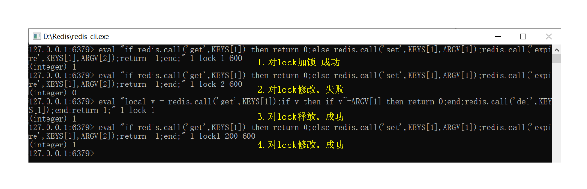

# 1 Lua语法

Lua 手册地址：`https://www.lua.org/manual/5.3/manual.html`

# 2 Lua实现Redis分布式锁

为了对Redis存储的数据进行排他性访问，客户端需要先访问一个锁。这个锁定义在Redis服务器中，恰好能让各个客户端看见。

## 2.1 加锁

如果键存在，则返回0；如果不存在，则设置键和值，并设置过期时间，返回1。该操作是原子操作，可以由等效命令 set key value nx ex seconds代替。

Lua脚本如下：

```lua
if redis.call('get',KEYS[1]) then 
    return 0;
else 
    redis.call('set', KEYS[1], ARGV[1]);
    redis.call('expire', KEYS[1], ARGV[2]);
    return  1;
end;
```

Redis中使用该Lua脚本：对lock进行加锁，并设置过期时间为600。

```redis
eval "if redis.call('get',KEYS[1]) then return 0;else redis.call('set',KEYS[1],ARGV[1]);redis.call('expire',KEYS[1],ARGV[2]);return  1;end;" 1 lock 1 600
```

## 2.1 释放锁

如果不存在键，则无需释放；如果存在键并且值和传入的值一致，那么删除键。成功返回1。

其他情况返回释放失败。失败返回0。

Lua脚本如下：

```lua
local v = redis.call('get', KEYS[1]);
if v then 
    -- 如果和传入的值不同，返回0表示失败
    if v~=ARGV[1] then 
        return 0;
    end;
    -- 如果和传入的值相同，删除key
    redis.call('del',KEYS[1]);
end;
return 1;
```

Redis中使用该Lua脚本：对lock进行释放。

```redis
eval "local v = redis.call('get',KEYS[1]);if v then if v~=ARGV[1] then return 0;end;redis.call('del',KEYS[1]);end;return 1;" 1 lock 1
```

## 2.3 示例



# 3 Lua更新多个key

在业务需求中，我们经常会遇到需要原子性更新多个key的场景。

例子：某答题活动中，涉及到的信息有 用户当天答题情况、用户活动期间信息（总的答题数目，奖品领取记录等）、排行榜信息。请设计缓存模型，并写出当用户答题数增加时，更新各缓存的Lua脚本。

在该例子中，我们尝试使用1个Lua脚本，完成用户相关信息的更新。

## 3.1 缓存设计

使用Jedis操作Redis，当Lua处理多个key，需要key在hash后，落到同一个slot。

在Jedis源码中，提供了1个方法，使用花括号{}，将hash字段包裹，这样同样的字段就可以落在同一个slot中。详情查看Jedis hash源码`redis.clients.util.JedisClusterHashTagUtil#extractHashTag`。

但是，这样会导致所有的Key都落在了1个节点上，可能引起节点cpu过高，此例暂时不考虑。

（1）用户活动信息

key = 固定前缀 + 用户openid，每个用户1个Key，采用hash结构，存储用户活动信息。

| key  | 数据结构类型 | field |value结构 | 备注 |
| ---- | ------------| ----- | -------- |-----|
| {music:daily:quiz}:userRela:{openid} | hash |sumNum   |   1   |总答题数|
|  |  |received    |   0   |奖品领取记录。0：无领取资格，1：待领取，2：已领取|

（2）排行榜

| key  | 数据结构类型 | score |member | 备注 |
| ---- | ------------| ----- | -------- |-----|
| {music:daily:quiz}:rank | zset |1   |   {openid}   |维护大小100的排行榜   |

（3）每日答题记录

key中插入当天日期，并在1天后，随机过期。

| key  | 数据结构类型 |field| value结构 | 备注 |
| ---- | ------------|-----|---------- |-----|
|{music:daily:quiz}:{today}:{openid} | hash |todayNum|  1   |当天答对题数|
|  |  |todayQuizzed|  true   |是否已答题|

## 3.2 数据过期

由于是活动数据，因此不需要保留太久，在允许的时间内过期就行。

3.1 节中的用户活动信息、排行榜，在活动结束后1个月自动过期。用户当天的答题记录，在第二天过期。

为了防止短时间大量过期，Redis告警，需要给每个key的过期时间增加一个随机数。

## 3.3 Lua脚本

```lua
local todayKey = KEYS[1]  -- 当日答题数key
local relaKey  = KEYS[2]  -- 用户活动信息key
local rankKey  = KEYS[3]  -- 排行榜key

local openid     =          ARGV[1]    -- openid
local expireTime = tonumber(ARGV[2])   -- 过期时间
local addNum     = tonumber(ARGV[3])   -- 当前累加的答题数
local rankSize   = tonumber(ARGV[4])   -- 排行榜最大数目
local stage1     = tonumber(ARGV[5])   -- 奖品档位1

local todayNum = 0     -- 当日分数
local sumNum = 0       -- 总分
local lastUser         -- 最后一名

-- 1、更新当日分数
if redis.call("EXISTS", todayKey) == 1 then
    todayNum = tonumber(redis.call("GET", todayKey))
end
redis.call("SETEX", todayKey, expireTime, todayNum + addNum)

-- 2、更新总分
redis.call("HINCRBY", relaKey, "sumNum", addNum)
sumNum = tonumber(redis.call("HGET", relaKey, "sumNum"))

-- 3、更新排行榜
if redis.call("ZRANK", rankKey, openid) then              -- （1）已经在排行榜  -> 直接更新分数
    redis.call("ZINCRBY", rankKey, addNum, openid)
elseif redis.call("ZCARD", rankKey) >= rankSize then      -- （2）不在排行榜，且排行榜已满 -> 和最后一名比较
    lastUser = redis.call("ZRANGE", rankKey, 0, 0, "WITHSCORES")
    if tonumber(lastUser[2]) < sumNum then
        redis.call("ZREM", rankKey, lastUser[1])
        redis.call("ZADD", rankKey, sumNum, openid)
    end
else                                                       -- （3）不在排行榜，且排行榜未满 -> 直接加入
    redis.call("ZADD", rankKey, sumNum, openid)
end

-- 4、更新领取状态
if sumNum >= stage1 and redis.call("HEXISTS", relaKey, "received") ~= 1 then
    redis.call("HSET", relaKey, "received", "1")


-- 5、返回用户信息
return redis.call("HGETALL", relaKey)
```
