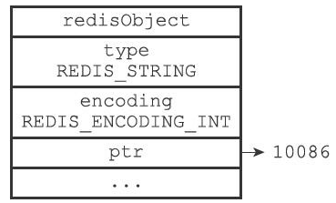
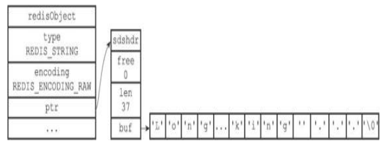
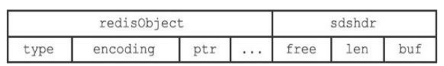

# 1.字符串对象

字符串对象的编码可以是int、 raw或者embstr。

可以用long double类型表示的浮点数在Redis中也是作为字符串来保存的，程序会先将浮点数转换成字符串，然后再保存转换所得的字符串值。

## 1.1 int

保存的是整数值，并且这个整数值可以用long类型来表示。

```redis
redis> SET number 10086
OK
redis> OBJECT ENCODING number
"int"
```



## 1.2 raw

保存的是字符串，并且字符串长度大于32字节，那么将使用简单动态字符串（SDS）来保存。

```redis
redis> SET story "Long, long ago there lived a king ..."
OK
redis> STRLEN story
(integer) 37
redis> OBJECT ENCODING story
"raw"
```



## 1.3 embstr

保存的是字符串，并且这个字符串值的长度小于等于32字节，那么将使用embstr编码来保存。

embstr编码是专门用于保存短字符串的一种优化编码方式，这种编码和raw编码一样，都使用redisObject结构和sdshdr结构来表示字符串对象，但raw编码会调用两次内存分配函数来分别创建redisObject结构和sdshdr结构，而embstr编码则通过调用一次内存分配函数来分配一块连续的空间。



优点：

①embstr编码将创建字符串对象所需的内存分配次数从raw编码的两次降低为一次。

②释放embstr编码的字符串对象只需要调用一次内存释放函数，而raw编码需要调用两次。

③数据都保存在一块连续的内存里，能够更好地利用缓存带来的优势。

# 2.列表对象

列表对象的编码可以是ziplist或者linkedlist。

（1）ziplist

列表对象同时满足以下两个条件，将使用ziplist：

- 列表对象保存的所有字符串元素的长度都小于64字节；
- 列表对象保存的元素数量小于512个； 

（2）linkedlist

不能满足上面两个条件的列表对象需要使用linkedlist编码。

# 3.哈希对象

哈希对象的编码可以是ziplist或者hashtable。

（1）ziplist

当哈希对象同时满足以下两个条件时，使用ziplist编码：

- 保存的所有键值对的键和值的字符串长度都小于64字节；
- 保存的键值对数量小于512个。

插入时，会先将键的压缩列表节点推入到压缩列表表尾，然后再将值的压缩列表节点推入到压缩列表表
尾， 因此：

- 保存了同一键值对的两个节点总是紧挨在一起，键的节点在前，值的节点在后；
- 先添加的键值对会被放在压缩列表的表头方向，而后添加的键值对会被放在压缩列表的表尾方向。

（2）hashtable

不能满足上面两个条件，需要使用hashtable编码。

hashtable编码的哈希对象使用字典作为底层实现，哈希对象中的每个键值对都使用一个字典键值对来保存。

# 4.集合对象

集合对象的编码可以是intset或者hashtable。

（1）intset

当集合对象同时满足以下两个条件时，对象使用intset编码：

- 集合对象保存的所有元素都是整数值；
- 集合对象保存的元素数量不超过512个。

（2）hashtable

不能满足上面两个条件的集合对象需要使用hashtable编码。

字典的键都是字符串对象，而字典的值则全部被设置为NULL。

# 5.有序集合对象

有序集合的编码可以是ziplist或者skiplist。

（1）ziplist

当有序集合对象同时满足以下两个条件时，使用ziplist编码：

- 有序集合保存的所有元素成员的长度都小于64字节；
- 有序集合保存的元素数量小于128个；

（2）skiplist

不能满足上面两个条件将使用skiplist编码。

**为什么有序集合需要同时使用跳跃表和字典来实现？**

（1）O（1）时间复杂度查找成员的分值。

（2）O（logN）范围操作，比如ZRANK、ZRANGE等命令。

如果单独使用字典或者跳跃表来实现种，在性能上对比起同时使用字典和跳跃表都会有所降低。 
