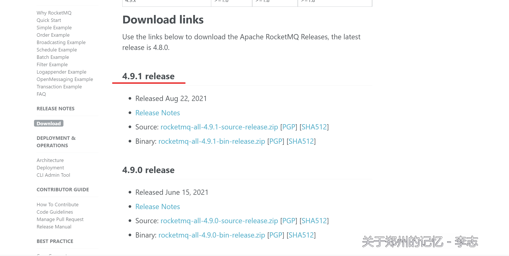
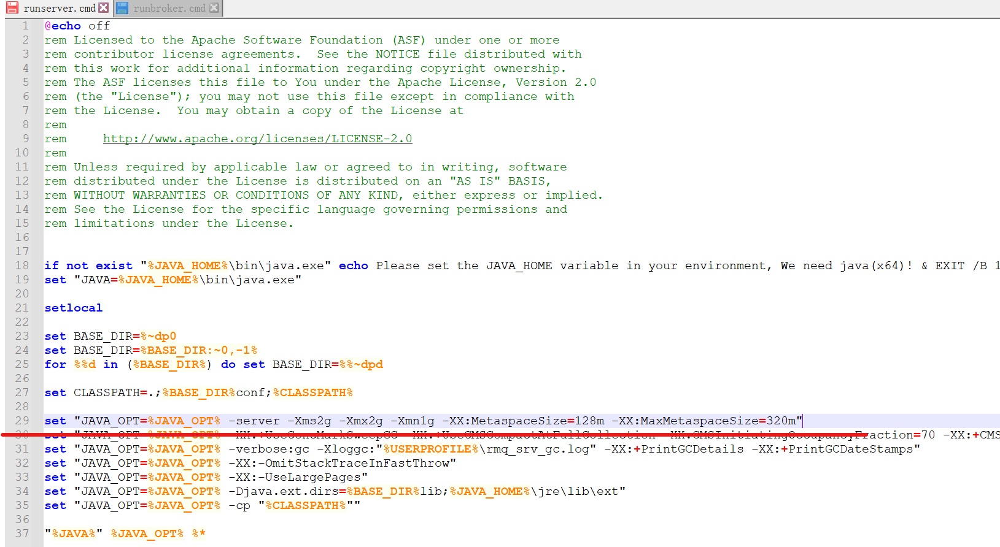
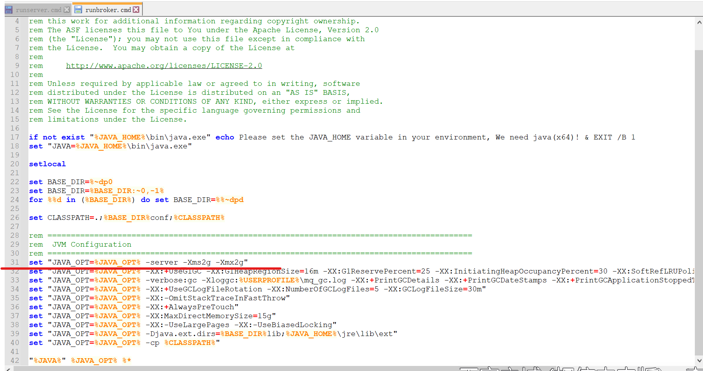
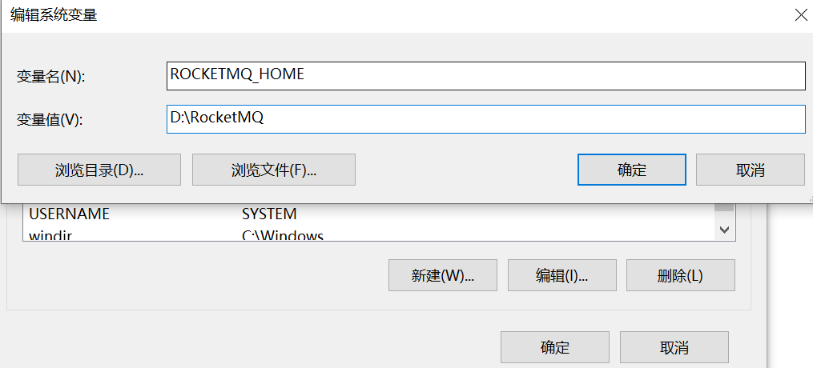
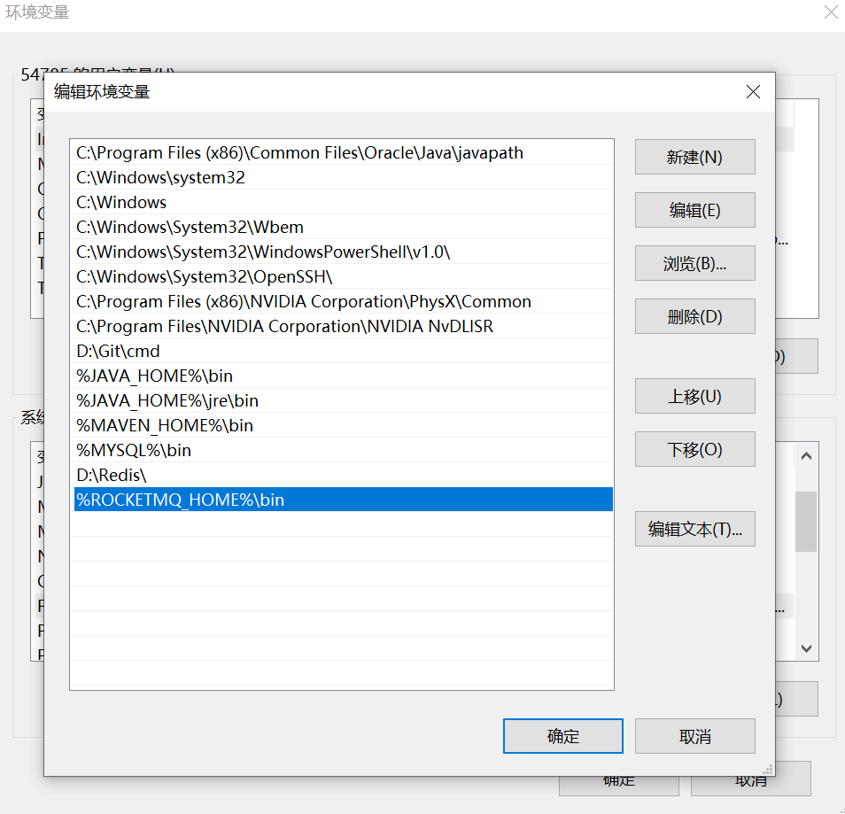
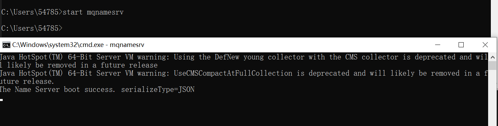
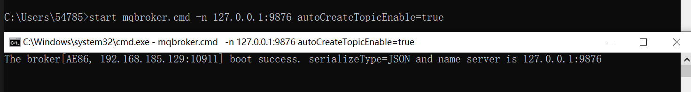
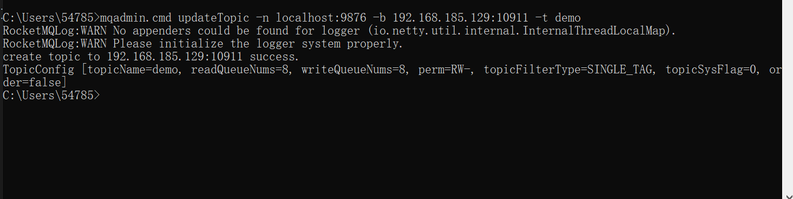
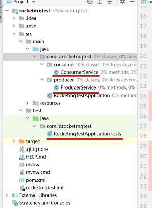
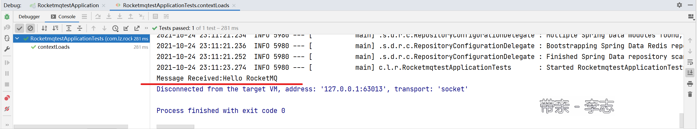

本章介绍RocketMQ的下载、安装与配置。

RocketMQ版本：4.9.1 release

# 1.[官网](http://rocketmq.apache.org/dowloading/releases/)下载安装包。



解压到相应的文件夹，完成安装。

# 2.配置

（1）调整默认内存大小。

分别打开 /bin 目录下的 runserver.cmd、runbroker.cmd文件。

修改为512m 512m 256m即可.





（2）设置环境变量

新建系统变量。名称： ROCKETMQ_HOME ，值对应你的安装位置。



将bin目录添加到系统变量path中。




（3）启动nameserver。命令行输入： `start mqnamesrv.cmd`



（4）启动broker。命令行输入： `start mqbroker.cmd -n 127.0.0.1:9876 autoCreateTopicEnable=true`



# 3.入门示例

（1）创建Topic

执行 `mqadmin.cmd updateTopic -n localhost:9876 -b 192.168.185.129:10911 -t demo`

**注意：**其中`192.168.185.129:10911`为2.4节启动的broker的地址，需要根据broker命令行中的具体情况输入。



（2）建立一个SpringBoot项目, 添加依赖

```maven
<dependency>
   <groupId>org.apache.rocketmq</groupId>
   <artifactId>rocketmq-client</artifactId>
   <version>4.9.1</version>
</dependency>
```

文件目录如下：



（3）生产者

```java
/**
 * RocketMQ 生产者
 *
 * @author lz
 * @date 2021/10/24 22:20
 **/
@Service
public class ProducerService {

    private DefaultMQProducer producer = null;

    @PostConstruct
    public void initMQProducer() {
        producer = new DefaultMQProducer("defalutGroup");
        producer.setNamesrvAddr("localhost:9876");
        producer.setRetryTimesWhenSendFailed(3);

        try {
            producer.start();
        } catch (MQClientException e) {
            e.printStackTrace();
        }
    }

    public boolean send(String topic, String tags, String content) {
        Message msg = new Message(topic, tags, "", content.getBytes(StandardCharsets.UTF_8));
        try {
            producer.send(msg);
            System.out.println("[Producer]Send Message:" + msg);
            return true;
        } catch (Exception e) {
            e.printStackTrace();
        }
        return false;
    }
}
```

（4）消费者

```java
/**
 * RocketMQ 消费者
 *
 * @author lz
 * @date 2021/10/24 22:37
 **/
@Service
public class ConsumerService {

    private DefaultMQPushConsumer consumer = null;

    @PostConstruct
    public void initMQConsumer() {
        consumer = new DefaultMQPushConsumer("defaultGroup");
        consumer.setNamesrvAddr("localhost:9876");
        try {
            consumer.subscribe("demo", "*");
            consumer.registerMessageListener(new MessageListenerConcurrently() {
                @Override
                public ConsumeConcurrentlyStatus consumeMessage(List<MessageExt> list, ConsumeConcurrentlyContext consumeConcurrentlyContext) {
                    for (MessageExt msg : list) {
                        System.out.println("[Consumer]Message Received:" + new String(msg.getBody()));
                    }
                    return ConsumeConcurrentlyStatus.CONSUME_SUCCESS;
                }
            });
            consumer.start();
        } catch (MQClientException e) {
            e.printStackTrace();
        }
    }

    @PreDestroy
    public void shutDownConsumer() {
        if (consumer != null) {
            consumer.shutdown();
        }
    }
}
```

（5）测试

```java
@RunWith(SpringRunner.class)
@SpringBootTest
public class RocketmqtestApplicationTests {

    @Autowired
    private ProducerService producerService;

    @Test
    public void contextLoads() {
        boolean result = producerService.send("demo", "TAG-A", "Hello RocketMQ2");
        assertTrue(result);
    }

}
```

（6）结果

可以看到打印出了消息。



# 4.参考链接

（1）[windows下安装rocketmq采坑全记录](https://blog.csdn.net/kobewwf24/article/details/82712461)

（2）[RocketMQ入门教程](https://www.cnblogs.com/ryelqy/p/14317528.html)