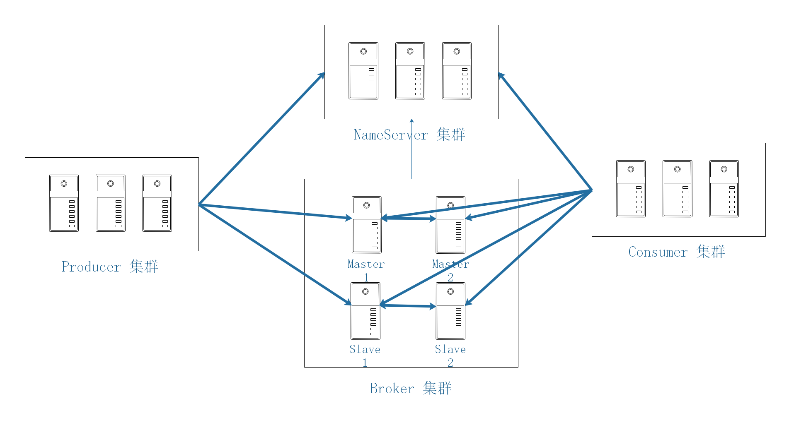

消息中间件的设计思路一般基于主题的订阅发布机制：

（1）消息生产者（Producer）发送某一主题的消息到消息服务器。

（2）消息服务器负责该消息的持久化存储。

（3）消息消费者(Consumer）订阅感兴趣的主题。

（4）消息服务器根据订阅信息（路由信息）将消息推送到消费者（PUSH模式），或者消息消费者主动向消息服务器拉取消息（PULL模式）。 

（5）消息消费者(Consumer）消费消息。

# 1 架构

## 1.1 Nameserver

topic的路由注册中心，为客户端根据Topic提供路由服务，从而引导客户端向Broker发送消息。Nameserver 之间的节点不通信。路由信息在Nameserver集群中数据一致性采取的最终一致性。

## 1.2 Broker

消息存储服务器，分为两种角色：Master与Slave。

上图中呈现的就是2主2从的部署架构，在RocketMQ中，主服务承担读写操作，从服务器作为一个备份，当主服务器存在压力时，从服务器可以承担读服务（消息消费）。所有Broker，包含Slave服务器每隔30s会向Nameserver发送心跳包，心跳包中会包含存在在Broker上所有的topic的路由信息。

## 1.3 Client

消息客户端，包括Producer(消息发送者)和Consumer(消费消费者)。客户端在同一时间只会连接一台 nameserver，只有在连接出现异常时才会向尝试连接另外一台。客户端每隔30s向Nameserver发起topic的路由信息查询。

温馨提示：Nameserver是在内存中存储Topic的路由信息，持久化Topic路由信息存放在Broker中，即${ROCKETMQ_HOME}/store/config/topics.json。

在RocketMQ4.5.0版本后引入了多副本机制，即一个复制组（m-s）可以演变为基于raft协议的复制组， 复制组内部使用raft协议保证broker节点数据的强一致性，该部署架构在金融行业用的比较多。

# 2 消息订阅模型

RocketMQ的消息消费采用发布与订阅模式。

## 2.1 topic

一类消息的集合，消息发送者将一类消息发送到一个主题中。

例如：订单模块将订单发送到order_topic中，而用户登录时，将登录事件发送到user_login_topic 中。

# 2.2 consumegroup 

消息消费组，一个消费单位的“群体”，消费组首先在启动时需要订阅需要消费的topic。一个topic可以被多个消费组订阅，同样一个消费组也可以订阅多个主题。一个消费组拥有多个消费者。

# 3 