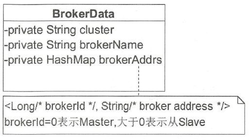
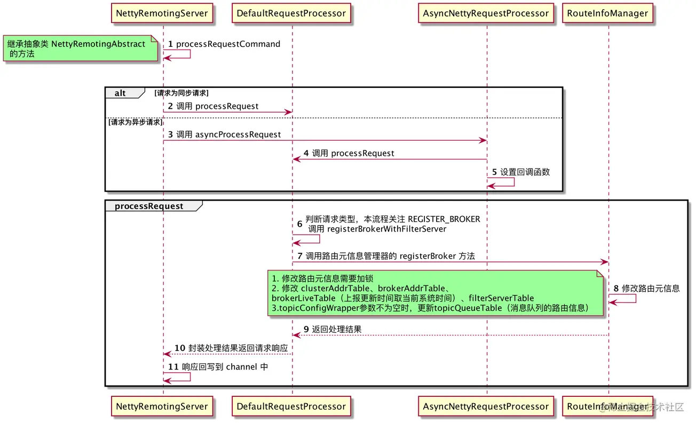

# 1 NameServer架构设计

Broker在启动时向所有NameServer注册，消息生产者（Producer）在发送消息之前先从NameServer获取Broker服务器地址列表，然后根据负载算法从列表中选择一台消息服务器进行消息发送。

NameServer与每台Broker服务器保持长连接，并间隔30s检测Broker是否存活，如果检测到Broker宕机，则从路由注册表中将其移除。但是路由变化不会马上通知消息生产者，这是为了降低NameServer实现的复杂性，在消息发送端提供容错机制来保证消息发送的高可用性。

NameServer本身的高可用可通过部署多台NameSrver服务器来实现，但彼此之间互不通信。即NameServer服务器之间在某一时刻的数据并不会完全相同，但这对消息发送不会造成任何影响。

- Broker每隔30s向NameServer集群的每一台机器发送心跳包， 包含自身创建的topic路由等信息。
- producer每隔30s向NameServer更新对应topic的路由信息。
- NameServer收到Broker发送的心跳包时会记录时间戳。
- NameServer每隔10s会扫描一次brokerLiveTable（存放心跳包的时间戳信息），如果在120s内没有收到心跳包，则认为Broker失效，更新topic的路由信息，将失效的Broker信息移除。


# 2 NameServer启动流程

启动类：`org/apache/rocketmq/namesrv/NamesrvStartup.java`

```Java
public class NamesrvStartup {

    private static InternalLogger log;
    private static Properties properties = null;
    private static CommandLine commandLine = null;
	// 主程序，执行main0方法
    public static void main(String[] args) {
        main0(args);
    }
	
    // 这个方法主要做了两件事：1、创建一个 NamesrvController 实例
    //                       2、初始化并启动该实例
    public static NamesrvController main0(String[] args) {

        try {
            // 创建一个 NamesrvController 实例
            NamesrvController controller = createNamesrvController(args);
            // 初始化并启动该实例
            start(controller);
            String tip = "The Name Server boot success. serializeType=" + RemotingCommand.getSerializeTypeConfigInThisServer();
            log.info(tip);
            System.out.printf("%s%n", tip);
            return controller;
        } catch (Throwable e) {
            e.printStackTrace();
            System.exit(-1);
        }

        return null;
    }
    
    。。。
}
```

## 2.1 createNamesrvController方法

**该方法的主要流程：**

(1)先创建NamesrvConfig（NameServer业务参数）、NettyServerConfig（NameServer网络参数），然后在解析启动时把指定的配置文件或启动命令中的选项值填充到NamesrvConfig、 NettyServerConfig对象中。

参数来源有如下两种方式:
	- -c configFile通过-c命令指定配置文件的路径。
	- 使用“--属性名 属性值”命令，例如 --listenPort 9876。
  
(2)然后根据配置文件创建NamesrvController实例并初始化，其中NamesrvController 是 NameServer 的核心控制器，因此 NameServer 的启动，主要也是在启动它。

**源码解读如下：**

```java
public static NamesrvController createNamesrvController(String[] args) throws IOException, JoranException {
    // 设置版本号为当前版本号
    System.setProperty(RemotingCommand.REMOTING_VERSION_KEY, Integer.toString(MQVersion.CURRENT_VERSION));
    //PackageConflictDetect.detectFastjson();

    //构造org.apache.commons.cli.Options,并添加-h -n参数，-h参数是打印帮助信息，-n参数是指定namesrvAddr
    Options options = ServerUtil.buildCommandlineOptions(new Options());
    //初始化commandLine，并在options中添加-c -p参数，-c指定nameserver的配置文件路径，-p标识打印配置信息
    commandLine = ServerUtil.parseCmdLine("mqnamesrv", args, buildCommandlineOptions(options), new PosixParser());
    if (null == commandLine) {
        System.exit(-1);
        return null;
    }
    //nameserver配置对象，业务参数
    final NamesrvConfig namesrvConfig = new NamesrvConfig();
    //netty服务器配置对象，网络参数
    final NettyServerConfig nettyServerConfig = new NettyServerConfig();
    //设置nameserver的端口号
    nettyServerConfig.setListenPort(9876);
    //命令带有-c参数，说明指定配置文件，需要根据配置文件路径读取配置文件内容，并将文件中配置信息赋值给NamesrvConfig和NettyServerConfig
    if (commandLine.hasOption('c')) {
        String file = commandLine.getOptionValue('c');
        if (file != null) {
            InputStream in = new BufferedInputStream(new FileInputStream(file));
            properties = new Properties();
            properties.load(in);
            //反射的方式对两个配置对象进行属性填充
            MixAll.properties2Object(properties, namesrvConfig);
            MixAll.properties2Object(properties, nettyServerConfig);
            //设置配置文件路径
            namesrvConfig.setConfigStorePath(file);

            System.out.printf("load config properties file OK, %s%n", file);
            in.close();
        }
    }
    //命令行带有-p，说明是打印参数的命令，那么就打印出NamesrvConfig和NettyServerConfig的属性。
    //注意：在启动NameServer时可以先使用./mqnameserver -c configFile -p打印当前加载的配置属性
    if (commandLine.hasOption('p')) {
        InternalLogger console = InternalLoggerFactory.getLogger(LoggerName.NAMESRV_CONSOLE_NAME);
        MixAll.printObjectProperties(console, namesrvConfig);
        MixAll.printObjectProperties(console, nettyServerConfig);
        //打印参数命令不需要启动nameserver服务，只需要打印参数即可
        //  System.exit(status)是用来结束当前正在运行中的java虚拟机.
        //  system.exit(0)表示正常退出程序;system.exit(1)非0表示非正常退出程序
        System.exit(0);
    }
    //解析命令行参数，并加载到namesrvConfig中
    //若命令行带有“--属性名 属性值”命令，例如 --listenPort 9876，则先将配置加载到properties文件中，然后在调用反射的方式对namesrvConfig对象进行属性填充
    MixAll.properties2Object(ServerUtil.commandLine2Properties(commandLine), namesrvConfig);
    //检查 rocketmq的主目录，不能为空
    if (null == namesrvConfig.getRocketmqHome()) {
        System.out.printf("Please set the %s variable in your environment to match the location of the RocketMQ installation%n", MixAll.ROCKETMQ_HOME_ENV);
        // 表示非正常退出
        System.exit(-2);
    }
    //初始化logback日志工厂，rocketmq默认使用logback作为日志输出
    LoggerContext lc = (LoggerContext) LoggerFactory.getILoggerFactory();
    JoranConfigurator configurator = new JoranConfigurator();
    configurator.setContext(lc);
    lc.reset();
    // 新建日志文件，以后日志便打印到该地址中
    configurator.doConfigure(namesrvConfig.getRocketmqHome() + "/conf/logback_namesrv.xml");

    log = InternalLoggerFactory.getLogger(LoggerName.NAMESRV_LOGGER_NAME);
    // 将nameserver配置和netty服务器配置打印到日志文件中
    MixAll.printObjectProperties(log, namesrvConfig);
    MixAll.printObjectProperties(log, nettyServerConfig);
    //创建NamesrvController
    final NamesrvController controller = new NamesrvController(namesrvConfig, nettyServerConfig);

    //将全局Properties的内容备份到NamesrvController.Configuration.allConfigs中
    // 记住所有的配置防止丢失
    controller.getConfiguration().registerConfig(properties);

    return controller;
}
```

其中**NamesrvConfig配置对象的主要参数如下：**

```java
public class NamesrvConfig {
	/**
	 * RocketMQ主目录，通过Drocketmq.home.dir=path或设置环境变量ROCKETMQ_HOME可以配置RocketMQ的主目录
	 */
	private String rocketmqHome = System.getProperty(MixAll.ROCKETMQ_HOME_PROPERTY, 	System.getenv(MixAll.ROCKETMQ_HOME_ENV));
	/**
	 * NameServer存储KV配置属性的持久化路径,默认值：$user.home/namesrv/kvConfig.json
	 */
	private String kvConfigPath = System.getProperty("user.home") + File.separator + "namesrv" + File.separator + "kvConfig.json";
	/**
	 * NameServer默认配置文件路径,默认值：$user.home/namesrv/namesrv.properties,默认不生效
	 * NameServer启动时如果要通过配置文件配置NameServer启动属性，请使用-c选项
	 */
	private String configStorePath = System.getProperty("user.home") + File.separator + "namesrv" + File.separator + "namesrv.properties";
	private String productEnvName = "center";
	/**
	 * 是否支持集群测试，默认是不支持
	 */
	private boolean clusterTest = false;
	/**
	 * 是否支持顺序消息，默认是不支持
	 */
	private boolean orderMessageEnable = false;
}
```

其中NameServer底层是使用Netty进行通讯的，NettyServerConfig配置对象的主要参数如下：

```java
public class NettyServerConfig implements Cloneable {
    private int listenPort = 8888; // NameServer 监听端口，默认会被初始化为 9876
    private int serverWorkerThreads = 8; // Netty 业务线程池线程个数
    private int serverCallbackExecutorThreads = 0; // Netty public 任务线程池线程个数，Netty 网络设计，根据业务类型会创建不同的线程池,比如处理消息发送，消息消费、心跳检测等。如果该业务类型未注册线程池，则由public线程池执行
   
    private int serverSelectorThreads = 3; // IO 线程池个数，主要是 NameServer、Broker 端解析请求、返回相的线程个数，这类线程主要是处理,网络请求的，解析请求包，然后转发到各个业务线程池完成具体的操作，然后将结果返回给调用方
    
    private int serverOnewaySemaphoreValue = 256; // send oneway 消息请求并发度（broker 端参数）
    private int serverAsyncSemaphoreValue = 64; // 异步消息发送最大并发度（ Broker 端参数）
    private int serverChannelMaxIdleTimeSeconds = 120; // 网络连接最大空闲时间，默认120s，如果连接空闲时间超过该参数设置的值，连接将被关闭

    private int serverSocketSndBufSize = NettySystemConfig.socketSndbufSize; // 网络 socket 发送缓冲区大小，默认64k
    private int serverSocketRcvBufSize = NettySystemConfig.socketRcvbufSize; // 网络接收端缓存区大小，默认64k
    private boolean serverPooledByteBufAllocatorEnable = true; // bytebuffer是否开启缓存，建议开启

    private boolean useEpollNativeSelector = false; // 是否启用 Epoll IO 模型，Linux环境建议开启
	
}
```

## 2.2 start方法：

**该方法的主要流程为：**

(1)加载KV配置，初始化一个NettyServer网络处理对象，并启动。

(2)开启两个定时任务，在RocketMQ中此类定时任务统称为心跳检测。
- 定时任务1：NameServer每隔10s扫描一次Broker，移除处于未激活状态的Broker。
- 定时任务2：NameServer每隔10min打印一次KV配置。

启动NamesrvController实例，实际上启动的是netty服务端。


**源码解读如下：**

```java
public static NamesrvController start(final NamesrvController controller) throws Exception {

    if (null == controller) {
        throw new IllegalArgumentException("NamesrvController is null");
    }
    // 首先执行 initialize 方法,这个方法做了很多事,具体如下所示
    boolean initResult = controller.initialize();
    if (!initResult) {
        controller.shutdown();
        System.exit(-3);
    }

    /*
     * rocketmq的开发团队这里展示一种常用的编程技巧，如果代码中使用了 线程池，
     * 一种优雅停机的方式就是注册一个JVM钩子函数，在JVM进程 关闭之前，先将线程池关闭，及时释放资源。
     */
    Runtime.getRuntime().addShutdownHook(new ShutdownHookThread(log, (Callable<Void>) () -> {
        controller.shutdown();
        return null;
    }));
    // 执行start函数，启动nameserver,，以便监听Broker、生产者的网络请求，具体如下所示
    controller.start();

    return controller;
}
```

**其中controller.initialize()的方法源码如下：**

```Java
public boolean initialize() {
    //加载kvConfigPath下kvConfig.json配置文件里的KV配置，然后将这些配置放到KVConfigManager#configTable属性中
    this.kvConfigManager.load();

    //根据nettyServerConfig初始化一个netty服务器。
    //brokerHousekeepingService是在NamesrvController实例化时构造函数里实例化的，该类负责Broker连接事件的处理，实现了ChannelEventListener，主要用来管理RouteInfoManager的brokerLiveTable
    this.remotingServer = new NettyRemotingServer(this.nettyServerConfig, this.brokerHousekeepingService);
    
    //初始化负责处理Netty网络交互数据的线程池，默认线程数是8个
    this.remotingExecutor =
        Executors.newFixedThreadPool(nettyServerConfig.getServerWorkerThreads(), new ThreadFactoryImpl("RemotingExecutorThread_"));
   
    //注册Netty服务端业务处理逻辑，如果开启了clusterTest，那么注册的请求处理类是ClusterTestRequestProcessor，否则请求处理类是DefaultRequestProcessor
    this.registerProcessor();
    
    //注册心跳机制线程池，延迟5秒启动，每隔10秒遍历RouteInfoManager#brokerLiveTable这个属性，用来扫描不存活的broker
    this.scheduledExecutorService.scheduleAtFixedRate(NamesrvController.this.routeInfoManager::scanNotActiveBroker, 5, 10, TimeUnit.SECONDS);
    
    //注册打印KV配置线程池，延迟1分钟启动、每10分钟打印出kvConfig配置
    this.scheduledExecutorService.scheduleAtFixedRate(NamesrvController.this.kvConfigManager::printAllPeriodically, 1, 10, TimeUnit.MINUTES);
   
    //rocketmq可以通过开启TLS来提高数据传输的安全性，如果开启了，那么需要注册一个监听器来重新加载SslContext
    if (TlsSystemConfig.tlsMode != TlsMode.DISABLED) {
        // Register a listener to reload SslContext
        try {
            fileWatchService = new FileWatchService(
                new String[] {
                    TlsSystemConfig.tlsServerCertPath,
                    TlsSystemConfig.tlsServerKeyPath,
                    TlsSystemConfig.tlsServerTrustCertPath
                },
                new FileWatchService.Listener() {
                    boolean certChanged, keyChanged = false;
                    @Override
                    public void onChanged(String path) {
                        if (path.equals(TlsSystemConfig.tlsServerTrustCertPath)) {
                            log.info("The trust certificate changed, reload the ssl context");
                            reloadServerSslContext();
                        }
                        if (path.equals(TlsSystemConfig.tlsServerCertPath)) {
                            certChanged = true;
                        }
                        if (path.equals(TlsSystemConfig.tlsServerKeyPath)) {
                            keyChanged = true;
                        }
                        if (certChanged && keyChanged) {
                            log.info("The certificate and private key changed, reload the ssl context");
                            certChanged = keyChanged = false;
                            reloadServerSslContext();
                        }
                    }
                    private void reloadServerSslContext() {
                        ((NettyRemotingServer) remotingServer).loadSslContext();
                    }
                });
        } catch (Exception e) {
            log.warn("FileWatchService created error, can't load the certificate dynamically");
        }
    }

    return true;
}
```

**其中controller.start()的方法源码如下：**

```
public void start() throws Exception {
    // 启动 netty 服务端，用于接收客户端请求
    this.remotingServer.start();

    if (this.fileWatchService != null) {
        // 启动监听TLS配置文件（Transport Layer Security，传输层安全协议）的线程，并不涉及业务逻辑
        this.fileWatchService.start();
    }
}
```

## 2.3 小结

至此，启动流程分析完毕。最后来小结下(流程图如下)：

1. 首先通过命令行参数、配置文件、默认配置填充`NamesrvConfig`、`NettyServerConfig`

2. 根据以上两个配置对象创建`NamesrvController`，并备份配置信息到`NamesrvController`中

3. 启动`NamesrvController`实例，实际上启动的是 netty 服务端


# 3 NameServer路由管理

## 3.1 路由元信息

在了解路由信息管理之前，我们首先需要了解**NameServer到底存储了哪些路由元信息，数据结构分别是什么样的**。

查看代码我们可以看到主要通过5个属性来维护路由元信息，如下：

```java
// 首先可以看出，在namesever启动创建NamesrvController时会新建一个RouteInfoManager类，该类的属性中便存放着路由元信息
public class NamesrvController {
    ...
    // 路由信息管理类
    private final RouteInfoManager routeInfoManager;
	
    ...
     
    // 构造方法    
    public NamesrvController(NamesrvConfig namesrvConfig, NettyServerConfig nettyServerConfig) {
        this.namesrvConfig = namesrvConfig;
        this.nettyServerConfig = nettyServerConfig;
        this.kvConfigManager = new KVConfigManager(this);
        this.routeInfoManager = new RouteInfoManager();
        this.brokerHousekeepingService = new BrokerHousekeepingService(this);
        this.configuration = new Configuration(
            log,
            this.namesrvConfig, this.nettyServerConfig
        );
        this.configuration.setStorePathFromConfig(this.namesrvConfig, "configStorePath");
    }
    
    ...
}        


// RouteInfoManager类
public class RouteInfoManager {
    private static final InternalLogger log = InternalLoggerFactory.getLogger(LoggerName.NAMESRV_LOGGER_NAME);
    private final static long BROKER_CHANNEL_EXPIRED_TIME = 1000 * 60 * 2;
    private final ReadWriteLock lock = new ReentrantReadWriteLock();
    
    /**
     * topic消息队列的路由信息，消息发送时根据路由表进行负载均衡
     */
    private final HashMap<String/* topic */, Map<String /* brokerName */ , QueueData>> topicQueueTable;
    
    /**
     * Broker基础信息，包含brokerName、所属集群名称、主备Broker地址
     */
    private final HashMap<String/* brokerName */, BrokerData> brokerAddrTable;
    
    /**
     * Broker集群信息，存储集群中所有Broker的名称
     */
    private final HashMap<String/* clusterName */, Set<String/* brokerName */>> clusterAddrTable;
    
    /**
     * Broker状态信息，NameServer每次收到心跳包时会替换该信息
     */
    private final HashMap<String/* brokerAddr */, BrokerLiveInfo> brokerLiveTable;
    
    /**
     * Broker上的FilterServer列表，用于类模式消息过滤
     */
    private final HashMap<String/* brokerAddr */, List<String>/* Filter Server */> filterServerTable;


    public RouteInfoManager() {
        this.topicQueueTable = new HashMap<>(1024);
        this.brokerAddrTable = new HashMap<>(128);
        this.clusterAddrTable = new HashMap<>(32);
        this.brokerLiveTable = new HashMap<>(256);
        this.filterServerTable = new HashMap<>(256);
    }
    
    ...
        
}

```

下面详细介绍下这5中路由元信息：

### 3.1.1 topicQueueTable

- **说明**：Topic消息队列路由信息，消息发送时根据路由表进行负载均衡
- **数据结构**：`HashMap`结构，key是topic名字，value是一个类型是`Map<String  , QueueData>>`的map，一个topic中有多个map。`QueueData`的数据结构如下：

| 字段名         | 类型   | 说明          |
| :------------- | :----- | :------------ |
| brokerName     | String | broker名字    |
| readQueueNums  | int    | 读队列数目    |
| writeQueueNums | int    | 写队列数目    |
| perm           | int    | 读写权限      |
| topicSynFlag   | int    | topic同步标记 |


- **数据结构示例**：

```json
topicQueueTable:{
    "topic1": {
         "broker-a"：
        			{
            			"brokerName": "broker-a",
            			"readQueueNums":4,
            			"writeQueueNums":4,
            			"perm":6,
            			"topicSynFlag":0,
        			},
    	"broker-b"：
        			{
            			"brokerName": "broker-b",
            			"readQueueNums":4,
            			"writeQueueNums":4,
            			"perm":6,
            			"topicSynFlag":0,
        			}
		}
}
```

### 3.1.2 brokerAddrTable

- **说明**：Broker基础信息，包含brokerName、所属集群名称、主备Broker地址

- **数据结构**：`HashMap`结构，key是brokerName，value是一个类型是`BrokerData`的对象。`BrokerData`的数据结构如下(可以结合下面broker主从结构逻辑图来理解)：

  | 字段名      | 类型                                                    | 说明                                                         |
  | :---------- | :------------------------------------------------------ | :----------------------------------------------------------- |
  | cluster     | String                                                  | broker集群名                                                 |
  | brokerName  | String                                                  | broker名                                                     |
  | brokerAddrs | HashMap<Long/* brokerId */, String/* broker address */> | 该broker的ip集合（每个broker主从结构），key是brokerId，value是ip地址 |

 

- **broker主从结构逻辑图**：


- **数据结构示例**：

```json
brokerAddrTable:{
    "broker-a": {
        "cluster": "c1",
        "brokerName": "broker-a",
        "brokerAddrs": {
            0: "192.168.1.1:10000",
            1: "192.168.1.2:10000"
        }
    },
    "broker-b": {
        "cluster": "c1",
        "brokerName": "broker-b",
        "brokerAddrs": {
            0: "192.168.1.3:10000",
            1: "192.168.1.4:10000"
        }
    }
}
```

### 3.1.3 clusterAddrTable

- **说明**：Broker集群信息，存储集群中所有Broker名称
- **数据结构**：`HashMap`结构，key是clusterName，value是存储brokerName的`Set`结构。
- **数据结构示例**：

```json
clusterAddrTable:{
    "c1": ["broker-a","broker-b"]
}
```

##### 3.1.4 brokerLiveTable

- **说明**：Broker状态信息。NameServer每次收到心跳包时会替换该信息

- **数据结构**：`HashMap`结构，key是broker的地址，value是`BrokerLiveInfo`结构的该broker信息对象。`BrokerLiveInfo`的数据结构如下：

  | 字段名              | 类型        | 说明                                                         |
  | :------------------ | :---------- | :----------------------------------------------------------- |
  | lastUpdateTimestamp | long        | 最近一次收到心跳包的时间戳                                   |
  | dataVersion         | DataVersion | 数据版本号对象                                               |
  | channel             | Channel     | netty的Channel，IO数据交互的媒介                             |
  | haServerAddr        | String      | master地址，初次请求的时候该值为空，slave向Nameserver注册后返回 |

  


- **数据结构示例**：

```json
brokerLiveTable:{
    "192.168.1.1:10000": {
            "lastUpdateTimestamp": 1518270318980,
            "dataVersion":versionObj1,
            "channel":channelObj,
            "haServerAddr":""
    },
    "192.168.1.2:10000": {
            "lastUpdateTimestamp": 1518270318980,
            "dataVersion":versionObj1,
            "channel":channelObj,
            "haServerAddr":"192.168.1.1:10000"
     },
    "192.168.1.3:10000": {
            "lastUpdateTimestamp": 1518270318980,
            "dataVersion":versionObj1,
            "channel":channelObj,
            "haServerAddr":""
     },
    "192.168.1.4:10000": {
            "lastUpdateTimestamp": 1518270318980,
            "dataVersion":versionObj1,
            "channel":channelObj,
            "haServerAddr":"192.168.1.3:10000"
     }
}
```


### 3.1.5 filterServerTable

- **说明**：Broker上的FilterServer列表，消息过滤服务器列表，后续介绍Consumer时会介绍，consumer拉取数据是通过filterServer拉取，consumer向broker注册
- **数据结构**：`HashMap`结构，key是broker地址，value是记录了filterServer地址的`List`集合

## 3.2 路由注册

`路由注册和发现其实是两个动作，但针对的都是 broker。注册是指 broker 注册到 NameServer，发现是指 producer 和 consumer 通过 NameServer 发现 broker`。

broker启动成功的时候就马上去注册，然后与注册中心建立一个心跳机制，一直不停的告诉注册中心：我还活着！

### 3.2.1 Broker发送心跳包

```java
public class BrokerController {
    ...
    
        // 1. 在 broker 启动时，先做一次注册
        if (!messageStoreConfig.isEnableDLegerCommitLog()) {
            startProcessorByHa(messageStoreConfig.getBrokerRole());
            handleSlaveSynchronize(messageStoreConfig.getBrokerRole());
            this.registerBrokerAll(true, false, true);
        }

        // 2. 接下来先延迟 10s(因为 broker 刚刚已经发送了注册请求，没有必要立马再进行注册，所以定时任务线程池先延迟了10s。这种设计很细节，但在业务上是有效的，避免不必要的资源浪费。)，然后每隔30s（brokerConfig.getRegisterNameServerPeriod()）进行一次注册
        this.scheduledExecutorService.scheduleAtFixedRate(new Runnable() {

            @Override
            public void run() {
                try {
                    BrokerController.this.registerBrokerAll(true, false, brokerConfig.isForceRegister());
                } catch (Throwable e) {
                    log.error("registerBrokerAll Exception", e);
                }
            }
        }, 1000 * 10, Math.max(10000, Math.min(brokerConfig.getRegisterNameServerPeriod(), 60000)), TimeUnit.MILLISECONDS);
        
    ...    
}
```

`可以看出实际路由注册是在org.apache.rocketmq.broker.BrokerController#registerBrokerAll中实现，注意：这个方法并不是把“所有的broker”都注册，而是把该 broker 注册到所有的 NameServer 上；核心代码如下：`

```java
	/**
     * @param checkOrderConfig 是否校验 顺序消息配置
     * @param oneway 是否是 单向发送，单向发送不接收返回值
     * @param forceRegister 是否强制注册
     */
    public synchronized void registerBrokerAll(final boolean checkOrderConfig, boolean oneway, boolean forceRegister) {
        // topicConfigWrapper 中封装了 该broker 上的 topic 信息和 dataVersion
        TopicConfigSerializeWrapper topicConfigWrapper = this.getTopicConfigManager().buildTopicConfigSerializeWrapper();

        // 这块代码的作用是将 topicConfigWrapper 中的值取出来重新封装一遍，又再塞回 topicConfigWrapper，我理解是为了将 this.brokerConfig.getBrokerPermission()的属性值 set 进去。不过这并不是很重要的细节，我们只要知道 topicConfigWrapper 至少包含了该broker 上的 topic 信息和 dataVersion 即可
        if (!PermName.isWriteable(this.getBrokerConfig().getBrokerPermission())
                || !PermName.isReadable(this.getBrokerConfig().getBrokerPermission())) {
            ConcurrentHashMap<String, TopicConfig> topicConfigTable = new ConcurrentHashMap<String, TopicConfig>();
            for (TopicConfig topicConfig : topicConfigWrapper.getTopicConfigTable().values()) {
                TopicConfig tmp =
                        new TopicConfig(topicConfig.getTopicName(), topicConfig.getReadQueueNums(), topicConfig.getWriteQueueNums(),
                                this.brokerConfig.getBrokerPermission());
                topicConfigTable.put(topicConfig.getTopicName(), tmp);
            }
            topicConfigWrapper.setTopicConfigTable(topicConfigTable);
        }

        // needRegister方法会比较 broker的dataVersion 与 所有namesever中（brokerLiveTable）存的dataVersion是否相等，若有一个不相等，则需要再次把 broker 注册到所有的 NameServer上
        if (forceRegister || needRegister(this.brokerConfig.getBrokerClusterName(),
                this.getBrokerAddr(),
                this.brokerConfig.getBrokerName(),
                this.brokerConfig.getBrokerId(),
                this.brokerConfig.getRegisterBrokerTimeoutMills())) {
            doRegisterBrokerAll(checkOrderConfig, oneway, topicConfigWrapper);
        }
    }
```

`套娃开始，org.apache.rocketmq.broker.BrokerController#doRegisterBrokerAll`

```java
// 这里只要做了两件事：1、调用 brokerOuterAPI.registerBrokerAll进行注册
//                   2、处理注册结果 registerBrokerResultList：进行 master 地址的更新、顺序消息Topic的配置更新
private void doRegisterBrokerAll(boolean checkOrderConfig, boolean oneway,
    TopicConfigSerializeWrapper topicConfigWrapper) {
    List<RegisterBrokerResult> registerBrokerResultList = this.brokerOuterAPI.registerBrokerAll(
        this.brokerConfig.getBrokerClusterName(),
        this.getBrokerAddr(),
        this.brokerConfig.getBrokerName(),
        this.brokerConfig.getBrokerId(),
        this.getHAServerAddr(),
        topicConfigWrapper,
        this.filterServerManager.buildNewFilterServerList(),
        oneway,
        this.brokerConfig.getRegisterBrokerTimeoutMills(),
        this.brokerConfig.isCompressedRegister());

    // 处理注册结果 registerBrokerResultList：进行 master 地址的更新、顺序消息Topic的配置更新
    if (registerBrokerResultList.size() > 0) {
        RegisterBrokerResult registerBrokerResult = registerBrokerResultList.get(0);
        if (registerBrokerResult != null) {
            if (this.updateMasterHAServerAddrPeriodically && registerBrokerResult.getHaServerAddr() != null) {
                this.messageStore.updateHaMasterAddress(registerBrokerResult.getHaServerAddr());
            }

            this.slaveSynchronize.setMasterAddr(registerBrokerResult.getMasterAddr());

            // 若开启检查顺序消息配置，则更新broker中顺序消息Topic的配置
            if (checkOrderConfig) {
                this.getTopicConfigManager().updateOrderTopicConfig(registerBrokerResult.getKvTable());
            }
        }
    }
}
```

`套娃：org.apache.rocketmq.broker.out.BrokerOuterAPI#registerBrokerAll`

```java
public List<RegisterBrokerResult> registerBrokerAll(
        final String clusterName,
        final String brokerAddr,
        final String brokerName,
        final long brokerId,
        final String haServerAddr,
        final TopicConfigSerializeWrapper topicConfigWrapper,
        final List<String> filterServerList,
        final boolean oneway,
        final int timeoutMills,
        final boolean compressed) {

        final List<RegisterBrokerResult> registerBrokerResultList = new CopyOnWriteArrayList<>();
        //获取nameserver地址列表
        List<String> nameServerAddressList = this.remotingClient.getNameServerAddressList();
        if (nameServerAddressList != null && nameServerAddressList.size() > 0) {


            //封装请求头，主要封装broker相关信息
            final RegisterBrokerRequestHeader requestHeader = new RegisterBrokerRequestHeader();
            requestHeader.setBrokerAddr(brokerAddr);
            requestHeader.setBrokerId(brokerId);
            requestHeader.setBrokerName(brokerName);
            requestHeader.setClusterName(clusterName);
            requestHeader.setHaServerAddr(haServerAddr);
            requestHeader.setCompressed(compressed);
            //封装requestBody，包括topic和filterServerList相关信息
            RegisterBrokerBody requestBody = new RegisterBrokerBody();
            requestBody.setTopicConfigSerializeWrapper(topicConfigWrapper);
            requestBody.setFilterServerList(filterServerList);
            final byte[] body = requestBody.encode(compressed);
            final int bodyCrc32 = UtilAll.crc32(body);
            requestHeader.setBodyCrc32(bodyCrc32);
            final CountDownLatch countDownLatch = new CountDownLatch(nameServerAddressList.size());
            //开启多线程到每个nameserver进行注册
            for (final String namesrvAddr : nameServerAddressList) {
                brokerOuterExecutor.execute(() -> {
                    try {
                        //实际调用registerBroker方法进行注册
                        RegisterBrokerResult result = registerBroker(namesrvAddr, oneway, timeoutMills, requestHeader, body);
                        if (result != null) {
                            //记录注册结果到registerBrokerResultList中
                            registerBrokerResultList.add(result);
                        }

                        log.info("register broker[{}]to name server {} OK", brokerId, namesrvAddr);
                    } catch (Exception e) {
                        log.warn("registerBroker Exception, {}", namesrvAddr, e);
                    } finally {
                        countDownLatch.countDown();
                    }
                });
            }

            try {
                countDownLatch.await(timeoutMills, TimeUnit.MILLISECONDS);
            } catch (InterruptedException e) {
            }
        }

        return registerBrokerResultList;
    }
```

从上面代码来看，也比较简单，**首先需要封装请求包头和requestBody，然后开启多线程到每个nameserver服务器去注册**。

- 请求包头类型为`RegisterBrokerRequestHeader`，主要包括如下字段：

| 字段名       | 类型    | 说明                                                         |
| :----------- | :------ | :----------------------------------------------------------- |
| brokerAddr   | String  | broker地址                                                   |
| brokerId     | Long    | broker的id                                                   |
| brokerName   | String  | broker名字                                                   |
| clusterName  | String  | 集群名                                                       |
| haServerAddr | String  | master地址，主从架构，实现高可用需要                         |
| compressed   | boolean | 是否需要压缩，RegisterBrokerBody是否需要压缩后序列化         |
| bodyCrc32    | int     | 将requestBody通过CRC32算法计算出CRC值，用于在nameserver端校验数据的正确性 |

- requestBody类型是`RegisterBrokerBody`，主要包括如下字段：

| 字段名                      | 类型                        | 说明                                                         |
| :-------------------------- | :-------------------------- | :----------------------------------------------------------- |
| topicConfigSerializeWrapper | TopicConfigSerializeWrapper | topic配置相关信息                                            |
| filterServerList            | List<String>                | 消息过滤服务器列表，后续介绍Consumer时会介绍，consumer拉取数据是通过filterServer拉取，consumer向broker注册 |

**通过多次套娃可以发现，实际的路由注册是通过`org.apache.rocketmq.broker.out.BrokerOuterAPI#registerBroker`方法实现，核心代码如下：**

```java
private RegisterBrokerResult registerBroker(
        final String namesrvAddr,
        final boolean oneway,
        final int timeoutMills,
        final RegisterBrokerRequestHeader requestHeader,
        final byte[] body
) throws RemotingCommandException, MQBrokerException, RemotingConnectException, RemotingSendRequestException, RemotingTimeoutException,
        InterruptedException {
    //创建请求指令，需要注意RequestCode.REGISTER_BROKER，nameserver端的网络处理器会根据requestCode进行相应的业务处理
    RemotingCommand request = RemotingCommand.createRequestCommand(RequestCode.REGISTER_BROKER, requestHeader);
    request.setBody(body);
    //基于netty进行网络传输
    if (oneway) {
        //如果是单向调用，没有返回值，不返回nameserver返回结果
        try {
            this.remotingClient.invokeOneway(namesrvAddr, request, timeoutMills);
        } catch (RemotingTooMuchRequestException e) {
            // Ignore
        }
        return null;
    }
    //异步调用向nameserver发起注册，获取nameserver的返回信息
    RemotingCommand response = this.remotingClient.invokeSync(namesrvAddr, request, timeoutMills);
    assert response != null;
    switch (response.getCode()) {
        case ResponseCode.SUCCESS: {
            //获取返回的reponseHeader
            RegisterBrokerResponseHeader responseHeader =
                    (RegisterBrokerResponseHeader) response.decodeCommandCustomHeader(RegisterBrokerResponseHeader.class);
            //重新封装返回结果，更新masterAddr和haServerAddr，在doRegisterBrokerAll方法中会对返回结果进行处理
            RegisterBrokerResult result = new RegisterBrokerResult();
            result.setMasterAddr(responseHeader.getMasterAddr());
            result.setHaServerAddr(responseHeader.getHaServerAddr());
            if (response.getBody() != null) {
                result.setKvTable(KVTable.decode(response.getBody(), KVTable.class));
            }
            return result;
        }
        default:
            break;
    }
```

**时序图总结下broker注册到NameServer的主要流程为：**


### 3.2.2 NameServer处理心跳包

我们再回到 NameServer，看看是怎么处理注册请求的。我们稍微思考下，这个处理请求的代码入口在哪呢？（实际过程中是通过代码调试得知入口的，但代码调试得到的结果实际上有点像翻答案，我们可以尝试自己先思考下）

当然首先是 netty 服务端先接收到请求，因此我们先去看一下 `NettyRemotingServer`，看了一圈发现这个类里并没有类似处理请求的方法。但是这个类集成了 `NettyRemotingAbstract`，我们继续在这里找一下，发现了这个类里有个方法叫 `processRequestCommand`。

这个类最后会调用到 NameServer 的 `DefaultRequestProcessor#processRequest`，这个方法中帮助 NameServer 处理来自客户端和 Broker 的各种请求。该方法的源码如下：

```java
public class DefaultRequestProcessor extends AsyncNettyRequestProcessor implements NettyRequestProcessor {
    
    ...
    // 可以看出该方法根据请求中requestCode进行不同的处理
    @Override
    public RemotingCommand processRequest(ChannelHandlerContext ctx,
        RemotingCommand request) throws RemotingCommandException {

        if (ctx != null) {
            log.debug("receive request, {} {} {}",
                request.getCode(),
                RemotingHelper.parseChannelRemoteAddr(ctx.channel()),
                request);
        }


        switch (request.getCode()) {
            case RequestCode.PUT_KV_CONFIG:
                return this.putKVConfig(ctx, request);
            case RequestCode.GET_KV_CONFIG:
                return this.getKVConfig(ctx, request);
            case RequestCode.DELETE_KV_CONFIG:
                return this.deleteKVConfig(ctx, request);
            case RequestCode.QUERY_DATA_VERSION:
                return queryBrokerTopicConfig(ctx, request);
            case RequestCode.REGISTER_BROKER:
                // 判断requestCode，如果是RequestCode.REGISTER_BROKER，那么确定业务处理逻辑是注册Broker。根据Broker版本号选择不同的方法（这两个方法区别不大）
                Version brokerVersion = MQVersion.value2Version(request.getVersion());
                if (brokerVersion.ordinal() >= MQVersion.Version.V3_0_11.ordinal()) {
                    return this.registerBrokerWithFilterServer(ctx, request);
                } else {
                    return this.registerBroker(ctx, request);
                }
            case RequestCode.UNREGISTER_BROKER:
                return this.unregisterBroker(ctx, request);
            case RequestCode.GET_ROUTEINFO_BY_TOPIC:
                return this.getRouteInfoByTopic(ctx, request);
            case RequestCode.GET_BROKER_CLUSTER_INFO:
                return this.getBrokerClusterInfo(ctx, request);
            case RequestCode.WIPE_WRITE_PERM_OF_BROKER:
                return this.wipeWritePermOfBroker(ctx, request);
            case RequestCode.ADD_WRITE_PERM_OF_BROKER:
                return this.addWritePermOfBroker(ctx, request);
            case RequestCode.GET_ALL_TOPIC_LIST_FROM_NAMESERVER:
                return getAllTopicListFromNameserver(ctx, request);
            case RequestCode.DELETE_TOPIC_IN_NAMESRV:
                return deleteTopicInNamesrv(ctx, request);
            case RequestCode.GET_KVLIST_BY_NAMESPACE:
                return this.getKVListByNamespace(ctx, request);
            case RequestCode.GET_TOPICS_BY_CLUSTER:
                return this.getTopicsByCluster(ctx, request);
            case RequestCode.GET_SYSTEM_TOPIC_LIST_FROM_NS:
                return this.getSystemTopicListFromNs(ctx, request);
            case RequestCode.GET_UNIT_TOPIC_LIST:
                return this.getUnitTopicList(ctx, request);
            case RequestCode.GET_HAS_UNIT_SUB_TOPIC_LIST:
                return this.getHasUnitSubTopicList(ctx, request);
            case RequestCode.GET_HAS_UNIT_SUB_UNUNIT_TOPIC_LIST:
                return this.getHasUnitSubUnUnitTopicList(ctx, request);
            case RequestCode.UPDATE_NAMESRV_CONFIG:
                return this.updateConfig(ctx, request);
            case RequestCode.GET_NAMESRV_CONFIG:
                return this.getConfig(ctx, request);
            default:
                break;
        }
        return null;
    }
    
    ...
}
```

`已V3_0_11以上为例，查看下org.apache.rocketmq.namesrv.processor.DefaultRequestProcessor#registerBrokerWithFilterServer方法`

```java
// 这个方法主要做了三件事：1、解析requestHeader并验签（基于crc32），判断数据是否正确，并处理请求参数
//					   2、调用RouteInfoManager#registerBroker来进行Broker注册(重点)
//                       3、封装注册结果返回请求响应
public RemotingCommand registerBrokerWithFilterServer(ChannelHandlerContext ctx, RemotingCommand request)
    throws RemotingCommandException {
    final RemotingCommand response = RemotingCommand.createResponseCommand(RegisterBrokerResponseHeader.class);
    final RegisterBrokerResponseHeader responseHeader = (RegisterBrokerResponseHeader) response.readCustomHeader();
    final RegisterBrokerRequestHeader requestHeader =
        (RegisterBrokerRequestHeader) request.decodeCommandCustomHeader(RegisterBrokerRequestHeader.class);

    if (!checksum(ctx, request, requestHeader)) {
        response.setCode(ResponseCode.SYSTEM_ERROR);
        response.setRemark("crc32 not match");
        return response;
    }

    RegisterBrokerBody registerBrokerBody = new RegisterBrokerBody();

    if (request.getBody() != null) {
        try {
            registerBrokerBody = RegisterBrokerBody.decode(request.getBody(), requestHeader.isCompressed());
        } catch (Exception e) {
            throw new RemotingCommandException("Failed to decode RegisterBrokerBody", e);
        }
    } else {
        registerBrokerBody.getTopicConfigSerializeWrapper().getDataVersion().setCounter(new AtomicLong(0));
        registerBrokerBody.getTopicConfigSerializeWrapper().getDataVersion().setTimestamp(0);
    }

    RegisterBrokerResult result = this.namesrvController.getRouteInfoManager().registerBroker(
        requestHeader.getClusterName(),
        requestHeader.getBrokerAddr(),
        requestHeader.getBrokerName(),
        requestHeader.getBrokerId(),
        requestHeader.getHaServerAddr(),
        registerBrokerBody.getTopicConfigSerializeWrapper(),
        registerBrokerBody.getFilterServerList(),
        ctx.channel());

    responseHeader.setHaServerAddr(result.getHaServerAddr());
    responseHeader.setMasterAddr(result.getMasterAddr());

    byte[] jsonValue = this.namesrvController.getKvConfigManager().getKVListByNamespace(NamesrvUtil.NAMESPACE_ORDER_TOPIC_CONFIG);
    response.setBody(jsonValue);

    response.setCode(ResponseCode.SUCCESS);
    response.setRemark(null);
    return response;
}
```

`因此需重点关注org.apache.rocketmq.namesrv.routeinfo.RouteInfoManager#registerBroker方法`

```java
public RegisterBrokerResult registerBroker(
        final String clusterName,
        final String brokerAddr,
        final String brokerName,
        final long brokerId,
        final String haServerAddr,
        final TopicConfigSerializeWrapper topicConfigWrapper,
        final List<String> filterServerList,
        final Channel channel) {
    RegisterBrokerResult result = new RegisterBrokerResult();
    try {
        try {
            //加写锁，防止并发写RouteInfoManager中的路由表信息。
            this.lock.writeLock().lockInterruptibly();
            //根据clusterName从clusterAddrTable中获取所有broker名字集合
            Set<String> brokerNames = this.clusterAddrTable.get(clusterName);
            //如果没有获取到，说明broker所属集群还没记录，那么需要创建，并将brokerName加入到集群的broker集合中
            if (null == brokerNames) {
                brokerNames = new HashSet<String>();
                this.clusterAddrTable.put(clusterName, brokerNames);
            }
            brokerNames.add(brokerName);

            boolean registerFirst = false;
            //根据brokerName尝试从brokerAddrTable中获取brokerData
            BrokerData brokerData = this.brokerAddrTable.get(brokerName);
            if (null == brokerData) {
                //如果没获取到brokerData，新建BrokerData并放入brokerAddrTable，registerFirst设为true；
                registerFirst = true;
                brokerData = new BrokerData(clusterName, brokerName, new HashMap<Long, String>());
                this.brokerAddrTable.put(brokerName, brokerData);
            }
            //更新brokerData中的brokerAddrs
            Map<Long, String> brokerAddrsMap = brokerData.getBrokerAddrs();
            //考虑到可能出现master挂了，slave变成master的情况，这时候brokerId会变成0，这时候需要把老的brokerAddr给删除
            //Switch slave to master: first remove <1, IP:PORT> in namesrv, then add <0, IP:PORT>
            //The same IP:PORT must only have one record in brokerAddrTable
            Iterator<Entry<Long, String>> it = brokerAddrsMap.entrySet().iterator();
            while (it.hasNext()) {
                Entry<Long, String> item = it.next();
                if (null != brokerAddr && brokerAddr.equals(item.getValue()) && brokerId != item.getKey()) {
                    it.remove();
                }
            }
            //更新brokerAddrs，根据返回的oldAddr判断是否是第一次注册的broker
            String oldAddr = brokerData.getBrokerAddrs().put(brokerId, brokerAddr);
            registerFirst = registerFirst || (null == oldAddr);
            //如果Broker是Master，并且Broker的Topic配置信息发生变化或者是首次注册，需要创建或更新Topic路由元数据，填充topicQueueTable
            //其实就是为默认主题自动注册路由信息，其中包含 MixAll.DEFAULT_TOPIC的路由信息。当消息生产者发送主题时，如果该主题未创建，并且BrokerConfig的autoCreateTopicEnable为true， 则返回MixAll.DEFAULT_TOPIC的路由信息。
            if (null != topicConfigWrapper
                    && MixAll.MASTER_ID == brokerId) {
                if (this.isBrokerTopicConfigChanged(brokerAddr, topicConfigWrapper.getDataVersion())
                        || registerFirst) {
                    ConcurrentMap<String, TopicConfig> tcTable =
                            topicConfigWrapper.getTopicConfigTable();
                    if (tcTable != null) {
                        for (Map.Entry<String, TopicConfig> entry : tcTable.entrySet()) {
                            //创建或更新Topic路由元数据
                            this.createAndUpdateQueueData(brokerName, entry.getValue());
                        }
                    }
                }
            }
            //更新BrokerLivelnfo,BrokeLivelnfo是执行路由删除的重要依据
            BrokerLiveInfo prevBrokerLiveInfo = this.brokerLiveTable.put(brokerAddr,
                    new BrokerLiveInfo(
                            System.currentTimeMillis(),
                            topicConfigWrapper.getDataVersion(),
                            channel,
                            haServerAddr));
            if (null == prevBrokerLiveInfo) {
                log.info("new broker registered, {} HAServer: {}", brokerAddr, haServerAddr);
            }
            //注册Broker的filterServer地址列表，一个Broker上会关联多个FilterServer消息过滤服务器
            if (filterServerList != null) {
                if (filterServerList.isEmpty()) {
                    this.filterServerTable.remove(brokerAddr);
                } else {
                    this.filterServerTable.put(brokerAddr, filterServerList);
                }
            }
            //如果此Broker为从节点，则需要查找Broker Master的节点信息，并更新对应masterAddr属性
            if (MixAll.MASTER_ID != brokerId) {
                String masterAddr = brokerData.getBrokerAddrs().get(MixAll.MASTER_ID);
                if (masterAddr != null) {
                    BrokerLiveInfo brokerLiveInfo = this.brokerLiveTable.get(masterAddr);
                    if (brokerLiveInfo != null) {
                        result.setHaServerAddr(brokerLiveInfo.getHaServerAddr());
                        result.setMasterAddr(masterAddr);
                    }
                }
            }
        } finally {
            this.lock.writeLock().unlock();
        }
    } catch (Exception e) {
        log.error("registerBroker Exception", e);
    }
    return result;
}
```

### 3.2.3 小结

`小结一下流程图为：`





## 3.3 路由剔除

`Broker每隔30s向NameServer发送一个心跳包，心跳包中包含BrokerId、Broker地址、Broker名称、Broker所属集群名称。如果Broker宕机，NameServer无法收到心跳包，NameServer会每隔10s扫描一次brokerLiveTable状态表，如果BrokerLive的lastUpdate-Timestamp时间戳距当前时间超过120s，则认为Broker失效，移除该Broker，关闭与Broker的连接，同时更新 topicQueueTable、brokerAddrTable、brokerLiveTable、 filterServerTable。`

**RocketMQ有两个触发点来触发路由删除操作。**

1）NameServer定时扫描brokerLiveTable，检测上次心跳包与当前系统时间的时间戳，如果时间戳大于120s，则需要移除该Broker信息。

2）Broker在正常关闭的情况下，会执行unregisterBroker指令。

因为不管是何种方式触发的路由删除，删除方法是一样的，都是 从topicQueueTable、brokerAddrTable、brokerLiveTable、 filterServerTable中删除与该Broker相关的信息，所以RocketMQ用这 两种方式维护路由信息时会抽取公共代码，本节将以第一种方式为例展开分析。 


首先从1.2节nameServer启动流程start方法中可以看见NamesrvController在初始化时会开启两个定时任务，其中定时任务1：NameServer每隔10s扫描一次Broker，移除处于未激活状态的Broker，其方法便是`org.apache.rocketmq.namesrv.routeinfo.RouteInfoManager#scanNotActiveBroker`

```java
public class RouteInfoManager {
    
    ...
    
    public int scanNotActiveBroker() {
        int removeCount = 0;
        Iterator<Entry<String, BrokerLiveInfo>> it = this.brokerLiveTable.entrySet().iterator();
        while (it.hasNext()) {
            Entry<String, BrokerLiveInfo> next = it.next();
            long last = next.getValue().getLastUpdateTimestamp();
            // 检测LastUpdateTimestamp上次收到心跳包的时间 与 当前时间差 如果超过120s，则需删除与该broker相关信息
            if ((last + BROKER_CHANNEL_EXPIRED_TIME) < System.currentTimeMillis()) {
                RemotingUtil.closeChannel(next.getValue().getChannel());
                it.remove();
                log.warn("The broker channel expired, {} {}ms", next.getKey(), BROKER_CHANNEL_EXPIRED_TIME);
                // 删除与该Broker相关的路由信息
                this.onChannelDestroy(next.getKey(), next.getValue().getChannel());

                removeCount++;
            }
        }

        return removeCount;
    }    
        
    ...
}
```

所以将重点放在`org.apache.rocketmq.namesrv.routeinfo.RouteInfoManager#onChannelDestroy`这个方法是上。

```java
public class RouteInfoManager {
    ...
      public void onChannelDestroy(String remoteAddr, Channel channel) {
        String brokerAddrFound = null;
        if (channel != null) {
            try {
                try {
                    //加读锁
                    this.lock.readLock().lockInterruptibly();
                    //通过channel从brokerLiveTable中找出对应的Broker地址
                    Iterator<Entry<String, BrokerLiveInfo>> itBrokerLiveTable =
                            this.brokerLiveTable.entrySet().iterator();
                    while (itBrokerLiveTable.hasNext()) {
                        Entry<String, BrokerLiveInfo> entry = itBrokerLiveTable.next();
                        if (entry.getValue().getChannel() == channel) {
                            brokerAddrFound = entry.getKey();
                            break;
                        }
                    }
                } finally {
                    // 释放读锁
                    this.lock.readLock().unlock();
                }
            } catch (Exception e) {
                log.error("onChannelDestroy Exception", e);
            }
        }
        //若该Broker已经从存活的Broker地址列表中被清除，则直接使用remoteAddr
        if (null == brokerAddrFound) {
            brokerAddrFound = remoteAddr;
        } else {
            log.info("the broker's channel destroyed, {}, clean it's data structure at once", brokerAddrFound);
        }

        if (brokerAddrFound != null && brokerAddrFound.length() > 0) {

            try {
                try {
                    // 加写锁
                    this.lock.writeLock().lockInterruptibly();
                    // 从brokerLiveTable和filterServerTable中移除该brokerAddr
                    this.brokerLiveTable.remove(brokerAddrFound);
                    this.filterServerTable.remove(brokerAddrFound);
                    String brokerNameFound = null;
                    boolean removeBrokerName = false;
                    Iterator<Entry<String, BrokerData>> itBrokerAddrTable =
                            this.brokerAddrTable.entrySet().iterator();
                    // 遍历 BrokerAddrTable
                    while (itBrokerAddrTable.hasNext() && (null == brokerNameFound)) {
                        BrokerData brokerData = itBrokerAddrTable.next().getValue();

                        //根据brokerAddress找到对应的brokerData，并将brokerData中对应的brokerAddress移除
                        Iterator<Entry<Long, String>> it = brokerData.getBrokerAddrs().entrySet().iterator();
                        while (it.hasNext()) {
                            Entry<Long, String> entry = it.next();
                            Long brokerId = entry.getKey();
                            String brokerAddr = entry.getValue();
                            if (brokerAddr.equals(brokerAddrFound)) {
                                brokerNameFound = brokerData.getBrokerName();
                                it.remove();
                                log.info("remove brokerAddr[{}, {}] from brokerAddrTable, because channel destroyed",
                                        brokerId, brokerAddr);
                                break;
                            }
                        }
                        //如果移除后，整个brokerData的brokerAddress空了，那么将整个brokerData移除
                        if (brokerData.getBrokerAddrs().isEmpty()) {
                            removeBrokerName = true;
                            itBrokerAddrTable.remove();
                            log.info("remove brokerName[{}] from brokerAddrTable, because channel destroyed",
                                    brokerData.getBrokerName());
                        }
                    }
                    // 若删除了BrokerName，则也需从clusterAddrTable中找到Broker并将其从集群中移除。
                    // 如果移除后，集群中不包含任何Broker，则将该集群从clusterAddrTable中移除。
                    if (brokerNameFound != null && removeBrokerName) {
                        Iterator<Entry<String, Set<String>>> it = this.clusterAddrTable.entrySet().iterator();
                        while (it.hasNext()) {
                            Entry<String, Set<String>> entry = it.next();
                            String clusterName = entry.getKey();
                            Set<String> brokerNames = entry.getValue();
                            boolean removed = brokerNames.remove(brokerNameFound);
                            if (removed) {
                                log.info("remove brokerName[{}], clusterName[{}] from clusterAddrTable, because channel destroyed",
                                        brokerNameFound, clusterName);

                                if (brokerNames.isEmpty()) {
                                    log.info("remove the clusterName[{}] from clusterAddrTable, because channel destroyed and no broker in this cluster",
                                            clusterName);
                                    it.remove();
                                }

                                break;
                            }
                        }
                    }
                    //若删除了BrokerName，则也需从topicQueueTable中找到Broker并将其从集群中移除
                    // 从所有topic的map中删除该brokerName的key；如果topic只包含待移除Broker的队列，从路由表中删除该topic。
                    if (removeBrokerName) {
                        String finalBrokerNameFound = brokerNameFound;
                        Set<String> needRemoveTopic = new HashSet<>();

                        topicQueueTable.forEach((topic, queueDataMap) -> {
                            QueueData old = queueDataMap.remove(finalBrokerNameFound);
                            log.info("remove topic[{} {}], from topicQueueTable, because channel destroyed",
                                    topic, old);

                            if (queueDataMap.size() == 0) {
                                log.info("remove topic[{}] all queue, from topicQueueTable, because channel destroyed",
                                        topic);
                                needRemoveTopic.add(topic);
                            }
                        });

                        needRemoveTopic.forEach(topicQueueTable::remove);
                    }
                } finally {
                    //释放写锁
                    this.lock.writeLock().unlock();
                }
            } catch (Exception e) {
                log.error("onChannelDestroy Exception", e);
            }
        }
    }
        
    ...
}
```

`小结一下流程图为：`


## 3.4 路由发现

### 3.4.1 producer主动拉取

客户端在从 NameServer 中获取 broker 相关信息，这个过程就是路由发现。我们以生产者为例分析路由发现。

路由信息在生产者中存放在 `DefaultMQProducerImpl.topicPublishInfoTable`中

```java
 private final ConcurrentMap<String/* topic */, TopicPublishInfo> topicPublishInfoTable  = new ConcurrentHashMap<String, TopicPublishInfo>();
```

是一个并发安全的容器，为什么要使用`ConcurrentMap`呢，因为它的写入口实际上有两个，也就是生产者路由发现的时机有两个：

1. 发送消息时会去检查 topicPublishInfoTable 是否为空或可用，不符合条件则去 NameServer 中查询

   - 这个代码路径是`org.apache.rocketmq.client.impl.producer.DefaultMQProducerImpl#send(org.apache.rocketmq.common.message.Message)`->`org.apache.rocketmq.client.impl.producer.DefaultMQProducerImpl#send(org.apache.rocketmq.common.message.Message, long)`->`org.apache.rocketmq.client.impl.producer.DefaultMQProducerImpl#sendDefaultImpl`->`org.apache.rocketmq.client.impl.producer.DefaultMQProducerImpl#tryToFindTopicPublishInfo`，可以看出，实际调用的是 `DefaultMQProducerImpl#tryToFindTopicPublishInfo`

     ```java
     // 第一次发送消息时，本地没有缓存topic 的路由信息，查询NameServer 尝试获取，如果路由信息未找到，再次尝试用默认主题DefaultMQProducerlmpl#createTopicKey 去查询，如果BrokerConfig#autoCreateTopicEnable 为true 时， NameServer 将返回路由信息，如果autoCreateTopicEnable 为false 将抛出无法找到topic 路由异常。
     private TopicPublishInfo tryToFindTopicPublishInfo(final String topic) {
             TopicPublishInfo topicPublishInfo = this.topicPublishInfoTable.get(topic);
             // 若topicPublishInfo为空或者messageQueueList为空
             if (null == topicPublishInfo || !topicPublishInfo.ok()) {
                 this.topicPublishInfoTable.putIfAbsent(topic, new TopicPublishInfo());
                 this.mQClientFactory.updateTopicRouteInfoFromNameServer(topic);
                 topicPublishInfo = this.topicPublishInfoTable.get(topic);
             }
     
             if (topicPublishInfo.isHaveTopicRouterInfo() || topicPublishInfo.ok()) {
                 return topicPublishInfo;
             } else {
                 this.mQClientFactory.updateTopicRouteInfoFromNameServer(topic, true, this.defaultMQProducer);
                 topicPublishInfo = this.topicPublishInfoTable.get(topic);
                 return topicPublishInfo;
             }
         }
     ```

     其中tryToFindTopicPublishInfo方法的流程图如下：

     

     `默认主题的作用是：`接受自动创建主题的 Broker 启动会把这个默认主题登记到 NameServer，这样当 Producer 发送新 Topic 的消息时候就得知哪个 Broker 可以自动创建主题，然后发往那个 Broker。而 Broker 接受到这个消息的时候发现没找到对应的主题，但是它接受创建新主题，这样就会创建对应的 Topic 路由信息。

2. 生产者启动时也会启动一个定时任务，定时从 NameServer 上拉取 topic 信息

   - 这个代码路径是：`DefaultMQProducerImpl#start` -> `mQClientFactory.start()` -> `MQClientInstance#this.startScheduledTask()`-> `MQClientInstance#this.updateTopicRouteInfoFromNameServer();`

为什么要有两个入口呢？

- 这是因为路由信息变更时，nameserver不会主动推送，需要客户端主动拉取路由信息才能将客户端上路由信息进行更新。请求类型 `GET_ROUTEINFO_BY_TOPIC`，调用`RouteInfoManager`的`pickupTopicRouteData`方法，这样设计的目的是降低 NameServer 的复杂度。因此第2种方式是必不可少的。
- 而第一种方式，就更好理解了，按需更新，这里的需是指发消息的需求。

两个方法都会调用下面这个方法`org.apache.rocketmq.client.impl.factory.MQClientInstance#updateTopicRouteInfoFromNameServer(java.lang.String, boolean, org.apache.rocketmq.client.producer.DefaultMQProducer)`：

```java
public boolean updateTopicRouteInfoFromNameServer(final String topic, boolean isDefault,
        DefaultMQProducer defaultMQProducer) {
        try {
            if (this.lockNamesrv.tryLock(LOCK_TIMEOUT_MILLIS, TimeUnit.MILLISECONDS)) {
                try {
                    TopicRouteData topicRouteData;
                    //如果isDefault为true则使用默认主题去查询，如果查询到路由信息，则替换路由信息中读写队列个数为消息生产者默认的队列个数（defaultTopicQueueNums）；如果isDefault 为false ，则使用参数topic去查询；如果未查询到路由信息（topicRouteData=null），则返回false ，表示路由信息未变化。
                    if (isDefault && defaultMQProducer != null) {
                        // 从nameserver处获得默认topic的路由信息
                        topicRouteData = this.mQClientAPIImpl.getDefaultTopicRouteInfoFromNameServer(defaultMQProducer.getCreateTopicKey(),
                            clientConfig.getMqClientApiTimeout());
                        if (topicRouteData != null) {
                            for (QueueData data : topicRouteData.getQueueDatas()) {
                                int queueNums = Math.min(defaultMQProducer.getDefaultTopicQueueNums(), data.getReadQueueNums());
                                data.setReadQueueNums(queueNums);
                                data.setWriteQueueNums(queueNums);
                            }
                        }
                    } else {
                        // 从nameserver处获得topic的路由信息
                        topicRouteData = this.mQClientAPIImpl.getTopicRouteInfoFromNameServer(topic, clientConfig.getMqClientApiTimeout());
                    }
                    if (topicRouteData != null) {
                        TopicRouteData old = this.topicRouteTable.get(topic);
                        boolean changed = topicRouteDataIsChange(old, topicRouteData);
                        if (!changed) {
                            // 遍历producerTable和consumerTable存储的路由信息，判断是否发生改变
                            changed = this.isNeedUpdateTopicRouteInfo(topic);
                        } else {
                            log.info("the topic[{}] route info changed, old[{}] ,new[{}]", topic, old, topicRouteData);
                        }

                        if (changed) {
                            TopicRouteData cloneTopicRouteData = topicRouteData.cloneTopicRouteData();

                            for (BrokerData bd : topicRouteData.getBrokerDatas()) {
                                this.brokerAddrTable.put(bd.getBrokerName(), bd.getBrokerAddrs());
                            }

                            // Update Pub info
                            if (!producerTable.isEmpty()) {
                                TopicPublishInfo publishInfo = topicRouteData2TopicPublishInfo(topic, topicRouteData);
                                publishInfo.setHaveTopicRouterInfo(true);
                                Iterator<Entry<String, MQProducerInner>> it = this.producerTable.entrySet().iterator();
                                while (it.hasNext()) {
                                    Entry<String, MQProducerInner> entry = it.next();
                                    MQProducerInner impl = entry.getValue();
                                    if (impl != null) {
                                        impl.updateTopicPublishInfo(topic, publishInfo);
                                    }
                                }
                            }

                            // Update sub info
                            if (!consumerTable.isEmpty()) {
                                Set<MessageQueue> subscribeInfo = topicRouteData2TopicSubscribeInfo(topic, topicRouteData);
                                Iterator<Entry<String, MQConsumerInner>> it = this.consumerTable.entrySet().iterator();
                                while (it.hasNext()) {
                                    Entry<String, MQConsumerInner> entry = it.next();
                                    MQConsumerInner impl = entry.getValue();
                                    if (impl != null) {
                                        impl.updateTopicSubscribeInfo(topic, subscribeInfo);
                                    }
                                }
                            }
                            log.info("topicRouteTable.put. Topic = {}, TopicRouteData[{}]", topic, cloneTopicRouteData);
                            this.topicRouteTable.put(topic, cloneTopicRouteData);
                            return true;
                        }
                    } else {
                        log.warn("updateTopicRouteInfoFromNameServer, getTopicRouteInfoFromNameServer return null, Topic: {}. [{}]", topic, this.clientId);
                    }
                } catch (MQClientException e) {
                    if (!topic.startsWith(MixAll.RETRY_GROUP_TOPIC_PREFIX) && !topic.equals(TopicValidator.AUTO_CREATE_TOPIC_KEY_TOPIC)) {
                        log.warn("updateTopicRouteInfoFromNameServer Exception", e);
                    }
                } catch (RemotingException e) {
                    log.error("updateTopicRouteInfoFromNameServer Exception", e);
                    throw new IllegalStateException(e);
                } finally {
                    this.lockNamesrv.unlock();
                }
            } else {
                log.warn("updateTopicRouteInfoFromNameServer tryLock timeout {}ms. [{}]", LOCK_TIMEOUT_MILLIS, this.clientId);
            }
        } catch (InterruptedException e) {
            log.warn("updateTopicRouteInfoFromNameServer Exception", e);
        }

        return false;
    }
```

`这个方法的精髓是调用org.apache.rocketmq.client.impl.MQClientAPIImpl#getTopicRouteInfoFromNameServer(java.lang.String, long, boolean)`方法去name server获取topic的路由信息。

```Java
public TopicRouteData getTopicRouteInfoFromNameServer(final String topic, final long timeoutMillis,
    boolean allowTopicNotExist) throws MQClientException, InterruptedException, RemotingTimeoutException, RemotingSendRequestException, RemotingConnectException {
    GetRouteInfoRequestHeader requestHeader = new GetRouteInfoRequestHeader();
    requestHeader.setTopic(topic);

    RemotingCommand request = RemotingCommand.createRequestCommand(RequestCode.GET_ROUTEINFO_BY_TOPIC, requestHeader);
    // 请求code: GET_ROUTEINFO_BY_TOPIC，最终又会前面提到nameserver的 processRequest 方法中，根据code找到处理逻辑
    RemotingCommand response = this.remotingClient.invokeSync(null, request, timeoutMillis);
    assert response != null;
    switch (response.getCode()) {
        case ResponseCode.TOPIC_NOT_EXIST: {
            if (allowTopicNotExist) {
                log.warn("get Topic [{}] RouteInfoFromNameServer is not exist value", topic);
            }

            break;
        }
        case ResponseCode.SUCCESS: {
            byte[] body = response.getBody();
            if (body != null) {
                return TopicRouteData.decode(body, TopicRouteData.class);
            }
        }
        default:
            break;
    }

    throw new MQClientException(response.getCode(), response.getRemark());
}
```

### 3.4.2 NameServer返回路由信息

```java
//调用RouteInfoManager#pickupTopicRouteData，从topicQueueTable,brokerAddrTabl，filterServerTable中获取信息，分别填充queueDatas、brokerDatas和filterServerTable
//如果topic为顺序消息，那么从KVconfig中获取关于顺序消息先关的配置填充到orderTopicConf中
//如果找不到路由信息，那么返回code为ResponseCode.TOPIC_NOT_EXIST
public RemotingCommand getRouteInfoByTopic(ChannelHandlerContext ctx,
    RemotingCommand request) throws RemotingCommandException {
    final RemotingCommand response = RemotingCommand.createResponseCommand(null);
    final GetRouteInfoRequestHeader requestHeader =
        (GetRouteInfoRequestHeader) request.decodeCommandCustomHeader(GetRouteInfoRequestHeader.class);

    TopicRouteData topicRouteData = this.namesrvController.getRouteInfoManager().pickupTopicRouteData(requestHeader.getTopic());

    if (topicRouteData != null) {
        //判断nameserver的orderMessageEnable配置是否打开
        if (this.namesrvController.getNamesrvConfig().isOrderMessageEnable()) {
            //如果配置打开了，根据namespace和topic名字获取kvConfig配置文件中顺序消息配置内容
            String orderTopicConf =
                    this.namesrvController.getKvConfigManager().getKVConfig(NamesrvUtil.NAMESPACE_ORDER_TOPIC_CONFIG,
                            requestHeader.getTopic());
            //封装orderTopicConf
            topicRouteData.setOrderTopicConf(orderTopicConf);
        }

        byte[] content = topicRouteData.encode();
        response.setBody(content);
        response.setCode(ResponseCode.SUCCESS);
        response.setRemark(null);
        return response;
    }
    //如果没有获取到topic路由，那么reponseCode为TOPIC_NOT_EXIST
    response.setCode(ResponseCode.TOPIC_NOT_EXIST);
    response.setRemark("No topic route info in name server for the topic: " + requestHeader.getTopic()
            + FAQUrl.suggestTodo(FAQUrl.APPLY_TOPIC_URL));
    return response;
}
```

`其中pickupTopicRouteData方法`的主要流程为：

```java
public TopicRouteData pickupTopicRouteData(final String topic) {
        TopicRouteData topicRouteData = new TopicRouteData();
        boolean foundQueueData = false;
        boolean foundBrokerData = false;
        Set<String> brokerNameSet = new HashSet<>();
        List<BrokerData> brokerDataList = new LinkedList<>();
        topicRouteData.setBrokerDatas(brokerDataList);

        HashMap<String, List<String>> filterServerMap = new HashMap<>();
        topicRouteData.setFilterServerTable(filterServerMap);

        try {
            try {
                //加读锁
                this.lock.readLock().lockInterruptibly();
                //从元数据topicQueueTable中根据topic名字获取<brokerName,QueueData>集合
                Map<String, QueueData> queueDataMap = this.topicQueueTable.get(topic);
                if (queueDataMap != null) {
                    //将该topic的所有QueueData集合写入topicRouteData的queueDatas中
                    topicRouteData.setQueueDatas(new ArrayList<>(queueDataMap.values()));
                    foundQueueData = true;

                    brokerNameSet.addAll(queueDataMap.keySet());
                    //遍历从QueueData集合中提取的brokerName
                    for (String brokerName : brokerNameSet) {
                        //根据brokerName从brokerAddrTable获取brokerData
                        BrokerData brokerData = this.brokerAddrTable.get(brokerName);
                        if (null != brokerData) {
                            //克隆brokerData对象，并写入到topicRouteData的brokerDatas中
                            BrokerData brokerDataClone = new BrokerData(brokerData.getCluster(), brokerData.getBrokerName(), (HashMap<Long, String>) brokerData
                                    .getBrokerAddrs().clone());
                            brokerDataList.add(brokerDataClone);
                            foundBrokerData = true;

                            // skip if filter server table is empty
                            if (!filterServerTable.isEmpty()) {
                                for (final String brokerAddr : brokerDataClone.getBrokerAddrs().values()) {
                                    List<String> filterServerList = this.filterServerTable.get(brokerAddr);

                                    // only add filter server list when not null
                                    if (filterServerList != null) {
                                        filterServerMap.put(brokerAddr, filterServerList);
                                    }
                                }
                            }
                        }
                    }
                }
            } finally {
                this.lock.readLock().unlock();
            }
        } catch (Exception e) {
            log.error("pickupTopicRouteData Exception", e);
        }

        log.debug("pickupTopicRouteData {} {}", topic, topicRouteData);

        if (foundBrokerData && foundQueueData) {
            return topicRouteData;
        }

        return null;
    }
```


# 4 附录

[1]两万字、三十图、二十三问，搞定RocketMQ! `https://juejin.cn/post/7083848490379378702`

[2]cap理论。 `https://blog.csdn.net/qq_37469055/article/details/116571929`

[3]零拷贝技术(DMA、PageCache)。 `https://blog.csdn.net/qq_40337086/article/details/113264601`

[4]7张图揭晓RocketMQ存储设计的奥妙。 `https://juejin.cn/post/7035616560068689951`

[5]精华！一张图进阶RocketMQ。 `https://juejin.cn/post/7093870821973688333`

