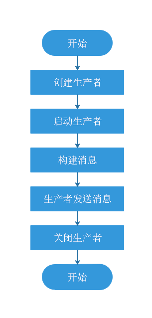
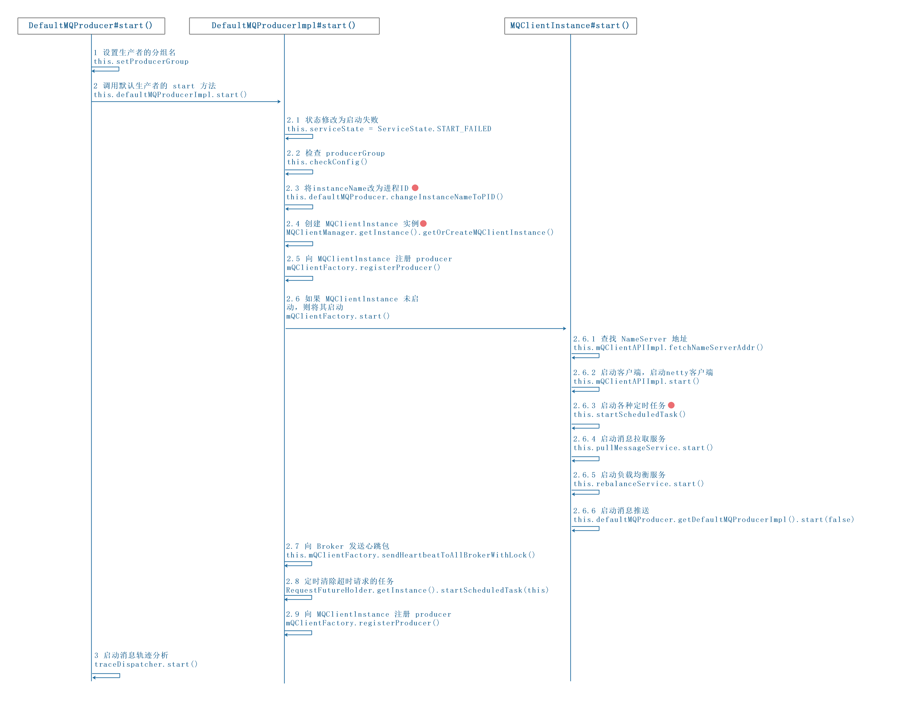

RocketMQ版本 v4.9.3。

# 1 引言

我们先从官网的发送消息的实例代码分析，来从整体查看 Producer 的消息发送：

```java
public class Producer {

    public static void main(String[] args) throws MQClientException {

        //1 创建指定分组名的生产者
        DefaultMQProducer producer = new DefaultMQProducer("ProducerGroupName");
        //可以对 producer 进行配置
        //producer.setNamesrvAddr("localhost:9876");

        //2 启动生产者
        producer.start();

        for (int i = 0; i < 128; i++) {
            try {

                //3 构建消息
                Message msg = new Message("TopicTest",
                            "TagA",
                            "OrderID188",
                            "Hello world".getBytes(RemotingHelper.DEFAULT_CHARSET));

                //4 同步发送
                SendResult sendResult = producer.send(msg);

                //5 打印发送结果
                System.out.printf("%s%n", sendResult);
            } catch (Exception e) {
                e.printStackTrace();
            }
        }
                            
        //6 关闭生产者
        producer.shutdown();
    }
}
```



# 2 概述

## 2.1 消息入参 Message 类

RocketMQ 消息封装类是 `org.apache.rocketmq.common.message.Message`:

```java
public class Message implements Serializable {
    private static final long serialVersionUID = 8445773977080406428L;

    //主题 topic 
    private String topic;

    //消息 Flag(RocketMQ 不做处理）
    private int flag;

    //扩展属性，主要包含下面几个：
    //tag：消息TAG，用于消息过滤。
    //keys: Message索引键，多个用空格隔开，RocketMQ可根据key快速检索消息。如订单号为key，快速找到同一订单的消息
    //waitStoreMsgOK：消息发送时是否等消息存储完成后再返回。
    //delayTimeLevel：消息延迟级别，用于定时消息或消息重试。
    private Map<String, String> properties;

    //消息体
    private byte[] body;
    
    //事务id
    private String transactionId;
}
```

## 2.2 消息发送方式

RocketMQ支持3种消息发送方式：单向（oneway）、同步（sync ）、异步（async）。

### 2.2.1 单向（oneway）

定义：发送者发送消息后，直接返回，不等待消息服务器的结果，也不注册回调函数，简单地说，就是只管发，不在乎消息是否成功存储在消息服务器上。

使用场景：用于发送一些不太重要的消息，例如操作日志，偶然出现消息丢失对业务无影响。

### 2.2.2 同步（sync ）

定义：发送者发送消息时，同步等待，直到消息服务器返回发送结果。

使用场景：对不特别追求消息发送速度，但消息可靠性要求高的场景。

### 2.2.3 异步（async）

定义：发送者先指定回调函数，发送完消息后，立即返回，消息发送者线程不阻塞，直到运行结束，消息发送成功或失败的回调任务在一个新的线程中执行。

实现原理：

（1）每一个消息发送者实例（DefaultMQProducer）内部会创建一个异步消息发送线程池，默认线程数量为 CPU 核数，线程池内部持有一个有界队列，默认长度为 5W，并且会控制异步调用的最大并发度，默认为 65536，其可以通过参数 clientAsyncSemaphoreValue 来配置。

（2）客户端使线程池将消息发送到服务端，服务端处理完成后，返回结构并根据是否发生异常调用 SendCallback 回调函数。

使用场景：对消息发送速度要求快，消息可靠性要求低的场景。

## 2.3 消息出参 SendResult 类

RocketMQ 消息发送的返回结果有如下几种：

（1）默认返回结果 SendResult 类，`org.apache.rocketmq.client.producer.SendResult`。

（2）事务消息发送返回结果 TransactionSendResult 类，继承了 SendResult，`org.apache.rocketmq.client.producer.TransactionSendResult`。

```java
public class SendResult {

    //发送状态
    private SendStatus sendStatus;

    //该 ID 是消息发送者在消息发送时会首先在客户端生成，全局唯一。org.apache.rocketmq.common.message.MessageClientIDSetter#createUniqID
    //组成如下：
    //客户端发送 IP，支持 IPV4 和 IPV6
    //进程 PID
    // MessageClientIDSetter 类加载器的 hashcode
    //当前系统时间戳与启动时间戳的差值
    //自增序列
    private String msgId;

    //消息队列
    private MessageQueue messageQueue;

    //队列偏移量
    private long queueOffset;

    //追踪ID
    private String transactionId;

    //消息所在 Broker 的物理偏移量，即在 commitlog 文件中的偏移量，其组成如下:
    //Broker 的 IP 与端口号
    //commitlog 中的物理偏移量
    private String offsetMsgId;

    //区域id
    private String regionId;

    //标识是否可追踪
    private boolean traceOn = true;
}
```

# 3 生产者的启动

消息生产者的代码在 client 模块中，相对于 RocketMQ 来说，它就是客户端，在应用系统中初始化生产者的一个实例即可使用它来发消息。

RocketMQ 有如下几种生产者：

(1)默认生产者 DefaultMQProducer，`org.apache.rocketmq.client.producer.DefaultMQProducer`。

(2)事务消息生产者 TransactionMQProducer，`org.apache.rocketmq.client.producer.TransactionMQProducer`，其继承了 DefaultMQProducer 。

DefaultMQProducer 是默认的生产者实现类，负责消息的发送，其实现MQProducer(继承了MQAdmin接口)接口:


## 3.1  DefaultMQProducer 默认消息生产者

### 3.1.1 DefaultMQProducer 类

`org.apache.rocketmq.client.producer.DefaultMQProducer`

```java
public class DefaultMQProducer extends ClientConfig implements MQProducer {

    //生产者内部默认实现类
    protected final transient DefaultMQProducerImpl defaultMQProducerImpl;

    private final InternalLogger log = ClientLogger.getLog();

    //返回码
    private final Set<Integer> retryResponseCodes = new CopyOnWriteArraySet<Integer>(Arrays.asList(
            ResponseCode.TOPIC_NOT_EXIST,
            ResponseCode.SERVICE_NOT_AVAILABLE,
            ResponseCode.SYSTEM_ERROR,
            ResponseCode.NO_PERMISSION,
            ResponseCode.NO_BUYER_ID,
            ResponseCode.NOT_IN_CURRENT_UNIT
    ));

    //生产者组，聚合了完全相同角色的所有生产者实例
    //对于非事务性消息，只要它在每个进程中是唯一的就没关系
    private String producerGroup;

    //默认 topicKey
    private String createTopicKey = TopicValidator.AUTO_CREATE_TOPIC_KEY_TOPIC;

    //主题在每一个 Broker 的默认队列数量
    private volatile int defaultTopicQueueNums = 4;

    //消息发送超时时间，默认 3s
    private int sendMsgTimeout = 3000;

    //消息体超过该值则启用压缩，默认 4K
    private int compressMsgBodyOverHowmuch = 1024 * 4;

    //同步方式发送消息重试次数，默认为2 ，总共执行 3 次
    //可能导致消息重复，需要开发人员自行解决。
    private int retryTimesWhenSendFailed = 2;

    //异步方式发送消息重试次数，默认为 2
    //可能会导致消息重复，需要开发人员自行解决。
    private int retryTimesWhenSendAsyncFailed = 2;

    //消息重试时选择另外一个Broker时，是否不等待存储结果就返回，默认为false
    private boolean retryAnotherBrokerWhenNotStoreOK = false;

    //允许发送的最大消息长度，默认为4M，该值最大为2^32-1
    private int maxMessageSize = 1024 * 1024 * 4;

    //异步传输数据的接口
    private TraceDispatcher traceDispatcher = null;
}
```

DefaultMQProducer 也是一个客户端，因此其继承了 ClientConfig 类，`org.apache.rocketmq.client.ClientConfig`。

```java
/**
 * 客户端公共配置
 * 客户端的配置都是 get、 set 形式，每个参数都可以用 spring来配置，也可以在代码中配置
 */
public class ClientConfig {

    public static final String SEND_MESSAGE_WITH_VIP_CHANNEL_PROPERTY = "com.rocketmq.sendMessageWithVIPChannel";

    //NameServer 地址列表，多个地址用分号隔开
    private String namesrvAddr = NameServerAddressUtils.getNameServerAddresses();

    //客户端本机 ip
    //某些机器会发生无法识别客户端IP地址的情况，需要在代码中强行指定
    private String clientIP = RemotingUtil.getLocalAddress();

    //客户端实例名称，客户端创建的多个 Producer、Consumer 实际上是共用一个内部实例
    private String instanceName = System.getProperty("rocketmq.client.name", "DEFAULT");

    //通信层异步回调线程数
    private int clientCallbackExecutorThreads = Runtime.getRuntime().availableProcessors();

    //命名空间
    // RocketMQ 4.5.1 之后，为消息发送者、消息消费者编入到一个命名空间中，方便支持多环境、多标签、全链路压测场景。
    protected String namespace;

    //
    private boolean namespaceInitialized = false;

    //
    protected AccessChannel accessChannel = AccessChannel.LOCAL;

    /**
     * 轮询 NameServer 间隔时间，ms
     */
    private int pollNameServerInterval = 1000 * 30;

    /**
     * 向 Broker 发送心跳间隔时间，ms
     */
    private int heartbeatBrokerInterval = 1000 * 30;

    /**
     * 持久化 Consumer 消费进度间隔时间，ms
     */
    private int persistConsumerOffsetInterval = 1000 * 5;

    private long pullTimeDelayMillsWhenException = 1000;

    private boolean unitMode = false;

    private String unitName;

    //开启vip通道
    private boolean vipChannelEnabled = Boolean.parseBoolean(System.getProperty(SEND_MESSAGE_WITH_VIP_CHANNEL_PROPERTY, "false"));

    private boolean useTLS = TlsSystemConfig.tlsEnable;

    private int mqClientApiTimeout = 3 * 1000;

    private LanguageCode language = LanguageCode.JAVA;
}
```

### 3.1.2 核心方法

MQProducer 接口：消息发送者接口。

|\<interface\> MQProducer|备注|
|--------------|----|
|List fetchPublishMessageQueues{final String topic)|根据 Topic 查找该主题下所有的消息队列|
|SendResult send{Message msg)|同步发送消息，具体发送到主题中的哪个消息队列由负载算法决定|
|void send(final Message msg, final MessageQueue mq, final SendCallback
sendCallback)|异步方式发送消息，发送到指定消息队列|
|void sendOneway(final Message msg, final MessageQueue mq)|单向消息发送，就是不在乎发送结果，消息发送出去后该方法立即返回|
|Message request(Message msg, long timeout)|request-response 请求模型，就消息发送者发送到 Broker，需要等消费者处理完才返回|
|void start()|启动发送者，在进行消息发送之前必须先调用该方法|
|void shutdown()|关闭发送者，如果不需要再使用该生产者，需要调用该方法释放资源|

MQAdmin 接口：MQ 基本的管理接口，提供对 MQ 提供基础的管理能力。

|\<interface\> MQAdmin|备注|
|--------------|----|
|void createTopic(String key, String newTopic, int queueNum)|创建主题|
|long searchOffset(final MessageQueue mq, final long timestamp)|根据时间戳从队列中查找其偏移量|
|long maxOffset(final MessageQueue mq)|查找该消息队列中最大的物理偏移量|
|long minOffset(final MessageQueue mq)|查找该消息队列中最小物理偏移量|
|long earliestMsgStoreTime(final MessageQueue mq)|获取消息存储的最早时间|
|MessageExt viewMessage(final String offsetMsgld)|根据消息偏移量查找消息|
|MessageExt viewMessage(String topic, String msgld)|根据主题与消息 ID 查找消息|
|QueryResult queryMessage(String topic, String key, int maxNum, Iong begin, long end)|根据条件批量查询消息|

### 3.1.3 启动生产者

DefaultMQProducer 的 start 方法。

```java
public void start() throws MQClientException {

    //设置生产者的分组名 producerGroup，
    this.setProducerGroup(withNamespace(this.producerGroup));

    //调用生产者默认实现的 start 方法
    this.defaultMQProducerImpl.start();

    //如果消息轨迹相关的消息分发类不是null，说明需要启动消息轨迹分析
    if (null != traceDispatcher) {
        try {
            traceDispatcher.start(this.getNamesrvAddr(), this.getAccessChannel());
        } catch (MQClientException e) {
            log.warn("trace dispatcher start failed ", e);
        }
    }
}
```

## 3.2 启动流程



### 3.2.1 DefaultMQProducerlmpl 的 start 方法

我们可以从 DefaultMQProducerlmpl 的 start 方法来查看，消息生产者是如何启动的。

`org.apache.rocketmq.client.impl.producer.DefaultMQProducerImpl#start(boolean)`。

```java
public void start(final boolean startFactory) throws MQClientException {
    switch (this.serviceState) {
        case CREATE_JUST:

            //Step 1:
            //状态修改为启动失败，避免多次启动
            this.serviceState = ServiceState.START_FAILED;

            //检查 producerGroup 是否合法
            this.checkConfig();

            //将生产者的 instanceName 改为进程 ID
            if (!this.defaultMQProducer.getProducerGroup().equals(MixAll.CLIENT_INNER_PRODUCER_GROUP)) {
                this.defaultMQProducer.changeInstanceNameToPID();
            }

            //Step 2:
            //通过 MQClientManager 创建 MQClientlnstance 客户端实例
            this.mQClientFactory = MQClientManager.getInstance().getOrCreateMQClientInstance(this.defaultMQProducer, rpcHook);

            //Step 3:
            //向 MQClientlnstance 注册，将当前生产者加入到 MQClientlnstance 管理 中，方便后续调用网络请求、进行心跳检测等
            boolean registerOK = mQClientFactory.registerProducer(this.defaultMQProducer.getProducerGroup(), this);
            if (!registerOK) {
                this.serviceState = ServiceState.CREATE_JUST;
                throw new MQClientException("The producer group[" + this.defaultMQProducer.getProducerGroup()
                        + "] has been created before, specify another name please." + FAQUrl.suggestTodo(FAQUrl.GROUP_NAME_DUPLICATE_URL),
                        null);
            }

            //保存 topic 路由信息
            this.topicPublishInfoTable.put(this.defaultMQProducer.getCreateTopicKey(), new TopicPublishInfo());

            //Step 4:
            //启动 MQClientlnstance，如果 MQClientlnstance 已经启动 ，则本次启动不会真正执行。
            if (startFactory) {
                mQClientFactory.start();
            }

            log.info("the producer [{}] start OK. sendMessageWithVIPChannel={}", this.defaultMQProducer.getProducerGroup(),
                    this.defaultMQProducer.isSendMessageWithVIPChannel());
            this.serviceState = ServiceState.RUNNING;
            break;
        case RUNNING:
        case START_FAILED:
        case SHUTDOWN_ALREADY:
            throw new MQClientException("The producer service state not OK, maybe started once, "
                    + this.serviceState
                    + FAQUrl.suggestTodo(FAQUrl.CLIENT_SERVICE_NOT_OK),
                    null);
        default:
            break;
    }

    //向 Broker 发送心跳包
    this.mQClientFactory.sendHeartbeatToAllBrokerWithLock();

    //定时清除超时请求的任务
    RequestFutureHolder.getInstance().startScheduledTask(this);

}
```

### 3.2.2 MQClientManager 类

MQClientManager 是个单例类，采用饿汉模式创建。其用来提供 MQClientInstance 实例，并且根据 clientId 复用 MQClientInstance 实例。

```java
public class MQClientManager {

    private final static InternalLogger log = ClientLogger.getLog();

    //静态实例
    private static MQClientManager instance = new MQClientManager();
    private AtomicInteger factoryIndexGenerator = new AtomicInteger();

    //存储 MQClientInstance 示例
    private ConcurrentMap<String/* clientId */, MQClientInstance> factoryTable =
            new ConcurrentHashMap<String, MQClientInstance>();

    public MQClientInstance getOrCreateMQClientInstance(final ClientConfig clientConfig) {
        return getOrCreateMQClientInstance(clientConfig, null);
    }


    //整个 JVM 实例中只存在一个 MQClientManager 实例，
    //缓存表 ConcurrentMap<String /＊ Clientld */，MQClientinstance＞ factoryTable，同一个 clientld 只会创建一个 MQClientinstance。
    public MQClientInstance getOrCreateMQClientInstance(final ClientConfig clientConfig, RPCHook rpcHook) {
        String clientId = clientConfig.buildMQClientId();

        //获取缓存表中的缓存
        MQClientInstance instance = this.factoryTable.get(clientId);

        if (null == instance) {

            //创建客户端实例
            instance =
                    new MQClientInstance(clientConfig.cloneClientConfig(),
                            this.factoryIndexGenerator.getAndIncrement(), clientId, rpcHook);

            //保存到缓存
            MQClientInstance prev = this.factoryTable.putIfAbsent(clientId, instance);
            if (prev != null) {
                instance = prev;
                log.warn("Returned Previous MQClientInstance for clientId:[{}]", clientId);
            } else {
                log.info("Created new MQClientInstance for clientId:[{}]", clientId);
            }
        }

        return instance;
    }

}
```

### 3.2.3 MQClientInstance 类

`org.apache.rocketmq.client.impl.factory.MQClientInstance`。

MQClientInstance 客户端实例，网络通信的工具类， Producer（DefaultMQProducerImpl） 、Consumer（DefaultMQPushConsumerImpl）、 Admin控制台（DefaultMQAdminExtImpl） 里都含有这个类。类内部封装了 netty 客户端，消息的生产，消费和负载均衡的实现类等

 MQClientInstance 实现的是底层通信功能和获取并保存元数据的功能，没必要每个 Consumer 或 Producer 都创建一个对象，一个 MQClientInstance 对象可以被多个 Consumer 或 Producer 公用。RocketMQ 通过一个工厂类达到共用 MQClientInstance 的目的。

作用：

（1）与 NameServer 通信进行心跳维持、根据 Topic 获取 Broker 地址。

（2）与 Broker 通信进行收发消息、ReBalance。

```java
public class MQClientInstance {

    private final static long LOCK_TIMEOUT_MILLIS = 3000;
    private final InternalLogger log = ClientLogger.getLog();

    //客户端的通用配置：topic 拉取周期时间，心跳周期时间等
    private final ClientConfig clientConfig;

    private final int instanceIndex;
    private final String clientId;
    private final long bootTimestamp = System.currentTimeMillis();

    //用来缓存 Group 和生产者的对应关系
    private final ConcurrentMap<String/* group */, MQProducerInner> producerTable = new ConcurrentHashMap<String, MQProducerInner>();

    //用来缓存 Group 和消费者的对应关系
    private final ConcurrentMap<String/* group */, MQConsumerInner> consumerTable = new ConcurrentHashMap<String, MQConsumerInner>();

    //用来缓存 Group 和管理员的对应关系
    private final ConcurrentMap<String/* group */, MQAdminExtInner> adminExtTable = new ConcurrentHashMap<String, MQAdminExtInner>();

    //Netty 客户端的配置
    private final NettyClientConfig nettyClientConfig;

    //MQ 内部一些操作的 api 的实现，包括发送，消费消息和admin控制台的一些操作指令的实现，以及一些网络请求的处理
    private final MQClientAPIImpl mQClientAPIImpl;

    //MQ 的 admin 控制台操作的内部逻辑的实现类，控制台可以通过一些命令来对消息或者 topic 进行操作
    private final MQAdminImpl mQAdminImpl;

    //对 Topic 路由配置信息
    private final ConcurrentMap<String/* Topic */, TopicRouteData> topicRouteTable = new ConcurrentHashMap<String, TopicRouteData>();

    //加锁，NameServer 上的注册表
    // updateTopicRouteInfoFromNameServer(java.lang.String, boolean, org.apache.rocketmq.client.producer.DefaultMQProducer)
    private final Lock lockNamesrv = new ReentrantLock();

    //加锁，心跳检测机制
    //sendHeartbeatToAllBrokerWithLock()
    private final Lock lockHeartbeat = new ReentrantLock();

    //对于集群中的 Broker 地址进行缓存
    private final ConcurrentMap<String/* Broker Name */, HashMap<Long/* brokerId */, String/* address */>> brokerAddrTable =
            new ConcurrentHashMap<String, HashMap<Long, String>>();

    //对于集群中 Broker 的版本信息进行缓存
    private final ConcurrentMap<String/* Broker Name */, HashMap<String/* address */, Integer>> brokerVersionTable =
            new ConcurrentHashMap<String, HashMap<String, Integer>>();

    private final ScheduledExecutorService scheduledExecutorService = Executors.newSingleThreadScheduledExecutor(new ThreadFactory() {
        @Override
        public Thread newThread(Runnable r) {
            return new Thread(r, "MQClientFactoryScheduledThread");
        }
    });
    private final ClientRemotingProcessor clientRemotingProcessor;

    //push模式下，拉取消息的线程
    private final PullMessageService pullMessageService;

    //消息消费的负载均衡类
    private final RebalanceService rebalanceService;

    //消息生产者类
    private final DefaultMQProducer defaultMQProducer;

    private final ConsumerStatsManager consumerStatsManager;
    private final AtomicLong sendHeartbeatTimesTotal = new AtomicLong(0);
    private ServiceState serviceState = ServiceState.CREATE_JUST;
    private Random random = new Random();
}
```

start 方法了解该类的功能：该类首先从 NameServer 获取并保存各种配置信息，比如 Topic 的 Route 信息。同时 MQClientInstance 还会通过 MQClientAPIImpl 类实现消息的收发，也就是从 Broker 获取消息或者发送消息到Broker。

```java
public void start() throws MQClientException {

    synchronized (this) {
        switch (this.serviceState) {
            //刚创建
            case CREATE_JUST:
                this.serviceState = ServiceState.START_FAILED;

                //step1：如果未指定 NameServer 地址，则从名称服务器查找地址
                if (null == this.clientConfig.getNamesrvAddr()) {
                    this.mQClientAPIImpl.fetchNameServerAddr();
                }

                //step2：启动客户端，启动netty客户端
                // NettyRemotingClient的 start() 方法，这个方法中先是创建了 Netty 客户端，然后调用了两个定时执行的任务
                // 两个任务一个是删除过期的请求，一个是将没有连接响应的 NameServer 断开连接
                this.mQClientAPIImpl.start();

                //step3：启动各种定时任务
                // 2分钟更新一次nameServer的地址
                // 30秒更新一次topic的路由信息
                // 30秒对Broker发送一次心跳检测，并将下线的broker删除
                // 5秒持久化一次consumer的offset
                // 1分钟调整一次线程池，这个定时任务其实什么都没有执行。
                this.startScheduledTask();

                //step4：启动消息拉取服务
                // 调用 PullMessageService 的 run()方法，里面主要是调用了 DefaultMQPushConsumerImpl.pullMessage 方法
                this.pullMessageService.start();

                //step5：启动负载均衡服务
                this.rebalanceService.start();

                // step6：启动消息推送
                this.defaultMQProducer.getDefaultMQProducerImpl().start(false);

                log.info("the client factory [{}] start OK", this.clientId);
                this.serviceState = ServiceState.RUNNING;
                break;
            case START_FAILED:
                throw new MQClientException("The Factory object[" + this.getClientId() + "] has been created before, and failed.", null);
            default:
                break;
        }
    }
}
```

# 4 消息发送

主要的步骤：验证消息、查找路由、消息发送（包含异常处理机制）。

默认消息发送以同步方式发送，默认超时时间为3s。

```java
public SendResult send(Message msg) throws MQClientException, RemotingException, MQBrokerException, InterruptedException {
    //`org.apache.rocketmq.client.producer.DefaultMQProducer#sendMsgTimeout`
    return send(msg, this.defaultMQProducer.getSendMsgTimeout());
}

public SendResult send(Message msg, long timeout) throws MQClientException, RemotingException, MQBrokerException, InterruptedException {
    return this.sendDefaultImpl(msg, CommunicationMode.SYNC, null, timeout);
}

private SendResult sendDefaultImpl(
            Message msg,
            final CommunicationMode communicationMode,
            final SendCallback sendCallback,
            final long timeout
    ) throws MQClientException, RemotingException, MQBrokerException, InterruptedException {
        
    //1 验证生产者处于运行状态
    this.makeSureStateOK();

    //2 验证消息是否符合相应的规范，会验证消息的最大长度，`org.apache.rocketmq.client.producer.DefaultMQProducer#maxMessageSize`
    Validators.checkMessage(msg, this.defaultMQProducer);

    final long invokeID = random.nextLong();
    long beginTimestampFirst = System.currentTimeMillis();
    long beginTimestampPrev = beginTimestampFirst;
    long endTimestamp = beginTimestampFirst;

    //3 查找主题发布信息
    TopicPublishInfo topicPublishInfo = this.tryToFindTopicPublishInfo(msg.getTopic());

    //4 消息发送
    if (topicPublishInfo != null && topicPublishInfo.ok()) {
        boolean callTimeout = false;
        MessageQueue mq = null;
        Exception exception = null;
        SendResult sendResult = null;

        //4.1 同步方式重试次数，`org.apache.rocketmq.client.producer.DefaultMQProducer.retryTimesWhenSendFailed`
        int timesTotal = communicationMode == CommunicationMode.SYNC ? 1 + this.defaultMQProducer.getRetryTimesWhenSendFailed() : 1;
        int times = 0;
        String[] brokersSent = new String[timesTotal];

        for (; times < timesTotal; times++) {

            //4.2 上一次选择的执行发送消息失败的 Broker
            String lastBrokerName = null == mq ? null : mq.getBrokerName();
            //选择消息队列进行发送
            MessageQueue mqSelected = this.selectOneMessageQueue(topicPublishInfo, lastBrokerName);
            if (mqSelected != null) {
                mq = mqSelected;
                brokersSent[times] = mq.getBrokerName();
                try {
                    beginTimestampPrev = System.currentTimeMillis();
                    if (times > 0) {
                        //Reset topic with namespace during resend.
                        msg.setTopic(this.defaultMQProducer.withNamespace(msg.getTopic()));
                    }
                    long costTime = beginTimestampPrev - beginTimestampFirst;                        if (timeout < costTime) {
                        callTimeout = true;
                        break;
                    }

                    //4.3 内核消息发送
                    sendResult = this.sendKernelImpl(msg, mq, communicationMode, sendCallback, topicPublishInfo, timeout - costTime);

                    endTimestamp = System.currentTimeMillis();

                    //4.4 更新 mq.getBrokerName() 的规避时长
                    this.updateFaultItem(mq.getBrokerName(), endTimestamp - beginTimestampPrev, false);

                    //4.5 根据消息发送模式，进行消息发送后处理
                    switch (communicationMode) {
                        //异步消息，返回null
                        case ASYNC:
                            return null;
                        //单向消息，不关心结果，返回null
                        case ONEWAY:
                            return null;
                        //同步消息
                        case SYNC:
                            //消息发送不成功，继续循环重试
                            if (sendResult.getSendStatus() != SendStatus.SEND_OK) {
                                //`org.apache.rocketmq.client.producer.DefaultMQProducer.retryAnotherBrokerWhenNotStoreOK`
                                if (this.defaultMQProducer.isRetryAnotherBrokerWhenNotStoreOK()) {
                                    continue;
                                }
                            }

                            return sendResult;
                        default:
                            break;
                    }

                    //4.6 异常处理。如果发送过程中抛出了异常，调用 DefaultMQProducerlmpl#updateFaultItem，更新错误项规避时长
                } catch (RemotingException e) {
                    endTimestamp = System.currentTimeMillis();
                    this.updateFaultItem(mq.getBrokerName(), endTimestamp - beginTimestampPrev, true);
                    log.warn(String.format("sendKernelImpl exception, resend at once, InvokeID: %s, RT: %sms, Broker: %s", invokeID, endTimestamp - beginTimestampPrev, mq), e);
                    log.warn(msg.toString());
                    exception = e;
                    continue;
                } catch (MQClientException e) {
                    endTimestamp = System.currentTimeMillis();
                    this.updateFaultItem(mq.getBrokerName(), endTimestamp - beginTimestampPrev, true);
                    log.warn(String.format("sendKernelImpl exception, resend at once, InvokeID: %s, RT: %sms, Broker: %s", invokeID, endTimestamp - beginTimestampPrev, mq), e);
                    log.warn(msg.toString());
                    exception = e;
                    continue;
                } catch (MQBrokerException e) {
                    endTimestamp = System.currentTimeMillis();
                    this.updateFaultItem(mq.getBrokerName(), endTimestamp - beginTimestampPrev, true);
                    log.warn(String.format("sendKernelImpl exception, resend at once, InvokeID: %s, RT: %sms, Broker: %s", invokeID, endTimestamp - beginTimestampPrev, mq), e);
                    log.warn(msg.toString());
                    exception = e;
                    if (this.defaultMQProducer.getRetryResponseCodes().contains(e.getResponseCode())) {
                        continue;
                    } else {
                        if (sendResult != null) {
                            return sendResult;
                        }

                        throw e;
                    }
                } catch (InterruptedException e) {
                    endTimestamp = System.currentTimeMillis();
                    this.updateFaultItem(mq.getBrokerName(), endTimestamp - beginTimestampPrev, false);
                    log.warn(String.format("sendKernelImpl exception, throw exception, InvokeID: %s, RT: %sms, Broker: %s", invokeID, endTimestamp - beginTimestampPrev, mq), e);
                    log.warn(msg.toString());

                    log.warn("sendKernelImpl exception", e);
                    log.warn(msg.toString());
                    throw e;
                }
            } else {
                break;
            }
        }

        if (sendResult != null) {
            return sendResult;
        }

        String info = String.format("Send [%d] times, still failed, cost [%d]ms, Topic: %s, BrokersSent: %s",
                times,
                System.currentTimeMillis() - beginTimestampFirst,
                msg.getTopic(),
                Arrays.toString(brokersSent));

        info += FAQUrl.suggestTodo(FAQUrl.SEND_MSG_FAILED);

        MQClientException mqClientException = new MQClientException(info, exception);
        if (callTimeout) {
            throw new RemotingTooMuchRequestException("sendDefaultImpl call timeout");
        }

        if (exception instanceof MQBrokerException) {
            mqClientException.setResponseCode(((MQBrokerException) exception).getResponseCode());
        } else if (exception instanceof RemotingConnectException) {
            mqClientException.setResponseCode(ClientErrorCode.CONNECT_BROKER_EXCEPTION);
        } else if (exception instanceof RemotingTimeoutException) {
            mqClientException.setResponseCode(ClientErrorCode.ACCESS_BROKER_TIMEOUT);
        } else if (exception instanceof MQClientException) {
            mqClientException.setResponseCode(ClientErrorCode.BROKER_NOT_EXIST_EXCEPTION);
        }

        throw mqClientException;
    }

    //5 没找到主题发布信息，则校验 NameServer 是否为空
    validateNameServerSetting();

    throw new MQClientException("No route info of this topic: " + msg.getTopic() + FAQUrl.suggestTodo(FAQUrl.NO_TOPIC_ROUTE_INFO),null).setResponseCode(ClientErrorCode.NOT_FOUND_TOPIC_EXCEPTION);
}
```

## 4.1 主题的发布信息

主题的发布信息存放在 TopicPublishInfo 类中，其中 TopicRouteData 存放了主题的路由信息。

```java
//Topic 发布信息
//`org.apache.rocketmq.client.impl.producer.TopicPublishInfo`
public class TopicPublishInfo {

    //是否是顺序消息
    private boolean orderTopic = false;

    //topicPublishInfo 是否存着对应的 topicRouteData 信息
    private boolean haveTopicRouterInfo = false;

    //该主题队列的消息队列
    private List<MessageQueue> messageQueueList = new ArrayList<MessageQueue>();

    //每选择一次消息队列， 该值会自增 1 ，如果 Integer.MAX_VALUE, 则重置为 0，用于选择消息队列
    private volatile ThreadLocalIndex sendWhichQueue = new ThreadLocalIndex();

    //Topic分装信息
    private TopicRouteData topicRouteData;
}

//Topic 路由信息
//`org.apache.rocketmq.common.protocol.route.TopicRouteData`
public class TopicRouteData extends RemotingSerializable {

    /**
     * topic排序的配置
     * 和"ORDER_TOPIC_CONFIG"这个NameSpace有关
     * 参照DefaultRequestProcessor#getRouteInfoByTopic
     */
    private String orderTopicConf;

    /**
     * topic 队列元数据
     * 可参照 RouteInfoManager.topicQueueTable
     */
    private List<QueueData> queueDatas;

    /**
     * topic 分布的 broker 元数据
     * 可以根据queueDatas得到，参照RouteInfoManager#pickupTopicRouteData
     */
    private List<BrokerData> brokerDatas;

    //broker 上过滤服务器地址列表
    private HashMap<String/* brokerAddr */, List<String>/* Filter Server */> filterServerTable;
}
```

生产者通过 tryToFindTopicPublishInfo() 函数去查找 topic 对应的发布信息:

`org.apache.rocketmq.client.impl.producer.DefaultMQProducerImpl#tryToFindTopicPublishInfo`

```java
private TopicPublishInfo tryToFindTopicPublishInfo(final String topic) {

    //从缓存Map中取发布信息
    TopicPublishInfo topicPublishInfo = this.topicPublishInfoTable.get(topic);

    //如果生产者中没有缓存 topic 的发布信息
    if (null == topicPublishInfo || !topicPublishInfo.ok()) {
        this.topicPublishInfoTable.putIfAbsent(topic, new TopicPublishInfo());
        //从 NameServer 查询该 topic 的发布信息
        this.mQClientFactory.updateTopicRouteInfoFromNameServer(topic);
        topicPublishInfo = this.topicPublishInfoTable.get(topic);
    }

    //如果该发布信息中包含了 topic 路由信息，则直接返回该发布信息
    if (topicPublishInfo.isHaveTopicRouterInfo() || topicPublishInfo.ok()) {
        return topicPublishInfo;
    } else {
        this.mQClientFactory.updateTopicRouteInfoFromNameServer(topic, true, this.defaultMQProducer);
        topicPublishInfo = this.topicPublishInfoTable.get(topic);
        return topicPublishInfo;
    }
}
```

如果没有找到，则从 NameServer 更新主题发布信息：

`org.apache.rocketmq.client.impl.factory.MQClientInstance#updateTopicRouteInfoFromNameServer(java.lang.String, boolean, org.apache.rocketmq.client.producer.DefaultMQProducer)`

```java
public boolean updateTopicRouteInfoFromNameServer(final String topic, boolean isDefault,
                                                      DefaultMQProducer defaultMQProducer) {

        //获取Topic信息的时，可能有多线程对当前信息进行读写，因此加锁
        try {
            if (this.lockNamesrv.tryLock(LOCK_TIMEOUT_MILLIS, TimeUnit.MILLISECONDS)) {
                try {
                    TopicRouteData topicRouteData;
                    //如果 isDefault 为 true，则使用默认主题去查询
                    if (isDefault && defaultMQProducer != null) {
                        //通过 NettyRemotingClient 去查询
                        topicRouteData = this.mQClientAPIImpl.getDefaultTopicRouteInfoFromNameServer(defaultMQProducer.getCreateTopicKey(),
                                clientConfig.getMqClientApiTimeout());

                        //如果查询到路由信息，则将路由信息中读写队列个数设置为 min(消息生产者默认的队列个数, data.getReadQueueNums())
                        if (topicRouteData != null) {
                            for (QueueData data : topicRouteData.getQueueDatas()) {
                                int queueNums = Math.min(defaultMQProducer.getDefaultTopicQueueNums(), data.getReadQueueNums());
                                data.setReadQueueNums(queueNums);
                                data.setWriteQueueNums(queueNums);
                            }
                        }

                    //如果 isDefault 为 false，则使用参数 topic 去查询
                    } else {
                        //通过 NettyRemotingClient 去查询
                        topicRouteData = this.mQClientAPIImpl.getTopicRouteInfoFromNameServer(topic, clientConfig.getMqClientApiTimeout());
                    }

                    //如果路由信息找到
                    if (topicRouteData != null) {
                        //本地缓存中的路由信息
                        TopicRouteData old = this.topicRouteTable.get(topic);
                        //判断路由信息是否发生了改变
                        boolean changed = topicRouteDataIsChange(old, topicRouteData);
                        if (!changed) {
                            changed = this.isNeedUpdateTopicRouteInfo(topic);
                        } else {
                            log.info("the topic[{}] route info changed, old[{}] ,new[{}]", topic, old, topicRouteData);
                        }

                        if (changed) {

                            //深拷贝一份
                            TopicRouteData cloneTopicRouteData = topicRouteData.cloneTopicRouteData();

                            //更新 brokerDatas
                            for (BrokerData bd : topicRouteData.getBrokerDatas()) {
                                this.brokerAddrTable.put(bd.getBrokerName(), bd.getBrokerAddrs());
                            }

                            // Update publishInfo，更新生产者的发布信息
                            if (!producerTable.isEmpty()) {
                                //根据 topicRouteData 中的 List<QueueData> 转换成 TopicPublishInfo 的 List<MessageQueue> 列表
                                TopicPublishInfo publishInfo = topicRouteData2TopicPublishInfo(topic, topicRouteData);
                                publishInfo.setHaveTopicRouterInfo(true);
                                Iterator<Entry<String, MQProducerInner>> it = this.producerTable.entrySet().iterator();
                                while (it.hasNext()) {
                                    Entry<String, MQProducerInner> entry = it.next();
                                    MQProducerInner impl = entry.getValue();
                                    if (impl != null) {
                                        //更新生产者 MQProducerInner 中该 topic 的路由信息
                                        impl.updateTopicPublishInfo(topic, publishInfo);
                                    }
                                }
                            }

                            // Update subscribeInfo，更新消费者的订阅信息
                            if (!consumerTable.isEmpty()) {
                                //创建 MessageQueue
                                Set<MessageQueue> subscribeInfo = topicRouteData2TopicSubscribeInfo(topic, topicRouteData);
                                Iterator<Entry<String, MQConsumerInner>> it = this.consumerTable.entrySet().iterator();
                                while (it.hasNext()) {
                                    Entry<String, MQConsumerInner> entry = it.next();
                                    MQConsumerInner impl = entry.getValue();
                                    if (impl != null) {
                                        impl.updateTopicSubscribeInfo(topic, subscribeInfo);
                                    }
                                }
                            }
                            log.info("topicRouteTable.put. Topic = {}, TopicRouteData[{}]", topic, cloneTopicRouteData);
                            this.topicRouteTable.put(topic, cloneTopicRouteData);
                            return true;
                        }
                    } else {
                        log.warn("updateTopicRouteInfoFromNameServer, getTopicRouteInfoFromNameServer return null, Topic: {}. [{}]", topic, this.clientId);
                    }
                } catch (MQClientException e) {
                    if (!topic.startsWith(MixAll.RETRY_GROUP_TOPIC_PREFIX) && !topic.equals(TopicValidator.AUTO_CREATE_TOPIC_KEY_TOPIC)) {
                        log.warn("updateTopicRouteInfoFromNameServer Exception", e);
                    }
                } catch (RemotingException e) {
                    log.error("updateTopicRouteInfoFromNameServer Exception", e);
                    throw new IllegalStateException(e);
                } finally {
                    this.lockNamesrv.unlock();
                }
            } else {
                log.warn("updateTopicRouteInfoFromNameServer tryLock timeout {}ms. [{}]", LOCK_TIMEOUT_MILLIS, this.clientId);
            }
        } catch (InterruptedException e) {
            log.warn("updateTopicRouteInfoFromNameServer Exception", e);
        }

        return false;
}

//更新生产者的发布信息
//`org.apache.rocketmq.client.impl.factory.MQClientInstance#topicRouteData2TopicPublishInfo`
public static TopicPublishInfo topicRouteData2TopicPublishInfo(final String topic, final TopicRouteData route) {
    
    TopicPublishInfo info = new TopicPublishInfo();
    info.setTopicRouteData(route);

    //如果是顺序读写
    if (route.getOrderTopicConf() != null && route.getOrderTopicConf().length() > 0) {
        String[] brokers = route.getOrderTopicConf().split(";");
        for (String broker : brokers) {
            String[] item = broker.split(":");
            int nums = Integer.parseInt(item[1]);
            for (int i = 0; i < nums; i++) {
                MessageQueue mq = new MessageQueue(topic, item[0], i);
                info.getMessageQueueList().add(mq);
            }
        }

        info.setOrderTopic(true);

    //如果不是顺序读写
    } else {
        List<QueueData> qds = route.getQueueDatas();
        Collections.sort(qds);
        //遍历路由信息的 QueueData 信息
        for (QueueData qd : qds) {
            //如果队列有写权限
            if (PermName.isWriteable(qd.getPerm())) {
                BrokerData brokerData = null;
                //为每个 queueData 找到对应的 brokerData
                for (BrokerData bd : route.getBrokerDatas()) {
                    if (bd.getBrokerName().equals(qd.getBrokerName())) {
                        brokerData = bd;
                        break;
                    }
                }

                //queueData 的 broker 不能为 null
                if (null == brokerData) {
                    continue;
                }

                if (!brokerData.getBrokerAddrs().containsKey(MixAll.MASTER_ID)) {
                    continue;
                }

                //根据写队列个数，创建 MessageQueue
                for (int i = 0; i < qd.getWriteQueueNums(); i++) {
                    MessageQueue mq = new MessageQueue(topic, qd.getBrokerName(), i);
                    info.getMessageQueueList().add(mq);
                }
            }
        }

        info.setOrderTopic(false);
    }

    return info;
}

//更新消费者的订阅信息
//`org.apache.rocketmq.client.impl.factory.MQClientInstance#topicRouteData2TopicSubscribeInfo`
public static Set<MessageQueue> topicRouteData2TopicSubscribeInfo(final String topic, final TopicRouteData route) {
    Set<MessageQueue> mqList = new HashSet<MessageQueue>();
    List<QueueData> qds = route.getQueueDatas();
    //遍历路由信息中的 QueueData 信息
    for (QueueData qd : qds) {
        //如果队列有读权限
        if (PermName.isReadable(qd.getPerm())) {
            for (int i = 0; i < qd.getReadQueueNums(); i++) {
                MessageQueue mq = new MessageQueue(topic, qd.getBrokerName(), i);
                mqList.add(mq);
            }
        }
    }
    return mqList;
}
```

## 4.2 选择消息队列

消息发送前，需要选择消息队列。

`org.apache.rocketmq.client.impl.producer.DefaultMQProducerImpl#selectOneMessageQueue`

```java
public MessageQueue selectOneMessageQueue(final TopicPublishInfo tpInfo, final String lastBrokerName) {
        return this.mqFaultStrategy.selectOneMessageQueue(tpInfo, lastBrokerName);
}
```

进一步调用了 MQFaultStrategy#selectOneMessageQueue 方法，使用了 Broker 故障延迟机制：

`org.apache.rocketmq.client.latency.MQFaultStrategy#selectOneMessageQueue`

```java
public MessageQueue selectOneMessageQueue(final TopicPublishInfo tpInfo, final String lastBrokerName) {
    //启用 Broker 故障延迟机制, 算法在一次消息发送过程中能成功规避故障的 Broker
    //如果 Broker 宕机，由于路由算法中的消息队列是按 Broker 排序的。如果上一次根据路由算法选择的是宕机的 Broker的第一个队列 ，那么随后的下次选择的是宕机 Broker 的第二个队列，消息发送很有可能会失败，再次引发重试，带来不必要的性能损耗。
    if (this.sendLatencyFaultEnable) {
        try {
            int index = tpInfo.getSendWhichQueue().incrementAndGet();

            //根据对消息队列进行轮询获取一个消息队列
            for (int i = 0; i < tpInfo.getMessageQueueList().size(); i++) {
                int pos = Math.abs(index++) % tpInfo.getMessageQueueList().size();
                if (pos < 0)
                    pos = 0;
                MessageQueue mq = tpInfo.getMessageQueueList().get(pos);

                //该 messageQueue 是可用的，说明故障恢复了
                if (latencyFaultTolerance.isAvailable(mq.getBrokerName()))
                    return mq;
            }

            //此时，该 messageQueue 是不可用的
            //选择一个相对好的 broker，不考虑可用性的消息队列
            final String notBestBroker = latencyFaultTolerance.pickOneAtLeast();
            int writeQueueNums = tpInfo.getQueueIdByBroker(notBestBroker);
            if (writeQueueNums > 0) {
                final MessageQueue mq = tpInfo.selectOneMessageQueue();
                if (notBestBroker != null) {
                    mq.setBrokerName(notBestBroker);
                    mq.setQueueId(tpInfo.getSendWhichQueue().incrementAndGet() % writeQueueNums);
                }
                return mq;
            } else {
                //latencyFaultTolerance 移除 notBestBroker
                latencyFaultTolerance.remove(notBestBroker);
            }
        } catch (Exception e) {
            log.error("Error occurred when selecting message queue", e);
        }

        return tpInfo.selectOneMessageQueue();
    }

    //不启用 Broker 故障延迟机制
    return tpInfo.selectOneMessageQueue(lastBrokerName);
}
```

不启用 Broker 故障延迟机制，调用 TopicPublishInfo#selectOneMessageQueue 方法：

`org.apache.rocketmq.client.impl.producer.TopicPublishInfo#selectOneMessageQueue(java.lang.String)`

```java
public MessageQueue selectOneMessageQueue(final String lastBrokerName) {
    if (lastBrokerName == null) {
        return selectOneMessageQueue();
    } else {
        //根据lastBrokerName，找到上一次消息失败时，对应的 messageQueue
        for (int i = 0; i < this.messageQueueList.size(); i++) {
            //假如 broker 宕机，此时，index+1 可能为该 broker 上的第二个 messageQueue，则同样消息发送不出去
            int index = this.sendWhichQueue.incrementAndGet();
            int pos = Math.abs(index) % this.messageQueueList.size();
            if (pos < 0)
                pos = 0;
            MessageQueue mq = this.messageQueueList.get(pos);
            if (!mq.getBrokerName().equals(lastBrokerName)) {
                return mq;
            }
        }
        return selectOneMessageQueue();
    }
}

//第一次执行消息队列选择时，lastBrokerName 为 null，此时直接用 sendWhichQueue 自增再获取值
public MessageQueue selectOneMessageQueue() {
    int index = this.sendWhichQueue.incrementAndGet();
    int pos = Math.abs(index) % this.messageQueueList.size();
    if (pos < 0)
        pos = 0;
    return this.messageQueueList.get(pos);
}
```

## 4.3 内核消息发送

`org.apache.rocketmq.client.impl.producer.DefaultMQProducerImpl#sendKernelImpl`：

```java
private SendResult sendKernelImpl(final Message msg,
                                      final MessageQueue mq,
                                      final CommunicationMode communicationMode,
                                      final SendCallback sendCallback,
                                      final TopicPublishInfo topicPublishInfo,
                                      final long timeout) throws MQClientException, RemotingException, MQBrokerException, InterruptedException {

        long beginStartTime = System.currentTimeMillis();

        //1 根据 MessageQueue 获取 Broker 的网络地址
        String brokerAddr = this.mQClientFactory.findBrokerAddressInPublish(mq.getBrokerName());

        //如果 MQClientInstance 的brokerAddrTable 未缓存该 Broker 的信息，则从 NameServer 主动更新一下 topic 的路由信息
        if (null == brokerAddr) {
            tryToFindTopicPublishInfo(mq.getTopic());
            brokerAddr = this.mQClientFactory.findBrokerAddressInPublish(mq.getBrokerName());
        }

        SendMessageContext context = null;
        if (brokerAddr != null) {

            //是否开启vip通道
            brokerAddr = MixAll.brokerVIPChannel(this.defaultMQProducer.isSendMessageWithVIPChannel(), brokerAddr);

            //提前保存未被压缩的消息
            byte[] prevBody = msg.getBody();

            try {
                //for MessageBatch,ID has been set in the generating process
                //2 非批量消息，则为消息分配全局唯一 ID
                if (!(msg instanceof MessageBatch)) {
                    MessageClientIDSetter.setUniqID(msg);
                }

                //topic 具有命名空间
                boolean topicWithNamespace = false;
                if (null != this.mQClientFactory.getClientConfig().getNamespace()) {
                    msg.setInstanceId(this.mQClientFactory.getClientConfig().getNamespace());
                    topicWithNamespace = true;
                }

                int sysFlag = 0;
                boolean msgBodyCompressed = false;

                //如果消息体默认超过 4K,会对消息体采用 zip 压缩,并且设置消息的系统标记为 MessageSysFlag.COMPRESSED_FLAG
                //`org.apache.rocketmq.client.producer.DefaultMQProducer.compressMsgBodyOverHowmuch`
                if (this.tryToCompressMessage(msg)) {
                    sysFlag |= MessageSysFlag.COMPRESSED_FLAG;
                    msgBodyCompressed = true;
                }

                //如果是事务 Prepared 消息，则设置消息的系统标记为 MessageSysFlag.TRANSACTION_PREPARED_TYPE
                final String tranMsg = msg.getProperty(MessageConst.PROPERTY_TRANSACTION_PREPARED);
                if (Boolean.parseBoolean(tranMsg)) {
                    sysFlag |= MessageSysFlag.TRANSACTION_PREPARED_TYPE;
                }

                //3 如果注册了拒绝回调通知
                if (hasCheckForbiddenHook()) {
                    //创建钩子函数上下文
                    CheckForbiddenContext checkForbiddenContext = new CheckForbiddenContext();
                    checkForbiddenContext.setNameSrvAddr(this.defaultMQProducer.getNamesrvAddr());
                    checkForbiddenContext.setGroup(this.defaultMQProducer.getProducerGroup());
                    checkForbiddenContext.setCommunicationMode(communicationMode);
                    checkForbiddenContext.setBrokerAddr(brokerAddr);
                    checkForbiddenContext.setMessage(msg);
                    checkForbiddenContext.setMq(mq);
                    checkForbiddenContext.setUnitMode(this.isUnitMode());

                    //逐个执行钩子函数
                    this.executeCheckForbiddenHook(checkForbiddenContext);
                }

                //4 如果注册了消息发送钩子函数， 则执行消息发送之前的增强逻辑
                // 通过 DefaultMQProducerImpl#registerSendMessageHook 注册钩子处理类，并且可以注册多个
                if (this.hasSendMessageHook()) {

                    //创建钩子函数上下文
                    context = new SendMessageContext();
                    context.setProducer(this);
                    context.setProducerGroup(this.defaultMQProducer.getProducerGroup());
                    context.setCommunicationMode(communicationMode);
                    context.setBornHost(this.defaultMQProducer.getClientIP());
                    context.setBrokerAddr(brokerAddr);
                    context.setMessage(msg);
                    context.setMq(mq);
                    context.setNamespace(this.defaultMQProducer.getNamespace());
                    String isTrans = msg.getProperty(MessageConst.PROPERTY_TRANSACTION_PREPARED);
                    if (isTrans != null && isTrans.equals("true")) {
                        context.setMsgType(MessageType.Trans_Msg_Half);
                    }

                    if (msg.getProperty("__STARTDELIVERTIME") != null || msg.getProperty(MessageConst.PROPERTY_DELAY_TIME_LEVEL) != null) {
                        context.setMsgType(MessageType.Delay_Msg);
                    }

                    //逐个执行钩子函数
                    this.executeSendMessageHookBefore(context);
                }

                //5 构建消息发送请求包，封装 Header
                SendMessageRequestHeader requestHeader = new SendMessageRequestHeader();
                //生产者组
                requestHeader.setProducerGroup(this.defaultMQProducer.getProducerGroup());
                //主题名称
                requestHeader.setTopic(msg.getTopic());
                //默认创建主题 Key
                requestHeader.setDefaultTopic(this.defaultMQProducer.getCreateTopicKey());
                //该主题在单个 Broker 默认队列数
                requestHeader.setDefaultTopicQueueNums(this.defaultMQProducer.getDefaultTopicQueueNums());
                //队列 ID （队列序号）
                requestHeader.setQueueId(mq.getQueueId());
                //消息的系统标记( MessageSysFlag ）
                requestHeader.setSysFlag(sysFlag);
                //消息发送时间
                requestHeader.setBornTimestamp(System.currentTimeMillis());
                //消息标记（ RocketMQ 对消息中的 flag 不做任何处理 ，供应用程序使用） 、
                requestHeader.setFlag(msg.getFlag());
                //消息扩展属性
                requestHeader.setProperties(MessageDecoder.messageProperties2String(msg.getProperties()));
                //消息重试次数
                requestHeader.setReconsumeTimes(0);
                requestHeader.setUnitMode(this.isUnitMode());
                //是否是批量消息
                requestHeader.setBatch(msg instanceof MessageBatch);

                //特殊 topic 校验，topic 以 %RETRY% 开头，表示重试消息
                if (requestHeader.getTopic().startsWith(MixAll.RETRY_GROUP_TOPIC_PREFIX)) {
                    String reconsumeTimes = MessageAccessor.getReconsumeTime(msg);
                    if (reconsumeTimes != null) {
                        requestHeader.setReconsumeTimes(Integer.valueOf(reconsumeTimes));
                        MessageAccessor.clearProperty(msg, MessageConst.PROPERTY_RECONSUME_TIME);
                    }

                    String maxReconsumeTimes = MessageAccessor.getMaxReconsumeTimes(msg);
                    if (maxReconsumeTimes != null) {
                        requestHeader.setMaxReconsumeTimes(Integer.valueOf(maxReconsumeTimes));
                        MessageAccessor.clearProperty(msg, MessageConst.PROPERTY_MAX_RECONSUME_TIMES);
                    }
                }

                SendResult sendResult = null;
                //6 根据消息发送方式（异步、单向、同步）进行网络传输
                switch (communicationMode) {
                    //6.1 异步消息
                    case ASYNC:
                        Message tmpMessage = msg;
                        boolean messageCloned = false;

                        //ToDo: 下方finally有恢复 msg 的 body、topic，为何此处还要再写一次？
                        //6.1.1 如果消息已经被压缩了，使用未压缩的内容存到 body 中
                        if (msgBodyCompressed) {
                            //深拷贝一份消息
                            tmpMessage = MessageAccessor.cloneMessage(msg);
                            messageCloned = true;
                            //使用未被压缩的消息
                            msg.setBody(prevBody);
                        }

                        //6.1.2 topic 使用了命名空间
                        if (topicWithNamespace) {
                            //深拷贝一份消息
                            if (!messageCloned) {
                                tmpMessage = MessageAccessor.cloneMessage(msg);
                                messageCloned = true;
                            }
                            //去除消息中，topic的命名空间
                            msg.setTopic(NamespaceUtil.withoutNamespace(msg.getTopic(), this.defaultMQProducer.getNamespace()));
                        }

                        long costTimeAsync = System.currentTimeMillis() - beginStartTime;
                        if (timeout < costTimeAsync) {
                            throw new RemotingTooMuchRequestException("sendKernelImpl call timeout");
                        }

                        //6.1.3 异步发送消息
                        sendResult = this.mQClientFactory.getMQClientAPIImpl().sendMessage(
                                brokerAddr,
                                mq.getBrokerName(),
                                tmpMessage,
                                requestHeader,
                                timeout - costTimeAsync,
                                communicationMode,
                                sendCallback,
                                topicPublishInfo,
                                this.mQClientFactory,
                                this.defaultMQProducer.getRetryTimesWhenSendAsyncFailed(),  /*异步重试次数，`org.apache.rocketmq.client.producer.DefaultMQProducer#retryTimesWhenSendAsyncFailed` */
                                context,
                                this);
                        break;

                    //6.2 单向消息，与同步发送机制一致，只不过同步发送可以重试
                    case ONEWAY:

                        //6.3 同步消息
                    case SYNC:
                        long costTimeSync = System.currentTimeMillis() - beginStartTime;
                        if (timeout < costTimeSync) {
                            throw new RemotingTooMuchRequestException("sendKernelImpl call timeout");
                        }
                        sendResult = this.mQClientFactory.getMQClientAPIImpl().sendMessage(
                                brokerAddr,
                                mq.getBrokerName(),
                                msg,
                                requestHeader,
                                timeout - costTimeSync,
                                communicationMode,
                                context,
                                this);
                        break;
                    default:
                        assert false;
                        break;
                }

                //7 如果注册了消息发送钩子函数，执行 after 逻辑
                if (this.hasSendMessageHook()) {
                    context.setSendResult(sendResult);
                    this.executeSendMessageHookAfter(context);
                }

                return sendResult;

                //8 异常处理。如果注册了消息发送钩子函数，执行 after 逻辑
            } catch (RemotingException e) {
                if (this.hasSendMessageHook()) {
                    context.setException(e);
                    this.executeSendMessageHookAfter(context);
                }
                throw e;
            } catch (MQBrokerException e) {
                if (this.hasSendMessageHook()) {
                    context.setException(e);
                    this.executeSendMessageHookAfter(context);
                }
                throw e;
            } catch (InterruptedException e) {
                if (this.hasSendMessageHook()) {
                    context.setException(e);
                    this.executeSendMessageHookAfter(context);
                }
                throw e;

                //9 恢复消息的原状态
                //即便try里面有 return， 此处的 finally 中也会被执行
            } finally {
                //消息体恢复成未压缩状态
                msg.setBody(prevBody);
                // topic 恢复成无命名空间
                msg.setTopic(NamespaceUtil.withoutNamespace(msg.getTopic(), this.defaultMQProducer.getNamespace()));
            }
        }

        //抛出 MQClientException，提示 Broker 不存在
        throw new MQClientException("The broker[" + mq.getBrokerName() + "] not exist", null);
    }
```

## 4.4 MQClientAPIImpl 消息发送

`org.apache.rocketmq.client.impl.MQClientAPIImpl#sendMessage()`

```java
public SendResult sendMessage(
            final String addr,
            final String brokerName,
            final Message msg,
            final SendMessageRequestHeader requestHeader,
            final long timeoutMillis,
            final CommunicationMode communicationMode,
            final SendCallback sendCallback,
            final TopicPublishInfo topicPublishInfo,
            final MQClientInstance instance,
            final int retryTimesWhenSendFailed,
            final SendMessageContext context,
            final DefaultMQProducerImpl producer
    ) throws RemotingException, MQBrokerException, InterruptedException {
        long beginStartTime = System.currentTimeMillis();
        RemotingCommand request = null;
        String msgType = msg.getProperty(MessageConst.PROPERTY_MESSAGE_TYPE);
        boolean isReply = msgType != null && msgType.equals(MixAll.REPLY_MESSAGE_FLAG);
        if (isReply) {
            if (sendSmartMsg) {
                SendMessageRequestHeaderV2 requestHeaderV2 = SendMessageRequestHeaderV2.createSendMessageRequestHeaderV2(requestHeader);
                request = RemotingCommand.createRequestCommand(RequestCode.SEND_REPLY_MESSAGE_V2, requestHeaderV2);
            } else {
                request = RemotingCommand.createRequestCommand(RequestCode.SEND_REPLY_MESSAGE, requestHeader);
            }
        } else {
            if (sendSmartMsg || msg instanceof MessageBatch) {
                SendMessageRequestHeaderV2 requestHeaderV2 = SendMessageRequestHeaderV2.createSendMessageRequestHeaderV2(requestHeader);
                request = RemotingCommand.createRequestCommand(msg instanceof MessageBatch ? RequestCode.SEND_BATCH_MESSAGE : RequestCode.SEND_MESSAGE_V2, requestHeaderV2);
            } else {
                request = RemotingCommand.createRequestCommand(RequestCode.SEND_MESSAGE, requestHeader);
            }
        }

        //请求里面设置请求的消息的字节数组
        request.setBody(msg.getBody());

        switch (communicationMode) {
            case ONEWAY:
                this.remotingClient.invokeOneway(addr, request, timeoutMillis);
                return null;
            case ASYNC:
                final AtomicInteger times = new AtomicInteger();
                long costTimeAsync = System.currentTimeMillis() - beginStartTime;

                //消息超时校验
                if (timeoutMillis < costTimeAsync) {
                    throw new RemotingTooMuchRequestException("sendMessage call timeout");
                }
                this.sendMessageAsync(addr, brokerName, msg, timeoutMillis - costTimeAsync, request, sendCallback, topicPublishInfo, instance,
                        retryTimesWhenSendFailed, times, context, producer);
                return null;
            case SYNC:
                long costTimeSync = System.currentTimeMillis() - beginStartTime;
                if (timeoutMillis < costTimeSync) {
                    throw new RemotingTooMuchRequestException("sendMessage call timeout");
                }
                return this.sendMessageSync(addr, brokerName, msg, timeoutMillis - costTimeSync, request);
            default:
                assert false;
                break;
        }

        return null;
}
```

底层使用 Netty 进行通信，即`org.apache.rocketmq.remoting.netty.NettyRemotingClient`发送消息，该类实现了 `org.apache.rocketmq.remoting.RemotingClient` 接口：

```java
//ONEWAY
org.apache.rocketmq.remoting.netty.NettyRemotingClient#invokeOneway

//ASYNC
org.apache.rocketmq.remoting.netty.NettyRemotingClient#invokeAsync

//SYNC
org.apache.rocketmq.remoting.netty.NettyRemotingClient#invokeSync
```

# 5 消息发送结果

异步、单向（oneway）返回结果都为 null，只有同步发送消息才会返回结果，处理类为 `org.apache.rocketmq.client.impl.MQClientAPIImpl#processSendResponse`。

```java
private SendResult processSendResponse(
            final String brokerName,
            final Message msg,
            final RemotingCommand response,
            final String addr
    ) throws MQBrokerException, RemotingCommandException {

    //1 确认消息码
    SendStatus sendStatus;
    switch (response.getCode()) {
        //刷盘超时
        case ResponseCode.FLUSH_DISK_TIMEOUT: {
            sendStatus = SendStatus.FLUSH_DISK_TIMEOUT;
            break;
        }
        //保存超时
        case ResponseCode.FLUSH_SLAVE_TIMEOUT: {
            sendStatus = SendStatus.FLUSH_SLAVE_TIMEOUT;
            break;
        }
        //保存不可用
        case ResponseCode.SLAVE_NOT_AVAILABLE: {
            sendStatus = SendStatus.SLAVE_NOT_AVAILABLE;
            break;
        }
        //成功
        case ResponseCode.SUCCESS: {
            sendStatus = SendStatus.SEND_OK;
            break;
        }
        default: {
            throw new MQBrokerException(response.getCode(), response.getRemark(), addr);
        }
    }

    //2 响应头拆分
    SendMessageResponseHeader responseHeader =
            (SendMessageResponseHeader) response.decodeCommandCustomHeader(SendMessageResponseHeader.class);

    //3 如果有 Namespace， 则将 Topic 中的 Namespace 去掉
    String topic = msg.getTopic();
    if (StringUtils.isNotEmpty(this.clientConfig.getNamespace())) {
        topic = NamespaceUtil.withoutNamespace(topic, this.clientConfig.getNamespace());
    }

    //4 获取消息队列
    MessageQueue messageQueue = new MessageQueue(topic, brokerName, responseHeader.getQueueId());

    //5 添加 uniqMsgId，`org.apache.rocketmq.common.message.MessageClientIDSetter#createUniqID`
    String uniqMsgId = MessageClientIDSetter.getUniqID(msg);
    if (msg instanceof MessageBatch) {
        StringBuilder sb = new StringBuilder();
        for (Message message : (MessageBatch) msg) {
            sb.append(sb.length() == 0 ? "" : ",").append(MessageClientIDSetter.getUniqID(message));
        }
        uniqMsgId = sb.toString();
    }

    //6 结果封装
    SendResult sendResult = new SendResult(sendStatus, uniqMsgId, responseHeader.getMsgId(), messageQueue, responseHeader.getQueueOffset());

    //7 设置 transactionId
    sendResult.setTransactionId(responseHeader.getTransactionId());

    //8 设置 traceOn
    String regionId = response.getExtFields().get(MessageConst.PROPERTY_MSG_REGION);
    String traceOn = response.getExtFields().get(MessageConst.PROPERTY_TRACE_SWITCH);
    if (regionId == null || regionId.isEmpty()) {
        regionId = MixAll.DEFAULT_TRACE_REGION_ID;
    }
    if (traceOn != null && traceOn.equals("false")) {
        sendResult.setTraceOn(false);
    } else {
        sendResult.setTraceOn(true);
    }

    //9 设置 regionId
    sendResult.setRegionId(regionId);

    return sendResult;    
}
```
