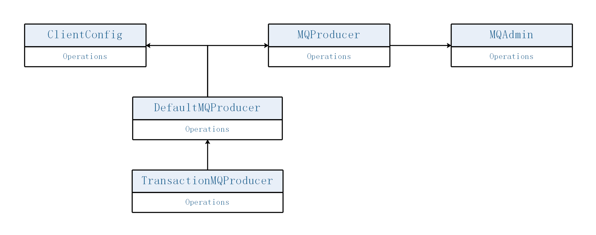
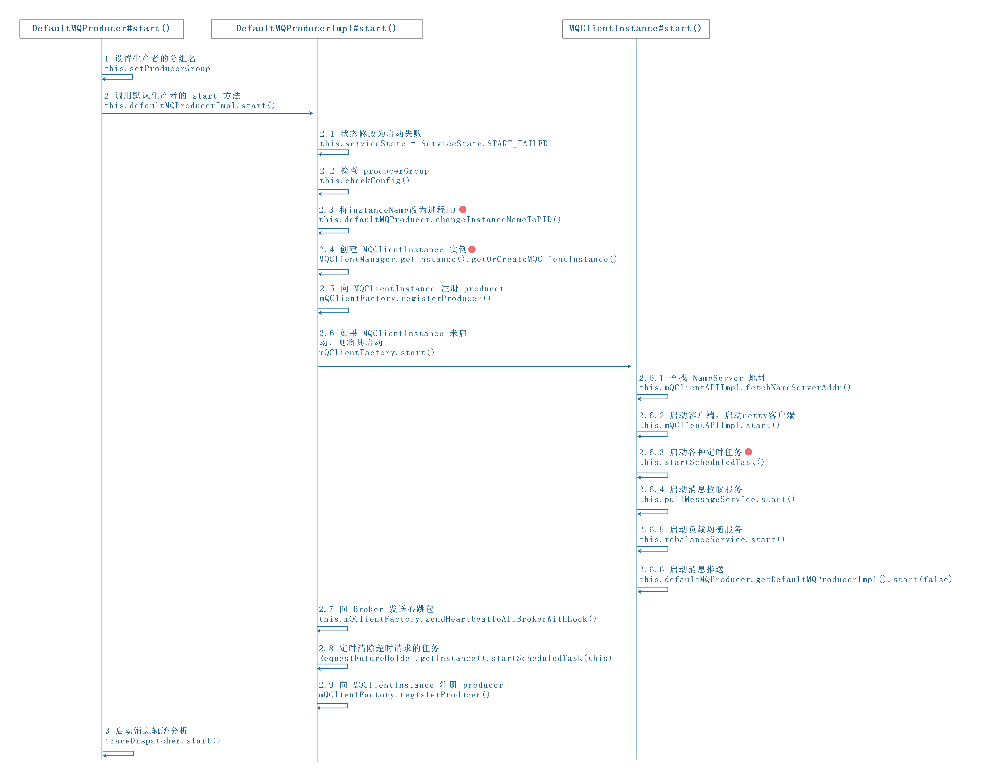
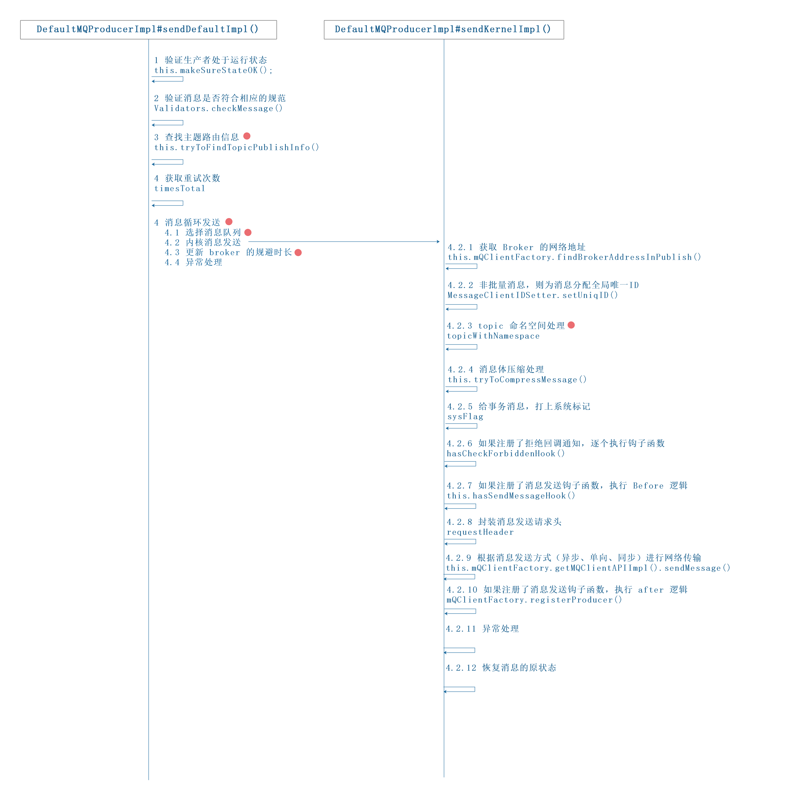

RocketMQ版本 v4.9.3。

RocketMQ 作为一款消息中间件，以高性能、高吞吐量著称，其由 NameServer、Broker、Producer、Consumer 四部分组成，本文将从 Producer 消息发送的角度分析 RocketMQ 的高性能与高可用。

## 1 消息发送 Demo

我们先从官网的发送消息的实例代码分析，来从整体查看 Producer 的消息发送过程：

```java
//org.apache.rocketmq.example.quickstart.Producer
public class Producer {

    public static void main(String[] args) throws MQClientException {

        //1 创建指定分组名的生产者
        DefaultMQProducer producer = new DefaultMQProducer("please_rename_unique_group_name");

        //2 启动生产者
        producer.start();

        for (int i = 0; i < 1000; i++) {
            try {

            	//3 构建消息
                Message msg = new Message("TopicTest",
                            "TagA",
                            ("Hello RocketMQ " + i).getBytes(RemotingHelper.DEFAULT_CHARSET)
                );

                //4 同步发送
                SendResult sendResult = producer.send(msg);

                //5 打印发送结果
                System.out.printf("%s%n", sendResult);
            } catch (Exception e) {
                e.printStackTrace();
                Thread.sleep(1000);
            }
        }
                            
        //6 关闭生产者
        producer.shutdown();
    }
}
```

从官方源码给出的示例看出，消息发送经历了如下阶段，下文也将一一介绍。


# 2 RocketMQ 消息

RocketMQ 的消息通过 Message 类（`org.apache.rocketmq.common.message.Message`）承载，其源码如下:

```java
public class Message implements Serializable {
    private static final long serialVersionUID = 8445773977080406428L;

    //主题 topic 
    private String topic;

    //消息 Flag
    private int flag;

    //扩展属性
    private Map<String, String> properties;

    //消息体
    private byte[] body;
    
    //事务id
    private String transactionId;
}
```

其中，properties 可以添加额外的属性。例如：

- tag：消息TAG，可以用于消息过滤。
- keys: Message索引键，RocketMQ可根据key快速检索消息。如订单号为key，快速找到该订单对应的消息。

# 3 RocketMQ 生产者

生产者负责消息的发送，RocketMQ 有如下几种生产者：

（1）默认生产者 DefaultMQProducer，`org.apache.rocketmq.client.producer.DefaultMQProducer`。

（2）事务消息生产者 TransactionMQProducer，`org.apache.rocketmq.client.producer.TransactionMQProducer`，其继承了 DefaultMQProducer 。

因此，我们可以从默认生产者 DefaultMQProducer 类来了解生产者的基本功能。

## 3.1 DefaultMQProducer 类

DefaultMQProducer 继承了 ClientConfig 类（`org.apache.rocketmq.client.ClientConfig`），因此生产者也具有客户端的通用属性。另外还实现了 MQProducer(继承了MQAdmin接口)接口。



```java
public class DefaultMQProducer extends ClientConfig implements MQProducer {

    //生产者内部默认实现类
    protected final transient DefaultMQProducerImpl defaultMQProducerImpl;

    //如下返回码将会重试，支持自行添加
    private final Set<Integer> retryResponseCodes = new CopyOnWriteArraySet<Integer>(Arrays.asList(
            ResponseCode.TOPIC_NOT_EXIST,
            ResponseCode.SERVICE_NOT_AVAILABLE,
            ResponseCode.SYSTEM_ERROR,
            ResponseCode.NO_PERMISSION,
            ResponseCode.NO_BUYER_ID,
            ResponseCode.NOT_IN_CURRENT_UNIT
    ));

    //生产者组，聚合了完全相同角色的所有生产者实例
    private String producerGroup;

    //默认 topicKey
    private String createTopicKey = TopicValidator.AUTO_CREATE_TOPIC_KEY_TOPIC;

    //主题在每一个 Broker 的默认队列数量
    private volatile int defaultTopicQueueNums = 4;

    //消息发送超时时间，默认 3s
    private int sendMsgTimeout = 3000;

    //消息体超过该值则启用压缩，默认 4K
    private int compressMsgBodyOverHowmuch = 1024 * 4;

    //同步方式发送消息重试次数，默认为2 ，总共执行 3 次
    private int retryTimesWhenSendFailed = 2;

    //异步方式发送消息重试次数，默认为 2
    private int retryTimesWhenSendAsyncFailed = 2;

    //消息重试时选择另外一个Broker时，是否不等待存储结果就返回，默认为false
    private boolean retryAnotherBrokerWhenNotStoreOK = false;

    //允许发送的最大消息长度，默认为4M，该值最大为2^32-1
    private int maxMessageSize = 1024 * 1024 * 4;

    //异步传输数据的接口
    private TraceDispatcher traceDispatcher = null;
}
```

我们在创建生产者的时候，可以根据实际需求，通过 set 方法，去设置生产者的各种属性。

## 3.2 生产者的通用能力

### 3.2.1 父类 ClientConfig

ClientConfig 类为客户端公共配置，每个参数都可以用 spring 来配置，也可以在代码中配置。其中，我们需要关注到 namespace 参数，该参数将发送者、消费者编入到一个命名空间中，以支持多环境的测试场景。

```java
public class ClientConfig {

    //NameServer 地址列表，多个地址用分号隔开
    private String namesrvAddr = NameServerAddressUtils.getNameServerAddresses();

    //客户端本机 ip
    private String clientIP = RemotingUtil.getLocalAddress();

    //命名空间
    protected String namespace;

    //省略部分属性...
}
```

### 3.2.2 MQProducer 接口

提供消息发送基本能力。

|\<interface\> MQProducer|备注|
|--------------|----|
|List fetchPublishMessageQueues(final String topic)|根据 Topic 查找该主题下所有的消息队列|
|SendResult send(Message msg)|同步发送消息，具体发送到主题中的哪个消息队列由负载算法决定|
|void send(final Message msg, final MessageQueue mq, final SendCallback sendCallback)|异步方式发送消息，发送到指定消息队列|
|void sendOneway(final Message msg, final MessageQueue mq)|单向消息发送，就是不在乎发送结果，消息发送出去后该方法立即返回|
|Message request(Message msg, long timeout)|request-response 请求模型，就消息发送者发送到 Broker，需要等消费者处理完才返回|
|void start()|启动发送者，在进行消息发送之前必须先调用该方法|
|void shutdown()|关闭发送者，如果不需要再使用该生产者，需要调用该方法释放资源|

### 3.2.3 MQAdmin 接口

MQ 基本的管理接口，对 MQ 提供基础的管理能力。

|\<interface\> MQAdmin|备注|
|--------------|----|
|void createTopic(String key, String newTopic, int queueNum)|创建主题|
|long searchOffset(final MessageQueue mq, final long timestamp)|根据时间戳从队列中查找其偏移量|
|long maxOffset(final MessageQueue mq)|查找该消息队列中最大的物理偏移量|
|long minOffset(final MessageQueue mq)|查找该消息队列中最小物理偏移量|
|long earliestMsgStoreTime(final MessageQueue mq)|获取消息存储的最早时间|
|MessageExt viewMessage(final String offsetMsgld)|根据消息偏移量查找消息|
|MessageExt viewMessage(String topic, String msgld)|根据主题与消息 ID 查找消息|
|QueryResult queryMessage(String topic, String key, int maxNum, Iong begin, long end)|根据条件批量查询消息|

# 4 生产者的启动

生产者的启动调用的是 `DefaultMQProducer` 的 start() 方法。

```java
public void start() throws MQClientException {

    //设置生产者的分组名 producerGroup
    //这里会将 producerGroup 带上 namespace
    this.setProducerGroup(withNamespace(this.producerGroup));

    //调用生产者默认实现的 start 方法
    this.defaultMQProducerImpl.start();

    //如果消息轨迹相关的消息分发类不是null，说明需要启动消息轨迹分析
    if (null != traceDispatcher) {
        try {
            traceDispatcher.start(this.getNamesrvAddr(), this.getAccessChannel());
        } catch (MQClientException e) {
            log.warn("trace dispatcher start failed ", e);
        }
    }
}
```

启动的总体流程图如下：



## 4.1 DefaultMQProducerlmpl 的 start() 方法

`DefaultMQProducerlmpl`是生产者`DefaultMQProducer`内部默认的实现类，其`start()`方法封装了生产者的启动细节。

```java
public void start(final boolean startFactory) throws MQClientException {
    switch (this.serviceState) {
        case CREATE_JUST:

            //Step1:
            //状态修改为启动失败，避免多次启动
            this.serviceState = ServiceState.START_FAILED;

            //Step2:检查 producerGroup 是否合法
            this.checkConfig();

            //Step3:将生产者的 instanceName 改为进程 ID
            if (!this.defaultMQProducer.getProducerGroup().equals(MixAll.CLIENT_INNER_PRODUCER_GROUP)) {
                this.defaultMQProducer.changeInstanceNameToPID();
            }

            //Step4:
            //通过 MQClientManager 创建 MQClientlnstance 客户端实例
            this.mQClientFactory = MQClientManager.getInstance().getOrCreateMQClientInstance(this.defaultMQProducer, rpcHook);

            //Step5:
            //向 MQClientlnstance 注册，将当前生产者加入到 MQClientlnstance 管理 中，方便后续调用网络请求、进行心跳检测等
            boolean registerOK = mQClientFactory.registerProducer(this.defaultMQProducer.getProducerGroup(), this);
            if (!registerOK) {
                this.serviceState = ServiceState.CREATE_JUST;
                throw new MQClientException("The producer group[" + this.defaultMQProducer.getProducerGroup()
                        + "] has been created before, specify another name please." + FAQUrl.suggestTodo(FAQUrl.GROUP_NAME_DUPLICATE_URL),
                        null);
            }

            //Step6:保存 topic 的发布信息
            this.topicPublishInfoTable.put(this.defaultMQProducer.getCreateTopicKey(), new TopicPublishInfo());

            //Step7:
            //启动 MQClientlnstance，如果 MQClientlnstance 已经启动 ，则本次启动不会真正执行。
            if (startFactory) {
                mQClientFactory.start();
            }

            log.info("the producer [{}] start OK. sendMessageWithVIPChannel={}", this.defaultMQProducer.getProducerGroup(),
                    this.defaultMQProducer.isSendMessageWithVIPChannel());
            this.serviceState = ServiceState.RUNNING;
            break;
        case RUNNING:
        case START_FAILED:
        case SHUTDOWN_ALREADY:
            throw new MQClientException("The producer service state not OK, maybe started once, "
                    + this.serviceState
                    + FAQUrl.suggestTodo(FAQUrl.CLIENT_SERVICE_NOT_OK),
                    null);
        default:
            break;
    }

    //Step8:向 Broker 发送心跳包
    this.mQClientFactory.sendHeartbeatToAllBrokerWithLock();

    //Step9:定时清除超时请求的任务
    RequestFutureHolder.getInstance().startScheduledTask(this);

}
```

## 4.2 客户端 MQClientInstance

在4.1节Step 4中，生产者在启动时，会通过`MQClientManager`类获取客户端实例`MQClientInstance`，并且向这个实例注册自己，方便后续调用网络请求、进行心跳检测等。

```java
public class MQClientManager {

    //存储 MQClientInstance 实例
    private ConcurrentMap<String /*clientId*/, MQClientInstance> factoryTable = new ConcurrentHashMap<String, MQClientInstance>();

    //省略部分属性...
}
```

`MQClientManager`是个单例类，类里创建了一个缓存表，用来存储`MQClientInstance`，并且根据`clientId`复用`MQClientInstance`。`clientld` = 客户端`IP` + 实例名`instanceName` + (`unitname` 可选），其中，实例名`instanceName`为进程ID。如果在同一个应用程序里启动多个生产者，在未设置`unitname`时，则`clientld`相同，即多个生产者将会共用一个`MQClientInstance`实例。这样做的原因在于`MQClientInstance`实现的是底层通信功能和获取并保存元数据的功能，没必要每个`Producer`都创建一个对象，因此一个`MQClientInstance`对象可以被多个`Producer`共用。

获取到`MQClientInstance`后，在3.1节Step 7，如果客户端没有启动，则调用`start()`方法启动客户端。通过`start()`方法的源码，我们可以知道，`MQClientInstance`的功能。

```java
public void start() throws MQClientException {

    synchronized (this) {
        switch (this.serviceState) {
            //刚创建
            case CREATE_JUST:
                this.serviceState = ServiceState.START_FAILED;

                //step1：如果未指定 NameServer 地址，则从名称服务器查找地址
                if (null == this.clientConfig.getNamesrvAddr()) {
                    this.mQClientAPIImpl.fetchNameServerAddr();
                }

                //step2：启动客户端，启动netty客户端
                // NettyRemotingClient的 start() 方法，这个方法中先是创建了 Netty 客户端，然后调用了两个定时执行的任务
                // 两个任务一个是删除过期的请求，一个是将没有连接响应的 NameServer 断开连接
                this.mQClientAPIImpl.start();

                //step3：启动各种定时任务
                // 2分钟更新一次nameServer的地址
                // 30秒更新一次topic的路由信息
                // 30秒对Broker发送一次心跳检测，并将下线的broker删除
                // 5秒持久化一次consumer的offset
                // 1分钟调整一次线程池，这个定时任务其实什么都没有执行。
                this.startScheduledTask();

                //step4：启动消息拉取服务
                // 调用 PullMessageService 的 run()方法，里面主要是调用了 DefaultMQPushConsumerImpl.pullMessage 方法
                this.pullMessageService.start();

                //step5：启动负载均衡服务
                this.rebalanceService.start();

                //step6：启动消息推送
                this.defaultMQProducer.getDefaultMQProducerImpl().start(false);

                log.info("the client factory [{}] start OK", this.clientId);
                this.serviceState = ServiceState.RUNNING;
                break;
            case START_FAILED:
                throw new MQClientException("The Factory object[" + this.getClientId() + "] has been created before, and failed.", null);
            default:
                break;
        }
    }
}
```

# 5 消息发送

## 5.1 消息发送方式

RocketMQ支持3种消息发送方式：单向（oneway）、同步（sync ）、异步（async）。

- 单向（oneway）：发送消息后，将直接返回，不再等待发送结果，也没有回调函数。用于发送一些偶尔出现消息丢失，但是对业务不会造成太大影响的消息。

- 同步（sync ）：发送消息后，同步等待服务器的返回结果。适用于不过分追求发送速度，但要求消息可靠性高的场景。

- 异步（async）：发送者指定回调函数，在消息发送完后，立即返回，继续运行，直到结束。消息发送成功或失败后，指定的回调任务将开启新线程执行。适用于要求发送速度快，但不过分追求消息可靠性的场景。

# 5.2 消息发送步骤

主要的步骤：验证消息、查找路由、消息发送（包含异常处理机制）。



消息发送底层调用的是`org.apache.rocketmq.client.impl.producer.DefaultMQProducerImpl#sendDefaultImpl`方法：

```java
private SendResult sendDefaultImpl(
            Message msg,
            final CommunicationMode communicationMode,
            final SendCallback sendCallback,
            final long timeout
    ) throws MQClientException, RemotingException, MQBrokerException, InterruptedException {
        
    //step1: 验证生产者处于运行状态
    this.makeSureStateOK();

    //step2: 验证消息是否符合相应的规范，会验证消息的最大长度，`org.apache.rocketmq.client.producer.DefaultMQProducer#maxMessageSize`
    Validators.checkMessage(msg, this.defaultMQProducer);

    final long invokeID = random.nextLong();
    long beginTimestampFirst = System.currentTimeMillis();
    long beginTimestampPrev = beginTimestampFirst;
    long endTimestamp = beginTimestampFirst;

    //step3: 查找主题发布信息
    TopicPublishInfo topicPublishInfo = this.tryToFindTopicPublishInfo(msg.getTopic());

    //step4: 消息发送
    if (topicPublishInfo != null && topicPublishInfo.ok()) {
        boolean callTimeout = false;
        MessageQueue mq = null;
        Exception exception = null;
        SendResult sendResult = null;

        //step4.1: 同步方式重试次数，`org.apache.rocketmq.client.producer.DefaultMQProducer.retryTimesWhenSendFailed`
        int timesTotal = communicationMode == CommunicationMode.SYNC ? 1 + this.defaultMQProducer.getRetryTimesWhenSendFailed() : 1;
        int times = 0;
        String[] brokersSent = new String[timesTotal];

        for (; times < timesTotal; times++) {

            //step4.2: 选择消息队列进行发送
            String lastBrokerName = null == mq ? null : mq.getBrokerName();
            MessageQueue mqSelected = this.selectOneMessageQueue(topicPublishInfo, lastBrokerName);

            if (mqSelected != null) {
                mq = mqSelected;
                brokersSent[times] = mq.getBrokerName();
                try {
                    beginTimestampPrev = System.currentTimeMillis();
                    if (times > 0) {
                        msg.setTopic(this.defaultMQProducer.withNamespace(msg.getTopic()));
                    }
                    long costTime = beginTimestampPrev - beginTimestampFirst;                        if (timeout < costTime) {
                        callTimeout = true;
                        break;
                    }

                    //step4.3: 内核消息发送
                    sendResult = this.sendKernelImpl(msg, mq, communicationMode, sendCallback, topicPublishInfo, timeout - costTime);

                    endTimestamp = System.currentTimeMillis();

                    //step4.4: 更新 mq.getBrokerName() 的规避时长
                    this.updateFaultItem(mq.getBrokerName(), endTimestamp - beginTimestampPrev, false);

                    //step4.5: 根据消息发送模式，进行消息发送后处理
                    switch (communicationMode) {
                        //异步消息，返回null
                        case ASYNC:
                            return null;
                        //单向消息，不关心结果，返回null
                        case ONEWAY:
                            return null;
                        //同步消息
                        case SYNC:
                            //step4.6: 消息发送不成功，继续循环重试
                            if (sendResult.getSendStatus() != SendStatus.SEND_OK) {
                                if (this.defaultMQProducer.isRetryAnotherBrokerWhenNotStoreOK()) {
                                    continue;
                                }
                            }

                            return sendResult;
                        default:
                            break;
                    }

                    //step4.7: 异常处理。根据抛出的异常类型，做针对性处理，且都会调用 DefaultMQProducerlmpl#updateFaultItem，更新错误项规避时长
                } catch (RemotingException e) {
                    //省略部分源码...
                }
            } else {
                break;
            }
        }

        //发送结果处理
        //省略部分源码...
    }

    //step5: 没找到主题发布信息，则校验 NameServer 是否为空
    validateNameServerSetting();

    throw new MQClientException("No route info of this topic: " + msg.getTopic() + FAQUrl.suggestTodo(FAQUrl.NO_TOPIC_ROUTE_INFO),null).setResponseCode(ClientErrorCode.NOT_FOUND_TOPIC_EXCEPTION);
}
```

## 5.3 内核消息发送

在5.2节的step4.3，消息准备工作做完后，将使用内核消息发送。

```java
//org.apache.rocketmq.client.impl.producer.DefaultMQProducerImpl#sendKernelImpl
private SendResult sendKernelImpl(final Message msg,
                                      final MessageQueue mq,
                                      final CommunicationMode communicationMode,
                                      final SendCallback sendCallback,
                                      final TopicPublishInfo topicPublishInfo,
                                      final long timeout) throws MQClientException, RemotingException, MQBrokerException, InterruptedException {

        long beginStartTime = System.currentTimeMillis();

        //step1: 根据 MessageQueue 获取 Broker 的网络地址
        String brokerAddr = this.mQClientFactory.findBrokerAddressInPublish(mq.getBrokerName());

        //如果 MQClientInstance 的brokerAddrTable 未缓存该 Broker 的信息，则从 NameServer 主动更新一下 topic 的路由信息
        if (null == brokerAddr) {
            tryToFindTopicPublishInfo(mq.getTopic());
            brokerAddr = this.mQClientFactory.findBrokerAddressInPublish(mq.getBrokerName());
        }

        SendMessageContext context = null;
        if (brokerAddr != null) {

            //step2: 消息预处理
            //是否开启vip通道
            brokerAddr = MixAll.brokerVIPChannel(this.defaultMQProducer.isSendMessageWithVIPChannel(), brokerAddr);

            //提前保存未被压缩的消息
            byte[] prevBody = msg.getBody();

            try {
                //非批量消息，则为消息分配全局唯一 ID
                if (!(msg instanceof MessageBatch)) {
                    MessageClientIDSetter.setUniqID(msg);
                }

                //topic 具有命名空间
                boolean topicWithNamespace = false;
                if (null != this.mQClientFactory.getClientConfig().getNamespace()) {
                    msg.setInstanceId(this.mQClientFactory.getClientConfig().getNamespace());
                    topicWithNamespace = true;
                }

                int sysFlag = 0;
                boolean msgBodyCompressed = false;

                //如果消息体默认超过 4K,会对消息体采用 zip 压缩,并且设置消息的系统标记为 MessageSysFlag.COMPRESSED_FLAG
                //`org.apache.rocketmq.client.producer.DefaultMQProducer.compressMsgBodyOverHowmuch`
                if (this.tryToCompressMessage(msg)) {
                    sysFlag |= MessageSysFlag.COMPRESSED_FLAG;
                    msgBodyCompressed = true;
                }

                //如果是事务 Prepared 消息，则设置消息的系统标记为 MessageSysFlag.TRANSACTION_PREPARED_TYPE
                final String tranMsg = msg.getProperty(MessageConst.PROPERTY_TRANSACTION_PREPARED);
                if (Boolean.parseBoolean(tranMsg)) {
                    sysFlag |= MessageSysFlag.TRANSACTION_PREPARED_TYPE;
                }

                //step3: 如果注册了拒绝回调通知，逐个执行钩子函数
                if (hasCheckForbiddenHook()) {
                    //省略部分代码...
                }

                //step4: 如果注册了消息发送钩子函数，则执行消息发送之前的增强逻辑
                if (this.hasSendMessageHook()) {
                    //省略部分代码...
                }

                //step5: 构建消息发送请求包，封装 Header
                SendMessageRequestHeader requestHeader = new SendMessageRequestHeader();
                //省略部分代码...

                //step6: 根据消息发送方式（异步、单向、同步）进行网络传输   
                SendResult sendResult = null;
                switch (communicationMode) {
                    //6.1 异步消息
                    case ASYNC:
                        Message tmpMessage = msg;
                        boolean messageCloned = false;

                        //6.1.1 如果消息已经被压缩了，使用未压缩的内容存到 body 中
                        if (msgBodyCompressed) {
                            //深拷贝一份消息
                            tmpMessage = MessageAccessor.cloneMessage(msg);
                            messageCloned = true;
                            //使用未被压缩的消息
                            msg.setBody(prevBody);
                        }

                        //6.1.2 topic 使用了命名空间
                        if (topicWithNamespace) {
                            //深拷贝一份消息
                            if (!messageCloned) {
                                tmpMessage = MessageAccessor.cloneMessage(msg);
                                messageCloned = true;
                            }
                            //去除消息中，topic的命名空间
                            msg.setTopic(NamespaceUtil.withoutNamespace(msg.getTopic(), this.defaultMQProducer.getNamespace()));
                        }

                        long costTimeAsync = System.currentTimeMillis() - beginStartTime;
                        if (timeout < costTimeAsync) {
                            throw new RemotingTooMuchRequestException("sendKernelImpl call timeout");
                        }

                        //6.1.3 异步发送消息
                        sendResult = this.mQClientFactory.getMQClientAPIImpl().sendMessage(
                                brokerAddr,
                                mq.getBrokerName(),
                                tmpMessage,
                                requestHeader,
                                timeout - costTimeAsync,
                                communicationMode,
                                sendCallback,
                                topicPublishInfo,
                                this.mQClientFactory,
                                this.defaultMQProducer.getRetryTimesWhenSendAsyncFailed(),  /*异步重试次数，`org.apache.rocketmq.client.producer.DefaultMQProducer#retryTimesWhenSendAsyncFailed` */
                                context,
                                this);
                        break;

                    //6.2 单向消息，与同步发送机制一致，只不过同步发送可以重试
                    case ONEWAY:

                        //6.3 同步消息
                    case SYNC:
                        long costTimeSync = System.currentTimeMillis() - beginStartTime;
                        if (timeout < costTimeSync) {
                            throw new RemotingTooMuchRequestException("sendKernelImpl call timeout");
                        }
                        sendResult = this.mQClientFactory.getMQClientAPIImpl().sendMessage(
                                brokerAddr,
                                mq.getBrokerName(),
                                msg,
                                requestHeader,
                                timeout - costTimeSync,
                                communicationMode,
                                context,
                                this);
                        break;
                    default:
                        assert false;
                        break;
                }

                //step7: 如果注册了消息发送钩子函数，执行 after 逻辑
                if (this.hasSendMessageHook()) {
                    //省略部分代码...
                }

                return sendResult;

            //step8: 异常处理，并且如果注册了消息发送钩子函数，执行 after 逻辑
            } catch (RemotingException e) {
                if (this.hasSendMessageHook()) {
                    context.setException(e);
                    this.executeSendMessageHookAfter(context);
                }
                throw e;
            } catch (MQBrokerException e) {
                if (this.hasSendMessageHook()) {
                    context.setException(e);
                    this.executeSendMessageHookAfter(context);
                }
                throw e;
            } catch (InterruptedException e) {
                if (this.hasSendMessageHook()) {
                    context.setException(e);
                    this.executeSendMessageHookAfter(context);
                }
                throw e;

                //step9: 恢复消息的原状态
                //即便try里面有 return， 此处的 finally 中也会被执行
            } finally {
                //消息体恢复成未压缩状态
                msg.setBody(prevBody);
                // topic 恢复成无命名空间
                msg.setTopic(NamespaceUtil.withoutNamespace(msg.getTopic(), this.defaultMQProducer.getNamespace()));
            }
        }

        //step10: 抛出 MQClientException，提示 Broker 不存在
        throw new MQClientException("The broker[" + mq.getBrokerName() + "] not exist", null);
    }
```

内核在发送消息时调用了`org.apache.rocketmq.client.impl.MQClientAPIImpl#sendMessage()`类，该类里使用 Netty 进行通信，即`org.apache.rocketmq.remoting.netty.NettyRemotingClient`发送消息：

```java
//ONEWAY
org.apache.rocketmq.remoting.netty.NettyRemotingClient#invokeOneway

//ASYNC
org.apache.rocketmq.remoting.netty.NettyRemotingClient#invokeAsync

//SYNC
org.apache.rocketmq.remoting.netty.NettyRemotingClient#invokeSync
```

## 5.4 消息发送高可用分析

## 5.4.1 缓存`topic`的发布信息

`topic`的发布信息存放在 TopicPublishInfo 类（`org.apache.rocketmq.client.impl.producer.TopicPublishInfo`）中，该类存储了是否是顺序消息、`topic`对应的的消息队列、用于选择消息队列的自增值、`topic`路由信息等。

在5.2节 step3中，生产者内部实现类在发送消息前，使用`tryToFindTopicPublishInfo()`方法取查找`topic`的发布信息。可以看到，为了更快速的获取，该类在内部使用了一个Map来缓存`topic`发布信息。查找时，如果缓存没有，则从`NameServer`查询该`topic`的发布信息。

```java
//`org.apache.rocketmq.client.impl.producer.DefaultMQProducerImpl#tryToFindTopicPublishInfo`
private TopicPublishInfo tryToFindTopicPublishInfo(final String topic) {

    //从缓存Map中取发布信息
    TopicPublishInfo topicPublishInfo = this.topicPublishInfoTable.get(topic);

    //如果生产者中没有缓存 topic 的发布信息
    if (null == topicPublishInfo || !topicPublishInfo.ok()) {
        this.topicPublishInfoTable.putIfAbsent(topic, new TopicPublishInfo());
        //从 NameServer 查询该 topic 的发布信息
        this.mQClientFactory.updateTopicRouteInfoFromNameServer(topic);
        topicPublishInfo = this.topicPublishInfoTable.get(topic);
    }

    //如果该发布信息中包含了 topic 路由信息，则直接返回该发布信息
    if (topicPublishInfo.isHaveTopicRouterInfo() || topicPublishInfo.ok()) {
        return topicPublishInfo;
    } else {
        this.mQClientFactory.updateTopicRouteInfoFromNameServer(topic, true, this.defaultMQProducer);
        topicPublishInfo = this.topicPublishInfoTable.get(topic);
        return topicPublishInfo;
    }
}
```

## 5.4.2 消息发送失败重投机制

重试机制作用的地方，需要根据发送模式来查看。

（1）同步发送

在5.2节step4.1中，会通过同步消息发送失败重试次数`DefaultMQProducer#retryTimesWhenSendFailed`来设置消息循环发送次数，该参数在2.1节介绍`DefaultMQProducer`类时提过，可以通过set方法设置。

在step4.6中，消息结果的状态不等于`SendStatus.SEND_OK`，将会继续循环重试。

（2）异步发送

在异步发送时，捕获到异常或者`RemotingCommand==null`时，均会触发消息重投。具体实现可阅读`org.apache.rocketmq.client.impl.MQClientAPIImpl#onExceptionImpl`类源码。

## 5.4.3 Broker 故障延迟机制

在5.2节的step4.2中，消息发送前，通过`MQFaultStrategy#selectOneMessageQueue()`方法，选择消息将要发送至的消息队列。

考虑`Broker`宕机的场景，如果上一次消息发送失败，选择的是宕机的`Broker`的某个队列，那么在轮询的过程中，可能连续找到的队列都是宕机`Broker`上的，为了避免轮询时出现这种情况，将会直接从规避的`Broker`缓存中，随机取出一个`Broker`。用户可以通过设置开关`MQFaultStrategy#sendLatencyFaultEnable`，来使用`Broker`的故障延迟机制。

```java
//`org.apache.rocketmq.client.latency.MQFaultStrategy#selectOneMessageQueue`
public MessageQueue selectOneMessageQueue(final TopicPublishInfo tpInfo, final String lastBrokerName) {
    
    //step1: 启用 Broker 故障延迟机制
    if (this.sendLatencyFaultEnable) {
        try {

            //step2: 计数器+1
            int index = tpInfo.getSendWhichQueue().incrementAndGet();

            //step3: 对消息队列进行轮询，直到获取一个可用的消息队列
            for (int i = 0; i < tpInfo.getMessageQueueList().size(); i++) {
                int pos = Math.abs(index++) % tpInfo.getMessageQueueList().size();
                if (pos < 0)
                    pos = 0;

                MessageQueue mq = tpInfo.getMessageQueueList().get(pos);

                //step4: 该 messageQueue 是可用的，说明故障恢复了
                //isAvailable()实现：
                //(1)判断是否在故障列表中，不在故障列表中代表可用。
                //(2)在故障列表中判断当前时间是否大于等于故障规避的开始时间startTimestamp
                if (latencyFaultTolerance.isAvailable(mq.getBrokerName()))
                    return mq;
            }

            //此时，没有找到可用的 messageQueue
            //step5: 尝试从规避的 Broker 中选择一个可用的 Broker
            final String notBestBroker = latencyFaultTolerance.pickOneAtLeast();
            int writeQueueNums = tpInfo.getQueueIdByBroker(notBestBroker);

            //step6: 如果该 Broker 的 writeQueueNums > 0
            if (writeQueueNums > 0) {

                //找到该 Broker 对应的消息队列
                final MessageQueue mq = tpInfo.selectOneMessageQueue();

                if (notBestBroker != null) {
                    mq.setBrokerName(notBestBroker);
                    mq.setQueueId(tpInfo.getSendWhichQueue().incrementAndGet() % writeQueueNums);
                }
                return mq;
            } else {
                //将 notBestBroker 从规避集合 latencyFaultTolerance 中移除 
                latencyFaultTolerance.remove(notBestBroker);
            }
        } catch (Exception e) {
            log.error("Error occurred when selecting message queue", e);
        }

        return tpInfo.selectOneMessageQueue();
    }

    //不启用 Broker 故障延迟机制，将会从消息队列中，选择一个不属于上一次的`Broker`的队列
    return tpInfo.selectOneMessageQueue(lastBrokerName);
}
```

# 6 消息发送结果

异步、单向（oneway）返回结果都为 null，只有同步发送消息才会返回结果，处理类为 `org.apache.rocketmq.client.impl.MQClientAPIImpl#processSendResponse`。

RocketMQ 消息发送的返回结果有如下几种：

（1）默认返回结果 SendResult 类，`org.apache.rocketmq.client.producer.SendResult`。

（2）事务消息发送返回结果 TransactionSendResult 类，继承了 SendResult，`org.apache.rocketmq.client.producer.TransactionSendResult`。

# 7 总结

本文以RocketMQ官方Demo为切入点，结合核心源码，介绍了生产者整个的消息发送过程。在学习后，我们要掌握：

（1）消息体、生产者的相关属性与设置方法，即了解RocketMQ消息发送时，对外提供的关键能力。

（2）生产者启动步骤，关键在于通过 MQClientManager 类获取客户端实例 MQClientInstance，并且向这个实例注册自己，用于后续更新相关信息。

（3）消息发送时的高性能、高可用措施：缓存 Topic信息、失败重试、Broker 故障延迟等机制。

（4）消息发送完，只有同步消息才会返回结果。
