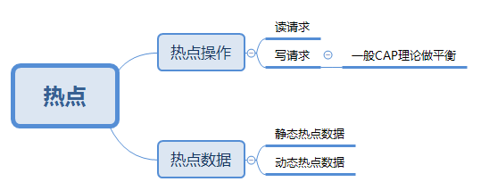

# 1.背景

## 1.1 什么是热点

## 1.2 特点

（1）请求大量占用服务器资源。

（2）可用更低的资源，支撑热点请求。

# 2.发现热点

## 2.1 静态

（1）商业手段：通过用户报名，查看热点。

（2）技术手段：大数据计算、预测。

## 2.2 动态

（1）构建异步系统，收集各环节热点key。例如，Agent聚合日志。

（2）建立热点上报。

（3）建立热点服务下发。

## 3.处理热点

（1）优化：缓存。若缓存不够，则使用淘汰算法（LRU、LFU等）。

（2）限制：常用的限流算法，时间窗口、滑动时间窗口、漏斗、令牌桶等。

（3）隔离：

①业务隔离：卖家参加秒杀，需要单独报名。因此，可以做缓存预热。

②系统隔离：分组部署，或申请单独域名。

③数据隔离：秒杀数据启用单独的 Redis、MySQL集群。
